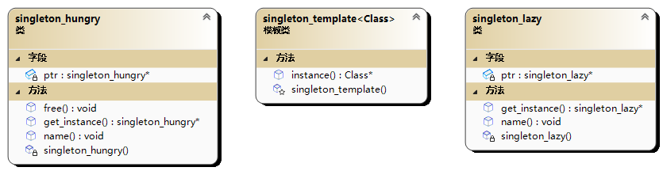

# ☺ 单例模式(Singleton模式)

<figure><figcaption></figcaption></figure>

特点：针对一个类的唯一实例

```cpp
//单例模式
#include<iostream>
#include<memory>
using namespace std;

//三步走 构造函数私有化 添加静态私有指针 提供接口

//懒汉式 线程不安全(可使用mutex解决)
//第一次调用get_instance函数时才进行创建
class singleton_lazy {
public:
	static singleton_lazy* get_instance() {
		if (ptr == nullptr) {
			ptr = new singleton_lazy;
		}
		return ptr;
	}
	void name() {
		cout << "lazy" << endl;
	}
private:
	singleton_lazy(){}
	static singleton_lazy* ptr;
};

//初始化
singleton_lazy* singleton_lazy::ptr = nullptr;

//饿汉式 在main函数执行前进行初始化
class singleton_hungry {
public:
	static singleton_hungry* get_instance() {
		return ptr;
	}
	static void free() {
		if (ptr != nullptr) {
			delete ptr;
		}
	}
	void name() {
		cout << "hungry" << endl;
	}
private:
	singleton_hungry() {}
	static singleton_hungry* ptr;
};

//为什么在这里可以访问singleton_hungey的私有构造函数呢
//因为ptr不是全局变量，而是类静态成员，它的初始化器在类内进行
//而非全局作用域
singleton_hungry* singleton_hungry::ptr = new singleton_hungry;


//优雅的使用template与shared_ptr
template<typename Class>
class singleton_template {
public:
	static Class* instance() {
		static shared_ptr<Class> instance = nullptr;
		if (instance == nullptr) {
			instance = make_shared<Class>();
			//哪怕出现竞争也不会出现内存泄露
		}
		return instance.get();
	}
protected:
	singleton_template() = default;
};

int main() {
	singleton_lazy::get_instance()->name();//lazy
	singleton_hungry::get_instance()->name();//hungry
	singleton_hungry::free();
	int* ptr=singleton_template<int>::instance();
	*ptr = 999;
	cout << *singleton_template<int>::instance() << endl;//999
	return 0;
}

```
