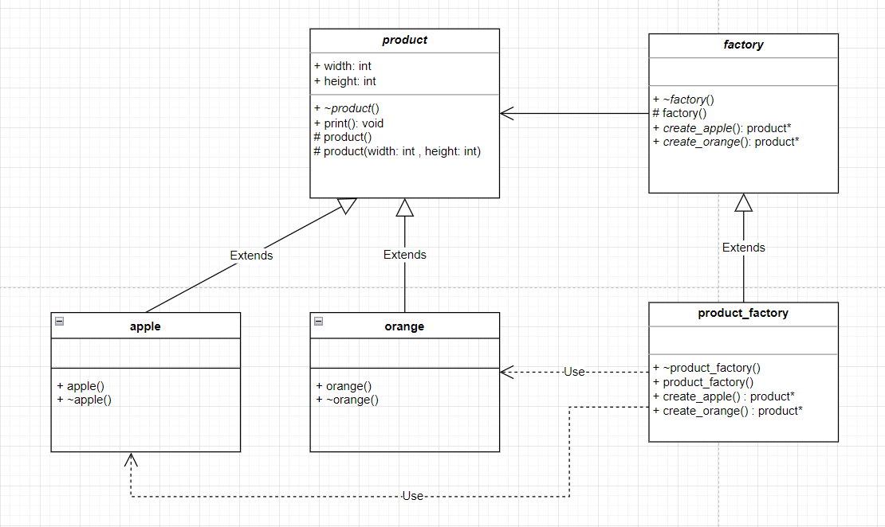

# 🍎 工厂模式(Factory模式)

工厂模式属于创建型模式

特点：被实例化的子类

<figure><figcaption></figcaption></figure>

```cpp
#include <iostream>

using namespace std;

//抽象类
class product {
public:
    int width, height;
public:
    virtual ~product()=0;
    void print();
protected:
    product() = default;
    product(int width,int height):width(width),height(height) {

    }
};

product::~product() {
    cout << "~product()" << endl;
}

void product::print() {
    cout << width << " " << height << endl;
}

class apple :public product {
public:
    apple():product(12,21) {
        
    }
    ~apple() {
        cout << "~apple()" << endl;
    };
};

class orange :public product {
public:
    orange() :product(12, 12) {

    }
    ~orange() {
        cout << "~orange()" << endl;
    }
};

//抽象类
class factory {
public:
    virtual ~factory()=0;
    virtual product* create_apple()=0;
    virtual product* create_orange() = 0;
protected:
    factory()=default;
};

factory::~factory() {
    cout << "~factory()" << endl;
}

class product_factory :public factory {
public:
    ~product_factory();
    product_factory()=default;
    product* create_apple()override;
    product* create_orange()override;
};

product_factory::~product_factory() {
    cout << "~product_factory()" << endl;
}

product* product_factory::create_apple() {
    return new apple();
}

product* product_factory::create_orange() {
    return new orange();
}

int main() {
    factory* m_factory = new product_factory();
    product* m_apple=m_factory->create_apple();
    product* m_orange = m_factory->create_orange();
    m_apple->print(); //12 21
    m_orange->print();//12 12
    delete m_factory; //~product_factory() ~factory()
    delete m_apple;   //~apple() ~product()
    delete m_orange;  //~orange() ~product()
    return 0;
}
```
