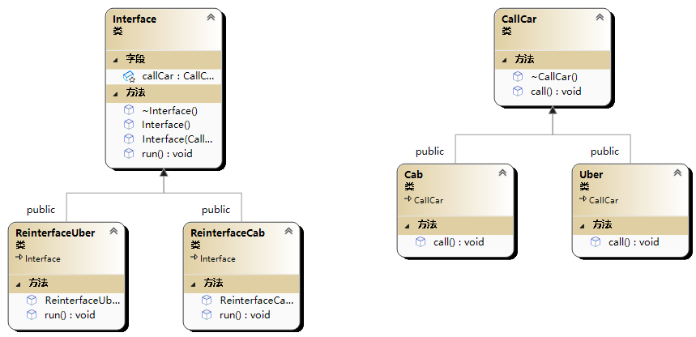

# 🤩 桥接模式(Bridge模式)

<figure><figcaption></figcaption></figure>

```cpp
#include<iostream>
using namespace std;

class CallCar;

class Interface {
public:
	virtual void run() = 0;
	Interface():callCar(nullptr) {}
	Interface(CallCar*callCar):callCar(callCar) {

	}
	virtual ~Interface() {
		delete callCar;
	}
protected:
	CallCar* callCar;
};

class CallCar{
public:
	virtual void call() = 0;
	virtual ~CallCar() = default;
};

class ReinterfaceCab:public Interface {
public:
	ReinterfaceCab(CallCar*callCar):Interface(callCar){}
	void run() override {
		//通常这里会做更多操作，如业务的参数逻辑判断等等
		cout << "Cab" << endl;
		callCar->call();
	}
};

class ReinterfaceUber :public Interface {
public:
	ReinterfaceUber(CallCar* callCar) :Interface(callCar) {
	}
	void run() override {
		cout << "Uber" << endl;
		callCar->call();
	}
};

class Cab :public CallCar {
public:
	void call() override{
		cout << "Cab" << endl;
	}
};

class Uber :public CallCar {
public:
	void call() override{
		cout << "Uber" << endl;
	}
};

int main() {
	Interface* api1 = new ReinterfaceCab(new Cab);
	api1->run();//Cab Cab

	Interface* api2 = new ReinterfaceUber(new Uber);
	api2->run();//Uber Uber
	
	delete api1;
	delete api2;
	//这里可以这样理解，我们是一个网约车程序
	//ReinterfaceCab是叫普通出租车,在其run方法进行某些业务操作
	//然后用callCar->call()，真正的去叫出租车
	//ReinterfaceUber是叫Uber,在其run方法进行某些业务操作
	//然后callCar->call(),真正的去叫Uber
	//当叫不同的车有不同的业务逻辑，则在不同的Reinterface内进行就好了
	//而不用把复杂的业务逻辑由不同的CallCar派生类实现
	return 0;
}

```
