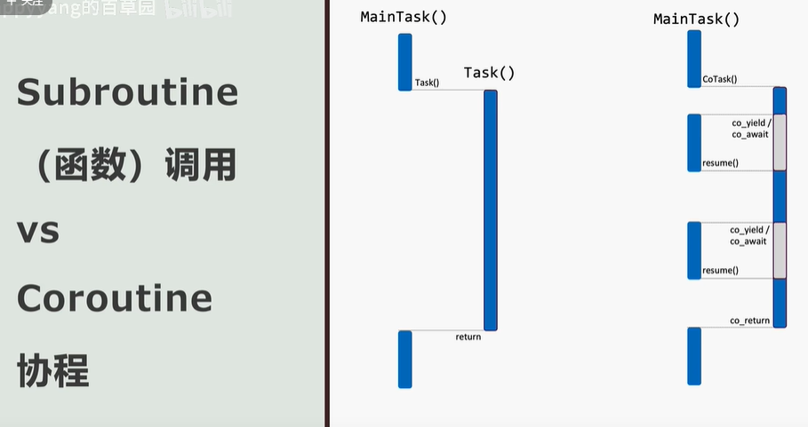

# 🚀 协程

## 协程

非常nice的讲解 <https://www.bilibili.com/video/BV1c8411f7dw>

### 什么是协程

先学会使用，然后在学习背后的实现原理。由浅到深才是学习的正确姿势。

协程：是一种可以被挂起和回复的函数。

电脑本机没有环境可以使用 轻松使用C++2a环境:<https://godbolt.org/>

### 函数调用VS协程



函数的调用是调用的函数进行return，然后返回回来，继续执行，且调用的函数已经执行完了，不会中断。

而协程是可以执行到某处co_yield或co_await时，然后跳转到某个地方(协程被挂起时不是必须回到被调用的地方，完全可以指定其他协程，这就是协程调度的内容了)，当协程被执行resume时继续执行协程
当co_return时协程将结束。

### 简单实例

简单认识

- 协程返回值类型与promise_type、initial_suspend、final_suspend、unhandled_exception、get_return_object、yield_value、return_void、return_value
- std::coroutine_handle、done、()、resume、from_promise
- co_await、co_yield、co_return
- awaitable、await_ready、await_suspend、await_resume

```CMake
project(main)

add_compile_options(-Wall)

set(CMAKE_C_FLAGS "${CMAKE_C_FLAGS} -g -Wall -O0")
set(CMAKE_CXX_FLAGS "${CMAKE_CXX_FLAGS} -g -std=c++2a -Wall -O0")

add_executable(main.exe main.cpp)
# target_link_libraries(main.exe)
```

```cpp
// main.cpp
// 测试gcc12.1可以编译通过 测试支持最低版本gcc11.1
#include <iostream>
#include <coroutine>
#include <string_view>

class CoMessage
{
public:
    std::string_view str;
};

// 协程返回类型
struct CoRet
{
    // 协程返回类型中需要有一个promise_type类型
    struct promise_type
    {
        CoMessage _message;
        int _out;

        // 返回类型为awaitable
        std::suspend_never initial_suspend()
        {
            return {};
        }

        // 返回类型为awaitable
        std::suspend_never final_suspend() noexcept
        {
            std::cout << "final_suspend" << std::endl;
            return {};
        }

        void unhandled_exception()
        {
        }

        CoRet get_return_object()
        {
            return {std::coroutine_handle<promise_type>::from_promise(*this)};
        }

        std::suspend_always yield_value(int r)
        {
            _out = r;
            return {};
        }

        void return_void() // 即co_return ;
        {
        }

        // void return_value(std::string str) // 即co_return str;
        // {
        // }
    };

    std::coroutine_handle<promise_type> _h; //_h.resume() 或 _h() 协程会在被挂起的地方恢复

    // ~CoRet()
    // {
    //     if (_h)
    //     {
    //         _h.destroy();
    //     }
    // }
};

// 自定义awaitable类型
struct Awaitable
{
    CoMessage *_message;
    // 其返回值决定co_wait时是否被挂起 true为不挂起 false为挂起
    bool await_ready()
    {
        return false;
    }

    // 在cowait时要挂起 即将跳转走之前被执行 返回值为void则跳转到被调用处
    // 也可以返回其他std::coroutine_handle执行要跳转到的位置
    void await_suspend(std::coroutine_handle<CoRet::promise_type> h)
    {
        _message = &h.promise()._message;
    }

    // co_wait时的返回值
    CoMessage await_resume()
    {
        return *_message;
    }
};

CoRet CoFunction()
{
    // 协程开始被调度时就会隐式创建一个返回类型中的promise_type对象
    // 创建的这个promise_type对象就会控制协程的运行以及内外的数据交换
    // CoRet::promise_type promise;
    // CoRet coRet = promise.get_return_object(); 即协程的返回值
    // 然后会进行 co_await promise.initial_suspend()

    // 而gcc12.1以上可以这样写
    // Awaitable awaitable;
    // CoMessage message = co_await awaitable; // 从awaitable.await_resume()返回的
    // 不然要这样写
    CoMessage message = co_await Awaitable();

    std::cout << "coroutine message=" << message.str << std::endl;

    co_return; // 调用promise的return_void或return_value
    // 最后会进行 co_await promise.final_suspend()
}

int main(int argc, char **argv)
{
    CoRet ret = CoFunction();
    std::cout << "CoFunction() next line" << std::endl;
    ret._h.promise()._message.str = "hello"; // 写到协程的promise对象中
    ret._h();
    // ret._h.resume(); 与 ret._h() 等价
    std::cout << "over" << std::endl;
    return 0;
}

// co_yield等价于 co_await promise.yield_value(expr)
// 协程如果调用了co_return 则 ret._h.done()将会返回真

// CoFunction() next line
// coroutine message=hello
// final_suspend
// over
```

### std::suspend_never的实现

std::suspend_never是一个std默认实现的一个awaitable

```cpp
struct suspend_never
{
  constexpr bool await_ready() const noexcept { return true; } // 不挂起co_wait直接无效继续执行co_wait后面的代码
  constexpr void await_suspend(coroutine_handle<>) const noexcept {}
  constexpr void await_resume() const noexcept {}
};
```

### std::suspend_always的实现

std::suspend_always也是一个std默认实现的一个awaitable

```cpp
struct suspend_always
{
  constexpr bool await_ready() const noexcept { return false; } // co_wait时直接挂起然后触发await_suspend 然后等待resume再回来
  constexpr void await_suspend(coroutine_handle<>) const noexcept {} 
  constexpr void await_resume() const noexcept {}
};
```

### 进一步熟悉流程

这里可以进一步了解final_suspend的返回值

```cpp
// main.cpp
// 测试gcc12.1可以编译通过 测试支持最低版本gcc11.1
#include <iostream>
#include <coroutine>
#include <string_view>

class CoMessage
{
public:
    std::string_view str;
};

// 协程返回类型
struct CoRet
{
    // 协程返回类型中需要有一个promise_type类型
    struct promise_type
    {
        CoMessage _message;
        std::string_view _out;

        // 返回类型为awaitable
        std::suspend_always initial_suspend()
        {
            std::cout << "initial_suspend" << std::endl;
            return {};
        }

        // 返回类型为awaitable
        std::suspend_never final_suspend() noexcept
        {
            // final_suspend返回值决定了协程会不会被destory 当返回std::suspend_never时final_suspend执行后协程handle被destory 在调用handle.done()返回0
            // 当返回std::suspend_always也就是协程最后有被挂起，那么handle.done()会返回真，而且如果返回std::suspend_always我们是需要在它处显示handle.destory()
            std::cout << std::coroutine_handle<promise_type>::from_promise(*this).done() << std::endl;
            std::cout << "final_suspend" << std::endl;
            std::cout << "co_return " << _out << std::endl;
            return {};
        }

        void unhandled_exception()
        {
        }

        CoRet get_return_object()
        {
            return {std::coroutine_handle<promise_type>::from_promise(*this)};
        }

        std::suspend_never yield_value(std::string_view r)
        {
            _out = r;
            return {};
        }

        // void return_void() // 即co_return ;
        // {
        // }

        void return_value(std::string_view str) // 即co_return str; 可以将内容通过co_return存到promise中
        {
            _out = str;
        }
    };

    std::coroutine_handle<promise_type> _h; //_h.resume() 或 _h() 协程会在被挂起的地方恢复

    // ~CoRet()
    // {
    //     if (_h)
    //     {
    //         _h.destroy();
    //     }
    // }
};

// 自定义awaitable类型
struct Awaitable
{
    CoMessage *_message;
    // 其返回值决定co_wait时是否被挂起 true为不挂起 false为挂起
    bool await_ready()
    {
        return false;
    }

    // 在cowait时要挂起 即将跳转走之前被执行 返回值为void则跳转到被调用处
    // 也可以返回其他std::coroutine_handle执行要跳转到的位置
    void await_suspend(std::coroutine_handle<CoRet::promise_type> h)
    {
        _message = &h.promise()._message;
    }

    // co_wait时的返回值
    CoMessage await_resume()
    {
        return *_message;
    }
};

CoRet CoFunction()
{
    // 协程开始被调度时就会隐式创建一个返回类型中的promise_type对象
    // 创建的这个promise_type对象就会控制协程的运行以及内外的数据交换
    // CoRet::promise_type promise;
    // CoRet coRet = promise.get_return_object(); 即协程的返回值
    // 然后会进行 co_await promise.initial_suspend()

    // 而gcc12.1以上可以这样写
    // Awaitable awaitable;
    // CoMessage message = co_await awaitable; // 从awaitable.await_resume()返回的
    // 不然要这样写
    CoMessage message = co_await Awaitable();

    std::cout << "coroutine message=" << message.str << std::endl;

    co_return "888888"; // 调用promise的return_void或return_value
    // 最后会进行 co_await promise.final_suspend()
}

int main(int argc, char **argv)
{
    std::cout << "start main" << std::endl;
    CoRet ret = CoFunction();
    std::cout << "CoFunction() next line" << std::endl;
    ret._h(); // 回到 co_await promise.initial_suspend()
    // 从co_await Awaitable()跳过来了
    std::cout << "=>" << ret._h.done() << std::endl; // 0

    ret._h.promise()._message.str = "hello"; // 写到协程的promise对象中
    ret._h.resume();                         // 回到co_await Awaitable();
    std::cout << "over" << std::endl;
    std::cout << ret._h.done() << std::endl; // 0
    std::cout << ret._h.promise()._out << std::endl; // 888888
    // 协程结束后不能在被resume了

    return 0;
}
// ret._h.destory()可以提前销毁协程handle

// start main
// initial_suspend
// CoFunction() next line
// =>0
// coroutine message=hello
// 1
// final_suspend
// co_return 888888
// over
// 0
// 888888
```

### 简单理解协程调度

从这个例子中其实可以看 其实协程可以看成任务状态机，通过promise与coroutine_handle与外界交互
只不过最大优势就是 可以自动维持上下文，状态机挂起的时候，可以自动回到触发状态机的地方即调用resume()的地方。

这么一来像做服务器的有什么打的优势，其实就是epoll+协程+非阻塞IO，而且可以做到单线程并发
例如epoll 来了新连接 则为新连接创建协程，epoll监听连接套接字可读时 可以向promise中标记 你可以读了 或者 可以写了。然后进行resume() 每个协程内部其实就是死循环 read process write之类的相关操作，要暂时不处理了比如EAGAIN了，完全可以co_wait出去回到原来要执行的地方，可能会处理下一个协程，这么一来可以发现 C++协程更像是一种状态机的语法糖一样的感觉，而且很容易围绕非阻塞IO去做
一些异步任务，而且完全可以单线程，安全好用简单，在必要的时候进行resume触发执行，协程也有自知之明 自己会co_wait co_yield co_return不会进行阻塞 不是在运行就是在挂起等待被resume 这才是关键与精髓。

```cpp

#include <coroutine>
#include <future>
#include <thread>
#include <iostream>
#include <unordered_map>
#include <unordered_set>
#include <vector>


using namespace std;

struct CoRet
{
    struct promise_type
    {
        int _in;
        int _out;
        int _res;
        suspend_never initial_suspend() {return {};}
        suspend_always final_suspend() noexcept {return {};}
        void unhandled_exception() {}
        CoRet get_return_object()
        { return 
            {coroutine_handle<promise_type>::from_promise(*this)};
        }
        suspend_always yield_value(int r) {
            _out = r;
            return {};
        }
        void return_value(int r) {
            _res = r;
        }
    };

    coroutine_handle<promise_type> _h; // _h.resume(), _h()
};

struct Input
{
    int* _in;
    int* _out;
    bool await_ready() { return false; }
    void await_suspend(coroutine_handle<CoRet::promise_type> h) 
    { _in = &h.promise()._in; _out = &h.promise()._out; }
    int await_resume() { return *_in; }
};

// 协程
CoRet Guess() {
    // co_await promise.initial_suspend();
    int res = (rand()%30)+1;
    Input input;
    int numGuess = 0;
    while(true)
    {
        int g = co_await input;
        
        ++numGuess;
        (*input._out) = (res>g ? 1: (res == g? 0 : -1));
        if((*input._out) == 0) co_return numGuess;
    }    
    // co_await promise.final_suspend();...
}


struct Hasher
{
    size_t operator() (const pair<int, int>& p) const
    {
        return (size_t)(p.first << 8) + (size_t)(p.second); 
    }
};
int main()
{
    srand(time(nullptr));

    unordered_map<pair<int, int>, vector<CoRet>, Hasher> buckets;
    for(auto i = 0; i<100; ++i) buckets[make_pair(1, 30)].push_back(Guess());

    while(!buckets.empty())
    {
        auto it = buckets.begin();
        auto& range = it->first;//1
        auto& handles = it->second;//vector<CoRet>存放协程
                
        int g = (range.first+range.second)/2;//中间数
        auto ur = make_pair(g+1, range.second);//右边部分
        auto lr = make_pair(range.first, g-1);//左边部分

        vector<future<int>> cmp;
        cmp.reserve(handles.size());

        // 这个循环是非阻塞的非常快
        for(auto& coret : handles)
        {
            // 为每个任务去开线程 去执行协程
            cmp.push_back(async(launch::async, [&coret, g]() { // 判断中间数
                coret._h.promise()._in = g;
                coret._h.resume(); // 协程内部遇见co_wait co_yield会返回来               
                return coret._h.promise()._out;
            }));
            // 获得许多future 即lamda返回值向条件变量一样
        }

        // 遍历所有协程，前面已经让协程去异步运行了
        for(int i=0; i< handles.size(); ++i)
        {
            int r = cmp[i].get(); // 等待future返回值这里是阻塞的 只有相应协程被resume lamda返回才可以get()返回
            
            if(r == 0) {//猜对了
                cout << "The secret number is " << handles[i]._h.promise()._in
                << ", total # guesses is " << handles[i]._h.promise()._res
                << endl;
            }            
            else if (r == 1) buckets[ur].push_back(handles[i]);//将协程移到右边部分去执行
            else buckets[lr].push_back(handles[i]);//将协程移到左边部分去执行
        }
        buckets.erase(it);//删除原来范围的，猜中了的不用再猜协程中的数字了，剩余协程不是去左边就是右边
    }

/*
    auto ret = Guess();
    pair<int, int> range = {1,30};    
    int in, out;
    do
    {
        in = (range.first+range.second)/2;
        ret._h.promise()._in = in; 
        cout << "main: make a guess: " << ret._h.promise()._in << endl;

        ret._h.resume(); // resume from co_await

        out = ret._h.promise()._out;
        cout << "main: result is " << 
        ((out == 1) ? "larger" :
        ((out == 0) ? "the same" : "smaller"))
            << endl;
        if(out == 1) range.first = in+1;
        else if(out == -1) range.second = in-1;
    }
    while(out != 0);
*/
}
```
