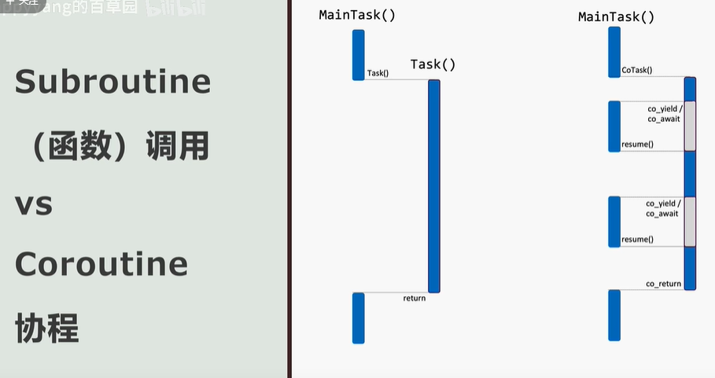
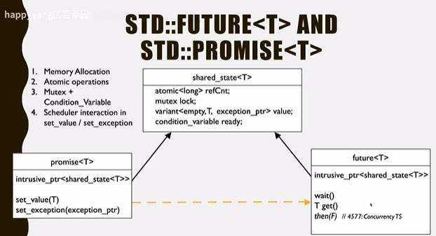

# 🍌 C++20 特性

C++20 引入了许多新特性和语言改进，下面是其中一些主要的特性：

1、概念（Concepts）：C++20 引入了概念的概念，允许程序员在编写模板代码时指定参数必须满足的类型约束。

2、模块（Modules）：C++20 引入了模块，允许程序员将代码分割为逻辑单元，减少了头文件包含带来的编译时间和二进制文件大小。

3、协程（Coroutines）：C++20 引入了协程，使得异步编程变得更加简单和高效。

4、初始化列表构造函数模板（Template for Initialization List Constructors）：C++20 允许使用模板定义初始化列表构造函数，从而支持更多的初始化方式。

5、constexpr 函数的参数和返回值类型不再有限制（Relaxing Constraints on constexpr Functions）：C++20 允许 constexpr 函数的参数和返回值类型可以是任意的，而不再有限制。

6、空指针常量表达式（Constexpr Null Pointer）：C++20 引入了一个新的空指针常量表达式 std::nullptr_t，允许在编译时进行更安全的空指针检查。

7、编译时字符串操作（Compile-Time String Operations）：C++20 引入了编译时字符串操作，可以在编译时进行字符串的拼接、截取和转换等操作。

8、多线程库改进（Improvements to the Thread Library）：C++20 改进了多线程库，引入了一些新的特性，如同步队列、锁升级、线程局部存储等。

9、元编程改进（Improvements to Metaprogramming）：C++20 引入了一些元编程改进，如 consteval 函数、requires 表达式、typename 在模板参数列表中的位置更加灵活等。

10、三路比较操作符

11、异常规范

12、初始化上下文优化

13、类型特性修改和增强

14、std::ranges库

15、捕获初始化

16、线程本地存储

17、统一的构造和析构

18、数学分隔符

19、同步队列

20、其他细节改进：C++20 还引入了一些其他的细节改进，如三向比较操作符、格式化字符串函数 std::format()、std::span 容器、标准库中对文件系统的支持等。

## 三向比较

### 太空飞船 spaceship 运算符

C++20标准新引入了一名为“太空飞船”(spaceship)的运算符`<=>`。它是一个三向比较运算符。`<=>`并不是C++20首创的，实际上Perl、PHP、Ruby等语言早已支持了三向比较运算符，C++是后来的学习者。

```cpp
// lhs <=> rhs
// 可能产生三种结果 该结果可以和0比较
// 小于0 lhs < rhs
// 等于0 lhs == rhs
// 大于0 lhs > rhs
#include <iostream>
using namespace std;

int main()
{
    bool b = 7 <=> 11 < 0;
    std::cout << b << std::endl; // 1
    return 0;
}
```

运算符`<=>`的返回值只能与0和自身类型来比较，如果同其他数值比较，编译器会报错。

```cpp
bool b = 7 <=> 11 < 100; // 编译失败,<=>的结果不能与0之外的数值比较
```

### 三向比较的返回类型

可以看出`<=>`的返回结果并不是一个普通类型，根据标准三向比较会返回3种类型，而这3种类型又会分为有3～4种最终结果。

```cpp
std::strong_ordering
std::weak_ordering
std::partial_ordering
```

### std::strong_ordering

```cpp
// 表达式 lsh <=> rhs
std::strong_ordering
    - std::strong_ordering::less    对应 lhs  < rhs
    - std::strong_ordering::equal   对应 lhs == rhs
    - std::strong_ordering::greater 对应 lhs  > rhs
```

`std::strong_ordering` 类型的结果强调的是strong的含义，表达的是一种可替换性，简单来说，若`lhs == rhs`，那么在任何情况下rhs和lhs都可以相互替换，也就是`fx(lhs) == fx(rhs)`。

对于基本类型中的int类型，三向比较返回的是`std::strong_ordering`，例如：

```cpp
#include <iostream>

using namespace std;

int main()
{
    std::cout << typeid(decltype(7 <=> 11)).name();
    // St15strong_ordering
    return 0;
}
```

对于有复杂结构的类型，`std::strong_ordering` 要求其数据成员和基类的三向比较结果都为`std::strong_ordering`。例如：

默认情况下自定义类型是不存在三向比较运算符函数的，需要用户显式默认声明。

```cpp
#include <iostream>
#include <compare>

using namespace std;

class B
{
public:
    int a;
    long b;
    auto operator <=> (const B&) const = default;
};

class D : public B
{
public:
    short c;
    auto operator <=> (const D&) const = default;
};

int main()
{
    D x1, x2;
    std::cout << typeid(decltype(x1 <=> x2)).name() << std::endl;
    // St15strong_ordering
    return 0;
}
```

对结构体B而言，由于int和long的比较结果都是`std::strong_ordering`，因此结构体B的三向比较结果也是`std::strong_ordering`。  
对结构体D，其 基类 和 成员 的比较结果是`std::strong_ordering`，D的三向比较结果同样是`std::strong_ordering`。

### std::weak_ordering

```cpp
lhs <=> rhs
    - std::weak_ ordering::less      对应 lhs < rhs
    - std::weak_ordering::equivalent 对应 lhs == rhs
    - std::weak_ ordering::greater   对应 lhs > rhs
```

weak表达的是不可替换性。即若有`lhs == rhs`，则rhs和lhs不可以相互替换，也就是`fx(lhs) != fx(rhs)`。这种情况在基础类型中并没有，但是它常常发生在用户自定义类中，比如一个大小写不敏感的字符串类：

```cpp
#include <iostream>
#include <compare>
#include <string>

using namespace std;

int ci_compare(const char* s1, const char* s2)
{
    while(tolower(*s1) == tolower(*s2++))
    {
        if(*s1++ == '\0')
        {
            return 0;
        }
    }
    return tolower(*s1) - tolower(*--s2);
}

class CIString
{
public:
    CIString(const char*s) : str_(s){}
    std::weak_ordering operator<=>(const CIString& b) const
    {
        return ci_compare(str_.c_str(), b.str_.c_str()) <=> 0;
    }
private:
    std::string str_;
};

int main()
{
    CIString s1{"HELLO"}, s2{"hello"};
    std::cout << (s1 <=> s2 == 0) << std::endl;
    // 1
    return 0;
}
```

以上代码实现了一个简单的大小写不敏感的字符串类，它对于s1和s2的比较结果是`std::weak_ordering::equivalent`，表示两个操作数是等价的。但是它们不是相等的也不能相互替换。当`std::weak_ordering`和`std::strong_ordering`同时出现在基类和数据成员的类型中时，该类型的三向比较结果是`std::weak_ordering`，例如：

```cpp
struct D : B 
{
  CIString c{""};
  auto operator <=> (const D&) const = default;
};

D w1, w2;
std::cout << typeid(decltype(w1 <=> w2)).name();
```

用MSVC编译运行上面这段代码会输出`class std::weak_ordering`，因为D中的数据成员CIString的三向比较结果为`std::weak_ordering`。请注意，如果显式声明默认三向比较运算符函数为`std::strong_ordering operator <=> (const D&) const = default;`那么一定会遭遇到一个编译错误。

### std::partial_ordering

```cpp
std::partial_ordering
    - std::partial_ordering::less
    - std::partial_ordering::equivalent
    - std::partial_ ordering::greater
    - std::partial_ordering::unordered
```

`std::partial_ordering`约束力比`std::weak_ordering`更弱，它可以接受当`lhs == rhs`时rhs和lhs不能相互替换。
同时它还能给出第四个结果`std::partial_ordering::unordered`，表示进行比较的两个操作数没有关系。比如基础类型中的浮点数：

```cpp
#include <iostream>
using namespace std;

int main()
{
    std::cout << typeid(decltype(7.7 <=> 11.1)).name();
    // St16partial_ordering
    return 0;
}
```

会输出`class std::partial_ordering`而不是`std::strong_ordering`，是因为浮点的集合中存在一个特殊的NaN，它和其他浮点数值是没关系的：

```cpp
#include <iostream>
using namespace std;

int main()
{
    std::cout << ((0.0 / 0.0 <=> 1.0) == std::partial_ordering::unordered);
    // 1
    return 0;
}
```

当`std::weak_ordering`和`std::partial_ordering`同时出现在基类和数据成员的类型中时，该类型的三向比较结果是`std::partial_ordering`，例如：

```cpp
struct D : B 
{
  CIString c{""};
  float u;
  auto operator <=> (const D&) const = default;
};

D w1, w2;
std::cout << typeid(decltype(w1 <=> w2)).name();
// class std::partial_ordering
```

再次强调一下，`std::strong_ordering`、`std::weak_ordering`和`std::partial_ordering`只能与0和类型自身比较。深究其原因，是这3个类只实现了参数类型为自身类型和`nullptr_t`的比较运算符函数。

### std::variant

`std::variant`是 C++17 引入的标准库模板（使用前请确保你的编译器支持 C++ 17），它提供了一种类型安全的变体类型，可以存储不同类型的值。 `std::variant`表示一个类型安全的联合体，即可以在一个变量中存储不同类型的值，而且一次只能存储它其中一个可能的类型的值。 `std::variant`的主要优点是提供了类型安全和灵活性。它可以用于处理具有多种可能类型的数据，例如在函数参数中传递不同类型的参数，或者在处理异质集合时存储不同类型的元素。 以下是使用`std::variant`的一些示例代码：

```cpp
#include <iostream>
#include <variant>
using namespace std;

void processVariant(const std::variant<int, double, std::string>& v)
{
    std::visit([](auto &value){
        std::cout << "Value: " << value << std::endl;
    }, v);
}

int main()
{
    std::variant<int, double, std::string> v = 42;
    processVariant(v);
    v = 3.14;
    processVariant(v);
    v = "Hello, world";
    processVariant(v);
    std::cout << typeid(std::get<0>(v)).name() << std::endl;
    // i
    std::cout << typeid(std::get<1>(v)).name() << std::endl;
    // d
    std::cout << typeid(std::get<2>(v)).name() << std::endl;
    // NSt7__cxx1112basic_stringIcSt11char_traitsIcESaIcEEE
    return 0;
}
/*
Value: 42
Value: 3.14
Value: Hello, world
*/
// https://en.cppreference.com/w/cpp/utility/variant
```

需要注意的是，`std::variant`在存储类型时使用了动态多态性（即运行时多态），这意味着在编译时无法确定存储的具体类型，而是在运行时根据实际赋值来确定。 这也意味着在使用`std::variant`时，需要谨慎处理类型转换和操作，以确保类型安全。

### std::common_comparison_category

在C++20的标准库中有一个模板元函数 `std::common_comparison_category` ，它可以帮助我们在一个类型合集中判断出最终三向比较的结果类型，当类型合集中存在不支持三向比较的类型时，该模板元函数返回void。

```cpp
https://en.cppreference.com/w/cpp/utility/compare/common_comparison_category
```

### 对基础类型的支持

1. 对两个算术类型的操作数进行一般算术转换，然后进行比较。其中整型的比较结果为`std::strong_ordering`，浮点型的比较结果为`std::partial_ordering`。例如`7 <=> 11.1`中，整型7会转换为浮点类型，然后再进行比较，最终结果为`std::partial_ordering`类型。
2. 对于无作用域枚举类型和整型操作数，枚举类型会转换为整型再进行比较，无作用域枚举类型无法与浮点类型比较。

```cpp
enum color {
  red
};

auto r = red <=> 11;   //编译成功
auto r = red <=> 11.1; //编译失败
```

3. 对两个相同枚举类型的操作数比较结果，如果枚举类型不同，则无法编译。
4. 对于其中一个操作数为bool类型的情况，另一个操作数必须也是bool类型，否则无法编译。比较结果为`std::strong_ordering`。
5. 不支持作比较的两个操作数为数组的情况，会导致编译出错，例如：

```cpp
int arr1[5];
int arr2[5];
auto r = arr1 <=> arr2; // 编译失败
```

6. 对于其中一个操作数为指针类型的情况，需要另一个操作数是同样类型的指针，或者是可以转换为相同类型的指针，比如数组到指针的转换、派生类指针到基类指针的转换等，最终比较结果为`std::strong_ordering`。

```cpp
char arr1[5];
char arr2[5];
char* ptr = arr2;
auto r = ptr <=> arr1;
// 上面的代码可以编译成功，若将代码中的arr1改写为int arr1[5]，则无法编译，因为int [5]无法转换为char *。如果将char * ptr = arr2;修改为void * ptr = arr2;，就可以编译成功了。
```

### 自动生成的比较运算符函数

标准库中提供了一个名为`std::rel_ops`的命名空间，在用户自定义类型已经提供了`==`运算符函数和<运算符函数的情况下，帮助用户实现其他4种运算符函数， 包括`!=、>、<=和>=`，例如：

```cpp
#include <string>
#include <utility>
class CIString2 {
public:
  CIString2(const char* s) : str_(s) {}

  bool operator < (const CIString2& b) const {
       return ci_compare(str_.c_str(), b.str_.c_str()) < 0;
  }
private:
  std::string str_;
};

using namespace std::rel_ops;
CIString2 s1{ "hello" }, s2{ "world" };
bool r = s1 >= s2;
```

不过因为C++20标准有了三向比较运算符的关系，所以不推荐上面这种做法了。C++20标准规定，如果用户为自定义类型声明了三向比较运算符，那么编译器会为其自动生成`<、>、<=和>=`这4种运算符函数。对于CIString我们可以直接使用这4种运算符函数:

```cpp
CIString s1{ "hello" }, s2{ "world" };
bool r = s1 >= s2;
```

那么这里就会产生一个疑问，很明显三向比较运算符能表达两个操作数是相等或者等价的含义，为什么标准只允许自动生成4种运算符函数，却不能自动生成`==和=!`这两个运算符函数呢？实际上这里存在一个严重的性能问题。在C++20标准拟定三向比较的早期，是允许通过三向比较自动生成6个比较运算符函数的，而三向比较的结果类型也不是3种而是5种，多出来的两种分别是`std::strong_equality`和`std::weak_equality`。但是在提案文档p1190中提出了一个严重的性能问题。简单来说，假设有一个结构体：

```cpp
struct S {
    std::vector<std::string> names;
    auto operator<=>(const S &) const = default;
};
```

它的三向比较运算符的默认实现这样的：

```cpp
template<typename T>
std::strong_ordering operator<=>(const std::vector<T>& lhs, const std::vector<T> & rhs)
{
    size_t min_size = min(lhs.size(), rhs.size());
    for (size_t i = 0; i != min_size; ++i) {
        if (auto const cmp = std::compare_3way(lhs[i], rhs[i]); cmp != 0) {
            return cmp;
        }
    }
    return lhs.size() <=> rhs.size();
}
```

这个实现对于`<和>`这样的运算符函数没有问题，因为需要比较容器中的每个元素。但是`==`运算符就显得十分低效，对于`==`运算符高效的做法是先比较容器中的元素数量是否相等，如果元素数量不同，则直接返回false：

```cpp
template<typename T>
bool operator==(const std::vector<T>& lhs, const std::vector<T>& rhs)
{
    const size_t size = lhs.size();
    if (size != rhs.size()) {
        return false;
    }

    for (size_t i = 0; i != size; ++i) {
        if (lhs[i] != rhs[i]) {
            return false;
        }
    }
    return true;
}
```

想象一下，如果标准允许用三向比较的算法自动生成`==`运算符函数会发生什么事情， 很多旧代码升级编译环境后会发现运行效率下降了，尤其是在容器中元素数量众多且每个元素数据量庞大的情况下。 很少有程序员会注意到三向比较算法的细节，导致这个性能问题难以排查。基于这种考虑，C++委员会修改了原来的三向比较提案， 规定声明三向比较运算符函数只能够自动生成4种比较运算符函数。由于不需要负责判断是否相等， 因此`std::strong_equality`和`std::weak_equality`也退出了历史舞台。对于`==和!=`两种比较运算符函数， 只需要多声明一个`==`运算符函数，`!=`运算符函数会根据前者自动生成：

```cpp
class CIString {
public:
  CIString(const char* s) : str_(s) {}

  std::weak_ordering operator<=>(const CIString& b) const {
       return ci_compare(str_.c_str(), b.str_.c_str()) <=> 0;
  }

  bool operator == (const CIString& b) const {
       return ci_compare(str_.c_str(), b.str_.c_str()) == 0;
  }
private:

  std::string str_;
};

CIString s1{ "hello" }, s2{ "world" };
bool r1 = s1 >= s2; // 调用operator<=>
bool r2 = s1 == s2; // 调用operator ==
```

### 兼容旧代码

现在C++20标准已经推荐使用`<=>和==`运算符自动生成其他比较运算符函数，而使用`<、==以及std::rel_ops`生成其他比较运算符函数会因为`std::rel_ops`已经不被推荐使用而被编译器警告。则那么对于老代码，我们是否需要去实现一套`<=>和==`运算符函数呢？其实大可不必，C++委员会在裁决这项修改的时候已经考虑到老代码的维护成本，所以做了兼容性处理，即在用户自定义类型中，实现了`<、==`运算符函数的数据成员类型，在该类型的三向比较中将自动生成合适的比较代码。比如：

```cpp
struct Legacy {
  int n;
  bool operator==(const Legacy& rhs) const
  {
       return n == rhs.n;
  }
  bool operator<(const Legacy& rhs) const
  {
       return n < rhs.n;
  }
};

struct TreeWay {
  Legacy m;
  std::strong_ordering operator<=>(const TreeWay &) const = default;
};

TreeWay t1, t2;
bool r = t1 < t2;
```

在上面的代码中，结构体TreeWay的三向比较操作会调用结构体Legacy中的`<和==`运算符来完成，其代码类似于：

```cpp
struct TreeWay {
  Legacy m;
  std::strong_ordering operator<=>(const TreeWay& rhs) const {
       if (m < rhs.m) return std::strong_ordering::less;
       if (m == rhs.m) return std::strong_ordering::equal;
       return std::strong_ordering::greater;
  }
};
```

需要注意的是，这里`operator<=>`必须显式声明返回类型为`std::strong_ordering`，使用auto是无法通过编译的。

### 三向比较总结

C++20新增的三向比较特性，该特性的引入为实现比较运算提供了方便。 我们只需要实现`==和<=>`两个运算符函数，剩下的4个运算符函数就可以交给编译器自动生成了。 虽说`std::rel_ops`在实现了`==和<`两个运算符函数以后也能自动提供剩下的4个运算符函数， 但显然用三向比较更加便捷。另外，三向比较提供的3种结果类型也是`std::rel_ops`无法媲美的。 进一步来说，由于三向比较的出现，`std::rel_ops`在C++20中已经不被推荐使用了。 最后，C++委员会没有忘记兼容性问题，这让三向比较能够通过运算符函数`<和==`来自动生成。

## 协程

非常nice的讲解 <https://www.bilibili.com/video/BV1c8411f7dw>

### 什么是协程

先学会使用，然后在学习背后的实现原理。由浅到深才是学习的正确姿势。

协程：是一种可以被挂起和回复的函数。

电脑本机没有环境可以使用 轻松使用C++2a环境:<https://godbolt.org/>

### 函数调用VS协程



函数的调用是调用的函数进行return，然后返回回来，继续执行，且调用的函数已经执行完了，不会中断。

而协程是可以执行到某处co_yield或co_await时，然后跳转到某个地方(协程被挂起时不是必须回到被调用的地方，完全可以指定其他协程，这就是协程调度的内容了)，当协程被执行resume时继续执行协程
当co_return时协程将结束。

### 简单实例

简单认识

- 协程返回值类型与promise_type、initial_suspend、final_suspend、unhandled_exception、get_return_object、yield_value、return_void、return_value
- std::coroutine_handle、done、()、resume、from_promise
- co_await、co_yield、co_return
- awaitable、await_ready、await_suspend、await_resume

```CMake
project(main)

add_compile_options(-Wall)

set(CMAKE_C_FLAGS "${CMAKE_C_FLAGS} -g -Wall -O0")
set(CMAKE_CXX_FLAGS "${CMAKE_CXX_FLAGS} -g -std=c++2a -Wall -O0")

add_executable(main.exe main.cpp)
# target_link_libraries(main.exe)
```

```cpp
// main.cpp
// 测试gcc12.1可以编译通过 测试支持最低版本gcc11.1
#include <iostream>
#include <coroutine>
#include <string_view>

class CoMessage
{
public:
    std::string_view str;
};

// 协程返回类型
struct CoRet
{
    // 协程返回类型中需要有一个promise_type类型
    struct promise_type
    {
        CoMessage _message;
        int _out;

        // 返回类型为awaitable
        std::suspend_never initial_suspend()
        {
            return {};
        }

        // 返回类型为awaitable
        std::suspend_never final_suspend() noexcept
        {
            std::cout << "final_suspend" << std::endl;
            return {};
        }

        void unhandled_exception()
        {
        }

        CoRet get_return_object()
        {
            return {std::coroutine_handle<promise_type>::from_promise(*this)};
        }

        std::suspend_always yield_value(int r)
        {
            _out = r;
            return {};
        }

        void return_void() // 即co_return ;
        {
        }

        // void return_value(std::string str) // 即co_return str;
        // {
        // }
    };

    std::coroutine_handle<promise_type> _h; //_h.resume() 或 _h() 协程会在被挂起的地方恢复

    // ~CoRet()
    // {
    //     if (_h)
    //     {
    //         _h.destroy();
    //     }
    // }
};

// 自定义awaitable类型
struct Awaitable
{
    CoMessage *_message;
    // 其返回值决定co_wait时是否被挂起 true为不挂起 false为挂起
    bool await_ready()
    {
        return false;
    }

    // 在cowait时要挂起 即将跳转走之前被执行 返回值为void则跳转到被调用处
    // 也可以返回其他std::coroutine_handle执行要跳转到的位置
    void await_suspend(std::coroutine_handle<CoRet::promise_type> h)
    {
        _message = &h.promise()._message;
    }

    // co_wait时的返回值
    CoMessage await_resume()
    {
        return *_message;
    }
};

CoRet CoFunction()
{
    // 协程开始被调度时就会隐式创建一个返回类型中的promise_type对象
    // 创建的这个promise_type对象就会控制协程的运行以及内外的数据交换
    // CoRet::promise_type promise;
    // CoRet coRet = promise.get_return_object(); 即协程的返回值
    // 然后会进行 co_await promise.initial_suspend()

    // 而gcc12.1以上可以这样写
    // Awaitable awaitable;
    // CoMessage message = co_await awaitable; // 从awaitable.await_resume()返回的
    // 不然要这样写
    CoMessage message = co_await Awaitable();

    std::cout << "coroutine message=" << message.str << std::endl;

    co_return; // 调用promise的return_void或return_value
    // 最后会进行 co_await promise.final_suspend()
}

int main(int argc, char **argv)
{
    CoRet ret = CoFunction();
    std::cout << "CoFunction() next line" << std::endl;
    ret._h.promise()._message.str = "hello"; // 写到协程的promise对象中
    ret._h();
    // ret._h.resume(); 与 ret._h() 等价
    std::cout << "over" << std::endl;
    return 0;
}

// co_yield等价于 co_await promise.yield_value(expr)
// 协程如果调用了co_return 则 ret._h.done()将会返回真

// CoFunction() next line
// coroutine message=hello
// final_suspend
// over
```

### std::suspend_never的实现

std::suspend_never是一个std默认实现的一个awaitable

```cpp
struct suspend_never
{
  constexpr bool await_ready() const noexcept { return true; } // 不挂起co_wait直接无效继续执行co_wait后面的代码
  constexpr void await_suspend(coroutine_handle<>) const noexcept {}
  constexpr void await_resume() const noexcept {}
};
```

### std::suspend_always的实现

std::suspend_always也是一个std默认实现的一个awaitable

```cpp
struct suspend_always
{
  constexpr bool await_ready() const noexcept { return false; } // co_wait时直接挂起然后触发await_suspend 然后等待resume再回来
  constexpr void await_suspend(coroutine_handle<>) const noexcept {} 
  constexpr void await_resume() const noexcept {}
};
```

### 进一步熟悉流程

这里可以进一步了解final_suspend的返回值

```cpp
// main.cpp
// 测试gcc12.1可以编译通过 测试支持最低版本gcc11.1
#include <iostream>
#include <coroutine>
#include <string_view>

class CoMessage
{
public:
    std::string_view str;
};

// 协程返回类型
struct CoRet
{
    // 协程返回类型中需要有一个promise_type类型
    struct promise_type
    {
        CoMessage _message;
        std::string_view _out;

        // 返回类型为awaitable
        std::suspend_always initial_suspend()
        {
            std::cout << "initial_suspend" << std::endl;
            return {};
        }

        // 返回类型为awaitable
        std::suspend_never final_suspend() noexcept
        {
            // final_suspend返回值决定了协程会不会被destory 当返回std::suspend_never时final_suspend执行后协程handle被destory 在调用handle.done()返回0
            // 当返回std::suspend_always也就是协程最后有被挂起，那么handle.done()会返回真，而且如果返回std::suspend_always我们是需要在它处显示handle.destory()
            std::cout << std::coroutine_handle<promise_type>::from_promise(*this).done() << std::endl;
            std::cout << "final_suspend" << std::endl;
            std::cout << "co_return " << _out << std::endl;
            return {};
        }

        void unhandled_exception()
        {
        }

        CoRet get_return_object()
        {
            return {std::coroutine_handle<promise_type>::from_promise(*this)};
        }

        std::suspend_never yield_value(std::string_view r)
        {
            _out = r;
            return {};
        }

        // void return_void() // 即co_return ;
        // {
        // }

        void return_value(std::string_view str) // 即co_return str; 可以将内容通过co_return存到promise中
        {
            _out = str;
        }
    };

    std::coroutine_handle<promise_type> _h; //_h.resume() 或 _h() 协程会在被挂起的地方恢复

    // ~CoRet()
    // {
    //     if (_h)
    //     {
    //         _h.destroy();
    //     }
    // }
};

// 自定义awaitable类型
struct Awaitable
{
    CoMessage *_message;
    // 其返回值决定co_wait时是否被挂起 true为不挂起 false为挂起
    bool await_ready()
    {
        return false;
    }

    // 在cowait时要挂起 即将跳转走之前被执行 返回值为void则跳转到被调用处
    // 也可以返回其他std::coroutine_handle执行要跳转到的位置
    void await_suspend(std::coroutine_handle<CoRet::promise_type> h)
    {
        _message = &h.promise()._message;
    }

    // co_wait时的返回值
    CoMessage await_resume()
    {
        return *_message;
    }
};

CoRet CoFunction()
{
    // 协程开始被调度时就会隐式创建一个返回类型中的promise_type对象
    // 创建的这个promise_type对象就会控制协程的运行以及内外的数据交换
    // CoRet::promise_type promise;
    // CoRet coRet = promise.get_return_object(); 即协程的返回值
    // 然后会进行 co_await promise.initial_suspend()

    // 而gcc12.1以上可以这样写
    // Awaitable awaitable;
    // CoMessage message = co_await awaitable; // 从awaitable.await_resume()返回的
    // 不然要这样写
    CoMessage message = co_await Awaitable();

    std::cout << "coroutine message=" << message.str << std::endl;

    co_return "888888"; // 调用promise的return_void或return_value
    // 最后会进行 co_await promise.final_suspend()
}

int main(int argc, char **argv)
{
    std::cout << "start main" << std::endl;
    CoRet ret = CoFunction();
    std::cout << "CoFunction() next line" << std::endl;
    ret._h(); // 回到 co_await promise.initial_suspend()
    // 从co_await Awaitable()跳过来了
    std::cout << "=>" << ret._h.done() << std::endl; // 0

    ret._h.promise()._message.str = "hello"; // 写到协程的promise对象中
    ret._h.resume();                         // 回到co_await Awaitable();
    std::cout << "over" << std::endl;
    std::cout << ret._h.done() << std::endl; // 0
    std::cout << ret._h.promise()._out << std::endl; // 888888
    // 协程结束后不能在被resume了

    return 0;
}
// ret._h.destory()可以提前销毁协程handle

// start main
// initial_suspend
// CoFunction() next line
// =>0
// coroutine message=hello
// 1
// final_suspend
// co_return 888888
// over
// 0
// 888888
```

### 简单理解协程调度

从这个例子中其实可以看 其实协程可以看成任务状态机，通过promise与coroutine_handle与外界交互
只不过最大优势就是 可以自动维持上下文，状态机挂起的时候，可以自动回到触发状态机的地方即调用resume()的地方。

这么一来像做服务器的有什么打的优势，其实就是epoll+协程+非阻塞IO，而且可以做到单线程并发
例如epoll 来了新连接 则为新连接创建协程，epoll监听连接套接字可读时 可以向promise中标记 你可以读了 或者 可以写了。然后进行resume() 每个协程内部其实就是死循环 read process write之类的相关操作，要暂时不处理了比如EAGAIN了，完全可以co_wait出去回到原来要执行的地方，可能会处理下一个协程，这么一来可以发现 C++协程更像是一种状态机的语法糖一样的感觉，而且很容易围绕非阻塞IO去做
一些异步任务，而且完全可以单线程，安全好用简单，在必要的时候进行resume触发执行，协程也有自知之明 自己会co_wait co_yield co_return不会进行阻塞 不是在运行就是在挂起等待被resume 这才是关键与精髓。

```cpp

#include <coroutine>
#include <future>
#include <thread>
#include <iostream>
#include <unordered_map>
#include <unordered_set>
#include <vector>


using namespace std;

struct CoRet
{
    struct promise_type
    {
        int _in;
        int _out;
        int _res;
        suspend_never initial_suspend() {return {};}
        suspend_always final_suspend() noexcept {return {};}
        void unhandled_exception() {}
        CoRet get_return_object()
        { return 
            {coroutine_handle<promise_type>::from_promise(*this)};
        }
        suspend_always yield_value(int r) {
            _out = r;
            return {};
        }
        void return_value(int r) {
            _res = r;
        }
    };

    coroutine_handle<promise_type> _h; // _h.resume(), _h()
};

struct Input
{
    int* _in;
    int* _out;
    bool await_ready() { return false; }
    void await_suspend(coroutine_handle<CoRet::promise_type> h) 
    { _in = &h.promise()._in; _out = &h.promise()._out; }
    int await_resume() { return *_in; }
};

// 协程
CoRet Guess() {
    // co_await promise.initial_suspend();
    int res = (rand()%30)+1;
    Input input;
    int numGuess = 0;
    while(true)
    {
        int g = co_await input;
        
        ++numGuess;
        (*input._out) = (res>g ? 1: (res == g? 0 : -1));
        if((*input._out) == 0) co_return numGuess;
    }    
    // co_await promise.final_suspend();...
}


struct Hasher
{
    size_t operator() (const pair<int, int>& p) const
    {
        return (size_t)(p.first << 8) + (size_t)(p.second); 
    }
};
int main()
{
    srand(time(nullptr));

    unordered_map<pair<int, int>, vector<CoRet>, Hasher> buckets;
    for(auto i = 0; i<100; ++i) buckets[make_pair(1, 30)].push_back(Guess());

    while(!buckets.empty())
    {
        auto it = buckets.begin();
        auto& range = it->first;//1
        auto& handles = it->second;//vector<CoRet>存放协程
                
        int g = (range.first+range.second)/2;//中间数
        auto ur = make_pair(g+1, range.second);//右边部分
        auto lr = make_pair(range.first, g-1);//左边部分

        vector<future<int>> cmp;
        cmp.reserve(handles.size());

        // 这个循环是非阻塞的非常快
        for(auto& coret : handles)
        {
            // 为每个任务去开线程 去执行协程
            cmp.push_back(async(launch::async, [&coret, g]() { // 判断中间数
                coret._h.promise()._in = g;
                coret._h.resume(); // 协程内部遇见co_wait co_yield会返回来               
                return coret._h.promise()._out;
            }));
            // 获得许多future 即lamda返回值向条件变量一样
        }

        // 遍历所有协程，前面已经让协程去异步运行了
        for(int i=0; i< handles.size(); ++i)
        {
            int r = cmp[i].get(); // 等待future返回值这里是阻塞的 只有相应协程被resume lamda返回才可以get()返回
            
            if(r == 0) {//猜对了
                cout << "The secret number is " << handles[i]._h.promise()._in
                << ", total # guesses is " << handles[i]._h.promise()._res
                << endl;
            }            
            else if (r == 1) buckets[ur].push_back(handles[i]);//将协程移到右边部分去执行
            else buckets[lr].push_back(handles[i]);//将协程移到左边部分去执行
        }
        buckets.erase(it);//删除原来范围的，猜中了的不用再猜协程中的数字了，剩余协程不是去左边就是右边
    }

/*
    auto ret = Guess();
    pair<int, int> range = {1,30};    
    int in, out;
    do
    {
        in = (range.first+range.second)/2;
        ret._h.promise()._in = in; 
        cout << "main: make a guess: " << ret._h.promise()._in << endl;

        ret._h.resume(); // resume from co_await

        out = ret._h.promise()._out;
        cout << "main: result is " << 
        ((out == 1) ? "larger" :
        ((out == 0) ? "the same" : "smaller"))
            << endl;
        if(out == 1) range.first = in+1;
        else if(out == -1) range.second = in-1;
    }
    while(out != 0);
*/
}
```

### 不同线程resume同一个协程

一个线程程将一个协程运行到某个位置 然后协程挂起了。
完全可以使用其他线程 继续完成协程。
谁进行resume谁就执行协程 而且resume内部还可能触发另一个协程handle的resume。
这里就发现了，其实resume需要保证线程安全，通过一个挂起的协程handle被多个线程同时handle,会出现问题的。
C++协程是无栈协程 其协程frame存放在堆上 而且是对称的协程 也就是协程之间地位是平等的 一个协程可以随便
跳到其他协程 哪怕在两个协程见反复横跳都没问题 但是如果我们用一起的函数调用 这样loop多了就会栈溢出了
而无栈协程不会，只是在两个状态机之间切换跳转。

```cpp
#include <iostream>
#include <coroutine>
#include <string_view>
#include <thread>
#include <future>

class CoMessage
{
public:
    std::string_view str;
};

struct Awaitable;

struct CoRet
{
    struct promise_type
    {
        CoMessage _message;
        std::string_view _out;

        std::suspend_always initial_suspend()
        {
            std::cout << "3=>" << std::this_thread::get_id() << std::endl;
            return {};
        }

        std::suspend_never final_suspend() noexcept;

        void unhandled_exception()
        {
        }

        CoRet get_return_object()
        {
            std::cout << "4=>" << std::this_thread::get_id() << std::endl;
            return {std::coroutine_handle<promise_type>::from_promise(*this)};
        }

        std::suspend_never yield_value(std::string_view r)
        {
            _out = r;
            return {};
        }

        // void return_void()
        // {
        // }

        void return_value(std::string_view str)
        {
            std::cout << "5=>" << std::this_thread::get_id() << std::endl;
            _out = str;
        }
    };

    std::coroutine_handle<promise_type> _h;
};

struct Awaitable
{
    CoMessage *_message;
    bool await_ready() noexcept
    {
        return false;
    }

    void await_suspend(std::coroutine_handle<CoRet::promise_type> h) noexcept
    {
        _message = &h.promise()._message;
    }

    CoMessage await_resume() noexcept
    {
        std::cout << "6=>" << std::this_thread::get_id() << std::endl;
        return *_message;
    }
};

std::suspend_never CoRet::promise_type::final_suspend() noexcept
{
    std::cout << "7=>" << std::this_thread::get_id() << std::endl;
    return {};
}

CoRet CoFunction()
{
    std::cout << "2=>" << std::this_thread::get_id() << std::endl;
    CoMessage message1 = co_await Awaitable();
    CoMessage message2 = co_await Awaitable();
    CoMessage message3 = co_await Awaitable();
    co_return "888888";
}

int main(int argc, char **argv)
{
    std::cout << "1=>" << std::this_thread::get_id() << std::endl;
    CoRet ret = CoFunction();
    ret._h();
    ret._h.promise()._message.str = "hello";
    ret._h.resume();
    // 开新线程去处理协程
    std::future<int> fu = std::async(
        [&]
        {
            ret._h.resume();
            ret._h.resume();
            return 999;
        });
    fu.get(); // 等待异步任务
    return 0;
}

// 1=>140087387162432
// 4=>140087387162432
// 3=>140087387162432
// 2=>140087387162432
// 6=>140087387162432
// 6=>140087383815744
// 6=>140087383815744
// 5=>140087383815744
// 7=>140087383815744
```

### C风格揭秘协程

CppCon 2016 C++ Coroutines Under the Covers

Coroutines In C

```cpp
void* f(int n)
{
    void* hdl = CORO_BEGIN(malloc);
    for(int i = n;; ++i)
    {
        CORO_SUSPEND(hdl);
        print(i);
        CORO_SUSPEND(hdl);
        print(-i);
    }
    CORO_END(hdl, free);
}
int main()
{
    void* coro = f(1);
    for(int i = 0; i < 4; ++i)
    {
        CORO_RESUME(coro);
    }
    CORO_DESTROY(coro);
}
// 输出 1,-1,2,-2

define i32 @main()
{
    call void @print(i32 1)
    call void @print(i32 -1)
    call void @print(i32 2)
    call void @print(i32 -2)
    ret i32 0
}
```

如何建立协程的帧 Build Coroutine Frame

```cpp
void* f(int n)
{
    void* hdl = CORO_BEGIN(malloc);
    for(int i = n;; ++i)
    {
        CORO_SUSPEND(hdl);
        print(i);
        CORO_SUSPEND(hdl);
        print(-i);
    }
    CORO_END(hdl, free);
}
// 只需要记录声明周期跨越CORO_SUSPEND的
struct f.frame {
    int i;
};
```

解密创建协程帧

```cpp
struct f.frame {
    int i;
}
void* f(int n)
{
    void* hdl = CORO_BEGIN(malloc);
    f.frame* frame = (f.frame*)hdl;
    for(frame->i = n;; ++frame->i)
    {
        CORO_SUSPEND(hdl);
        print(frame->i);
        CORO_SUSPEND(hdl);
        print(-frame->i);
    }
    CORO_END(hdl, free);
}
```

解密创建跳跃点 Create Jump Points，像游戏存档一样

```cpp
struct f.frame
{
    int suspend_index;
    int i;
};
void* f(int n)
{
    void* hdl = CORO_BEGIN(malloc);
    f.frame* frame = (f.frame*)hdl;
    for(frame->i = n;; ++frame->i)
    {
        frame->suspend_index = 0;
r0:     CORO_SUSPEND(hdl);
        print(frame->i);
        frame->suspend_index = 1;
r1:     CORO_SUSPEND(hdl);
        print(-frame->i);
    }
    CORO_END(hdl, free);
}
```

背后可以分为三部分

```cpp
// Coroutine Start Function
void* f(int n)
{
    void* hdl = CORO_BEGIN(malloc);
    //...
    return hdl;
}
// Coroutine Resume Function
void f.resume(f.frame* frame)
{
    switch(frame->suspend_index)
    {
        //...
    }
}
// Coroutine Destroy Function
void f.destroy(f.frame* frame)
{
    switch(frame->suspend_index)
    {
        //...
    }
    free(frame);
}
```

假设编译器生成的f.resume

```cpp
void f.resume(f.frame* frame)
{
    switch (frame->suspend_index)
    {
        case 0: goto r0;
        default: goto r1;
    }
    for(frame->i = n;;++frame->i)
    {
        frame->suspend_index = 0;
r0:     CORO_SUSPEND(hdl);
        print(frame->i);
        frame->suspend_index = 1;
r1:     CORO_SUSPEND(hdl);
        print(-frame->i);
    }
    CORO_END(hdl, free);
}
```

After CleanUp

```cpp
void* f(int* n)
{
// 进一步抽象
    void* hdl = CORO_BEGIN(malloc);
    f.frame* frame = (f.frame*)hdl;
    frame->ResumeFn = &f.resume;
    frame->DestroyFn = &f.destroy;
    frame->i = n;
    frame->suspend_index = 0;
    return coro_hdl;
}
void f.destroy(f.frame* frame)
{
    free(frame);
}
void f.cleanup(f.frame* frame){}
void f.resume(f.frame* frame)
{
    if(frame->index == 0)
    {
        print(frame->i);
        frame->suspend_index = 1;
    }
    else
    {
        print(-frame->i);
        ++frame->i;
        frame->suspend_index = 0;
    }
}
struct f.frame
{
    FnPtr ResumeFn;
    FnPtr DestroyFn;
    int suspend_index;
    int i;
};
```

### std::noop_coroutine

std::noop_coroutine() 是 C++20 中引入的一个函数，位于 <coroutine> 头文件中。它是一个空的协程（coroutine），用作协程（coroutine）的占位符或者空操作。

### 尽可能用协程替代std::future与std::promise

因为future和promise 需要分配内存 原子操作 互斥锁 条件变量等，开销比较大。例如，假设在某些代码中需要传递一个协程对象，但是实际上不需要执行该协程，这时就可以使用 std::noop_coroutine() 来代替，以达到占位的目的。



可以免去额外的内存申请 原子操作 互斥锁 条件变量的开销

下面代码整体经过流程

1. 创建王子协程 suspend_always。
2. 创建公主协程 suspend_always。  
3. 将公主协程赋值到王子协程的promise _next上去
4. 公主协程去co_await王子
5. 进而触发王子的await_suspend 在其中进行std::async对王子进行resume
王子 std::this_thread::sleep_for(500ms); 然后co_return将金币赋值到了promise上
最后利用王子 final_suspend 返回一个awaiter await_ready返回false 触发 await_suspend 返回值 决定跳往哪里王子的有_next则跳往公主的int c = co_await future; 得到了王子co_return的金币量。  
6. 最后公主也co_return了，其返回awaiter的await_ready返回false,公主协程被done了标记为1，而且awaiter await_suspend返回空协程，最后我们async创建的协程其实结束了,主线程一直循环检查公主done,此时公主done了，一切都结束了。

```cpp
#include <iostream>
#include <chrono>
#include <future>
#include <thread>
#include <coroutine>
using namespace std;

struct Task
{
    struct promise_type
    {
        int _result;
        coroutine_handle<> _next = nullptr;

        Task get_return_object()
        {
            return Task{coroutine_handle<promise_type>::from_promise(*this)};
        }

        std::suspend_always initial_suspend()
        {
            return {};
        }

        // 协程结束时 王子结束时利用最后的co_wait final_suspend() 利用final_suspend返回值运行公主协程
        auto final_suspend() noexcept
        {
            struct next_awaiter
            {
                promise_type *me;
                bool await_ready() noexcept
                {
                    return false;
                }
                coroutine_handle<> await_suspend(coroutine_handle<promise_type> h) noexcept
                {
                    // 跳到哪里
                    if (h.promise()._next)
                    {
                        return h.promise()._next; // 有公主就跳到公主挂起哪里
                    }
                    else
                    {
                        return std::noop_coroutine();
                    }
                }
                void await_resume() noexcept
                {
                }
            };
            return next_awaiter{this};
        }

        void return_value(int i) { _result = i; }
        void unhandled_exception() {}
    };

    using handle = coroutine_handle<promise_type>;
    handle _h;
    std::future<void> _t;

    // awaiter
    bool await_ready()
    {
        return false;
    }
    void await_suspend(handle h)
    {
        _h.promise()._next = h;
        _t = std::async(
            [&]()
            {
                _h.resume();
            });
    }
    int await_resume()
    {
        return _h.promise()._result;
    }
};

Task Prince()
{
    int coins = 1;
    std::this_thread::sleep_for(500ms);
    std::cout << std::this_thread::get_id() << "Prince - found treasure!" << std::endl;
    co_return coins;
}

Task Princess(Task &future)
{
    std::cout << std::this_thread::get_id() << "Princess - wait for Prince" << std::endl;
    int c = co_await future; // 触发Prince的await_suspend 把公主协程挂到王子的promise的next 然后开一个线程去resume王子
    std::cout << std::this_thread::get_id() << "Princess - got" << c << " coins." << std::endl;
    co_return 0;
}

int main(int argc, char **argv)
{
    auto prince = Prince();           // 创建王子协程
    auto princess = Princess(prince); // 创建公主协程
    princess._h.resume();             // 会执行到co_wait future返回

    while (!princess._h.done())
    {
        cout << std::this_thread::get_id() << " main wait ...\n";
        std::this_thread::sleep_for(100ms);
    }
    std::cout << std::this_thread::get_id() << " main: done" << std::endl;
    return 0;
}

/*
140521947157440Princess - wait for Prince
140521947157440 main wait ...
140521947157440 main wait ...
140521947157440 main wait ...
140521947157440 main wait ...
140521947157440 main wait ...
140521947141696Prince - found treasure!
140521947141696Princess - got1 coins.
140521947157440 main: done
*/
```

### 用协程写个简单的并发server(待改进待勘误)

main.cpp

```cpp
#include <iostream>
#include <coroutine>
#include <sys/epoll.h>
#include <netinet/in.h>
#include <fcntl.h>
#include <unistd.h>
#include <cstring>
#include <vector>

constexpr int PORT = 20023;
constexpr int MAX_EVENTS = 100000;

int epoll_fd;

class Task
{
public:
    struct promise_type
    {
        Task get_return_object()
        {
            return Task{std::coroutine_handle<promise_type>::from_promise(*this)};
        }
        std::suspend_never initial_suspend() { return {}; }
        std::suspend_always final_suspend() noexcept { return {}; }
        void return_void() {}
        void unhandled_exception()
        {
            std::cout << "unhandled_exception" << std::endl;
            std::terminate();
        }
    };

    Task(std::coroutine_handle<promise_type> h) : coro_handle(h) {}
    ~Task()
    {
        std::cout << "~Task" << std::endl;
        // if (coro_handle)
        //     coro_handle.destroy();
    }

    std::coroutine_handle<promise_type> coro_handle;
};

class SocketAwaiter
{
public:
    SocketAwaiter(int fd, uint32_t events) : fd(fd), events(events) {}

    bool await_ready() const noexcept { return false; }
    void await_suspend(std::coroutine_handle<> h)
    {
        epoll_event event;
        event.data.ptr = static_cast<void *>(h.address());
        event.events = events | EPOLLONESHOT;
        epoll_ctl(epoll_fd, EPOLL_CTL_MOD, fd, &event);
    }
    void await_resume() noexcept {}

private:
    int fd;
    uint32_t events;
};

void set_non_blocking(int fd)
{
    int flags = fcntl(fd, F_GETFL, 0);
    fcntl(fd, F_SETFL, flags | O_NONBLOCK);
}

Task handle_client(int client_socket)
{
    std::cout << "handle_client(" << client_socket << ")" << std::endl;

    char buffer[1024];
    std::string send_buffer;
    bool closed = false;

    while (true)
    {
        if (closed)
        {
            break;
        }
        // 等待可读事件
        SocketAwaiter read_awaiter{client_socket, EPOLLIN};
        co_await read_awaiter;

        int bytes_read = recv(client_socket, buffer, sizeof(buffer), 0);
        if (bytes_read == 0)
        {
            epoll_ctl(epoll_fd, EPOLL_CTL_DEL, client_socket, nullptr);
            close(client_socket);
            closed = true;
            break;
        }

        if (bytes_read < 0)
        {
            if (errno != EAGAIN && errno != EWOULDBLOCK && errno != EINTR)
            {
                epoll_ctl(epoll_fd, EPOLL_CTL_DEL, client_socket, nullptr);
                close(client_socket);
                closed = true;
                break;
            }
        }

        // 将收到的数据加入发送缓冲区
        if (bytes_read > 0)
        {
            std::cout << "bytes_read " << bytes_read << std::endl;
            send_buffer.append(buffer, bytes_read);
        }

        // 当有数据需要发送时，进入发送逻辑
        while (!send_buffer.empty())
        {
            // 等待可写事件
            SocketAwaiter write_awaiter{client_socket, EPOLLOUT};
            co_await write_awaiter;

            int bytes_sent = send(client_socket, send_buffer.c_str(), send_buffer.size(), 0);

            if (bytes_sent == 0)
            {
                std::cerr << "Send error" << std::endl;
                epoll_ctl(epoll_fd, EPOLL_CTL_DEL, client_socket, nullptr);
                close(client_socket);
                closed = true;
                break;
            }

            if (bytes_sent < 0)
            {
                if (errno != EAGAIN && errno != EWOULDBLOCK && errno != EINTR)
                {
                    epoll_ctl(epoll_fd, EPOLL_CTL_DEL, client_socket, nullptr);
                    close(client_socket);
                    closed = true;
                    break;
                }
                else
                {
                    continue;
                }
            }

            // 删除已经发送的数据
            if (bytes_sent > 0)
            {
                send_buffer.erase(0, bytes_sent);
            }
        }
    }
}

Task server()
{
    int server_fd = socket(AF_INET, SOCK_STREAM, 0);
    if (server_fd == 0)
    {
        std::cerr << "Socket creation failed\n";
        co_return; // 使用 co_return 来返回 Task
    }

    set_non_blocking(server_fd);

    sockaddr_in address;
    address.sin_family = AF_INET;
    address.sin_addr.s_addr = INADDR_ANY;
    address.sin_port = htons(PORT);

    if (bind(server_fd, (sockaddr *)&address, sizeof(address)) < 0)
    {
        std::cerr << "Bind failed\n";
        co_return; // 使用 co_return 来返回 Task
    }

    if (listen(server_fd, 3) < 0)
    {
        std::cerr << "Listen failed\n";
        co_return; // 使用 co_return 来返回 Task
    }

    epoll_fd = epoll_create1(0);
    if (epoll_fd == -1)
    {
        std::cerr << "Epoll creation failed\n";
        co_return; // 使用 co_return 来返回 Task
    }

    epoll_event event;
    event.data.fd = server_fd;
    event.events = EPOLLIN;
    epoll_ctl(epoll_fd, EPOLL_CTL_ADD, server_fd, &event);

    std::vector<epoll_event> events(MAX_EVENTS);

    while (true)
    {
        int n = epoll_wait(epoll_fd, events.data(), MAX_EVENTS, -1);
        for (int i = 0; i < n; i++)
        {
            if (events[i].data.fd == server_fd)
            {
                int client_socket = accept(server_fd, nullptr, nullptr);
                if (client_socket >= 0)
                {
                    std::cout << "new client_socket " << client_socket << std::endl;
                    set_non_blocking(client_socket);
                    epoll_event client_event;
                    client_event.data.fd = client_socket;
                    client_event.events = EPOLLIN | EPOLLET;
                    epoll_ctl(epoll_fd, EPOLL_CTL_ADD, client_socket, &client_event);
                    auto handle = handle_client(client_socket).coro_handle;
                    handle.resume();
                }
                std::cout << "handle_client(client_socket).coro_handle.resume() over" << std::endl;
            }
            else
            {
                std::cout << "event client " << reinterpret_cast<uint64_t>(events[i].data.ptr) << std::endl;
                auto handle = std::coroutine_handle<>::from_address(events[i].data.ptr);
                if (handle.done())
                {
                    std::cout << "handle done" << std::endl;
                }
                else
                {
                    handle.resume();
                }
                if (handle.done())
                {
                    std::cout << "handle done" << std::endl;
                    handle.destroy();
                }
            }
        }
    }

    close(server_fd);
    close(epoll_fd);
}

int main()
{
    server().coro_handle.resume();
    return 0;
}
```

CMakeLists.txt

```cpp
# 设置最低 CMake 版本要求
cmake_minimum_required(VERSION 2.8.12.2)

# 设置项目名称和版本
project(main.exe)

# 指定 C++ 编译器路径
set(CMAKE_CXX_COMPILER "/opt/rh/devtoolset-11/root/usr/bin/g++")
set(CMAKE_C_COMPILER "/opt/rh/devtoolset-11/root/usr/bin/gcc")

# 设置 C++ 标准
set(CMAKE_CXX_STANDARD 20)
set(CMAKE_CXX_STANDARD_REQUIRED True)

# 查找当前目录下的所有源文件
file(GLOB SOURCES "*.cpp")

# 查找当前目录下的所有头文件
file(GLOB HEADERS "*.h")

# 添加可执行文件，假设要生成的可执行文件名为 MyExecutable
add_executable(main.exe ${SOURCES} ${HEADERS})

target_compile_options(main.exe PRIVATE -fcoroutines)

# 如果需要链接库，可以使用 target_link_libraries 函数
target_link_libraries(main.exe PRIVATE pthread)
```

## C++20关于constexpr的优化

### 允许constexpr虚函数

在C++20标准前，虚函数是不允许声明为constexpr的。很多时候虚函数是无状态的，这种情况下是有条件作为常量表达式被优化的。

```cpp
#include <iostream>
using namespace std;

struct X
{
    virtual int f() const { return 1; }
};

int main(int argc, char **argv)
{
    X x;
    int i = x.f();
    return 0;
}
```

如果作为常量表达式进行优化，则可以减少函数调用。可惜在C++17标准中不允许我们这么做，直到C++20标准明确允许在常量表达式中使用虚函数，所以上面的代码可以修改为：

```cpp
#include <iostream>
using namespace std;

struct X
{
    constexpr virtual int f() const
    {
        int res = 999;
        return res;
    }
};

int main(int argc, char **argv)
{
    X x;
    constexpr int i = x.f();
    // 此处等价于
    // constexpr int i = 999;
    std::cout << i << std::endl; // 999
    return 0;
}
```

constexpr虚函数在继承重写上并没有其他特殊的要求，constexpr的虚函数可以覆盖重写普通虚函数，普通虚函数也可以覆盖重写constexpr的虚函数。

```cpp
#include <iostream>
using namespace std;

struct X1
{
    virtual int f() const = 0;
};

struct X2 : public X1
{
    constexpr virtual int f() const { return 2; }
};

struct X3 : public X2
{
    constexpr virtual int f() const { return 4; }
};

struct X4 : public X3
{
    virtual int f() const { return 5; }
};

constexpr int (X1::*pf)() const = &X1::f;

constexpr X2 x2;
static_assert(x2.f() == 2);
static_assert((x2.*pf)() == 2);

constexpr X1 const &r2 = x2;
static_assert(r2.f() == 2);
static_assert((r2.*pf)() == 2);

constexpr const X1 *p2 = &x2;
static_assert(p2->f() == 2);
static_assert((p2->*pf)() == 2);

constexpr X3 x3;
static_assert(x3.f() == 4);

constexpr X4 x4;
// static_assert(x4.f() == 5); // 编译错误 X4::f 不是constexpr
constexpr const X1 *p4 = &x4;
// static_assert(p4->f() == 4); // 编译错误 X4::f 不是constexpr

int main(int argc, char **argv)
{
    return 0;
}
```

总之就是constexpr越来越自由了，如果采用新版本的C++，其实不用特意去记忆这些东西，毕竟IDE会智能提示我们的。只需要知道有些场景中使用这些特性可以变得更高效就好了。

### 允许在constexpr函数中出现try-catch

在C++20标准以前try-catch是不能出现在constexpr函数中的，如

```cpp
#include <iostream>
using namespace std;

constexpr int f(int x)
{
    try
    {
        return x + 1;
    }
    catch (...)
    {
        return 0;
    }
}

int main(int argc, char **argv)
{
    constexpr int n = f(1);
    return 0;
}
```

C++17编译上面代码会得到一个友好的警告，C++20标准编译时，允许try-catch存在于
constexpr函数，但是throw语句依旧是被禁止的，也就是catch部分永远不会被执行，没有什么意义。

### 允许在constexpr中进行平凡的默认初始化

从C++20开始，标准允许在constexpr中进行平凡的默认初始化。

```cpp
#include <iostream>
using namespace std;

struct X
{
    bool val;
};

constexpr void f()
{
    X x;
}

int main(int argc, char **argv)
{
    f();
    return 0;
}
```

C++17编译则会报错，提示x没有初始化，需要用户提供一个构造函数，或者C++17这样写

```cpp
struct X
{
    bool value = false;
};
```

虽然C++20标准的编译器是能够编译，但是我们依然应该养成声明对象时随手初始化的习惯，避免让代码出现未定义的行为。 可以看 你可能不知道的C++部分 的 “为什么声明的变量没有被默认初始化”部分。

### 允许在constexpr中更改联合类型的有效成员

C++20之前对constexpr的另一个限制就是禁止更改联合类型的有效成员，如

```cpp
#include <iostream>
using namespace std;

union Foo
{
    int i;
    float f;
};

constexpr int use()
{
    Foo foo{};
    foo.f = 1.2f;
    foo.i = 3; // C++20之前将会编译失败
    return foo.i;
}

int main(int argc, char **argv)
{
    int arr[use()] = {0};
    return 0;
}
```

在GCC和MSVC C++17中上面代码是能够编译通过的。C++20除此之外还允许许多特性，如允许dynamic_cast和typeid出现在
常量表达式中，允许在constexpr函数使用未经评估的内联汇编。

### 使用consteval声明立即函数

constexpr声明函数并不一来常量表达式上下文环境，在非常量表达式环境中，函数可以退化表现为普通函数。但是有时候
我们希望确保函数在编译期就执行计算，无法在编译期确定的直接让编译器报错。
C++20推出了一个新的概念 立即函数，立即函数需要使用consteval说明符来声明。

```cpp
#include <iostream>
using namespace std;

consteval int sqr(int n)
{
    return n * n;
}

constexpr int r = sqr(100);
int x = 100;
int r2 = sqr(x); // 编译错误 调用 consteval 函数 "sqr" 不会生成有效的常数表达式
// 因为x不是const也不是constexpr
// sqr用consteval声明不会退化为普通函数

int main(int argc, char **argv)
{
    return 0;
}
```

如果一个立即函数在另外一个立即函数中被调用，则函数定义时的上下文环境不必是一个常量表达式。怎么理解呢，就是传参问题，下面的n在sqrsqr函数中看，不是常量表达式,但是是没问题的。

```cpp
#include <iostream>
using namespace std;

consteval int sqr(int n)
{
    return n * n;
}

consteval int sqrsqr(int n)
{
    n = 5;//这里没问题
    return sqr(sqr(n));
}

int main(int argc, char **argv)
{
    int arr[sqrsqr(10)]{0};
    std::cout << sizeof(arr) / sizeof(int) << std::endl; // 625
    return 0;
}
```

lambda表达式也可以使用consteval说明符

```cpp
#include <iostream>
using namespace std;

auto sqr = [](int n) consteval
{ return n * n; };
int r = sqr(100);

int main(int argc, char **argv)
{
    std::cout << r << std::endl; // 10000
    auto ptr = sqr;//gcc实测获取立即函数的函数地址是没有问题的
    std::cout << ptr(100) << std::endl;
    return 0;
}
```

### 使用constinit检查常量初始化

C++中有一种典型的错误叫做 “Static Initialization Order Fiasco”,指的是因为静态初始化顺序错误导致的问题，
因为这种错误往往发生在main函数之前，所以比较难以排查。在Effective C++中也有讲到。

```cpp
//a.cpp
static int a = 100;
```

```cpp
//b.cpp
extern int a;
struct X
{
    X(){
        n = a;
    }
    int n{0};
};

static X x;
```

没错就是这样，我们没办法控制哪个对象先构造，如果x在y之前构造，就会引发一个未定义的结果。
为了避免这种问题，我们通常希望使用常量初始化程序去初始化静态变量，不幸的是常量初始化规则很复杂。
C++20引入constinit说明符用，主要用于具有静态存储持续时间的变量声明，它要求变量具有常量初始化程序。

```cpp
#include <iostream>
using namespace std;

constinit int x = 11; // 编译成功，全局变量具有静态存储持续

int main(int argc, char **argv)
{
    constinit static int y = 42; // 编译成功，静态变量具有静态存储持续
    constinit int z = 7;         // 编译失败，局部变量是动态分配的
    return 0;
}
```

其次，constinit要求变量 初始化的程序部分应该是常量初始化程序

```cpp
#include <iostream>
using namespace std;

const char *f()
{
    return "hello";
}

constexpr const char *g() { return "cpp"; }
constinit const char *str1 = f(); // 编译错误 f()不是一个常量初始化程序
constinit const char *str2 = g(); // 编译成功

int main(int argc, char **argv)
{
    return 0;
}
```

constinit还能用于非初始化声明，告知编译器thread_local变量已经被初始化

```cpp
#include <iostream>
using namespace std;

thread_local int x = 100;

extern thread_local constinit int x;

int f()
{
    return x;
}

// constinit强调常量初始化 但是初始化的对象并不要求具有常量属性
constinit int number = 999;

int main(int argc, char **argv)
{
    std::cout << number << std::endl;
    return 0;
}
```

constinit强调常量初始化 但是初始化的对象并不要求具有常量属性。

### 判断常量求值环境

- `std:is_constant_evaluated`

用于检查当前表达式是否是一个常量求值环境 返回bool类型

```cpp
#include <iostream>
#include <cmath>
using namespace std;

int main(int argc, char **argv)
{
    std::cout << std::pow(2.0, 3) << std::endl; // 8
    return 0;
}
```

```cpp
#include <iostream>
#include <cmath>
#include <type_traits>
using namespace std;

constexpr double power(double b, int x)
{
    if (std::is_constant_evaluated() && x >= 0)
    {
        double r = 1.0, p = b;
        unsigned int u = (unsigned int)x;
        while (u != 0)
        {
            if (u & 1)
                r *= p;
            u /= 2;
            p *= p;
        }
        return r;
    }
    else
    {
        return std::pow(b, (double)x);
    }
}

int main(int argc, char **argv)
{
    // 常量环境 编译期间就算好了
    constexpr double kilo = power(10.0, 3);
    int n = 3;
    // 非常量环境 运行时算
    double mucho = power(10.0, n);
    std::cout << kilo << std::endl;  // 1000
    std::cout << mucho << std::endl; // 1000

    int n1 = -1;
    constexpr double q = power(10.0, n1); // 编译错误  ‘int n1’ is not const
    std::cout << q << std::endl;
    // 因为会走std::pow

    return 0;
}
```

有一个概念叫做 明显常量求值

1. 常量表达式，如数组长度、case表达式、非类型模板实参等
2. if constexpr语句中的条件
3. constexpr变量的初始化程序
4. 立即函数的调用
5. 约束概念表达式
6. 可在常量表达式中使用或具有常量初始化的变量初始化程序

```cpp
#include <iostream>
#include <type_traits>
using namespace std;

template <bool>
struct X
{
};

X<std::is_constant_evaluated()> x;
// 非类型模板实参，函数返回true，最终类型为X<true>

int main(int argc, char **argv)
{
    return 0;
}
```

```cpp
#include <iostream>
#include <type_traits>
using namespace std;

constexpr int f()
{
    const int n = std::is_constant_evaluated() ? 13 : 17; // n是13
    int m = std::is_constant_evaluated() ? 13 : 17;       // m可能是13或者17，取决于函数环境
    char arr[n] = {};                                     // char[13]
    return m + sizeof(arr);
}

int main(int argc, char **argv)
{
    int p = f();     // m为13，p为26
    int q = p + f(); // m为17，q为56 因为这里p是非const的 赋值右边不是常量求值环境
    return 0;
}
```

如果当判断是否为明显常量求值时存在多个条件，那么编译器会试探`std::is_constant_evaluated()`两种情况求值，比如：

```cpp
#include <iostream>
#include <type_traits>
using namespace std;

int y = 1000;
const int a = std::is_constant_evaluated() ? y : 1;
const int b = std::is_constant_evaluated() ? 2 : y;

int main(int argc, char **argv)
{
    std::cout << a << std::endl; // 1
    std::cout << b << std::endl; // 2
    return 0;
}
```

- 当对a求值时，编译器试探`std::is_constant_evaluated()==true`的情况，发现y会改变a的值，所以最后选择`std::is_constant_evaluated()==false`
- 当对b求值时，编译器试探`std::is_constant_evaluated()==true`的情况，发现结果恒为2，于是直接在编译时完成初始化

```cpp
#include <iostream>
#include <type_traits>
using namespace std;

int x = 2000;
int y = 1000;
const int a = std::is_constant_evaluated() ? y : 2; // (true,y)不符合 (false,2)符合
const int b = std::is_constant_evaluated() ? 5 : y; // (true,5)符合
const int c = std::is_constant_evaluated() ? 3 : 4; // (true,3)符合
const int d = std::is_constant_evaluated() ? x : y; // (true,x)不符合 (false,y)符合

int main(int argc, char **argv)
{
    std::cout << a << std::endl; // 2
    std::cout << b << std::endl; // 5
    std::cout << c << std::endl; // 3
    std::cout << d << std::endl; // 1000
    return 0;
}
```

### C++20constexpr总结

我只想喊，什么狗屎C++，大傻逼。

## 属性说明符和标准属性

各种编译器GCC、MSVC等等 提供了自家的属性语法

GCC

```cpp
_attribute__((attribute-list))
// 例如
_attribute__((aligned(16))) class X
{
    int i;
};
```

MSVC

```cpp
__declspec(attribute-list)
```

不过别管这些，也不要关心，也不要了解，理解使用这些东西只会增加开发的负担。我们应该只关注C++标准，
使用C++标准。

### 标准属性说明符语法

C++11标准的属性表示方法是

```cpp
[[attr]] [[attr1, attr2, attr3(args)]]
[[namespace:::attr(args)]]
```

有属性命名空间的概念如

```cpp
[[gnu::always_inline]] [[gnu::hot]] [[gnu::const]] [[nodiscard]]
inline int f();
// 或者
[[gnu::always_inline, gnu::hot, gnu::const, nodiscard]]
inline int f();
```

C++17标准对命名空间属性声明做了优化引入了using关键词打开属性命名空间

```cpp
[[ using attribute-namespace : attribute-list]]
```

如改写函数f

```cpp
[[using gnu : always_inline, hot, const]]
[[nodiscard]]
inline int f();
```

### 标准属性

C++11到C++20一共定义了9种标准属性。

### noreturn

C++11引入了noreturn属性，它是一种函数属性，用于告诉编译器函数不会返回。这在编写特定类型的函数时非常有用，例如终止程序的函数或者永远不会返回的函数。一个常见的用例是在函数中使用`abort()`函数，该函数会立即终止程序执行。通常情况下，`abort()`函数被调用后程序不会再继续执行，因此可以将其声明为noreturn，以便通知编译器这一点。

这有助于编译器进行更好的优化，同时也向代码的读者传达了清晰的意图。注意这里的不会返回不是返回void，而是什么都不返回不会返回。

```cpp
#include <iostream>
using namespace std;

[[noreturn]] void foo()
{
    std::cout << "foo()" << std::endl;
    abort();
}

void bar()
{
    std::cout << "bar()" << std::endl;
}

int main(int argc, char **argv)
{
    foo();
    bar();
    return 0;
}
```

### carries_dependency

指示释放消费 `std::memory_order` 中的依赖链传进和传出该函数，这允许编译器跳过不必要的内存栅栏指令。

此属性可在两种情形中出现：

- 它可应用于函数或 lambda 表达式的形参声明，该情况下它指示从该形参的初始化向该对象的左值到右值转换中携带依赖。
- 它可应用于函数声明整体，该情况下它指示从返回值向函数调用表达式的求值中携带依赖。此属性必须出现在任意翻译单元中某个函数或其形参之一的首个声明上。若另一翻译单元中的该函数或其形参的首个声明上未使用该属性，则程序非良构；不要求诊断。

反正我现在这个菜鸡是不理解，后面学过原子操作的再看吧。

### deprecated

deprecated是在C++14标准中引入的属性，带有此属性的实体被声明为弃用，虽然在代码中依然可以使用它们，但是并不鼓励这么做。当代码中出现带有弃用属性的实体时，编译器通常会给出警告而不是错误。

```cpp
#include <iostream>
using namespace std;

[[deprecated("foo was deprecated, use bar instead")]] void foo()
{
}
// warning: ‘void foo()’ is deprecated: foo was deprecated, use bar instead [-Wdeprecated-declarations]

class [[deprecated]] X
{
};

int main(int argc, char **argv)
{
    X x;
    foo();
    return 0;
}
```

### fallthrough

fallthrough是C++17标准中引入的属性，该属性可以在switch语句的上下文中提示编译器直落行为是有意的，并不需要给出警告。

```cpp
#include <iostream>
using namespace std;

void bar()
{
    std::cout << "bar()" << std::endl;
}

void foo(int a)
{
    switch (a)
    {
    case 0:
        break;
    case 1:
        bar();
        [[fallthrough]];
    case 2:
        bar();
        break;
    default:
        break;
    }
}

int main(int argc, char **argv)
{
    foo(1);
    // bar()
    // bar()
    return 0;
}
```

### nodiscard

nodiscard是在C++17标准中引入的属性，该属性声明函数的返回值不应该被舍弃，否则鼓励编译器给出警告提示。nodiscard属性也可以声明在类或者枚举类型上，但是它对类或者枚举类型本身并不起作用，只有当被声明为nodiscard属性的类或者枚举类型被当作函数返回值的时候才发挥作用：

```cpp
#include <iostream>
using namespace std;

class [[nodiscard]] X
{
};

[[nodiscard]] int foo()
{
    return 1;
}

X bar()
{
    return X();
}

int main(int argc, char **argv)
{
    X x;
    foo();
    // warning: ignoring return value of ‘int foo()’, declared with attribute ‘nodiscard’ [-Wunused-result]
    bar();
    // warning: ignoring returned value of type ‘X’, declared with attribute ‘nodiscard’ [-Wunused-result]
    return 0;
}
```

nodiscard属性只适用于返回值类型的函数，对于返回引用的函数使用nodiscard属性是没有作用的

```cpp
#include <iostream>
using namespace std;

class [[nodiscard]] X
{
};

X &bar(X &x)
{
    return x;
}

int main(int argc, char **argv)
{
    X x;
    bar(x); // bar返回引用,nodiscard不起作用，编译时不会引发警告
    return 0;
}
```

nodiscard属性有几个常用场合

1. 防止资源泄露，对于像malloc或者new这样的函数或者运算符，它们返回的内存指针是需要及时释放的，可以使用nodiscard属性提示调用者不要忽略返回值。
2. 对于工厂函数而言，真正有意义的是回返的对象而不是工厂函数，将nodiscard属性应用在工厂函数中也可以提示调用者别忘了使用对象，否则程序什么也不会做。
3. 对于返回值会影响程序运行流程的函数而言，nodiscard属性也是相当合适的，它告诉调用方其返回值应该用于控制后续的流程。如返回错误码，保证程序有进行判断

C++20开始，nodiscard属性支持将一个字符串字面量作为属性参数，字符串会包在警告中

```cpp
#include <iostream>
using namespace std;

class [[nodiscard("my nodiscard alert")]] X
{
};

X bar(X &x)
{
    return x;
}

int main(int argc, char **argv)
{
    X x;
    bar(x);
    // warning: ignoring returned value of type ‘X’, declared with attribute ‘nodiscard’: ‘my nodiscard alert’ [-Wunused-result]
    return 0;
}
```

C++20开始，nodiscard属性还能用于构造函数，它会在类型构建临时对象的时候让编译器发出警告

```cpp
#include <iostream>
using namespace std;

class X
{
public:
    [[nodiscard]] X() {}
    X(int a) {}
};

int main(int argc, char **argv)
{
    X x;
    X{}; // warning: ignoring return value of ‘X::X()’, declared with attribute ‘nodiscard’ [-Wunused-result]
    X{42};
    return 0;
}
// X {}
// 构造了临时对象，于是编译器给出忽略X::X() 返回值的警告；X{42};
// 不会产生编译警告，因为X(int a) {}
// 没有nodicard属性。
```

### maybe_unused

maybe_unused是在C++17标准中引入的属性，该属性声明实体可能不会被应用以消除编译器警告。

```cpp
#include <iostream>
using namespace std;

int foo(int a [[maybe_unused]], int b [[maybe_unused]])
{
    return 5;
}

int main(int argc, char **argv)
{
    foo(1, 2);
    int a [[maybe_unused]] = 9;
    return 0;
}
```

maybe_unused属性除作为函数形参属性外，还可以用在很多地方，比如类、结构体、联合类型、枚举类型、函数、变量等。

### likely和unlikely

likely和unlikely是C++20标准引入的属性，两个属性都是声明在标签或者语句上的。其中likely属性允许编译器对该属性所在的执行路径相对于其他执
行路径进行优化；而unlikely属性恰恰相反。通常，likely和unlikely被声明在switch语句：

通常情况下，编译器会假定条件分支的可能性是均等的，但实际情况中，某些分支可能会更有可能发生，而某些分支则较少发生。通过使用`[[likely]]`和`[[unlikely]]`属性，开发人员可以向编译器提供关于条件分支可能性的提示，以便编译器可以相应地优化生成的代码。

```cpp
#include <iostream>
using namespace std;

int main(int argc, char **argv)
{
    int a = 1, b = 2;
    if (a < b) [[likely]]
    {
    }
    else if (a == b) [[unlikely]]
    {
    }
    else
    {
    }
    return 0;
}
```

```cpp
#include <iostream>
using namespace std;

int f(int i)
{
    switch (i)
    {
    case 1:
        [[fallthrough]];
    [[likely]] case 2:
        return 1;
    default:
        break;
    }
    return 2;
}

int main(int argc, char **argv)
{
    f(1);
    return 0;
}
```

### no_unique_address

no_unique_address是C++20标准引入的属性，该属性指示编译器该数据成员不需要唯一的地址，也就是说它不需要与其他非静态数据成员使用不同的地址。注意，该属性声明的对象必须是非静态数据成员且不为位域：

```cpp
#include <iostream>
using namespace std;

struct Empty
{
};

struct X
{
    int i;
    Empty e;
};

int main(int argc, char **argv)
{
    std::cout << sizeof(Empty) << std::endl; // 1
    std::cout << sizeof(X) << std::endl;     // 8
    X x;
    printf("%p\n", &x.i); // 0x7ffe56fc7510
    printf("%p\n", &x.e); // 0x7ffe56fc7514
    return 0;
}
```

有一种方法是让空的e没有自己的地址,使用no_unique_address

```cpp
#include <iostream>
using namespace std;

struct Empty
{
};

struct X
{
    int i;
    [[no_unique_address]] Empty e;
};

int main(int argc, char **argv)
{
    std::cout << sizeof(Empty) << std::endl; // 1
    std::cout << sizeof(X) << std::endl;     // 4
    X x;
    printf("%p\n", &x.i); // 0x7ffc99948c04
    printf("%p\n", &x.e); // 0x7ffc99948c04
    return 0;
}
```

如果存在两个相同的类型且它们都具有no_unique_address属性，编译器不会重复地将其堆在同一个地址

```cpp
#include <iostream>
using namespace std;

struct Empty
{
};

struct Empty1
{
};

struct X
{
    int i;
    [[no_unique_address]] Empty e, e1;
};

struct X1
{
    int i;
    [[no_unique_address]] Empty e;
    [[no_unique_address]] Empty1 e1;
};

int main(int argc, char **argv)
{
    std::cout << sizeof(Empty) << std::endl; // 1
    std::cout << sizeof(X) << std::endl;     // 8
    X x;
    printf("%p\n", &x.i);  // 0x7fff305d0640
    printf("%p\n", &x.e);  // 0x7fff305d0640
    printf("%p\n", &x.e1); // 0x7fff305d0644

    X1 x1;
    printf("%p\n", &x1.i);  // 0x7ffe49f9036c
    printf("%p\n", &x1.e);  // 0x7ffe49f9036c
    printf("%p\n", &x1.e1); // 0x7ffe49f9036c

    return 0;
}
```

no_unique_address这个属性的使用场景。读者一定写过无状态的类，这种类不需要有数据成员，唯一需要做的就是实现一些必要的函数，
常见的是STL中一些算法函数所需的函数对象（仿函数）。而这种类作为数据成员加入其他类时，会占据独一无二的内存地址，实际上这是没有必要的。
所以，在C++20的环境下，我们可以使用no_unique_address属性，让其不需要占用额外的内存地址空间。

## 新增预处理器和宏

### 预处理器__has_include

C++17为预处理器增加了一个新特性，`__has_include`,用于判断某个头文件是否能被包含进来

```cpp
#include <iostream>

#if __has_include(<optional>)
#include <optional>
#define have_optional 1
#elif __has_include(<experimental/optional>)
#include <experimental/optional>
#define have_optional 1
#define experimental_optional 1
#else
#define have_optional 0
#endif

using namespace std;

int main(int argc, char **argv)
{
    std::cout << have_optional << std::endl;
    return 0;
}
```

### 特性测试宏

C++20标准添加了一组用于测试功能特性的宏，这组宏可以帮助我们测试当前的编译环境对各种功能特性的支持程度。

### 属性特性测试宏

```cpp
std::cout << __has_cpp_attribute(deprecated);
// 将会输出该属性添加到标准时的年份和月份 201309
```

```cpp
属性        值
carries_dependency 200809L
deprecated 201309L
fallthrough 201603L
likely 201803L
maybe_unused 201603L
no_unique_address 201803L
nodiscard 201603L
noreturn 200809L
unlikely 201803L
```

### 语言功能特性测试宏

以下列表的宏代表编译环境所支持的语言功能特性，每个宏将被展开为该特性
添加到标准时的年份和月份。请注意，这些宏展开的值会随着特性的变更而更新。

```cpp
#include <iostream>
using namespace std;

int main(int argc, char **argv)
{
    std::cout << __cpp_aggregate_bases << std::endl; // 201603
    return 0;
}
```

<https://en.cppreference.com/w/cpp/feature_test>

```cpp
宏         值
__cpp_aggregate_bases 201603L
__cpp_aggregate_nsdmi 201304L
__cpp_aggregate_paren_init 201902L
__cpp_alias_templates 200704L
__cpp_aligned_new 201606L
__cpp_attributes 200809L
__cpp_binary_literals 201304L
__cpp_capture_star_this 201603L
__cpp_char8_t 201811L
__cpp_concepts 201907L
__cpp_conditional_explicit 201806L
__cpp_consteval 201811L
__cpp_constexpr 201907L
__cpp_constexpr_dynamic_alloc 201907L
__cpp_constexpr_in_decltype 201711L
__cpp_constinit 201907L
__cpp_coroutines 201902L
__cpp_decltype 200707L
__cpp_decltype_auto 201304L
// ...............
```

### 标准库功能特性测试宏

以下列表的宏代表编译环境所支持的标准库功能特性，通常包含在`<version>`头文件或者表中的任意对应头文件中。
每个宏将被展开为该特性添加到标准时的年份和月份。请注意，这些宏展开的值会随着特性的变更而更新。

<https://en.cppreference.com/w/cpp/utility/feature_test>

```cpp
宏      值       头文件
__cpp_lib_addressof_constexpr 201603L <memory>

__cpp_lib_allocator_traits_is_always_equal
201411L
<memory> <scoped_allocator> <string> <deque> <forward_list> <list> <vector> <map><set> <unordered_map> <unordered_set>

__cpp_lib_any 201606L <any>
__cpp_lib_apply 201603L <tuple>
// ...............
```

### 新增宏VA_OPT

从C99标准开始，C语言引入了可变参数宏`__VA_ARGS`,C++11标准也将其纳入了标准。`__VA_ARGS__`常见的用法如打印日志上。

```cpp
#include <iostream>
using namespace std;

#define LOG(msg, ...) printf("[\"__FILE__\":%d]" msg "\n", __LINE__, __VA_ARGS__)

int main(int argc, char **argv)
{
    LOG("hello %d", 2024); //["__FILE__":8]hello 2024
    printf("hello" "world\n");//helloworld
    return 0;
}
```

上面有个问题就是如果LOG只用第一个参数会报错,问题就是多了个 `,`

```cpp
#include <iostream>
using namespace std;

#define LOG(msg, ...) printf("[\"__FILE__\":%d]" msg "\n", __LINE__, __VA_ARGS__)

int main(int argc, char **argv)
{
    LOG("hello");
    // 扩展到printf("[\"__FILE__\":%d]" "hello" "\n", 8, )
    return 0;
}
```

可以使用 `##` 连接`__VA_ARGS__`

在C/C++中，`##` 是预处理器中的连接运算符。它的作用是在宏展开过程中，
将其前后的标识符连接成一个单独的标识符或者删除前面的逗号。

```cpp
#include <iostream>
using namespace std;

#define LOG(msg, ...) printf("[\"__FILE__\":%d]" msg "\n", __LINE__, ##__VA_ARGS__)

int main(int argc, char **argv)
{
    LOG("hello"); // ["__FILE__":8]hello
    // 扩展到printf("[\"__FILE__\":%d]" "hello" "\n", 8)
    return 0;
}
```

C++20引入了一个新的宏`__VA_OPT__`令可变参数宏更容易在可变参数为空的情况下使用

```cpp
#include <iostream>
using namespace std;

#define LOG(msg, ...) printf("[" __FILE__      \
                             ":%d] " msg "\n", \
                             __LINE__ __VA_OPT__(, ) __VA_ARGS__)

int main(int argc, char **argv)
{
    // 扩展到 printf("[" "/mnt/c/Users/gaowanlu/Desktop/MyProject/note/testcode/main.cpp" ":%d] " "hello" "\n", 11  )
    LOG("hello");
    // [/mnt/c/Users/gaowanlu/Desktop/MyProject/note/testcode/main.cpp:10] hello
    return 0;
}
```

## 允许按值进行默认比较

在C++20之前的标准中，类的默认比较规则要求类C可以有一个参数为`const C&`的非静态成员函数，或者有两个参数为`const C&`的友元函数。

C++20 标准对这一条规则做了适度的放宽，它规定类的默认比较运算符函数可以是一个参数为`const C&`的非静态成员函数，或者两个参数为`const C&`或`C`的友元函数(不能一个const一个非const混用)。

```cpp
#include <iostream>
using namespace std;

struct C
{
    int i;
    friend bool operator==(C, C) = default;
    //  error: defaulted ‘bool operator==(C, C)’ only available with ‘-std=c++20’ or ‘-std=gnu++20’
};

int main(int argc, char **argv)
{
    return 0;
}
```

C++20的三种选择

```cpp
friend bool operator==(const C &, const C &) = default;
friend bool operator==(C, C) = default;
bool operator==(const C &) const = default;
```

## 支持new表达式推导数组长度

一直以来，C++在声明数组的时候都支持通过初始化时的元素个数推导数组长度，如：

```cpp
#include <iostream>
using namespace std;

int main(int argc, char **argv)
{
    int x[] = {1, 2, 3};
    char s[] = {"hello world"};
    char s1[]{"hello world"};
    std::cout << x[0] << " " << x[1] << " " << x[2] << std::endl; // 1 2 3
    std::cout << s << std::endl;                                  // hello world
    std::cout << s1 << std::endl;                                 // hello world
    return 0;
}
```

但是C++20之前不支持new数组时自动推导，C++20得到了支持。

```cpp
#include <iostream>
using namespace std;

int main(int argc, char **argv)
{
    int *x = new int[]{1, 2, 3};
    char *s = new char[]{"hello world"};

    std::cout << x[0] << " " << x[1] << " " << x[2] << std::endl; // 1 2 3
    std::cout << s << std::endl;                                  // hello world

    delete[] x;
    delete[] s;
    return 0;
}
```

## 允许数组转换为未知范围的数组

C++20允许数组转换为未知范围的数组，如

```cpp
#include <iostream>
using namespace std;

void f(int (&)[]) {}
int arr[1]{0};

int main(int argc, char **argv)
{
    f(arr);
    int(&r)[] = arr;
    return 0;
}
```

对于重载函数的情况，编译器依旧会选择更为精准匹配的函数：

```cpp
#include <iostream>
using namespace std;

void f(int (&)[])
{
    std::cout << "void f(int (&)[])" << std::endl;
}

void f(int (&)[1])
{
    std::cout << "void f(int (&)[1])" << std::endl;
}

int arr[1]{0};

int main(int argc, char **argv)
{
    f(arr); // void f(int (&)[1])
    return 0;
}
```

## 在delete运算符函数中析构对象

通常情况delete一个对象，编译器会先调用该对象的析构函数，之后才会调用delete运算符删除内存。

```cpp
#include <iostream>
#include <new>
using namespace std;

struct X
{
    X()
    {
        std::cout << "X()" << std::endl;
    }
    ~X()
    {
        std::cout << "~X()" << std::endl;
    }

    void *operator new(size_t s)
    {
        std::cout << "void *operator new(size_t s)" << std::endl;
        return ::operator new(s);
    }

    void operator delete(void *ptr)
    {
        std::cout << "void operator delete(void *ptr)" << std::endl;
        ::operator delete(ptr);
    }
};

int main(int argc, char **argv)
{
    X *x = new X;
    delete x;
    // void *operator new(size_t s)
    // X()
    // ~X()
    // void operator delete(void *ptr)
    return 0;
}
```

上面代码有个问题就是，析构和释放内存的操作是完全由编译器控制的，但是从C++20开始
可以将其分解开来。

```cpp
#include <iostream>
#include <new>
using namespace std;

struct X
{
    X()
    {
        std::cout << "X()" << std::endl;
    }
    ~X()
    {
        std::cout << "~X()" << std::endl;
    }

    void *operator new(size_t s)
    {
        std::cout << "void *operator new(size_t s)" << std::endl;
        return ::operator new(s);
    }

    void operator delete(X *ptr, std::destroying_delete_t)
    {
        ptr->~X(); // 手动调用析构函数
        std::cout << "void operator delete(X *ptr, std::destroying_delete_t)" << std::endl;
        ::operator delete(ptr);
    }
};

int main(int argc, char **argv)
{
    X *x = new X;
    delete x;
    // void *operator new(size_t s)
    // X()
    // ~X()
    // void operator delete(X *ptr, std::destroying_delete_t)
    return 0;
}
```

## 调用伪析构函数结束对象声明周期

C++20标准完善了调用伪析构函数结束对象声明周期的规则，在过去，调用伪析构函数会
根据对象的不同执行不同的行为。C++20之前当T为非平凡类型时,`p->~T()`会结束对象声明周期；
当T为平凡类型时，如int类型`p->~T()`会被当做无效语句。C++修不了这个行为不一致的规则，它规定伪析构函数的调用总是会结束对象的生命周期，即使对象是一个平凡类型。

```cpp
#include <iostream>
using namespace std;

struct B
{
    B() = default;
    ~B()
    {
        std::cout << "~B()" << std::endl;
    }
    int a{0};
};

template <typename T>
void destroy(T *p)
{
    p->~T();
}

int main(int argc, char **argv)
{
    B *b = new B;
    destroy(b); //~B()
    ::free(b);
    // 在C++20之前，调用伪析构函数结束int对象的声明周期可能被视为无效
    int x = 5;
    destroy(&x);
    std::cout << x << std::endl; // 实测GCC c++11和c++20都是输出5
    return 0;
}
```

## 修复const和默认复制构造函数不匹配造成无法编译的问题

下面需要关注的就是，MyType提供复制构造函数形参是非const的而Wrapper提供的是const的，这是不符合规定的，
const的不能兼容非const的，但是C++20得到了兼容，但是GCC在C++17就已经做了优化。

```cpp
#include <iostream>
using namespace std;

struct MyType
{
    MyType() = default;
    MyType(MyType &){};
};

template <typename T>
struct Wrapper
{
    Wrapper() = default;
    Wrapper(const Wrapper &) = default;
    T t;
};

int main(int argc, char **argv)
{
    [[maybe_unused]] Wrapper<MyType> var;
    return 0;
}
```

不过实测我的环境GCC是仅支持下面的,总之我们还是写最规范的代码吧，别玩什么稀罕的花招。

```cpp
#include <iostream>
using namespace std;

struct MyType
{
    MyType() = default;
    MyType(const MyType &){};
};

template <typename T>
struct Wrapper
{
    Wrapper() = default;
    Wrapper(const Wrapper &) = default;
    T t;
};

int main(int argc, char **argv)
{
    [[maybe_unused]] Wrapper<MyType> var1;
    [[maybe_unused]] Wrapper<MyType> var2(var1);
    return 0;
}
```

## 不推荐使用volatile的情况

volatile关键字是用来告诉编译器，被它修饰的变量可以被意外的修改，因此编译器在优化时不应该对这些变量的存取进行任何优化。volatile并不是线程安全的。主要作用包括：

- 禁止编译器对变量的优化：编译器在优化代码时，可能会对一些变量的读取和存储进行优化，例如，将变量缓存到寄存器中。然而，如果这个变量可能被外部因素修改，如中断服务程序，硬件操作等，则会导致程序的行为出现问题。使用 volatile 关键字可以告诉编译器不要对这些变量进行优化，每次都要从内存中读取或写入变量的值。
- 与硬件相关的变量：在嵌入式系统或与硬件相关的程序中，经常需要使用 volatile 关键字来声明与硬件寄存器通信的变量。这些寄存器的值可能会在程序的运行期间被外部设备修改，因此需要使用 volatile 来确保对这些变量的读取和写入是及时有效的。
- 线程间通信：在多线程编程中，如果一个变量被多个线程共享并且可能被一个线程修改，另一个线程读取，那么这个变量通常需要声明为 volatile。这可以确保线程之间的可见性，即一个线程对变量的修改会立即被其他线程看到。
总之，volatile关键字主要用于告诉编译器这个变量具有易失性（volatile），可能被外部因素修改，因此编译器不应该对其进行优化。

- 不推荐算术类型的后缀`++`和`--`表达式以及前缀`++`和`--`使用表达式volatile限定符。

```cpp
volatile int d = 5;
d++;
--d;
```

- 不推荐非类类型左操作数的赋值使用volatile限定符

```cpp
volatile int d = 5;
d += 2;
d *= 3;
```

- 不推荐函数形参和返回类型使用volatile限定符

```cpp
volatile int f() { return 1;}
int g(volatile int v) {return v;}
```

- 不推荐结构化绑定使用volatile限定符

```cpp
struct X
{
 int a;
 short b;
};
X x{ 11, 7 };
volatile auto [a,b] = x;
```

以上4种情况在C++20标准的编译环境中编译都会给出·`volatile - qualified type is deprecated`的警告信息。

其实这里volatile的内容，不是说这样用是错误，只不过容易给人造成误解，有很多人误以为volatile是线程安全的。

## 不推荐在下标表达式中使用逗号运算符

逗号运算符可以让多个表达式按照从左往右的顺序进行计算，整体的结果为系列种最后一个表达式的值。

```cpp
#include <iostream>
using namespace std;

int main(int argc, char **argv)
{
    int a[]{1, 2, 3};
    int x = 1, y = 2;
    std::cout << a[x, y]; // 3
    return 0;
}

// /mnt/c/Users/gaowanlu/Desktop/MyProject/note/testcode/main.cpp:8:21: warning: top-level comma expression in array subscript is deprecated [-Wcomma-subscript]
//     8 |     std::cout << a[x, y];
//       |                     ^
// /mnt/c/Users/gaowanlu/Desktop/MyProject/note/testcode/main.cpp:8:20: warning: left operand of comma operator has no effect [-Wunused-value]
//     8 |     std::cout << a[x, y];
```

C++20开始上面的代码会给出警告，如果仍旧想这么用可以使用

```cpp
std::cout << a[(x, y)]; // 3
```

## 模块

模块(module)是C++20标准引入的一个新特性，它的主要用途是将大型工程中的代码拆分成独立的逻辑单元，以方便大型工程的代码管理。模块能够大大减少使用头文件带来的问题，例如在使用头文件时经常会遇到宏和函数的重定义，而模块则会好很多，因为宏和未导出名称对于导入模块是不可见的。使用模块也能大幅提升编译效率，因为编译后的模块信息会存储在一个二进制文件中，编译器对于它的处理速度要远快于单纯使用文本替换的头文件方法。可惜到目前为止并没有主流编译器完全支持该特性，所以这里只做简单介绍：

```cpp
// main1.cpp
export module helloworld;
import std.core;

export void hello()
{
    std::cout << "hello world" << std::endl;
}
```

```cpp
// main.cpp
import helloworld;

int main(int argc, char **argv)
{
    hello();
    return 0;
}
```

## lambda表达式初始化捕获的包展开

lambda表达式使用可变参数模板有这么一个例子

```cpp
// 使用 decltype(auto) 可以确保返回类型与 std::invoke(f, args...) 的返回类型完全一致，包括引用和cv 限定符。而使用 auto 则只是根据表达式的返回类型进行推导，不一定会完全保留std::invoke(f, args...) 的类型特性。

template <class F, class..Args>
auto delay_invoke(F f, Args... args)
{
    return [f, args...]() -> decltype(auto)
    {
        return std::invoke(f, args...);
    }
}
```

这里有个问题就是，按值捕获的性能问题，如果delay_invoke传递的实参都是复杂的数据结构且数据量非常大，这种按值捕获显然不是一个理想状态。如果用引用捕获，在delay_invoke的使用场景下很容易造成未定义的结果。

可以结合初始化捕获和移动语义。

```cpp
#include <iostream>
#include <tuple>
using namespace std;

template <class F, class... Args>
auto delay_invoke(F f, Args... args)
{
    return [f = std::move(f), tup = std::make_tuple(std::move(args)...)]() -> decltype(auto)
    {
        // std::apply 可以将元组的元素作为参数传递给函数或者函数对象。
        return std::apply(f, tup);
    };
}

// template <class F, class... Args>
// auto delay_invoke(F f, Args... args)
// {

//     class __lambda_8_12
//     {
//     public:
//         inline decltype(auto) operator()() const
//         {
//             return std::apply(f, tup);
//         }

//     private:
//         auto f;
//         auto tup;

//     public:
//         __lambda_8_12(auto _f, auto _tup)
//             : f{_f}, tup{_tup}
//         {
//         }

//     } __lambda_8_12{std::move(f), std::make_tuple(std::move(args)...)};

//     return __lambda_8_12;
// }

int add(int a, int b, int c)
{
    return a + b + c;
}

int main(int argc, char **argv)
{
    auto f = delay_invoke(add, 2, 3, 4);
    auto res = f();
    std::cout << res << std::endl; // 9
    return 0;
}
```

C++20支持lambda表达式初始化捕获的包展开。

```cpp
#include <iostream>
#include <functional>
using namespace std;

template <class F, class... Args>
auto delay_invoke(F f, Args... args)
{
    return [f = std::move(f), ... args = std::move(args)]() -> decltype(auto)
    {
        return std::invoke(f, args...);
    };
}

int main(int argc, char **argv)
{
    auto f = delay_invoke([](int a, int b, int c) -> int
                          { return a + b + c; },
                          1, 2, 3);
    auto res = f();
    std::cout << res << std::endl; // 6
    return 0;
}
```

## 减少typename使用的必要性

当使用未决类型的内嵌类型时，例如`X<T>::Y`，需要使用typename明确告知编译器`X<T>::Y`
是一个类型，否则编译器会将其当做一个表达式的名称，比如一个静态数据成员或者静态成员函数。

```cpp
template<class T> void f(T::R);
template<class T> void f(typename T::R);
```

在C++20之前，有两种情况例外，分别是指定基类和成员初始化，如

```cpp
#include <iostream>
using namespace std;

struct Impl
{
};

struct Wrap
{
    using B = Impl;
};

template <class T>
struct D : T::B
{
    D() : T::B() {}
};

int main(int argc, char **argv)
{
    D<Wrap> var;
    return 0;
}
```

还有其他情况从语义中明确地判断出`X<T>::Y`表示的是类型，比如使用using创建类型别名

```cpp
using R = typename T::B;
// 这里的typename完全没必要
```

在C++20中，增加了一些情况可以让我们省略typename关键词。

- 在上下文仅可能是类型标识的情况，可以忽略typename

```cpp
// static_cast、const_cast、reinterpret_cast或dynamic_cast等类型转换
static_cast<T::B>(p);
// 定义类型别名
using R = T::B;
// 后置返回类型
auto g() -> T::B;
// 模板类型形参的默认参数
template<class R = T::B>
struct X;
```

- 其他情况等

```cpp
// 全局或者命名空间中简单的声明或者函数的定义
template<class T>
T::R f();
// 结构体的成员
template<class T>
struct D : T::B
{
 D() : T::B(){}
 T::B b; // 编译成功
};
// 作为 成员函数或者lambda表达式 形参声明
template<class T>
struct D : T::B
{
 D() : T::B(){}
 T::B f(T::B){ return T::B(); } // C++20可编译
};
```

总之这种不要记，毕竟我们谁不用IDE呢，这种东西了解点就好，每个新版本几乎都会解决一些历史原因给开发写代码带来的一些限制，但是人们往往还想现在写的代码可以在低版本C++去编译，真是大傻逼，所以积极拥抱新特性吧，确实爽
各种语法糖。

## 模板参数优化

### C++ ADL 是什么

C++的ADL（Argument-Dependent Lookup），也称为Koenig查找（Koenig Lookup），是一种名称查找规则，用于确定函数调用时所涉及的命名空间范围。ADL允许在函数调用中使用的命名空间扩展到函数参数的命名空间。这种查找规则使得在C++中更容易地编写通用代码，并且有助于实现“接口与实现分离”的设计思想。

当在一个函数调用中使用某个函数名作为实参，但该函数名并非定义在函数所在的命名空间内时，编译器会尝试在实参类型所属的命名空间中查找这个函数名。这种查找规则适用于非成员函数、友元函数和操作符重载。

```cpp
#include <iostream>
using namespace std;

namespace NS
{
    struct X
    {
    };
    void foo(X)
    {
        std::cout << "foo from NS" << std::endl;
    }
}

int main()
{
    NS::X x;
    foo(x); // 在此处调用foo，函数foo并未直接定义在main函数所在的命名空间内，但是通过ADL，编译器会在NS命名空间内查找foo函数
    return 0;
}
```

### 函数模板添加到ADL查找规则

在C++20之前，ADL的查找规则是不能查找到带显式指定模板实参的函数模板的

```cpp
#include <iostream>
using namespace std;

namespace N
{
    struct A
    {
    };
    template <class T>
    int f(T t) { return 1; }
};

int main(int argc, char **argv)
{
    // C++17 大多数编译器找不到函数f 或者有的警告是否要调用N::f
    int x = f<N::A>(N::A());
    return 0;
}
```

但是有个问题，明明可以这样写,why not? 写代码更加清晰

```cpp
NS::foo<NS::X>(x);
```

C++20中ADL也不是万能的也会出现下面行不通的情况

```cpp
#include <iostream>
using namespace std;

int h = 0;
void g() {}
namespace N
{
    struct A
    {
    };
    template <class T>
    int f(T) { return 1; }
    template <class T>
    int g(T) { return 2; }
    template <class T>
    int h(T) { return 3; }
}

int main(int argc, char **argv)
{
    int x = f<N::A>(N::A());    // 编译成功 查找f没有找到任何定义，f被认为是模板
    int y = f<N::A>(N::A());    // 编译成功 查找g找到一个函数 g被认为是模板
    int z = h<N::A>(N::A());    // 编译失败
    int q = N::h<N::A>(N::A()); // 编译成功
    return 0;
}
```

### 允许非类型模板形参中的字面量类类型

C++20之前，非类型模板形参可以是整数类型、枚举类型、指针类型、引用类型和`std::nullptr_t`,而类类型是不可以的。

```cpp
#include <iostream>
using namespace std;

struct A
{
};

template <A a>
struct B
{
};

int main(int argc, char **argv)
{
    A a;
    B<a> b; // C++20之前编译失败
    return 0;
}
```

C++20开始，字面量类类型(literal class)可以作为形参在非类型模板形参列表中使用了。

1. 所有基类和非静态数据成员都是公开且不可变的
2. 所有基类和非静态数据成员的类型都是标量类型、左值引用或者前者的数组（可能是多维）。

因为模板实参不支持字符串字面量，现在我们可以自定义类类型了

```cpp
#include <iostream>
using namespace std;

template <typename T, std::size_t N>
struct basic_fixed_string
{
    constexpr basic_fixed_string(const T (&foo)[N + 1])
    {
        std::copy_n(foo, N + 1, data_);
    }
    T data_[N + 1];
};

// C++17 函数模板的推导引导(function template deduction guide)
// 这个特性的主要目的是简化模板的使用，尤其是当模板参数可以从其他参数推导出来时。
// 通过使用类模板参数推导，可以在函数返回类型中使用复杂的表达式，以便更方便地推导模板参数。
template <typename T, std::size_t N>
basic_fixed_string(const T (&str)[N]) -> basic_fixed_string<T, N - 1>;

template <basic_fixed_string Str>
struct X
{
    X()
    {
        std::cout << Str.data_ << std::endl;
    }
};

int main(int argc, char **argv)
{
    X<"Hello World"> x; // Hello World
    return 0;
}
```

## 类模板的模板实参推导

### 别名模板的类模板实参推导

C++20支持了别名模板的类模板实参推导。实测GCC不行，无法通过编译

```cpp
#include <iostream>
using namespace std;

template <class T, class U>
struct X
{
    X(T, U) {}
};

template <class V>
using A = X<V *, V *>;

int main(int argc, char **argv)
{
    int i;
    double d;

    A a1(&i, &i); // 可以推导为A<int>
    // A a2(i, i); // i无法推导为V*
    // A a3(&i, &d); // (int*, double*)无法推导为(V*, V*)
    return 0;
}
```

### 聚合类型的类模板实参推导

除了别名模板，C++20还规定聚合类型也可以进行类模板的实参推导

```cpp
#include <iostream>
using namespace std;

template <class T>
struct S
{
    T x;
    T y;
};

int main(int argc, char **argv)
{
    S s1{1, 2}; // S<int> s1
    // S s2{1, 2u}; //无法推导类模板参数
    return 0;
}
```

嵌套聚合类型,下面代码对于X的T不是由`{1,2}`推导出来的，而是由`4`推导出来的

```cpp
#include <iostream>
using namespace std;

template <class T>
struct S
{
    T x;
    T y;
};

template <class T, class U>
struct X
{
    S<T> s;
    U u;
    T t;
};

int main(int argc, char **argv)
{
    X x{{1, 2}, 3u, 4};
    return 0;
}
```

如果显式制指定了，`S<T>`的模板实参，则初始化列表的子括号可以忽略

```cpp
#include <iostream>
using namespace std;

template <class T>
struct S
{
    T x;
    T y;
};

template <class T, class U>
struct X
{
    S<int> s;
    U u;
    T t;
};

int main(int argc, char **argv)
{
    X x{1, 2, 3u, 4};
    return 0;
}
```

C++20还规定，聚合类型中的数组也可以是推导对象。

```cpp
#include <iostream>
using namespace std;

template <class T, std::size_t N>
struct A
{
    T array[N];
};

template <typename T>
struct B
{
    T array[2];
};

int main(int argc, char **argv)
{
    A a{{1, 2, 3, 4}};
    B b = {0, 1};
    return 0;
}
```

## 概念和约束

本贾尼·斯特劳斯特卢普的一句话：“尝试使用概念！它们将极大地改善读者的通用编程，并让当前使用的变通方法（例如traits类）和 低级技术（例如基于enable_if的重载）感觉就像是容易出错和烦琐的汇编编程”。

### 使用std::enable_if约束模板

```cpp
#include <iostream>
#include <string>
using namespace std;

template <class T, class U = std::enable_if_t<std::is_integral_v<T>>>
struct X
{
};

template <typename T>
std::enable_if_t<std::is_integral_v<T>, void> foo(T value)
{
    std::cout << "This is an integral type" << std::endl;
}

template <typename T>
std::enable_if_t<!std::is_integral_v<T>, void> foo(T value)
{
    std::cout << "This is not an integral type" << std::endl;
}

int main(int argc, char **argv)
{
    X<int> x1; // X<int> x1 编译成功
    // X<std::string> x2; // 编译错误
    X<std::string, void> x3; // 编译成功

    foo(1);                    // This is an integral type
    foo(std::string("hello")); // This is not an integral type
    return 0;
}
```

对于x2无法推到出X的U的默认实参，所以必须提供两个实参。而x1则推到为了`X<int,void>`

我们也可以简单实现enable_if

```cpp
#include <iostream>
using namespace std;

template <bool B, class T = void>
struct my_enable_if
{
};

template <class T>
struct my_enable_if<true, T>
{
    using type = T;
};

int main(int argc, char **argv)
{
    // my_enable_if<false, int>::type; // 类 "my_enable_if<false, int>" 没有成员 "type"
    my_enable_if<true, int>::type n = 11;
    std::cout << n << std::endl; // 11
    return 0;
}
```

可以看到enable_if的实现十分简单，而让它发挥如此大作用的幕后功臣就是SFINAE规则。
不过使用`std::enable_if`作为模板实参约束也有一些硬伤，比如使用范围窄，需要加入额外的模板形参等。
于是为了更好地对模板进行约束，C++20标准引入了`概念（concept）`。

### 概念的背景介绍

概念是对C++核心语言特性中模板功能的扩展。它在编译时进行评估，对类模板、函数模板以及类模板的成员函数进行约束：它限制了能被接受为模板形参的实参集。

```cpp
#include <iostream>
using namespace std;

template <class C>
concept IntegerType = std::is_integral_v<C>;

template <IntegerType T>
struct X
{
    T t;
};

int main(int argc, char **argv)
{
    X<int> x1{1};
    X x2{2};
    // X<std::string> x3; // 编译失败
    std::cout << x1.t << " " << x2.t << std::endl; // 1 2
    return 0;
}
```

对于X的模板参数T必须满足 `std::is_integral_v` 为true;

上面代码还可以使用requires关键字进行代替，直接约束模板形参T，可以达到相同的效果。

```cpp
#include <iostream>
using namespace std;

template <class T>
requires std::is_integral_v<T>
struct X
{
    T t;
};

int main(int argc, char **argv)
{
    X x1{1};
    // X<std::string> x2;
    return 0;
}
```

比起使用`std::enable_if`使用concept和requires，编译器编译错误时会给出相对更清晰的信息。

### 使用concept和约束表达式定义概念

可以使用concept关键字来定义概念，如

```cpp
template <class C>
concept IntegerType = std::is_integral_v<C>;
```

其中的`IntegerType`是概念名，`std::is_integral_v<C>`称为约束表达式。

约束表达式应该是一个bool类型的纯右值常量表达式，当实参替换形参后，表达式计算结果为true则满足约束条件。否则相反。

这里所谓的计算都是在编译期间执行的，概念的最终结果是一个bool类型的纯右值。

```cpp
template <class T>
concept TestConcept = true;

static_assert(TestConcept<int>);
```

概念能够直接为static_assert的实参。`TestConcept<int>`是一个bool类型的常量表达式。

约束表达式还支持一般的逻辑操作，包括合取和析取。

```cpp
#include <iostream>
using namespace std;

// 合取
template <class C>
concept SignedIntegerType = std::is_integral_v<C> && std::is_signed_v<C>;

// 析取
template <class C>
concept IntegerFloatingType = std::is_integral_v<C> || std::is_floating_point_v<C>;

template <SignedIntegerType T>
class X
{
public:
    T t;
};

template <IntegerFloatingType T>
class Y
{
public:
    T f;
};

int main(int argc, char **argv)
{
    X<int> x1{1};
    Y<float> f1;
    f1.f = 1.2;
    // T<std::string> f2; // 编译错误
    return 0;
}
```

除了逻辑操作的合取和析取之外，约束表达式还有一种特殊情况叫做`原子约束`。

### requires子句和约束检查顺序

除了concept之外，还可以使用requires子句直接约束模板实参

```cpp
#include <iostream>
using namespace std;

template <typename T>
requires std::is_integral_v<T> && std::is_signed_v<T>
class X
{
public:
    T t;
};

template <typename T>
requires std::is_integral<T>::value || std::is_floating_point_v<T>
class Y
{
public:
    T f;
};

int main(int argc, char **argv)
{
    return 0;
}
```

requires紧跟的必须是一个类型为bool的常量表达式，除此外还对紧跟的常量表达式有一些额外的要求。

- 是一个初等表达式或者带括号的任意表达式

```cpp
#include <iostream>
using namespace std;

constexpr bool bar()
{
    return true;
}

template<class T>
requires bar()
struct X{
};

int main(int argc, char **argv)
{
    return 0;
}
```

其中`requires bar()`中`bar()`不是一个初等表达式，需要采用`requires (bar())`

```cpp
constexpr bool bar()
{
    return true;
}

template<class T>
requires (bar()) && true || false
struct X{
};
```

requires子句除了能出现在模板形参列表尾部，还可以出现在函数模板声明末尾。

```cpp
#include <iostream>
using namespace std;

constexpr bool bar()
{
    return true;
}

template<class T>
void X(T t) requires (bar()) && true || false
{
};

int main(int argc, char **argv)
{
    return 0;
}
```

当一个模板同时具备多种约束时，优先级是怎样的,按照下面1 2 3 4优先级依次进行，越靠前越优先。

```cpp
#include <iostream>
using namespace std;

template <class C>
concept ConstType = std::is_const_v<C>;

template <class C>
concept IntegralType = std::is_integral_v<C>;

template <ConstType T>                      // 1
    requires std::is_pointer_v<T>           // 2
void foo(IntegralType auto)                 // 3
    requires std::is_same_v<T, char *const> // 4
{
}

int main(int argc, char **argv)
{
    // foo<int>(1.5); // 不满足所有
    // foo<const int>(1.5); // 只满足1
    // foo<int *const>(1.5); // 满足 1 2
    // foo<int *const>(1); // 满足1 2 3
    foo<char *const>(1); // 满足1 2 3 4
    return 0;
}
```

### 原子约束

原子约束是 表达式 和 表达式中模板形参 到模板实参 映射的组合（简称为形参映射）。
比较两个原子约束是否相同的方法很特殊，除了比较代码上是否有相同表现，还需要比较
形参映射是否相同，也就是说功能上相同的原子约束可能是不同的原子约束。

```cpp
#include <iostream>
using namespace std;

template <int N>
constexpr bool Atomic = true;

template <int N>
concept C = Atomic<N>;

template <int N>
concept Add1 = C<N + 1>;

template <int N>
concept AddOne = C<N + 1>;

template <int M>
void f()
    requires Add1<2 * M>
{};

template <int M>
void f()
    requires AddOne<2 * M> && true
{};

int main(int argc, char **argv)
{
    f<0>();
    return 0;
}
```

上面的Add1和AddOne效果其实是一样的，这两个函数中的概念C都是形参映射从N变到2M+1。在两个函数都符合约束的情况下
编译器会选择约束更为复杂的`requires AddOne<2*M> && true`作为目标函数。
因为`AddOne<2*M>&&true`包含了`AddOne<2*M>`。

下面的代码会产生二义性，虽然都是概念Add1,但它们形参映射不同，分别为`2*N+1`和`N*2+1`,所以`Add1<N*2>&&true`并不能
包含`Add1<2*N>`。

```cpp
#include <iostream>
using namespace std;

template <int N>
constexpr bool Atomic = true;

template <int N>
concept C = Atomic<N>;

template <int N>
concept Add1 = C<N + 1>;

template <int N>
void f2()
    requires Add1<2 * N>
{};

template <int N>
void f2()
    requires Add1<N * 2> && true
{};

int main(int argc, char **argv)
{
    f2<0>(); // 编译失败 有多个 重载函数 "f2" 实例与参数列表匹配:
    return 0;
}
```

当约束表达式中存在原子约束时，如果约束表达式结果相同，则约束表达式应该是相同的，否则会编译失败。下面的两个约束表达式结果相同，但是约束表达式不相同，产生二义性。下面代码中`!sad<T>`就是原子约束。

```cpp
#include <iostream>
using namespace std;

template <class T>
concept sad = false;

template <class T>
int f1(T)
    requires(!sad<T>)
{
    return 1;
};

template <class T>
int f1(T)
    requires(!sad<T>) && true
{
    return 2;
};

int main(int argc, char **argv)
{
    f1(0); // error: call of overloaded ‘f1(int)’ is ambiguous
    return 0;
}
```

可以进行改造一下,没有什么是加一层解决不掉的，下面代码可以编译成功了

```cpp
#include <iostream>
using namespace std;

template <class T>
concept sad = false;

template <class T>
concept not_sad = !sad<T>;

template <class T>
int f1(T)
    requires(not_sad<T>)
{
    return 1;
};

template <class T>
int f1(T)
    requires(not_sad<T>) && true
{
    return 2;
};

int main(int argc, char **argv)
{
    f1(0);
    return 0;
}
```

例如，下面的雷同情况的,就会产生二义性，`not_sad<T>==true`是原子约束

```cpp
#include <iostream>
using namespace std;

template <class T>
concept sad = false;

template <class T>
concept not_sad = !sad<T>;

template <class T>
int f1(T)
    requires(not_sad<T> == true)
{
    return 1;
};

template <class T>
int f1(T)
    requires(not_sad<T> == true) && true
{
    return 2;
};

int main(int argc, char **argv)
{
    f1(0);
    return 0;
}
```

可以再套一层

```cpp
#include <iostream>
using namespace std;

template <class T>
concept sad = false;

template <class T>
concept not_sad_is_true = !sad<T> == true;

template <class T>
int f1(T)
    requires not_sad_is_true<T>
{
    return 1;
};

template <class T>
int f1(T)
    requires not_sad_is_true<T> && true
{
    return 2;
};

int main(int argc, char **argv)
{
    f1(0);
    return 0;
}
```

### requires表达式

requires关键字除了可以引入requires子句，还可以用来定义一个requires表达式，该表达式同样是一个纯右值表达式。

表达式为true时表示满足约束条件，反之false表示不满足约束条件。

需要特别说明的是requires表达式的判定标准，因为这个标准比较特殊，具体来说是对requires表达式进行模板实参的替换，如果替换之后requires表达式中出现无效类型或者表达式违反约束条件，则requires表达式求值为false，
反之则requires表达式求值为true。例如：

```cpp
#include <iostream>
#include <string>
#include <vector>
#include <array>
using namespace std;

template <class T>
concept Check = requires {
    T().clear();
};

template <Check T>
struct G
{
};

int main(int argc, char **argv)
{
    G<std::vector<char>> x;
    G<std::string> y;
    std::vector<int> v;
    // G<std::array<char, 10>> z; // std::array<char, 10> clear无效类型
    return 0;
}
```

上面requires表达式定义了概念Check,Check要求`T().clear()`是一个合法的表达式。因此vector、string可以编译通过。而array因为因为没有成员函数clear导致编译失败。

requires表达式还支持形参列表，例如上面的例子除了检查clear成员函数还需要检查是否支持+运算符。

```cpp
#include <iostream>
#include <string>
#include <vector>
#include <array>
using namespace std;

template <class T>
concept Check = requires {
    T().clear();
    T() + T();
};

template <Check T>
struct G
{
};

int main(int argc, char **argv)
{
    // G<std::vector<char>> x; // 编译错误 std::vector<char>不支持+
    G<std::string> y;
    return 0;
}
```

但是一般不会像上面那样做而是用requires表达式的形参列表,检查内容都是在编译时检查的，并不会真的运行时执行clear和相加。

```cpp
template <class T>
concept Check = requires(T a, T b) {
    a.clear();
    a + b;
};
```

requires形参列表不支持 运行时计算实参数量的不定参数列表

```cpp
// requires 表达式中不允许使用省略号参数
template <typename T>
concept C = requires(T t, ...) {};
```

在上面的requires表达式中,`a.clear()`和`a + b`可以说是对模板实参的两个要求，这些要求在C++标准中称为要求序列(requirement-seq)。要求序列分为4种，包括简单要求、类型要求、符合要求、嵌套要求。

#### 简单要求

简单要求是`不以requires关键字开始`，它只断言表达式的有效性，并不做表达式的求值操作。如果表达式替换模板实参失败，则该要求的计算结果为false：

```cpp
template <typename T>
concept C = requires(T a, T b) {
    a + b;
};
```

上面代码中`a + b`是一个简单要求，编译器会断言`a + b`的合法性，并不会计算其最终结果。`不以requires关键字开始是简单表达式的重要特征`。

#### 类型要求

类型要求是以typename关键字开始的，紧跟typename的是一个类型名。
通常可以检查 嵌套类型、类模板 以及 别名模板特化 的有效性。如果模板实参替换失败，则要求表达式的计算结果为false。

```cpp
#include <iostream>
#include <string>
using namespace std;

// 要求类型T有一个type嵌套类型且可以被初始化为0
template <typename T, typename T::type = 0>
struct S; // 声明

template <typename T>
using Ref = T &;

template <typename T>
concept C = requires {
    typename T::inner; // 要求T有个嵌套类型inner
    typename S<T>;     // 要求模板特化
    typename Ref<T>;   // 要求别名模板特化
};

struct ExampleForC
{
    using inner = std::string;
    using type = char; // S要求type能被0赋值 如果次数char替换为std::string就会报错了
};

template <C c>
struct UsingC
{
};

int main(int argc, char **argv)
{
    UsingC<ExampleForC> c;
    return 0;
}
```

#### 复合要求

断言一个符合要求需要按照一下顺序

1. 替换模板实参{E}中的表达式E,检测表达式的有效性。
2. 如果使用了noexcept，则需要检查并确保{E}中的表达式E不会有抛出异常的可能。
3. 如果使用了`->`后的返回类型约束，则需要将模板实参替换到返回类型约束中，并且确保表达式E的结果类型即`decltype((E))`,满足返回类型约束。

```cpp
#include <iostream>
#include <vector>
using namespace std;

template <class T>
concept Check = requires(T a, T b) {
    {
        a.clear()
    } noexcept;
    {
        a + b
    } noexcept -> std::same_as<int>;
};

// 声明即可满足requires表达式检查不用一定要定义完整
int operator+(const std::vector<char> &v1, const std::vector<char> &v2) noexcept;

template <Check c>
struct UsingCheck
{
};

int main(int argc, char **argv)
{
    UsingCheck<std::vector<char>> c;
    return 0;
}
```

其中的`std::same_as`是一个概念，其实现使用`std::is_same_v`实现的

```cpp
namespace __detail
{
  template<typename _Tp, typename _Up>
    concept __same_as = std::is_same_v<_Tp, _Up>;
} // namespace __detail
/// [concept.same], concept same_as
template<typename _Tp, typename _Up>
  concept same_as
    = __detail::__same_as<_Tp, _Up> && __detail::__same_as<_Up, _Tp>;
```

代码中的`std::same_as`返回类型要求，实际编译代码类似于

```cpp
std::same_as<decltype((a + b)), int>
```

#### 嵌套要求

下面的代码中概念里套了概念，requires表达式中嵌入了概念。

```cpp
#include <iostream>
using namespace std;

template <class T>
concept Check = requires(T a, T b) {
    requires std::same_as<decltype((a + b)), int>;
};

template <Check c>
class UsingCheck
{
};

int main(int argc, char **argv)
{
    UsingCheck<int> c;
    return 0;
}
```

上面的Check要求，表达式`a + b`的结果类型是int，可以等同于。

```cpp
#include <iostream>
using namespace std;

// 复合要求
template <class T>
concept Check = requires(T a, T b) {
     { a + b } -> std::same_as<int>;
};

template <Check c>
class UsingCheck
{
};

int main(int argc, char **argv)
{
    UsingCheck<int> c;
    return 0;
}
```

局部形参是不能参与运算的操作数，例如

```cpp
#include <iostream>
using namespace std;

template <typename T>
concept Check = requires(T a) {
    requires sizeof(a) == 4;
    // requires a == 0; // 局部形参不是可运算的操作数
};

template <Check C>
struct X
{
    C c;
};

int main(int argc, char **argv)
{
    X<int> x{0};
    std::cout << x.c << std::endl; // 0
    return 0;
}
```

### 约束可变参数模板

也就是讨论如何在模板参数包上使用约束呢。使用概念约束可变参数模板实际上就是将各个实参替换到概念的约束表达式后合取各个结果。

```cpp
#include <iostream>
#include <string>
using namespace std;

template <class T>
concept C1 = true;

template <C1... T>
struct X
{
};

int main(int argc, char **argv)
{
    X<int, double, std::string> x;
    // 约束检查等价于 (X<int> && X<double> && X<std::string>)
    return 0;
}
```

上面代码情况比较简单，有时代码会更加复杂，但展开规则是不变的，例如

```cpp
#include <iostream>
using namespace std;

template <class T, class U>
concept C = true;

// 经过替换实际的约束为C<T, int>
template <C<int> T>
struct X
{
};

// 约束实际为C<T,int> && ...
template <C<int>... T>
struct Y
{
};

int main(int argc, char **argv)
{
    return 0;
}

```

### 约束类模板特化

约束可以影响类模板特化的结果，在模板实例化的时候编译器会自动选择更满足约束条件的特化版本进行实例化，比如：

```cpp
#include <iostream>
using namespace std;

template <typename T>
concept C = true;

template <typename T>
struct X
{
    X()
    {
        std::cout << "template <typename T> struct X" << std::endl;
    }
};

template <typename T>
struct X<T *>
{
    X()
    {
        std::cout << "template <typename T> struct X<T *>" << std::endl;
    }
};

template <C T>
struct X<T>
{
    X()
    {
        std::cout << R"(template <C T> struct X<T>)" << std::endl;
    }
};

int main(int argc, char **argv)
{
    X<int *> x1;
    // template <typename T> struct X<T *>
    X<int> x2;
    // template <C T> struct X<T>
    std::cout << __cplusplus << std::endl; // 202002
    return 0;
}
```

对于`X<int *>`明显模板类特化`struct X<T*>`更符合，但是`X<int>`选择了有概念约束的。这里只是说明了约束对类模板特化的影响。

实际上约束在类模板特化上可以发挥很大的作用。

```cpp
#include <iostream>
using namespace std;

template <typename T>
concept C = requires(T t) {
    t.f();
};

template <typename T>
struct X
{
    X()
    {
        std::cout << R"(
template <typename T>
struct X)" << std::endl;
    }
};

template <C T>
struct X<T>
{
    X()
    {
        std::cout << R"(
template <C T>
struct X)" << std::endl;
    }
};

struct Args
{
    void f();
};

int main(int argc, char **argv)
{
    X<int> s1;
    X<Args> s2;
    // template <typename T>
    // struct X
    // template <C T>
    // struct X
    return 0;
}
```

如果之约束构造函数的话，还有s更简洁的骚操作。真实小刀划屁股开了眼了。

```cpp
#include <iostream>
using namespace std;

template <typename T>
struct S
{
    S()
    {
        std::cout << "S::S()" << std::endl;
    }
    S()
    requires requires(T t) { t.f(); } {
        std::cout << "S::S() requires" << std::endl;
    }
};

struct X
{
    void f();
};

int main(int argc, char **argv)
{
    S<int> s1; // S::S()
    S<X> s2;   // S::S() requires
    return 0;
}
```

### 约束auto

概念约束可以对auto和`decltype(auto)`的作用扩展到普遍情况，例如

```cpp
#include <iostream>
using namespace std;

template <class C>
concept IntegerType = std::is_integral_v<C>;

// 编译失败
// IntegerType auto foo1()
// {
//     return 1.1;
// }

IntegerType auto foo2()
{
    return 0;
}

int main(int argc, char **argv)
{
    // IntegerType auto i1 = 5.2; // 编译失败
    IntegerType auto i2 = 11;

    // IntegerType decltype(auto) i3 = 4.8; // 编译失败
    IntegerType decltype(auto) i4 = 7;

    // 编译失败
    // auto bar1 = []() -> IntegerType auto
    // { return 1.0; };

    auto bar2 = []() -> IntegerType auto
    {
        return 1;
    };

    return 0;
}
```

要约束的auto或`decltype(auto)`总是紧随约束之后，因此cv限定符和概念标识符不能随意混用。

```cpp
#include <iostream>
using namespace std;

template <class C>
concept IntegerType = std::is_integral_v<C>;

int main(int argc, char **argv)
{
    const IntegerType auto i5 = 23;
    IntegerType auto const i6 = 9;
    // IntegerType const auto i7 = 9; // 编译错误auto没有紧跟约束
    return 0;
}
```

## explicit(bool)

C++20扩展了explicit说明符，它可以接受一个求值类型为bool的常量表达式，用于指定explicit的功能是否生效。

```cpp
#include <iostream>
#include <vector>
using namespace std;

std::pair<std::string, std::string> safe()
{
    return {"meow", "purr"}; // 编译成功
}

std::pair<std::vector<int>, std::vector<int>> unsafe()
{
    return {11, 22}; // 编译失败
}

int main(int argc, char **argv)
{
    return 0;
}
```

上面的编译失败是因为`std::vector<int>`的构造函数使用了explicit说明符,所以需要显式构造。

但是怎么指定pair应该显式构造呢

```cpp
#include <iostream>
#include <vector>
using namespace std;

template <class T1, class T2>
struct MyPair
{
    template <class U1, class U2>
    explicit MyPair(const U1 &u1, const U2 &u2) : first_(u1), second_(u2) {}
    T1 first_;
    T2 second_;
};

MyPair<std::string, std::string> safe()
{
    return {"meow", "purr"}; // 编译失败
}

MyPair<std::vector<int>, std::vector<int>> unsafe()
{
    return {11, 22}; // 编译失败
}

int main(int argc, char **argv)
{
    return 0;
}
```

但是这样又导致safe编译失败了，为了解决问题，标准库采用SFINAE和概念的方法实现了pair的构造函数，代码类似于
不过看过代码，我感叹像我这样的菜鸡，这种代码看读懂写不出也罢，了解下即可。

```cpp
#include <iostream>
using namespace std;

// SFINAE版本
template <typename T1, typename T2>
struct MyPair
{
    template <typename U1 = T1, typename U2 = T2,
              std::enable_if_t<
                std::is_constructible_v<T1, U1> && 
                std::is_constructible_v<T2, U2> && 
                std::is_convertible_v<U1, T1> && 
                std::is_convertible_v<U2, T2>,
                int> = 0> 
    constexpr MyPair(U1 &&, U2 &&);

    template <typename U1 = T1, typename U2 = T2,
              std::enable_if_t<
                std::is_constructible_v<T1, U1> &&
                std::is_constructible_v<T2, U2> &&
                !(std::is_convertible_v<U1, T1> &&
                std::is_convertible_v<U2, T2>),
                int> = 0>
    explicit constexpr MyPair(U1 &&, U2 &&);
};

int main(int argc, char **argv)
{
    return 0;
}
```

概念版本，比SFINAE容易很多

```cpp
#include <iostream>
using namespace std;

// 概念版本
template <typename T1, typename T2>
struct MyPair
{
    template <typename U1 = T1, typename U2 = T2>
        requires std::is_constructible_v<T1, U1> &&
                 std::is_constructible_v<T2, U2> &&
                 std::is_convertible_v<U1, T1> &&
                 std::is_convertible_v<U2, T2>
    constexpr MyPair(U1 &&, U2 &&);

    // U1可构造T1 且 U2可构造T2
    // 则采用带有explicit的
    template <typename U1 = T1, typename U2 = T2>
        requires std::is_constructible_v<T1, U1> &&
                 std::is_constructible_v<T2, U2>
    explicit constexpr MyPair(U1 &&, U2 &&);
};

int main(int argc, char **argv)
{
    return 0;
}
```

恰好`explicit(bool)`特性能更好的解决上面的问题

SFINAE版本

```cpp
#include <iostream>
using namespace std;

// SFINAE版本
template <typename T1, typename T2>
struct MyPair
{
    template <typename U1 = T1, typename U2 = T2,
              std::enable_if_t<
                  std::is_constructible_v<T1, U1> &&
                      std::is_constructible_v<T2, U2>,
                  int> = 0>
    explicit(!(std::is_convertible_v<U1, T1> &&
               std::is_convertible_v<U2, T2>)) constexpr MyPair(U1 &&, U2 &&);
};

int main(int argc, char **argv)
{
    return 0;
}
```

概念版本

```cpp
#include <iostream>
using namespace std;

// 概念版本
template <typename T1, typename T2>
struct MyPair
{
    template <typename U1 = T1, typename U2 = T2>
    explicit(std::is_constructible_v<T1, U1> &&
             std::is_constructible_v<T2, U2>) constexpr MyPair(U1 &&, U2 &&);
};

int main(int argc, char **argv)
{
    return 0;
}
```

## 对于C++新特性的感叹

C++版本不断升级改进，使得特性越来越多，语法越来越抽象，特别是关于模板编程的内容，很容易令人头大。只看看代码学习就费脑子，更不用说用新特性写代码了，C++新版本特性似乎不是留给普通开发人员用的，
更像时优化标准库，写类工具库的大佬们用的，便于他们的开发，然后他们的成功惠及像我这样的菜鸡。
