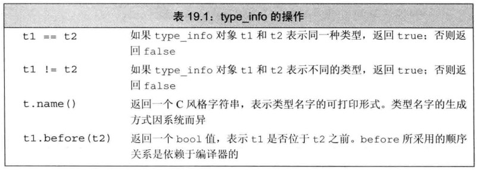

# 🚌 第 19 章 特殊工具与技术

## 第 19 章 特殊工具与技术

到此你会感觉 C++越来越离谱，不好好想着解决问题，语法与特性先成为了一大问题。只能说太复杂了，上手难度较高。

本章分别从，控制内存分配、运行时类型识别、枚举类型、类成员指针、嵌套类、union 联合体、局部类、不可移植的特性，入手进行学习

### 重载 new 和 delete

太离谱了吧，new 与 delete 还能重载！先回顾一下 new 与 delete,下面使用到了多维数组的内存动态分配，在 C++中 new 与 delete 就相当于 C 中的 malloc 与 free 函数

```cpp
//example1.cpp
#include <iostream>
#include <string>
using namespace std;

int main(int argc, char **argv)
{
    string *str = new string();
    delete str;
    int(*m)[5] = new int[5][5];
    m[0][0] = 1;
    m[4][4] = 1;
    cout << m[0][0] << " " << m[4][4] << endl; // 1 1
    delete[] m;
    return 0;
}
```

当用户自定义了 new 与 delete 的 operator,则有限使用自定义的，没找到则将寻找 new 与 delete 的函数重载，与之前的<,>操作函数类似，否则将会使用标准库中的 new、delete

标准库中有 4 个 delete 重载、4 个 new 重载

```cpp
void *operator new(size_t);//分配一个对象
void *operator new[](size_t);//分配一个数组
void *operator delete(void*) noexcept;//释放一个对象
void *operator delete[](void*) noexcept;//释放一个数组

void *operator new(size_t,nothrow_t&) noexcept;//分配一个对象
void *operator new[](size_t,nothrow_t&) noexcept;//分配一个数组
void *operator delete(void*,nothrow_t&) noexcept;//释放一个对象
void *operator delete[](void*,nothrow_t&) noexcept;//释放一个数组
```

总之我们左右不了 new 与 delete 的行为，我们做的就是写好构造函数与析构函数防止内存泄露

### malloc 与 free 函数

```cpp
#include<cstdlib>
```

例如以下是使用 malloc 和 free 编写 new 与 delete 的方法

```cpp
//example2.cpp
#include <iostream>
#include <cstdlib>
#include <stdexcept>
using namespace std;

void *operator new(size_t size)
{
    cout << "new memory" << endl;
    if (void *mem = malloc(size))
    {
        return mem;
    }
    else
    {
        throw bad_alloc();
    }
}

void operator delete(void *mem) noexcept
{
    cout << "delete memory" << endl;
    free(mem);
}

int main(int argc, char **argv)
{
    {
        int *num = new int();
        *num = 100;
        cout << *num << endl; // new memory 100
        delete num;
    }
    return 0;
}
```

### 定位 new 表达式

与 allocator 类的 allocate(size)与 deallocate(p,size)的功能有异曲同工之妙。定位 new 允许在一个特定的、预先分配的内存地址上构造对象

```cpp
new (place_address) type
new (place_address) type (initializers)
new (place_address) type [size]
new (place_address) type [size] {braced initializer list}
```

```cpp
//example3.cpp
#include <iostream>
using namespace std;

int main(int argc, char **argv)
{
    char *buffer = new char[12];
    int *p1 = new ((void *)buffer) int;
    *p1 = 1;
    cout << (int)buffer[0] << " " << (int)buffer[1] << " " << (int)buffer[2] << " " << (int)buffer[3] << endl;
    //        10000000                  00000000                00000000                00000000
    char *p2 = new ((void *)buffer) char[12]{1, 2, 3, 4};
    cout << (int)p2[0] << (int)p2[1] << (int)p2[2] << (int)p2[3] << endl;
    //        1               2              3           4
    return 0;
}
```

### 显式调用析构函数

构造函数的调用都是在使用栈内存定义变量时或者使用动态内存分配时进行调用，但是以前我们默认认为在内存释放时，析构函数自动调用，但是 C++允许显式调用析构函数的操作

显式调用析构函数与 allocator 的 destory(p)方法类似,调用后析构函数被执行，但是内存并没有被释放掉，内存可以重新进行使用

```cpp
//example4.cpp
#include <iostream>
#include <string>
using namespace std;

int main(int argc, char **argv)
{
    string *p1 = new string();
    p1->~string(); //调用构造函数并不释放内存
    *p1 = "dss";
    delete p1;
    // cout << *p1 << endl;//错误 乱码
    int(*m)[5] = new int[4][5];
    return 0;
}
```

### 运行时类型识别

在开发中在程序运行时，有时有需求判断一个变量是那种数据类型\
运行时类型识别(run-time type identification,RTTI),主要有两种方式

1、typeid 运算符，返回表达式的类型\
2、dynamic_cast 运算符，将基类指针或引用安全地转为派生类指针或引用

### dynamic_cast 运算符

dynamic_cast 使用形式

```cpp
dynamic_cast<type*>(e);
dynamic_cast<type&>(e);
dynamic_cast<type&&>(e);
//e为nullptr时则返回nullptr
```

### 指针类型 dynamic_cast

指针型 dynamic_cast 转换失败时会返回空指针

```cpp
//example5.cpp
#include <iostream>
#include <stdexcept>
using namespace std;

class A
{
public:
    A():num(0){}
    virtual void test() = 0;
protected:
    int num;
};

class B : public A
{
public:
    void test() override {}
    void show() {
        cout << ++num << endl;
    }
};

class C : public A
{
public:
    void test() override {}
    void hello()
    {
        cout << "hello world" << endl;
    }
    void show() {
        cout << ++num << endl;
    }
};

int main(int argc, char** argv)
{
    B* b = new B();
    A* a = b;

    B* b1 = dynamic_cast<B*>(a); // A至少要有一个虚函数
    b1->show();//1

    C* c = dynamic_cast<C*>(a); //去a的基类部分构造c
    //通过c只能访问基类的部分
    c->hello();//hello
    //c->show();错误

    delete c;
    delete b;
    return 0;
}
```

### 引用类型 dynamic_cast

引用类型转换失败则会抛出 std::bad_cast 异常

```cpp
//example6.cpp
class A
{
public:
    virtual void test() = 0;
};

class B : public A
{
public:
    void test() override
    {
        cout << "test" << endl;
    }
};

class C : public A
{
public:
    void test() override
    {
        cout << "C" << endl;
    }
};

int main(int argc, char **argv)
{
    B b;
    A &a = b;
    B &b1 = dynamic_cast<B &>(a);
    b1.test(); // test

    try
    {
        C c;
        A &a = c;
        dynamic_cast<B &>(a);
    }
    catch (bad_cast e)
    {
        cout << e.what() << endl; // std::bad_cast
    }
    return 0;
}
```

### 右值引用 dynamic_cast

```cpp
//example5.cpp
#include <iostream>
#include <stdexcept>
using namespace std;

class A {
public:
    virtual ~A(){}
    void run() {
        cout << "hello world" << endl;
    }
};

class B:public A {
public:
    B(){}
    ~B(){}
    void run() {
        cout << "bbb" << endl;
    }
};


int main(int argc, char** argv)
{
    A&& a = B();
    a.run();//hello world
    B&& b = dynamic_cast<B&&>(a);
    b.run();//bbb
    return 0;
}
```

### RTTI 实战

编写自定义类的 equal 方法,在多态中判断运行时类型

```cpp
#include <iostream>
using namespace std;

class A
{
public:
    bool operator==(A &other)
    {
        return this->equal(other) && this->get_num() == other.get_num();
    }

protected:
    virtual bool equal(A &other) = 0;
    virtual int get_num() = 0;
};

class B : public A
{
public:
    int num;
    B(int num) : num(num)
    {
    }

protected:
    virtual bool equal(A &other) override
    {
        return typeid(other) == typeid(*this);
    }
    virtual int get_num() override
    {
        return num;
    }
};

class C : public A
{
public:
    int num;
    C(int num) : num(num)
    {
    }

protected:
    virtual bool equal(A &other) override
    {
        return typeid(other) == typeid(*this);
    }
    virtual int get_num() override
    {
        return num;
    }
};

int main(int argc, char **argv)
{
    A *t1 = new B(1);
    A *t2 = new B(1);
    cout << boolalpha << (*t1 == *t2) << endl; // true
    A *t3 = new C(1);
    cout << boolalpha << (*t1 == *t3) << endl; // false
    cout << typeid(*t1).name() << endl;        // 1B
    cout << typeid(*t2).name() << endl;        // 1B
    cout << typeid(*t3).name() << endl;        // 1C

    delete dynamic_cast<B *>(t1);
    delete dynamic_cast<B *>(t2);
    delete dynamic_cast<C *>(t3);
    return 0;
}
```

### typeid 运算符

typeid 运算符返回 std::type_info 对象,在 C++中，`typeid 运算符的结果是一个左值`。这意味着可以对其应用取地址操作符（&）获取其地址。当对 typeid 的结果使用取地址操作符时，返回的是 std::type_info 对象的指针。

```cpp
#include <iostream>
using namespace std;

int main(int argc, char **argv)
{
    int a;
    const type_info &info1 = typeid(a);
    cout << info1.name() << endl; // i

    double d_num;
    const type_info &info2 = typeid(d_num);
    cout << info2.name() << endl; // d

    cout << (info1 == info2) << endl; // 0
    return 0;
}
```

### type_info 类

std::type_info 的定义可能根据编译器的不同而不同,std::type_info 删除了复制构造函数，若想保存 std::type_info，只能获取其引用或指针

```cpp
#include <iostream>
using namespace std;

int main(int argc, char **argv)
{
    int a;
    const std::type_info &info1 = typeid(a);
    auto ptr = &typeid(a);                          // const std::type_info *ptr
    cout << &info1 << " " << ptr << endl;           // 0x6ff57320 0x6ff57320
    cout << boolalpha << ((&info1) == ptr) << endl; // true
    return 0;
}
```

其没有默认构造函数，它的拷贝和移动构造函数、赋值运算符都被定义成了删除的，创建 type_info 的唯一途径就是使用 typeid 操作



值得注意的是 type_info 总是忽略 cv 限定符(const 与 volatile)

```cpp
#include <iostream>
using namespace std;

int main(int argc, char **argv)
{
    const int v1 = 9;
    int v2 = 9;
    cout << boolalpha << (typeid(v1) == typeid(v2)) << endl; // true
    volatile int v3 = 9;
    cout << boolalpha << (typeid(v1) == typeid(v3)) << endl; // true
    return 0;
}
```

### 枚举类型

C++中有两种枚举：限定作用域和不限定作用域的

1、限定作用域的

```cpp
//example10.cpp
#include <iostream>
using namespace std;

enum class m_enum
{
    a,
    b,
    c,
    d
};

int main(int argc, char **argv)
{
    bool res = m_enum::a == m_enum::b;
    cout << res << endl;                      // 0
    cout << (m_enum::a == m_enum::a) << endl; // 1
    return 0;
}
```

2、不限定作用域的

```cpp
//example11.cpp
#include <iostream>
using namespace std;

enum color //不限作用域
{
    red,
    blue
};

enum //未命名且不限作用域
{
    yellow,
    pink
};

int main(int argc, char **argv)
{
    cout << (red == blue) << endl; // 0
    // cout << (red == yellow) << endl;//warning: comparison between 'enum color' and 'enum<unnamed>'
    // 1
    return 0;
}
```

### 枚举成员

默认情况下枚举值从 0 开始，依次加 1

```cpp
//example12.cpp
#include <iostream>
using namespace std;

enum
{
    red,
    pink
};

enum color
{
    /// red, //冲突
    // pink
    black
};

enum class person
{
    man,
    woman
};

int main(int argc, char **argv)
{
    color c1 = black;
    person p1 = person::man;
    // color c2 = red;//错误
    return 0;
}
```

### 自定义枚举成员的值

默认从 0 依次加 1，但允许用户自定义值

```cpp
//example13.cpp
#include <iostream>
using namespace std;

enum class color
{
    pink,
    red = 12,
    black,
    blue = 3
};

int main(int argc, char **argv)
{
    color c1 = color::black;
    color c2 = color::red;
    cout << (int)c1 << endl;          // 13
    cout << (int)c2 << endl;          // 12
    cout << (int)color::pink << endl; // 0
    return 0;
}
```

### 枚举成员与常量表达式

枚举成员为 const，所以在初始化枚举成员时提供的初始值必须为常量表达式，每个枚举成员本身就是一条常量表达式

```cpp
//example14.cpp
#include <iostream>
using namespace std;

enum class color
{
    red,
    pink
};

int main(int argc, char **argv)
{
    const int n = 100;
    constexpr int num = n;
    cout << num << endl; // 100

    constexpr color c1 = color::pink;
    color c2 = color::red;
    c2 = color::pink;
    return 0;
}
```

### 枚举类型转换

非限定作用域与限定作用域二者有些区别

```cpp
//example15.cpp
#include <iostream>
using namespace std;

enum class color
{
    red,
    pink
};

enum
{
    black
};

enum m
{
    blue
};

int main(int argc, char **argv)
{
    int n1 = blue;
    cout << n1 << endl; // 0
    int n2 = black;

    // int n3 = color::red;//错误
    m m1 = blue;

    return 0;
}
```

### 指定 enum 的类型

默认枚举值的类型都是整形,但可以自己指定类型

```cpp
//example16.cpp
#include <iostream>
using namespace std;

enum color : unsigned long long
{
    red = 4343ULL,
    black = 4343
};

int main(int argc, char **argv)
{
    color::black;
    return 0;
}
```

### 枚举类型前置声明

和函数一样，枚举类型可以进行前置声明

```cpp
//example17.cpp
#include <iostream>
using namespace std;

//前置声明
enum class color; //限定作用域型默认使用int
// enum m;//错误 非限定作用域必须指定类型成员
enum m : int;

void func()
{
    // black;//错误
    // m::blue; //错误 error: 'blue' is not a member of 'm'
    // color::pink;//错误 error: 'pink' is not a member of 'color'
} //使用枚举成员前应该已经定义

enum class color
{
    red,
    pink
};

enum
{
    black
};

enum m : int
{
    blue
};

int main(int argc, char **argv)
{
    func();
    return 0;
}
```

### 形参匹配与枚举类型

枚举成员值也可以作为函数参数，要注意的细节就是枚举类型与数值类型的转换，其中涉及到函数的重载匹配问题

```cpp
//example18.cpp
#include <iostream>
using namespace std;

enum Color : int
{
    red,
    pink
};

void func(int num)
{
    cout << "num " << num << endl;
}

void func(Color color)
{
    cout << "color " << (int)color << endl;
}

void func_num(int func_num)
{
    cout << "func_num " << func_num << endl;
}

int main(int argc, char **argv)
{
    Color c1 = Color::red;
    func(c1);          // color 0
    func(0);           // num 0
    func(Color::pink); // color 1

    func_num(0);           // func_num 0
    func_num(Color::pink); // func_num 1

    //限定作用域型则严格遵守类型，不会进行向数值类型的自动转换，形参必须为相应的枚举类型
    //而不是数值类型，因为非限定型可以向数值类型自动转换
    return 0;
}
```

### 数据成员指针

成员指针(pointer to member)是指向类的非静态成员的指针\
大白话来讲到底是什么玩意呢？通俗的理解，有一种指针只能指向特定数据成员的属性

```cpp
//example19.cpp
class A
{
public:
    string content;
};

int main(int argc, char **argv)
{
    const string A::*ptr; // ptr可以指向A的对象中的string成员
    ptr = &A::content;    //进一步指定指向content属性
    //简单点就是 auto prt=&A::content

    A aObj;
    aObj.content = "hello";

    auto s = aObj.*ptr; //通过.获取aObj中的content成员
    A *aptr = &aObj;

    s = aptr->*ptr;    //通过指针->获取成员

    cout << s << endl; // hello
    s = "oop";
    cout << aObj.content << endl; // hello
    return 0;
}
```

### 返回数据成员指针的函数

可以将数据成员指针抽象为类的静态方法

```cpp
//example20.cpp
#include <iostream>
using namespace std;

class A
{
public:
    string contents;
    static const std::string A::*getContentsPointer()
    {
        return &A::contents;
    }
};

int main(int argc, char **argv)
{
    A a;
    A b;
    a.contents = "hello";
    b.contents = "world";
    const string A::*ptr = A::getContentsPointer();
    cout << a.*ptr << endl; // hello
    cout << b.*ptr << endl; // world
    return 0;
}
```

### 成员函数指针

有数据类型的指针，有函数类型的指针。那么也为成员函数的指针

```cpp
//example21.cpp
#include <iostream>
using namespace std;

class A
{
public:
    void test() const
    {
        cout << "hello world" << endl;
    }
    int test1(int a, double b)
    {
        return 0;
    }
};

int main(int argc, char **argv)
{
    auto ptr = &A::test; // void (A::*ptr)()
    // ptr指向A中返回void没有函数参数的成员函数
    auto ptr1 = &A::test1;
    // int (A::*ptr1)(int a, double b)
    void (A::*ptr2)() const = &A::test;
    return 0;
}
```

### 使用成员函数指针

与成员指针的适用方式是类似的

```cpp
//example22.cpp
class A
{
public:
    void test()
    {
        cout << "hello world" << endl;
    }
};

int main(int argc, char **argv)
{
    A a, *ap = &a;
    auto test_ptr = &A::test;
    (a.*test_ptr)();   // hello world
    (ap->*test_ptr)(); // hello world
    // a.*test_ptr();     //错误 根据优先级等价于 a.*(test_ptr())
    return 0;
}
```

### 使用成员指针的类型别名

由于成员指针的类型名称长度比较长，可以适用 using 为其起别名处理

```cpp
//example23.cpp
class A
{
public:
    string content;
    void test() const
    {
        cout << content << endl;
    }
};

using test = void (A::*)() const;
using content = string A::*;

int main(int argc, char **argv)
{
    content ptr1 = &A::content;
    test ptr2 = &A::test;
    A a;
    a.*ptr1 = "sd";
    (a.*ptr2)(); // sd
    return 0;
}
```

### 成员指针函数表

这是一种管理类方法的一种编程技巧，看起来下面的程序非常高级，C++菜鸟是看不懂的，想成为大牛像这种 demo 一定要学习到然后转化为自己的知识

```cpp
//example24.cpp
class A
{
public:
    using Action = A &(A::*)(); //为A的成员函数指针起别名
    enum Flag
    {
        UP,
        DOWN,
        LEFT,
        RIGHT
    };
    A &move(Flag f);
    A &up()
    {
        cout << "UP" << endl;
        return *this;
    }
    A &down()
    {
        cout << "DOWN" << endl;
        return *this;
    }
    A &left()
    {
        cout << "LEFT" << endl;
        return *this;
    }
    A &right()
    {
        cout << "RIGHT" << endl;
        return *this;
    }

private:
    static Action Menu[];
};

A::Action A::Menu[] =
    {
        &A::up,
        &A::down,
        &A::left,
        &A::right};

A &A::move(A::Flag f)
{
    return (this->*Menu[f])();
}

int main(int argc, char **argv)
{
    A a;
    a.move(A::UP);    // UP
    a.move(A::DOWN);  // DOWN
    a.move(A::LEFT);  // LEFT
    a.move(A::RIGHT); // RIGHT
    return 0;
}
```

### 将成员函数用作可调用对象

学习过函数指针可以赋值给可调用对象，成员函数也是可以的

```cpp
//example25.cpp
#include <iostream>
#include <string>
#include <functional>
using namespace std;

int main(int argc, char **argv)
{
    auto ptr1 = &string::empty; // bool (std::string::*ptr1)() const noexcept
    string str;
    cout << boolalpha << (str.*ptr1)() << endl; // true
    //使用function生成一个可调用对象
    function<bool(const string &)> fn = &string::empty;
    cout << fn(str) << endl; // true
    // mem_fn生成一个可调用对象
    auto empty = mem_fn(&string::empty);
    // std::_Mem_fn<bool (std::string::*)() const noexcept> empty
    cout << empty(str) << endl; // true
    return 0;
}
```

### 使用 function 生成一个可调用对象

可以将函数的地址赋给 function 对象

```cpp
#include <iostream>
#include <string>
#include <functional>
using namespace std;

int main(int argc, char **argv)
{
    auto ptr1 = &string::empty; // bool (std::string::*ptr1)() const noexcept
    string str;
    cout << boolalpha << (str.*ptr1)() << endl; // true
    //使用function生成一个可调用对象
    function<bool(const string &)> fn = &string::empty;
    cout << fn(str) << endl; // true
    // mem_fn生成一个可调用对象
    auto empty = mem_fn(&string::empty);
    // std::_Mem_fn<bool (std::string::*)() const noexcept> empty
    cout << empty(str) << endl; // true
    return 0;
}
```

### 使用 mem_fn 生成一个可调用对象

可以将成员函数的地址传递给 mem_fn 然后返回可调用对象

```cpp
//example26.cpp
#include <iostream>
#include <string>
#include <functional>
using namespace std;

int main(int argc, char **argv)
{
    auto ptr1 = &string::empty; // bool (std::string::*ptr1)() const noexcept
    string str;
    cout << boolalpha << (str.*ptr1)() << endl; // true
    //使用function生成一个可调用对象
    function<bool(const string &)> fn = &string::empty;
    cout << fn(str) << endl; // true
    // mem_fn生成一个可调用对象
    auto empty = mem_fn(&string::empty);
    // std::_Mem_fn<bool (std::string::*)() const noexcept> empty
    cout << empty(str) << endl; // true
    return 0;
}
```

### 使用 bind 生成一个可调用对象

在前面泛型算法章节有过学习

```cpp
//example26.cpp
#include <iostream>
#include <functional>
using namespace std;

class A
{
public:
    static void test(int n)
    {
        cout << n << endl;
    }
};

int main(int argc, char **argv)
{
    auto f = bind(&A::test, placeholders::_1);
    f(1); // 1
    return 0;
}
```

### 嵌套类

一个类可以被定义在一个类的内部，前者被称为嵌套类或嵌套类型

### 声明一个嵌套类

与普通类的声明类似，只不过声明在一个类的声明作用域内

```cpp
//example27.cpp
#include <iostream>
using namespace std;

class A
{
public:
    class B; //访问权限为public
};

class A::B
{
};

int main(int argc, char **argv)
{
    A a;
    A::B b;
    return 0;
}
```

### 在外层类之外定义一个嵌套类

嵌套类的作用域内，可以直接使用外层类的成员，无须对成员的名字进行限定

```cpp
//example28.cpp
#include <iostream>
#include <string>
using namespace std;

class A
{
public:
    class B;

private:
    using NAME = string;
    static const string name;
};

const string A::name = "A";

class A::B
{
public:
    B &test()
    {
        NAME str = "hello ";
        cout << str << name << endl; // hello A
        return *this;
    }
};

int main(int argc, char **argv)
{
    A a;
    A::B b;
    b.test(); // hello A
    return 0;
}
```

### 定义嵌套类的成员

理应当将嵌套类的成员函数与其声明分开定义

```cpp
//example29.cpp
#include <iostream>
#include <string>
using namespace std;

class A
{
public:
    class B;

private:
    using NAME = string;
    static const string name;
};

const string A::name = "A";

class A::B
{
public:
    B &test();
};

A::B &A::B::test()
{
    NAME str = "hello ";
    cout << str << name << endl; // hello A
    return *this;
}

int main(int argc, char **argv)
{
    A a;
    A::B b;
    b.test(); // hello A
    return 0;
}
```

### 嵌套类的静态成员定义

静态属性的定义与常规做法相似

```cpp
//example30.cpp
#include <iostream>
using namespace std;

class A
{
public:
    class B;
    using name_type = string;
};

class A::B
{
public:
    static const name_type name;
    void test();
};

const A::name_type A::B::name = "hello world";

void A::B::test()
{
    cout << name << endl;
}

int main(int argc, char **argv)
{
    A::B b;
    b.test(); // hello world
    return 0;
}
```

### 嵌套类作用域中的名字查找

嵌套类本身可以在外层类中使用,嵌套类内部也可以访问外层类中的类型,可以访问外层的嵌套类类型和静态成员

```cpp
//example31.cpp
#include <iostream>
using namespace std;

class A
{
public:
    class B;
    class C;

private:
    string name = "a";
};

class A::C
{
public:
    string name = "c";
};

class A::B
{
public:
    C c; //找不到回去外层寻找
    void test();
};

void A::B::test()
{
    A a;
    cout << a.name << endl; //嵌套类可以访问外层类的私有成员
}

int main(int argc, char **argv)
{
    A::B b;
    cout << b.c.name << endl; // c
    b.test();                 // a
    return 0;
}
```

### 嵌套类和外层类是相互独立的

嵌套类的嵌套是嵌套类被放在了外部类中，更像为嵌套类加了一个外层类的限定，但定义外层类类型变量是并不会将在其中定义外层类的对象与成员，二者之间的成员是独立的\
二者之间的成员访问权限又互相影响

### union 联合体

union 联合体是 C 语言中的内容，它是一种特殊的类，一个 union 可以有多个数据成员，但在任意时刻只有一个数据成员有值，当给某个成员赋值之后，其他成员变为未定义状态，分配给 union 对象的存储空间至少为能容纳最大的数据成员

C++11 中，可以有构造函数和析构函数，可以指定 public、protected 和 private 等保护标记，默认是 public 的。union 不能继承其他类，也不能被继承，其内不能有虚函数

### 定义 union

语法与定义 class 类型类似

```cpp
//example32.cpp
#include <iostream>
using namespace std;

union T
{
    char ch;
    float fl;
    double dl;
};

int main(int argc, char **argv)
{
    T t;
    t.ch = 'p';
    cout << t.dl << endl; // 1.79168e-307
    cout << t.fl << endl; // 8.99968e-039
    cout << t.ch << endl; // p
    t.dl = 232;
    cout << t.ch << endl; //
    cout << t.fl << endl; // 0
    cout << t.dl << endl; // 232
    return 0;
}
```

### 使用 union 类型

union 可以使用花括号显式初始化

```cpp
//example33.cpp
#include <iostream>
using namespace std;

union T
{
    int in;
    double dl;
    char ch;
};

int main(int argc, char **argv)
{
    T t1 = {'p'};
    T t2 = {12};
    T *t3 = new T;
    t3->ch = 'p';
    delete t3;
    return 0;
}
```

### 匿名 union

匿名 union 是未命名的 union，一旦定义了匿名 union，编译器会自动地创建一个未命名地对象

匿名 union 的定义所在的作用域内该 union 的成员都是可以直接访问的，不能包含受保护的成员或私有成员，也不能定义成员函数

```cpp
//example34.cpp
#include <iostream>
using namespace std;

//必须静态声明全局或命名空间范围的匿名联合

static union
{
    char ch;
    double dl;
};

int main(int argc, char **argv)
{
    ch = 'p';
    cout << ch << endl; // p
    cout << dl << endl; //乱码
    return 0;
}
```

### 含有类类型成员的 unino

```cpp
//example35.cpp
#include <iostream>
#include <string>
using namespace std;

union A
{
    string str;
    int a;
};

int main(int argc, char **argv)
{
    A a1("p"); //错误
    A a2("s"); //错误
    return 0;
}
```

为什么是错误的呢？union 的成员只有普通内置成员时，可以进行拷贝，赋值等操作。当内部拥有复杂数据类型时，且数据类型有默认构造构造函数或拷贝控制成员时，union 默认构造函数为 delete 的，默认析构函数也是 delete 的，解决方法显式定义 union 的默认构造函数和析构函数

```cpp
//example36.cpp
#include <iostream>
#include <string>
using namespace std;

union A
{
    string str;
    int a;
    A(const string &s)
    {
        new (&str) std::string(s);
    }
    A(const int &n)
    {
        a = n;
    }
    A &operator=(const A &a)
    {
        str = a.str;
        return *this;
    }
    ~A()
    {
        str.~string();
    }
};

int main(int argc, char **argv)
{
    A a(12);
    cout << a.a << endl; // 12
    A a1(string("dd"));
    cout << a1.str << endl; // dd
    return 0;
}
```

### C++中正确使用 union 的风格

在 C++基于 OOP 思想，可以对 union 及其操作进行封装抽象，但通常使用 union 更多的是使用基本数据类型，进而可以省去很多麻烦

只是用普通数据类型

```cpp
//example37.cpp
#include <iostream>
using namespace std;

union T
{
    int n;
    double dl;
};

int main(int argc, char **argv)
{
    T t1;
    t1.n = 12;
    T t2 = t1;
    cout << t2.n << endl; // 12
    return 0;
}
```

C++使用类进行管理

```cpp
//example38.cpp
#include <iostream>
using namespace std;

class Token
{
public:
    //默认将联合体存放int
    Token() : tok(INT), ival{0} {}
    //拷贝构造
    Token(const Token &t) : tok(t.tok) { copyUnion(t); }
    Token &operator=(const Token &t)
    {
        if(t.tok==STR&&this->tok==STR){
            this->sval=t.sval;
        }else{
            tok = t.tok;
            copyUnion(t);
        }
        return *this;
    }
    ~Token()
    {
        if (tok == STR)
            sval.~string(); //显式调用析构函数
    }
    Token &operator=(const std::string &);
    Token &operator=(char);
    Token &operator=(int);
    Token &operator=(double);

private:
    union
    {
        char cval;
        int ival;
        double dval;
        std::string sval;
    }; //匿名类 成员作用域
    enum
    {
        INT,
        CHAR,
        DBL,
        STR
    } tok; //判别式
    void copyUnion(const Token &);
};

void Token::copyUnion(const Token &t)
{
    if (this->tok == Token::STR)
        this->sval.~string();
    switch (t.tok)
    {
    case Token::INT:
        this->operator=(t.ival);
        break;
    case Token::CHAR:
        this->operator=(t.cval);
    case Token::DBL:
        this->operator=(t.dval);
    case Token::STR:
        this->operator=(t.sval);
    default:
        break;
    }
}

Token &Token::operator=(const std::string &str)
{
    if (this->tok == Token::STR)
        this->sval.~string();
    new (&this->sval) string(str);
    return *this;
}

Token &Token::operator=(char ch)
{
    if (this->tok == Token::STR)
        this->sval.~string();
    this->cval = ch;
    return *this;
}

Token &Token::operator=(int in)
{
    if (this->tok == Token::STR)
        this->sval.~string();
    this->ival = in;
    return *this;
}

Token &Token::operator=(double dl)
{
    if (this->tok == Token::STR)
        this->sval.~string();
    this->dval = dl;
    return *this;
}

int main(int argc, char **argv)
{
    Token token;
    token = "string";
    token = 23;
    token = 'c';
    token = 23.4;
    Token token_copy = token;
    return 0;
}
```

可见这种设计已经违背了出中，这些方法本身所占用的内存已经超过了数据本身的大小，这是非常不值得的一件事。

### 局部类

名字好熟悉，因为刚学习了嵌套类，类可以定义在某个函数内部，成这样的类为局部类，局部类定义的类型只在它的作用域内可见，和嵌套类不同，局部类收到严格限制

重点：局部类的所有成员(包括函数在内)都必须完整定义在类的内部，布局类不允许声明 static 数据成员,因为无法定义这样的成员

### 局部类不能使用函数作用域中的变量

局部类对外部作用域的内容的访问有很大限制，只能访问外部定义的类型名，静态变量，枚举类型，普通局部变量不允许访问

```cpp
//example39.cpp
#include <iostream>
using namespace std;

void func()
{
    struct A
    {
        int a;
        int b;
        ostream &operator<<(ostream &os) const
        {
            os << a << " " << b << endl;
            return os;
        }
    };
    class B
    {
    public:
        int a;
        int b;
        ostream &operator<<(ostream &os)
        {
            os << a << " " << b << endl;
            return os;
        }
    };
    A a;
    a.a = 1, a.b = 2;
    B b;
    b.a = 1, b.b = 2;
    a << cout; // 1 2
    b << cout; // 1 2
}

int main(int argc, char **argv)
{
    func();
    return 0;
}
```

### 常规的访问保护规则对局部类同样适用

对于局部类内部的类成员的访问权限，都适用，如 public、private、protected

### 局部类中的名字查找

与其他类似，首先在局部类内部寻找，找不到则取外部作用域查找，没找到则依次向外找

### 嵌套的局部类

嵌套的局部类就是在局部类中定义嵌套类,嵌套类必须定义在于局部类相同的作用域中，局部类内的嵌套类也是一个局部类

```cpp
//example40.cpp
#include <iostream>
using namespace std;

void func()
{
    struct A
    {
        class B;
    };
    class A::B
    {
    public:
        int n;
    };
    A::B b;
    b.n = 999;
    cout << b.n << endl; // 999
};

int main(int argc, char **argv)
{
    func();
    return 0;
}
```

### 固有的不可移植的特性

不可移植的特性是指，因为机器不同的特性，将含有不可移植特性的程序从一台机器转移到另一台机器通常会重新编写程序\
主要有从 C 语言继承的特性，位域和 volatile，还有 C++的特性 链接指示

### 内存字节对齐

推荐讲解视频 <https://www.bilibili.com/video/BV1JB4y1W7oR>

什么是内存对齐呢，先来看一个对比

```cpp
#include<iostream>
using namespace std;

#pragma pack(show)//16

struct PackA {
 char a;
 int b;
 short c;
};

struct PackB
{
 int b;
 char a;
 short c;
};

int main() {
 cout << sizeof(PackA) << endl;//12
 cout << sizeof(PackB) << endl;//8
 return 0;
}
```

我们可能会说 What fuck? Why?,为了 CPU 高效的读取内存，系统可不是一个字节一个字节读取的，如果每次读取四个字节

```cpp
0x0 char c1
0x1 char c2
0x2 char c3     //读取内存可不是从0x3然后读取4个字节，而是先读取0x0四个字节
0x3 int a       //再读0x3四个字节，然后拼凑出想要的4个字节
0x4 a           //这样想一下，效率比较低，有没有好一点的办法呢
0x5 a
0x6 a
```

可以将,a 后移动

```cpp
0x0 char c1
0x1 char c2
0x2 char c3
0x3
0x4 int a   //可见占用的总空间是不一样的
0x5 a
0x6 a
0x7 a
```

首先有一个基本的原则，变量的地址只能是其类型大小的整数倍,这是直接为变量时的简单情况

```cpp
#include<iostream>
using namespace std;

int main() {
 int a, b, c;
 double e;
 short f;
 cout << (long long) & a << endl;//184479120452 % 4 = 0
 cout << (long long) & b << endl;//184479120484 % 4 = 0
 cout << (long long) & c << endl;//184479120516 % 4 = 0
 cout << (long long)&e << endl;//184479120552 % 8 = 0
 cout << (long long)&f << endl;//184479120580 % 2 = 0
 return 0;
}
```

下面重新回到结构体的例子中

```cpp
#include<iostream>
using namespace std;

#pragma pack(show)//16

struct PackA {
 char a; //0x00
   //0x01
   //0x02
   //0x03
 int b; //0x04
   //0x05
   //0x06
   //0x07
 short c;//0x08
   //0x09         //这不是10个吗，为什么是12呢，因为结构体本身也有字节对齐大小
   //0x0A     //其对齐大小为，内部最大的对齐大小，此案例则为int 4byte
   //0x0B     //所以其对齐大小应该为4byte的整数倍
             //最小满足的大小为12byte
};

struct PackB
{
 int b;//0x00
    //0x01
       //0x02
       //0x03
 char a;//0x04
     //0x05
 short c;//0x06
   //0x07        //同理结构体也要字节对齐大小为int 大小的整数倍,正好满足要求
};

int main() {
 cout << sizeof(PackA) << endl;//12
 cout << sizeof(PackB) << endl;//8

 char* buffer = new char[sizeof(PackA)];
 PackA packa;
 cout << "packa_addr " << (long long)&packa % sizeof(int) << endl;//永远为0因为PackA字节对齐大小为4byte
 packa.a = 'a';
 packa.b = 1;
 packa.c = 2;//内存序列化
 memcpy(buffer, &packa, sizeof(packa));
 //解包操作
 PackA packa_copy;
 memcpy(&packa_copy, buffer, sizeof(packa_copy));
 cout << packa_copy.a << " " << packa_copy.b << " " << packa_copy.c << endl;
 //a 1 2
 delete[] buffer;
 return 0;
}
```

内存中如果有数组呢,数组按照其元素类型的对齐大小对每一项对齐，数组内内存地址连续

```cpp
#include<iostream>
using namespace std;

#pragma pack(show)//16

struct PackA {
 char a;//0x00
     //0x01
     //0x02
     //0x03
 int arr_int[2];//0x04 0x05 0x06 0x07
       //0x08 0x09 0x0A 0x0B
   //0x0C
   //0x0D
   //0x0E
   //0x0F
 int b;//0x10 0x11 0x12 0x13
 short arr_short[2]; //0x14 0x15 0x16 0x17 现在为18大小 结构体对齐大小为4
   //0x18
   //0x19 20%4=0 所以大小为20
};

int main() {
 cout << sizeof(PackA) << endl;//20
 return 0;
}
```

如果结构体嵌套结构体呢,结构体对齐大小则为其内存最大的对齐大小

```cpp
#include<iostream>
using namespace std;

#pragma pack(show)//16

struct PackA {
 char a;//0x00
     //0x01
     //0x02
     //0x03
 int arr_int[2];//0x04 0x05 0x06 0x07
       //0x08 0x09 0x0A 0x0B
   //0x0C
   //0x0D
   //0x0E
   //0x0F
 int b;//0x10 0x11 0x12 0x13
 short arr_short[2]; //0x14 0x15 0x16 0x17 现在为18大小 结构体对齐大小为4
   //0x18
   //0x19 20%4=0 所以大小为20
};

struct PackB {
 char a;//0x00 因为PackA对齐大小为4
     //0x01
        //0x02
        //0x03
 PackA packa;//0x04 ... 0x15
 //PackB 的对齐大小则为PackA的对齐大小 4
 //因为a对齐大小1<4
 //24%4=0 正好对齐
};

int main() {
 cout << sizeof(PackB) << endl;//24
 return 0;
}
```

对齐大小是根据不同的平台变化的，有些时候我们会一劳永逸，使用预处理命令进行指定 pack 的大小

```cpp
#include<iostream>
using namespace std;

#pragma pack(show)//16
#pragma pack(1) //设置pack大小

struct PackA {
 char a;//0x00
 int arr_int[2];//0x02 0x03 0x04 0x05 min(4,1) 选择1作为对齐大小
       //0x06 0x07 0x08 0x09
 int b;//0x0A 0x0B 0x0C 0x0D min(4,1)做对齐大小
 short arr_short[2]; //0x0E 0x0F 0x10 0x11
};//则PackA的对齐大小为1 内部使用的最大的对齐大小为1

struct PackB {
 char a;//0x00 min(1,1)做对齐大小
 PackA packa;//0x01 ... 0x12 min(PackA,1)做对齐大小
};//同理PackB的对齐大小为1

int main() {
 cout << sizeof(PackB) << endl;//18
 //如果将pack设置为2，就大于2的对齐大小则必须使用2作为对齐大小
 //小于2的对齐大小则使用其本身即可
 return 0;
}
```

上面的默认 pack 大小为 16 一般没有那种数据类型的对齐大小超过 16

### 位域

C++中的位域（Bit fields）允许将数据成员的位数指定为小于标准数据类型（如 int、char 等）的位数。使用位域可以有效地利用内存，并实现对特定位的操作。

位域的存在意义：

1、节省内存：当需要存储大量的布尔标志或小范围的整数时，使用位域可以节省内存空间，因为位域允许将多个成员打包到一个字节中。  
2、与硬件通信：位域经常用于与硬件设备进行通信，其中位域的每个位对应于硬件寄存器的特定位。

位域的类型只能是整数类型（包括有符号和无符号整数类型）

```cpp
#include <iostream>
using namespace std;

// bool
struct X1
{
    bool isRed : 1;
    bool isGreen : 1;
    bool isBlue : 1;
};

// 整形
struct X2
{
    unsigned int n1 : 1;
    signed long long n2 : 2;
};

// 枚举
enum class Color
{
    Red = 1,   // 001,1
    Green = 2, // 010,10
    Blue = 4   // 100,100
};

struct X3
{
    unsigned int color : 3;
};

int main(int argc, char **argv)
{
    // bool
    X1 x1;
    x1.isBlue = true;
    x1.isGreen = true;
    x1.isRed = false;
    cout << x1.isBlue << endl;  // 1
    cout << x1.isGreen << endl; // 1
    cout << x1.isRed << endl;   // 0
    // 整形
    X2 x2;
    x2.n1 = 1;
    x2.n2 = -2;
    cout << x2.n1 << " " << x2.n2 << endl; // 1 -2
    // enum
    X3 x3;
    x3.color = static_cast<unsigned int>(Color::Red) | static_cast<unsigned int>(Color::Blue) | static_cast<unsigned int>(Color::Green);
    // Red: 1
    std::cout << "Red: " << ((x3.color & static_cast<unsigned int>(Color::Red)) != 0) << std::endl;
    // Green: 1
    std::cout << "Green: " << ((x3.color & static_cast<unsigned int>(Color::Green)) != 0) << std::endl;
    // Blue: 1
    std::cout << "Blue: " << ((x3.color & static_cast<unsigned int>(Color::Blue)) != 0) << std::endl;
    return 0;
}
```

取址运算符&,不能作用于位域，任何指针都不能指向位域，因为内存地址起码是以字节为单位的偶

### 使用位域

位域的访问方式，与其他数据成员类似

```cpp
//example42.cpp
#include <iostream>
using namespace std;

//位域的类型必须为整形或者枚举类型
typedef unsigned int Bit;
class Block
{
public:
    Bit mode : 2;     //占两个二进制位 存储的大小范围为[0,3]
    Bit modified : 1; //存储的大小范围为[0,1]
    enum modes
    {
        READ = 1,
        WRITE = 2,
        EXECUTE = 3
    };
    Block &open(modes);
    bool isRead();
    void setWrite();
    void write();
};

void Block::write()
{
    modified = 1;
}

Block &Block::open(Block::modes mode_)
{
    mode |= READ;
    if (mode_ & WRITE)
        setWrite();
    return *this;
}

bool Block::isRead()
{
    return mode & READ;
}

void Block::setWrite()
{
    mode |= WRITE;
}

int main(int argc, char **argv)
{
    Block block;
    block.setWrite();
    cout << block.mode << endl;
    return 0;
}
```

### 位域与字节对齐

上面有学习过结构体中的字节对齐问题，那么含有位域的结构体的内存对齐情况又是怎样的呢？

```cpp
#include<iostream>
using namespace std;

//位域只能方整形或枚举

struct PackA {
 int a : 4;//4bit
 int : 2; //2bit
 int b : 4;//4bit
 unsigned c : 2;//2bit
 char d;//8bit
};

int main() {
 cout << sizeof(PackA) << endl;//8
 //What fuck. 怎么回事
 return 0;
}
```

下面来分析一下

```cpp
//错误的分析方法
#include<iostream>
using namespace std;

struct PackA {
 int a : 4;//4bit 0 1 2 3
 int : 2; //2bit  4 5
 //因为前面用了6bit 还有2bit凑一个字节
 //凑不下b了故直接跳过这2bit
 // 6 7
 int b : 4;//8 9 10 11
 unsigned c : 2;//12 13
    //跳过 14 15
 char d;//8bit
 //16 17 18 19 20 21 22 23
};//这么分析也就才3字节啊

int main() {
 cout << sizeof(PackA) << endl;//8
 //What fuck. 怎么回事

 return 0;
}
```

1、一个位域必须存储在同一个字节中，不能跨字节存储。如一个字节所剩空间不能存储下一个位域的时候，应从下一个字节开始存储。也可以有意使某个位域从下一单元开始  
2、由于位域不允许跨两个字节，因此位域的长度不能大于一个字节的长度，
也就是说位域的不能超过 8bit；
3、位域可以无位域名，这时它只用作填充或调整位置。无名的位域是不能使用的  
4、位域结构的成员不能单独被取 sizeof 值  
5、如果相邻位域字段的类型相同，且其位宽之和小于类型的 sizeof 大小，则后面的字段将紧邻前一个字段存储，直到不能容纳为止；  
6、如果相邻位域字段的类型相同，且其位宽之和大于类型的 sizeof 大小，则后面的字段将从新的存储单元开始，其偏移量为其类型大小的整数倍；  
7、如果相邻位域字段的类型不同，则各个编译器的具体实现有所差异，VC 不压缩，而 Dev C++压缩；  
8、如果位域字段之间插着非位域字段，则不进行压缩；  
9、整个位域结构体的总体大小为最宽的基本类型成员大小的整数倍。

VC 正确的分析方法

```cpp
#include<iostream>
using namespace std;

struct PackA {
 int a : 4;//4bit 0 1 2 3
 int : 2; //2bit  4 5
 //因为前面用了6bit 还有2bit凑一个字节
 //凑不下b了故直接跳过这2bit
 // 6 7
 int b : 4;//8 9 10 11
 unsigned c : 2;//12 13
     //14 15
     //16 17 18 19
     //20 21 22 23
     //24 25 26 27
     //28 29 30 31 跳过 前面大小共4byte
 char d;//8bit
};//这么分析也就才5字节啊，因为要结构体对齐，最大为int的4byte，如为4的整数倍
//为对齐大小为8

struct PackB {
 short a : 4;//开启2byte
 int b : 4;//开启4byte int与short不能共用
};//结构体对齐大小为8

struct PackC {
 char a : 2;
 char : 1;
 char b : 5;
};

struct PackD {
 long a : 4;
 int b : 4;
 unsigned c : 8;//因为long int unsigned的对齐大小都为4，
 //所以即使其类型不同也可以共享内存
};

int main() {
 cout << sizeof(PackA) << endl;//8
 //What fuck. 怎么回事
 cout << sizeof(PackB) << endl;//8
 cout << sizeof(PackC) << endl;//1
 cout << sizeof(PackD) << endl;//4
 return 0;
}
```

### 位域默认初始化

C++11 支持非静态数据成员默认初始化方法之后，C++20 支持对数据成员的位域进行默认初始化了。

```cpp
// g++ main.cpp -o main -std=c++2a
#include <iostream>
using namespace std;

struct X
{
    int y : 8 = 10;
    int z : 4 {7};
};

// 甚至可以用常量表达式表示比特数
// 但是千万不要用这么傻逼的东西
int a = 10;
struct X1
{
    int y : (true ? 8 : a) = 42;
};

int main(int argc, char **argv)
{
    X x;
    cout << x.y << " " << x.z << endl; // 10 7
    X1 x1;
    cout << x1.y << endl; // 42
    return 0;
}
```

### volatile 限定符

volatile 的最重要的作用是，读取数据时都使用指令从新从内存中读取最新数据，不考虑缓存机制，如下面的情景

```cpp
//example43.cpp
int main(int argc, char **argv)
{
    volatile int flag = 0;
    int a = flag;
    //没有改变过flag
    int b = flag;
    return 0;
}
```

如果 flag 不是 volatile 的，则在 a 与 b 之间编译器认为 flag 并没有改变，则会做出优化，将在 a=flag 读出的 flag 值赋给 b。使用 volatile 之后，每次读取 flag 值，都是使用从新从内存读取值

volatile 的关键字使用有点类似于 const

```cpp
//example44.cpp
#include <iostream>
using namespace std;

int main(int argc, char **argv)
{
    volatile int v;
    int *volatile vip; // volatile指针 指向int
    volatile int *ivp; //指向volatile int的指针
    volatile int *volatile vivp;
    //指向volatile int的指向volatile指针

    // int *p1 = &v;
    //"volatile int *" 类型的值不能用于初始化 "int *" 类型的实体

    ivp = &v;
    vivp = &v;

    // int &i = *ivp;
    //错误

    volatile int &i = *ivp; //正确

    return 0;
}
```

### 合成的拷贝对 volatile 对象无效

合成的拷贝/移动构造函数及赋值运算符不能默认接收 volatile 对象，因为默认合成的函数接收 const Name\&name 形式，并不是 volatile,进而也不可能将 volatile 对象绑定到引用，方法就是重载相关操作符

```cpp
//example45.cpp
#include <iostream>
using namespace std;

class T
{
public:
    T() = default;
    T &operator=(const T &) = default;
    //将volatile赋给非volatile
    T &operator=(volatile const T &t)
    {
        cout << "1" << endl;
        return *this;
    }
    //将volatile赋给volatile
    volatile T &operator=(volatile const T &t) volatile
    {
        cout << "2" << endl;
        return *this;
    }
};

int main(int argc, char **argv)
{
    T t;
    T t1 = t;
    volatile T t2;
    t = t2; // 1
    volatile T t3;
    t3 = t2; // 2
    return 0;
}
```

### 链接指示 extern "C"

C++使用链接指示(linkage directive)指出任意非 C++函数所用的语言

### 声明一个非 C++的函数

链接指示有两种形式，单个的和复合的

```cpp
//example46.cpp
#include <iostream>
using namespace std;

// C++头文件<cstring>中的链接指示
// 以下声明的函数是使用C语言实现的
extern "C" size_t strlen(const char *);
extern "C"
{
    int strcmp(const char *, const char *);
    char *strcat(char *, const char *);
}

int main(int argc, char **argv)
{
    int size = strlen("dscs");
    cout << size << endl; // 4
    return 0;
}
```

有的编译器还支持 Ada、FORTRAN 等

### 链接指示与头文件

相当于将 string.h 内的 C 头文件声明，使用 C 语言链接指示

```cpp
//example47.cpp
#include <iostream>
using namespace std;

extern "C"
{
#include <string.h>
}

int main(int argc, char **argv)
{
    cout << strlen("sds") << endl; // 3
    return 0;
}
```

### 指向 extern "C" 函数的指针

对于函数指针可以加 extern "C"对函数指针的指向加以约束

```cpp
//example48.cpp
#include <iostream>
using namespace std;

extern "C"
{
    void test();
}

void test()
{
    cout << "hello world" << endl;
}

extern "C"
{
    void (*ptr2)();
}

void test_other()
{
}

int main(int argc, char **argv)
{
    test(); // hello world
    void (*ptr)() = test;
    ptr(); // hello world

    ptr2 = test; // ptr2指向C函数
    ptr2();      // hello world
    void (*ptr3)() = ptr2;
    ptr3(); // hello world
    return 0;
}
```

### 链接指示对整个声明都有效

```cpp
//example49.cpp
#include <iostream>
using namespace std;

extern "C"
{
    void test()
    {
        cout << "hello world" << endl;
    }
    void func(void (*)());
    //给func传递的void(*)()也应该是C函数
    //链接指示对整个声明都有效
}

void func(void (*test)())
{
    test();
}

void test_other()
{
    cout << "hello world" << endl;
}

int main(int argc, char **argv)
{
    test();           // hello world
    func(test_other); // hello world
    func(test);       // hello world
    return 0;
}
```

### 导出 C++函数到其他语言

```cpp
//example50.cpp
#include <iostream>
using namespace std;

extern "C" void test()
{
}
// test函数可被C程序调用

int main(int argc, char **argv)
{
    test();
    return 0;
}
```

c++条件编译 \_\_cplusplus 宏

```cpp
//example51.cpp
#include <iostream>
using namespace std;

#ifdef __cplusplus
extern "C"
#endif
    int
    strcmp(const char *, const char *);

int main(int argc, char **argv)
{
    cout << strcmp("a", "b") << endl; //-1
    return 0;
}
```

### 重载函数与链接指示

C 语言中没有函数重载的特性

```cpp
//example52.cpp
#include <iostream>
using namespace std;

extern "C" int strcmp(const char *, const char *);
void strcmp()
{
    cout << "hello world" << endl;
}

int main(int argc, char **argv)
{
    cout << strcmp("a", "b") << endl; //-1
    strcmp();                         // hello world
    return 0;
}
```
