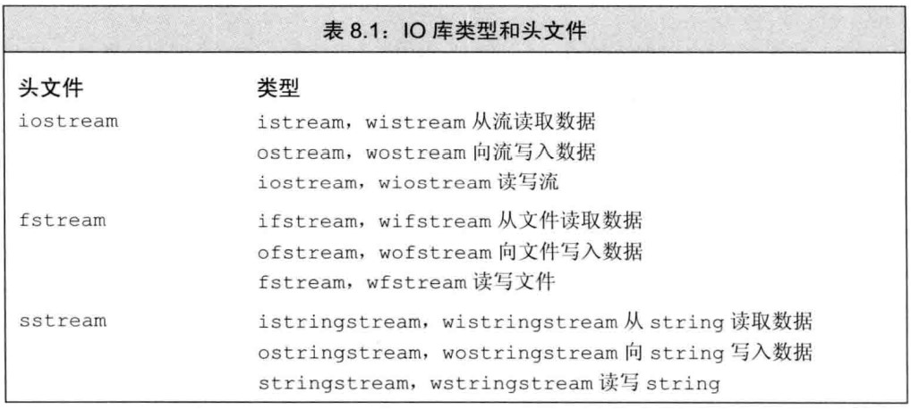
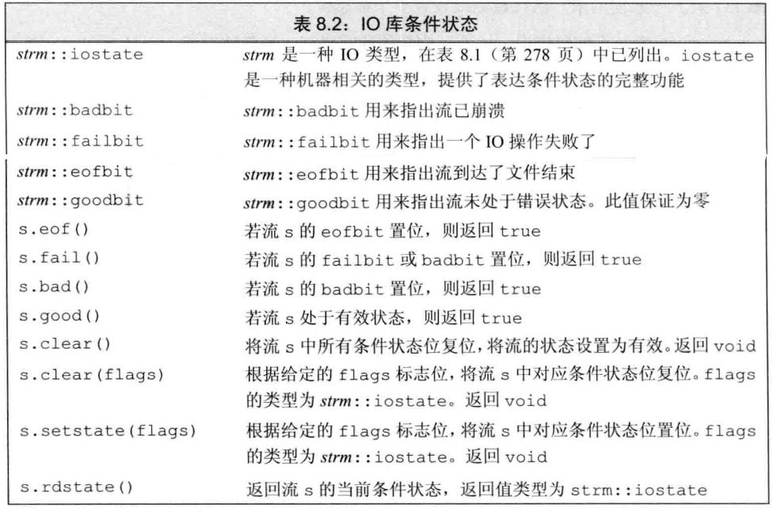
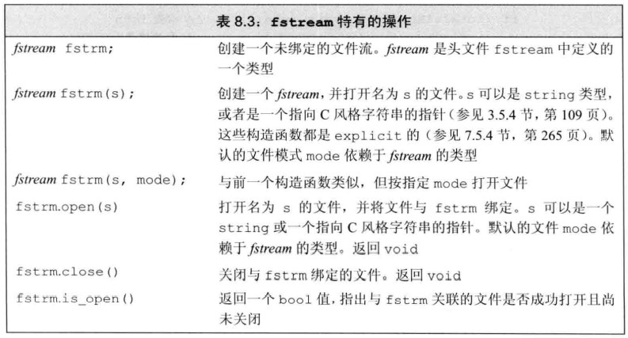

# 🥰 第 8 章 IO 库

## 第 8 章 IO 库

C++中不直接处理输入输出，而是通过一系列定义在标准库中的类型处理 IO，这些类型支持从设备读取数据，向设备写入数据的 IO 操作，设备可以是文件，控制台窗口等\
还有一些类型允许操作内存 IO，即从 string 读取数据，向 string 写入数据

我们已经接触了

istream 输入流类型，提供输入操作。ostream 输出流类型，提供输出操作。\
cin 是一个 istream 对象，从标准输入读取数据\
cout 是一个 ostream 对象，向标准输出写入数据\
cerr 是一个 ostream 对象，通常用于输出程序错误信息，写入到标准错误\
\>>运算符，用来从一个 istream 对象读取输入数据\
<<运算符，用来向一个 ostream 对象写入输出数据\
getline 函数，从一个给定的 istream 读取一行数据，存入一个给定的 string 对象中

### IO 类

先知道下面的东西大致有什么用途即可



以 w 开头的是表示支持使用宽字符的语言，C++定义类一组来操纵 wchar_t 类型的数据，宽字符版本类型和函数以 w 开头，如 wcin,wcout,wcerr

```cpp
//example1.cpp
#include<iostream>
using namespace std;
int main(int argc,char**argv){
    wstring name;
    wcin >> name;//你好
    wcout << name << endl;//你好
    cout << name.length() << endl;//4
    return 0;
}
```

### IO 类型间的关系

不同的输入输出流之间只通过继承机制来实现的，所有输入流的基类都是 istream，所有输出流的基类是 ostream

### IO 对象无拷贝或赋值

总之 IO 对象是不能进行赋值的，因为不能拷贝，所以不能将形参或返回类型设置为流类型\
通常会使用引用方式传递和返回，因为读写一个对象会改变其状态，传递和返回的引用不能是 const 的

### 条件状态

流对象有自己的状态，称为操作流的条件状态



看不懂没关系，先知道有这么回事，会面的学习才会真的用起来

```cpp
//example2.cpp
#include<iostream>
using namespace std;
int main(int argc,char**argv){
    cout << cin.eof() << endl;//0
    cout << cin.fail() << endl;//0
    cout << cin.good() << endl;//1 此时流状态位goodbit为1

    std::ios_base::iostate state=std::ios_base::failbit;
    cin.setstate(state);
    //读取条件状态
    cout << (cin.rdstate()==std::ios_base::failbit) << endl;//1
    cout << (cin.rdstate()==cin.failbit) << endl;//1
    cout << cin.good() << endl;//0

    return 0;
}
```

实际使用

```cpp
//example3.cpp
#include<iostream>
using namespace std;
int main(int argc,char**argv){
    int i;
    cin >> i;//g
    cout << cin.good() << endl;//0
    cout << i << endl;//0
    cin >> i;//不会被正常执行，因为cin的状态已经发生错误
    cout << cin.good() << endl;//0
    return 0;
}
```

如果将流操作放入 if 或者 while 等需要进行布尔检查的地方，则会检查流的状态

```cpp
//example4.cpp
#include<iostream>
using namespace std;
int main(int argc,char**argv){
    int i;
    if(cin>>i){
        cout << i << endl;
    }
    //输入 e 输出 none
    //输入 3 输出 3
    return 0;
}
```

### 管理条件状态

读取条件状态使用 rdstate()方法，使用 clear()恢复默认的状态,setstate 设置状态

```cpp
//example5.cpp
#include<iostream>
using namespace std;
int main(int argc,char**argv){
    auto old_state = cin.rdstate();
    cin.clear();//恢复默认条件状态
    cin.setstate(old_state);
    //复位时可以保持其他标志位不变
    cin.clear(cin.rdstate() & ~cin.failbit & ~cin.badbit);
    //辅位failbit、badbit 保持其他标志位不变
    return 0;
}
```

### 管理输出缓冲

每个输出流都管理一个缓冲区，用来保存程序读写的数据

```cpp
os<<"hello world";
```

文本可能马上打印出来，也可能保存在缓冲区中，随后打印\
操作系统可以将多个程序的多个输出操作组合称单一的系统级写操作，提高效率

导致缓冲刷新，即数据真正写出输出设备或文件的原因有很多

- 程序正常结束，作为 main 函数的 return 操作的一部分，缓冲被刷新
- 缓冲区满的时候
- 使用 endl 显式刷新缓冲区
- 每个输出操纵后，可以使用操纵符 unitbuf 设置流的内部状态，来清空缓冲区，cerr 默认是被设置 unitbuf 的，因此写入到 cerr 的内容会马上输出
- 一个输出流可能被关联到另一个流，当读写被关联的流时，关联到的流的缓冲区会被刷新，如 cin、cerr 都关联到 cout,因此读 cin 或写 cerr 都会导致 cout 的缓冲区被刷新

```cpp
//example6.cpp
#include <iostream>
using namespace std;
int main(int argc, char **argv)
{
    cout << "hello world" << endl;//输出加换行 然后刷新
    cout << "hello world" << flush;//输出 然后刷新
    cout << "hello world" << ends;//输出加一个空字符 然后刷新
    //hello world
    //hello worldhello world
    return 0;
}
```

### unitbuf 操纵符

```cpp
//example7.cpp
#include<iostream>
using namespace std;
int main(int argc,char**argv){
    cout << unitbuf;
    //都cout的写入都会立即刷新缓冲区，即立即输出
    //即cout不再使用缓冲区
    cout << "hello world";//hello world
    cout << nounitbuf;//恢复使用缓冲方式
    return 0;
}
```

### 关联输入和输出流

当一个输入流关联到一个输出流时，任何试图输入流读取数据的操作都会先刷新关联的输出流，默认 cout 与 cin 关联在一起

```cpp
//example8.cpp
#include<iostream>
using namespace std;
int main(int argc,char**argv){
    cout << "hello world" << endl;
    int i;
    cin >> i;//cout被缓冲区被刷新
    //也就是形成了先输出才会等待输入
    return 0;
}
```

`tie()`方法允许我们进行输入和输出流之间的关联\
`tie`有两个重载一个接收输出流的指针（设置关联的输出流指针），一个没有参数（返回关联输出流的指针）

```cpp
//example9.cpp
#include<iostream>
using namespace std;
int main(int argc,char**argv){
   std::ostream* m_ostream=cin.tie();
   if(m_ostream==&cout){
       cout << "m_ostream==&cout" << endl;//m_ostream==&cout
   }
   cin.tie(nullptr);//取消与其他输出流的关联
   cin.tie(&cout);//恢复关联
   return 0;
}
```

### 文件输入输出

三种流对象支持对文件的内容操作，ifstream 从一个文件读取数据，ofstream 向一个给定文件写入数据，以及 fstream 可以读写给定文件



### 使用文件流对象

```cpp
//example10.iofile
hello world
```

输入流的创建、文件打开与关闭

```cpp
//example10.cpp
#include<iostream>
#include<string>
#include<fstream>
using namespace std;
int main(int argc,char**argv){
    //构造一个ifstream并打开给定文件
    ifstream m_instream("./example10.iofile");
    //或
    // ifstream m_instream;
    // m_instream.open("./example10.iofile");
    if(m_instream.fail()||!m_instream.good()){
        cout << "file open failed" << endl;
        return 0;
    }

    string str;
    m_instream>>str;
    cout <<str.size()<<":"<< str << endl;//5:hello
    m_instream >> str;

    cout <<str.size()<<":"<< str << endl;//5:world
    m_instream >> str;

    m_instream.seekg(0);//
    getline(m_instream,str);
    cout << str.size()<<":"<<str << endl;//5:world

    //关闭输入流
    if(m_instream.is_open()){
        m_instream.close();
    }
    return 0;
}
```

### fstream 自动构造和析构

对于 fstream 对象不论是栈内存对象，还是堆内存对象，当他们的离开作用域的是否，fstream 的析构函数会被调用，此时 close 会自动调用

### 文件模式


只有当 out 被设定才能设定 trunc 模式\
如果 trunc 没有被设定，可以设定 app 模式，在 app 模式即使没有显示指定 out 模式，文件总能以输出模式被打开\
默认情况下，即使没有指定 trunc，以 out 模式打开的文件会被截断，为了保留以 out 模式打开的文件的内容，必须同时指定 app 模式，这样才会将数据追加到末尾或同时指定 in\
ate 和 binary 模式可用于任何类型的文件流对象

默认文件模式

`ifstream默认使用in模式、ofstream默认使用out模式、fstream默认使用in|out模式`

```cpp
//example11.cpp
#include<iostream>
#include<fstream>
using namespace std;
int main(int argc,char**argv){
    fstream m_stream;
    //当example11.iofile不存在时会自动创建一个空文件
    m_stream.open("./example11.iofile",fstream::app|fstream::in);//追加且可写
    if(m_stream.fail()){
        return -1;
    }
    string str="hello world\n";
    m_stream << str;//写到文件中去
    //m_stream.write(char*,sizt_t);

    m_stream.seekg(0,ios::beg);//更改读指针的位置

    // m_stream.seekp(0,ios::end);//更改写指针的位置
    // m_stream.tellp();

    //cout << m_stream.tellg() << endl;

    //m_stream.peek()!=EOF//返回文件流中的第一个字符，但并不是提取该字符。
    cout << m_stream.eof() << endl;//0
    while(m_stream.good()&&!m_stream.eof()){//下一个字符不是EOF
        getline(m_stream, str);
        cout << str<<"\n";
    }
    cout << m_stream.eof() << endl;
    m_stream.close();
    return 0;
}
```

### mode 的组合使用

- ofstream 流 以 ios::app 打开（或者“ios::app|ios::out”）,如果没有文件，那么生成空文件；如果有文件，那么在文件尾追加。\
  以 ios::app|ios::in 打开，不管有没有文件，都是失败。\
  以 ios::ate 打开（或者”ios::ate|ios::out”），如果没有文件，那么生成空文件；如果有文件，那么清空该文件\
  以 ios::ate|ios::in 打开，如果没有文件，那么打开失败；如果有文件，那么定位到文件尾，并可以写文件，但是不能读文件
- ifstream 流 以 ios::app 打开（“ios::app|ios::out”）,不管有没有文件，打开都是失败。\
  以 ios::ate 打开（“ios::ate|ios::out”）,如果没有文件，打开失败\
  如果有文件，打开成功，并定位到文件尾，但是不能写文件
- fstream 流 默认是 ios::in，所以如果没有文件，ios::app 和 ios::ate 都是失败，\
  以 ios::app|ios::out,如果没有文件则创建文件，如果有文件，则在文件尾追加\
  以 ios::ate|ios::out 打开，如果没有文件则创建文件，如果有，则清空文件。\
  以 ios::ate|ios::out|ios::in 打开，如果没有文件，则打开失败，有文件则定位到文件尾\
  可见：ios::app 不能用来打开输入流，即不能和 ios::in 相配合\
  而 ios::ate 可以和 ios::in 配合，此时定位到文件尾；如果没有 ios::in 相配合而只是同 ios::out 配合，那么将清空原文件\
  (ios::ate|ios::in–>在原文件尾追加内容；ios::ate—>清空原文件，ios::out 是默认必带的，可加上也可不加，对程序无影响)

### string 流

sstream 头文件定义了三个支持内存 IO，可以向 string 写入数据，从 string 读取数据，就像 string 是一个 IO 流一样

`istringstream`从 string 读取数据，`ostringstream`向 string 写入数据，而头文件`stringstream`既可以从 string 读数据写可以写数据，同理这些类也继承 iostream,可以使用 iostream，istream,ostream 相关的操作


### 使用 istringstream

字符串输入流，即从流中读取数据

```cpp
//example12.cpp
#include<iostream>
#include<sstream>
using namespace std;
int main(int argc,char**argv){
    string str="hello world";
    istringstream m_istringstream(str);//拷贝一份str作为输入流使用
    string temp;
    m_istringstream >> temp;//从流中读取数据
    cout << temp << endl;//hello
    cout << m_istringstream.eof() << endl;//0
    m_istringstream >> temp;//从流中读取数据
    cout << temp << endl;//world
    cout << m_istringstream.eof() << endl;//1
    return 0;
}
```

### 使用 ostringstream

字符串输出流，即向字符串流写数据

```cpp
//example13.cpp
#include<iostream>
#include<sstream>
using namespace std;
int main(int argc,char**argv){
    string str = "hello world";
    ostringstream m_ostringstream(str);
    m_ostringstream << " c++";
    string temp;
    temp=m_ostringstream.str();
    cout << temp << endl;//c++o world
    m_ostringstream << "hello c++";
    //返回流保存的string的拷贝
    cout << m_ostringstream.str() << endl;//c++hello c++
    return 0;
}
```

### 使用 stringstream

stringstream 综合了 istringstream 与 ostringstream 的功能特性

```cpp
//example14.cpp
#include<iostream>
#include<sstream>
using namespace std;
int main(int argc,char**argv){
    stringstream stream;
    stream << "hello world";//向流写入内容

    cout << stream.str() << endl;//hello world

    string temp;
    stream >> temp;//从流中读取内容

    cout << stream.eof() << endl;//0
    cout << temp << endl;//hello

    stream >> temp;//从流中读取内容

    cout << temp << endl;//world
    cout << stream.eof() << endl;//1
    return 0;
}
```

不要慌，在此学习的内容不是文件操作，如果从 C 语言来学 C++我们的思想要逐渐学习面向对象的思想，C++向我们提供了强大的 IO 流的操作的封装，这使得开发更加便捷，使用得当代码也能得到较好的维护性
