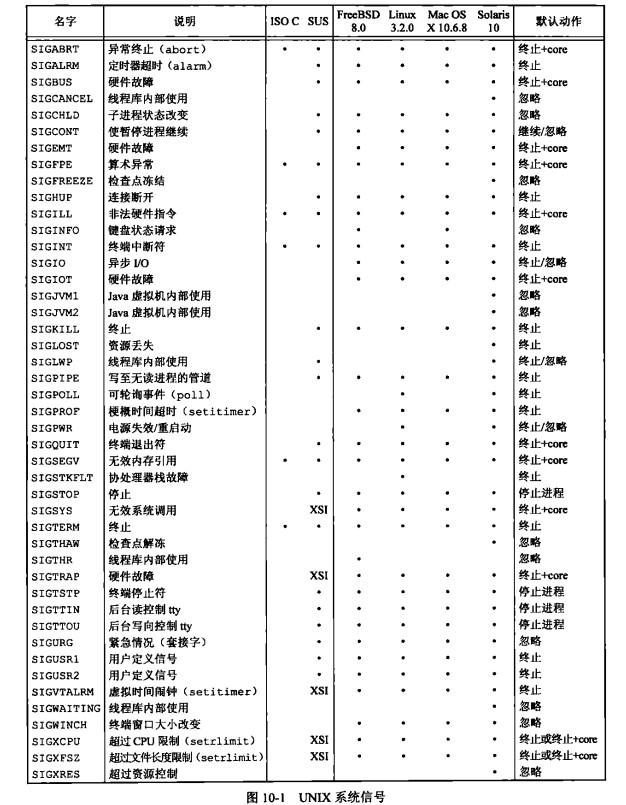

# 第 10 章 信号

## 信号

### 信号的概念

首先什么是信号，信号是软件中断。  
异步事件的处理：查询法（如循环检测）、通知法（如条件变量）
信号的响应依赖于中断

```shell
gaowanlu@DESKTOP-QDLGRDB:/$ kill -l
 1) SIGHUP       2) SIGINT       3) SIGQUIT      4) SIGILL       5) SIGTRAP
 6) SIGABRT      7) SIGBUS       8) SIGFPE       9) SIGKILL     10) SIGUSR1
11) SIGSEGV     12) SIGUSR2     13) SIGPIPE     14) SIGALRM     15) SIGTERM
16) SIGSTKFLT   17) SIGCHLD     18) SIGCONT     19) SIGSTOP     20) SIGTSTP
21) SIGTTIN     22) SIGTTOU     23) SIGURG      24) SIGXCPU     25) SIGXFSZ
26) SIGVTALRM   27) SIGPROF     28) SIGWINCH    29) SIGIO       30) SIGPWR
31) SIGSYS      34) SIGRTMIN    35) SIGRTMIN+1  36) SIGRTMIN+2  37) SIGRTMIN+3
38) SIGRTMIN+4  39) SIGRTMIN+5  40) SIGRTMIN+6  41) SIGRTMIN+7  42) SIGRTMIN+8
43) SIGRTMIN+9  44) SIGRTMIN+10 45) SIGRTMIN+11 46) SIGRTMIN+12 47) SIGRTMIN+13
48) SIGRTMIN+14 49) SIGRTMIN+15 50) SIGRTMAX-14 51) SIGRTMAX-13 52) SIGRTMAX-12
53) SIGRTMAX-11 54) SIGRTMAX-10 55) SIGRTMAX-9  56) SIGRTMAX-8  57) SIGRTMAX-7
58) SIGRTMAX-6  59) SIGRTMAX-5  60) SIGRTMAX-4  61) SIGRTMAX-3  62) SIGRTMAX-2
63) SIGRTMAX-1  64) SIGRTMAX
```

1~31 为标准信号。32~64 为实时信号。



### core 文件

当出错时可以保存现场为 core 文件，默认是不产生 core 文件的,默认 core 文件大小限制为 0

```cpp
gaowanlu@DESKTOP-QDLGRDB:/$ ulimit -a
core file size          (blocks, -c) 0
data seg size           (kbytes, -d) unlimited
scheduling priority             (-e) 0
file size               (blocks, -f) unlimited
pending signals                 (-i) 7823
max locked memory       (kbytes, -l) 64
max memory size         (kbytes, -m) unlimited
open files                      (-n) 1024
pipe size            (512 bytes, -p) 8
POSIX message queues     (bytes, -q) 819200
real-time priority              (-r) 0
stack size              (kbytes, -s) 8192
cpu time               (seconds, -t) unlimited
max user processes              (-u) 7823
virtual memory          (kbytes, -v) unlimited
file locks                      (-x) unlimited
```

将限制修改

```shell
gaowanlu@DESKTOP-QDLGRDB:/$ ulimit -c 10240
gaowanlu@DESKTOP-QDLGRDB:/$ ulimit -a
core file size          (blocks, -c) 10240
data seg size           (kbytes, -d) unlimited
scheduling priority             (-e) 0
file size               (blocks, -f) unlimited
pending signals                 (-i) 7823
max locked memory       (kbytes, -l) 64
max memory size         (kbytes, -m) unlimited
open files                      (-n) 1024
pipe size            (512 bytes, -p) 8
POSIX message queues     (bytes, -q) 819200
real-time priority              (-r) 0
stack size              (kbytes, -s) 8192
cpu time               (seconds, -t) unlimited
max user processes              (-u) 7823
virtual memory          (kbytes, -v) unlimited
file locks                      (-x) unlimited
```

设置 core 产生位置为执行文件位置

```cpp
root@drecbb4udzdboiei-0626900:~# echo  "core-%e-%p-%t" > /proc/sys/kernel/core_pattern
```

测试样例

```cpp
//main.cpp
#include <iostream>
using namespace std;

int main(int argc, char **argv)
{
    int *arr;
    arr[1]=12;
    return 0;
}
```

执行 main 产生 core 文件

```cpp
root@drecbb4udzdboiei-0626900:~# ls
core-main-4106040-1677165752  core-main-4106044-1677165757    main
```

### signal 函数

相关函数，ANSI C signal handling，绑定信号处理函数

重点：信号会打断阻塞的系统调用，例如在 sleep 中，但有信号传递过来则 sleep 会被打断,如 open、read 都有可能被打断，errno=EINTR

复杂情况：在处理一个信号时又来了一个相同信号需要处理，会怎样的，处理函数的现场是内核布置的所以可能冲掉前面的处理现场

```cpp
#include <signal.h>
typedef void (*sighandler_t)(int);
sighandler_t signal(int signum, sighandler_t handler);
```

样例

```cpp
#include <iostream>
#include <signal.h>
#include <unistd.h>
using namespace std;

void handler(int sig)
{
    cout << sig << endl;
    fflush(stdout);
    // exit(0);//Ctrl+C不会使得程序退出
}

int main(int argc, char **argv)
{
    signal(SIGINT, handler);
    // signal(SIGINT, SIG_IGN); 收到SIGINT但对信号不做任何处理
    for (int i = 0; i < 10; i++)
    {
        cout << "*";
        fflush(nullptr);
        sleep(1);
    }
    return 0;
}
```

信号打断阻塞

```cpp
#include <iostream>
#include <sys/types.h>
#include <sys/stat.h>
#include <fcntl.h>
using namespace std;

int main(int argc, char **argv)
{
    int fd;
    do
    {
        fd = open("./temp.txt", O_RDWR);
        if (fd < 0)
        {
            if (errno != EINTR) // 非信号打断则是真错误
            {
                cerr << "open error" << endl;
                exit(1);
            }
        }
    } while (fd < 0); // 被打断则再次尝试
    FILE *fp = fdopen(fd, "a+");
    fprintf(fp, "hello world\n");
    fflush(fp);
    return 0;
}
            //   ┌─────────────┬───────────────────────────────┐
            //   │fopen() mode │ open() flags                  │
            //   ├─────────────┼───────────────────────────────┤
            //   │     r       │ O_RDONLY                      │
            //   ├─────────────┼───────────────────────────────┤
            //   │     w       │ O_WRONLY | O_CREAT | O_TRUNC  │
            //   ├─────────────┼───────────────────────────────┤
            //   │     a       │ O_WRONLY | O_CREAT | O_APPEND │
            //   ├─────────────┼───────────────────────────────┤
            //   │     r+      │ O_RDWR                        │
            //   ├─────────────┼───────────────────────────────┤
            //   │     w+      │ O_RDWR | O_CREAT | O_TRUNC    │
            //   ├─────────────┼───────────────────────────────┤
            //   │     a+      │ O_RDWR | O_CREAT | O_APPEND   │
            //   └─────────────┴───────────────────────────────┘
```

### 信号的可靠与不可靠

#### 不可靠

1~31 信号 ——不支持排队，为普通信号。（不能用于统计信号发生次数的情景。）
SIGRTMIN-SIGRTMAX 信号 ——支持排队，实时信号

不可靠的意思是信号可能丢失或者被错误处理。信号的不可靠是行为的不可靠  
在早起系统中，信号存在两大缺陷，导致了信号不可靠

在处理一个信号时又来了一个相同信号需要处理，会怎样的，处理函数的现场是内核布置的所以可能冲掉前面的处理现场

缺陷 1：

系统早期馊主意，信号发生后，信号处理方式被重置为系统默认动作，只响应一次

```cpp
int  sig_int(); /* my signal handling function */
...
signal(SIGINT, sig_int); /* @1establish handler    */
...
sig_int()
{
    //如果再次被信号打断 则那么针对这个信号的处理方式就是系统默认的方法了
    signal(SIGINT, sig_int); /* @2reestablish handler for next time */
    ...
    ./*process the signal ... */
    ...
}

```

缺陷 2：

信号对进程的控制能力差，早期系统不能关闭信号，但是在执行后又需要提醒我们发生过信号

```cpp
pause - wait for signal
#include <unistd.h>
int pause(void);
```

```cpp
int  sig_int();     /* my signal handling function */
int  sig_int_flag; /* set nonzero when signal occurs */
main()
{
    signal(SIGINT, sig_int); /* establish handler */
    ...
    while (sig_int_flag == 0)
        pause();  /* go to sleep, waiting for signal */
    ...
}
sig_int()
{
    signal(SIGINT, sig_int); /* reestablish handler for next time */
    sig_int_flag = 1; /* set flag for main loop to examine */
}
// sig_int只有两行代码，它的作用就是忽略信号，并且用sig_int_flag标志信号发生过。
// 用while因为pause可能会被其他信号中断
// 缺陷：如果while与pause之间有信号发生，而且以后不再有信号发生则会一直pause下去，一直进入睡眠状态。
```

#### 可靠

可靠信号针对解决不可靠信号的两点缺陷来理解：

解决缺陷 1：

用 sigaction 代替 signal，现代大多数系统中，signal 也使用了 sigaction 实现，因此事可靠的。建议尽可能使用 sigaction 替代 signal，因为 sigaction 是同一的标准，可移植性强。可以说现在系统的信号处理方式是可靠的。不会只能执行一次。

解决缺陷 2：

用户可以通过 sigprocmask、sigaction 设置屏蔽字是信号阻塞。使信号处于 pending 状态，这样也就自然解决了缺陷二。

### 可重入函数

可重入函数：函数还没结束，又发生了再次调用  
所有的系统调用都是可重入函数、可重入函数不一定是系统调用  
一部分标准库函数也是可重入的（例如 memcpy）

```cpp
struct tm *localtime(const time_t *timep);
struct tm *localtime_r(const time_t *timep, struct tm *result);
//_r 就是可重入版本
```

### 信号的响应过程

内核为每个进程都维护有 mask、pending 两个位图（默认 32 位）。mask 是屏蔽字、pending 记录发生了哪些信号。  
mask 默认全部位为 1、pending 每个位为 0.  
中断时内核作业就绪队列排队、轮到时即将从内核态回到用户态时，mask 与 pending 按位与为 0 说明没有任何信号，回到用户态  
信号从收到到响应有一个避免的延迟

思考：如何忽略掉一个信号的？标准信号为什么要丢失？

如果 mask&pending 得出有信号、则将响应两个位改为 0，则响应信号相关指定函数  
执行完信号处理函数后、回到内核排队将 mask 相应位改为 1，队列排到时 mask&pendding,相位为 0，信号被响应过了  
在接收到多个标准信号时，先响应谁是没有严格的规定顺序

标准信号为什么要丢失？

```cpp
mask pending
1       0    //原始
1       1    //来了信号
0       0    //去执行信号处理函数时
0       1    //执行处理函数期间，接收到了很多此信号，则多次将pending相应位置1
1       1    //处理函数返回 将mask改为1
0       0    //再次执行处理函数
1       0    //处理函数返回 队列轮到 没有信号发生了，去执行用户代码
```

### kill 函数

```cpp
//send signal to a process
#include <sys/types.h>
#include <signal.h>
int kill(pid_t pid, int sig);
/*
pid：
>0 发送给指定进程
0  发送给与当前进程同组的所有进程
-1 只要有给目标进程发信号的权限，则都会发送，除了init进程
<0 发送给进程组号为-pid内的所有进程
将sig=0，不会发出任何信号，但有检测进程或进程组是否存在的功能(返回-1、errno==ESRCH)
 */
```

样例,给子进程发信号，使得子进程结束

```cpp
#include <iostream>
#include <sys/types.h>
#include <unistd.h>
#include <signal.h>

using namespace std;

void handler(int sig)
{
    cout << "child over" << endl;
    exit(0);
}

int main(int argc, char **argv)
{
    pid_t id = fork();
    if (id < 0)
    {
        exit(-1);
    }
    if (id == 0)
    {
        signal(SIGINT, handler);
        for (int i = 0; i < 10000; i++)
        {
            cout << i << endl;
            sleep(1);
        }
    }
    sleep(10);
    kill(id, SIGINT);
    return 0;
}
```

### raise 函数

给当前进程发送信号

```cpp
//send a signal to the caller
#include <signal.h>
int raise(int sig);
//kill(getpid(),sig);进程中调用
//pthread_kill(pthread_self(),sig); 以线程发信号
```

样例

```cpp
#include <iostream>
#include <signal.h>
using namespace std;

void handler(int sig)
{
    if (sig == SIGINT)
        cout << "SIGINT" << endl;
}

int main(int argc, char **argv)
{
    signal(SIGINT, handler);
    raise(SIGINT);
    return 0;
}
// gaowanlu@DESKTOP-QDLGRDB:/$ ./main
// SIGINT
```

### alarm 函数

倒计时为 0 时会向调用进程发送 SIGALRM(定时器超时)信号

```cpp
//set an alarm clock for delivery of a signal
//倒计时后会向当前进程发送SIGALRM信号
#include <unistd.h>
unsigned int alarm(unsigned int seconds);
```

样例

```cpp
#include <iostream>
#include <signal.h>
#include <unistd.h>
using namespace std;

void handler(int sig)
{
    if (sig == SIGALRM)
        cout << "SIGALRM" << endl;
}

int main(int argc, char **argv)
{
    signal(SIGALRM, handler);
    cout << "5秒后发送信号" << endl;
    alarm(5);
    sleep(10); // sleep(10) 会被信号打断
    return 0;
}
/*
gaowanlu@DESKTOP-QDLGRDB:/$ ./main
5秒后发送信号
SIGALRM
*/
```

### pause 函数

等待信号

```cpp
//wait for signal
#include <unistd.h>
int pause(void);
```

样例

```cpp
#include <iostream>
#include <signal.h>
#include <unistd.h>
using namespace std;

void handler(int sig)
{
    if (sig == SIGALRM)
        cout << "SIGALRM" << endl;
}

int main(int argc, char **argv)
{
    signal(SIGALRM, handler);
    cout << "5秒后发送信号" << endl;
    alarm(5);
    // alarm(5);//alarm不能连用
    pause();
    return 0;
}
/*
gaowanlu@DESKTOP-QDLGRDB:/$ ./main
5秒后发送信号
SIGALRM
*/
```

### sleep 与 nanosleep 函数

有些系统的 sleep 是用 alarm 与 pause 组合起来形成的  
linux 一般 sleep 是用得 nanosleep 封装的（正确方式）
休眠的方式有：sleep nanosleep usleep select 等

```cpp
//sleep for a specified number of seconds
#include <unistd.h>
unsigned int sleep(unsigned int seconds);
#include <time.h>
int nanosleep(const struct timespec *req, struct timespec *rem);
struct timespec {
   time_t tv_sec;        /* seconds */
   long   tv_nsec;       /* nanoseconds */
};
```

样例

```cpp
#include <iostream>
#include <signal.h>
#include <unistd.h>
using namespace std;

void handler(int sig)
{
    if (sig == SIGALRM)
        cout << "SIGALRM" << endl;
}

int main(int argc, char **argv)
{
    signal(SIGALRM, handler);
    sleep(5);
    cout << "sleep over" << endl;
    alarm(5);
    pause();
    cout << "alarm + pause over" << endl;
    return 0;
}
/*
gaowanlu@DESKTOP-QDLGRDB:/$ ./main
sleep over
SIGALRM
alarm + pause over
 */
```

### 定时循环样例

也就是在指定的时间内循环，时间到了停止循环

可以利用时间戳

```cpp
#include <iostream>
#include <time.h>
using namespace std;

int main(int argc, char **argv)
{
    time_t end;
    int64_t count = 0;
    end = time(nullptr) + 5;
    while (time(nullptr) <= end)
    {
        count++;
    }
    cout << count << endl;
    return 0;
}
/*
gaowanlu@DESKTOP-QDLGRDB:/$ time ./main
7940865

real    0m5.279s
user    0m2.656s
sys     0m2.016s
*/
//可见并不是很精准
```

可是使用 alarm 信号进行更精准的设计

```cpp
#include <iostream>
#include <signal.h>
#include <unistd.h>

using namespace std;

static volatile int loop = 1;
//volatile的作用是作为指令关键字，确保本条指令不会因编译器的优化而省略，且要求每次直接读值

void handler(int sig)
{
    loop = 0;
}

int main(int argc, char **argv)
{
    signal(SIGALRM, handler);
    alarm(5);
    int64_t count = 0;
    while (loop)
    {
        count++;
    }
    cout << count << endl;
    return 0;
}

/*
gaowanlu@DESKTOP-QDLGRDB:/$ time ./main
3578297050

real    0m5.012s
user    0m4.734s
sys     0m0.000s
*/
//可见更加精准了，而且循环的次数相差了非常非常多倍
```

在编译器优化编译时上面容易出现死循环、因为会认为 loop 一直为 1、while 中没有改变 loop，可以为 loop 加上 volatile 关键词

### 漏桶算法

漏桶算法是一种常用的限流算法、另一种是令牌桶算法

可能会想到使用 sleep、一般在实际的项目中不使用 sleep 函数

```cpp
#include <iostream>
#include <unistd.h>
using namespace std;

int main(int argc, char **argv)
{
    const char buffer[] = "anckdcnskdjnckjsdnckfvbhdvbdjhvbjefhwiedhieuhiurhfeufbuevbuvfdvdfvfdvascsd";
    int index = 0;
    while (index < sizeof(buffer))
    {
        for (int i = 0; i < 10 && index < sizeof(buffer); i++, index++)
        {
            cout << buffer[i] << flush;
        }
        sleep(1);
    }
    return 0;
}
// 模拟每秒10个字符
```

使用 alarm 优化

```bash
./main temp.txt
```

样例

```cpp
#include <iostream>
#include <unistd.h>
#include <signal.h>
#include <errno.h>
#include <sys/types.h>
#include <sys/stat.h>
#include <fcntl.h>
using namespace std;

#define CPS 10 // 每秒10个字符
#define BUFFER_SIZE CPS

static volatile int loop = 0;

void handler(int sig)
{
    alarm(1);
    loop = 1;
}

int main(int argc, char **argv)
{
    char buf[BUFFER_SIZE];

    if (argc < 2)
    {
        cerr << "请指定文件" << endl;
        exit(1);
    }
    alarm(1);
    signal(SIGALRM, handler);
    int fd, len;
    do
    {
        fd = open(argv[1], O_RDONLY);
        if (fd < 0)
        {
            if (errno == EINTR)
            {
                continue;
            }
            cerr << "open " << argv[1] << " error" << endl;
            exit(1);
        }
    } while (fd < 0);

    while (1)
    {
        while (!loop)
        {
            pause();
        }
        loop = 0;
        // 输出BUFF_SIZE个字符
        while ((len = read(fd, buf, BUFFER_SIZE)) < 0)
        {
            if (errno == EINTR)
            {
                continue;
            }
            cerr << "read error" << endl;
            exit(1);
        }
        if (len == 0)
        {
            // read end
            break;
        }
        while ((len != write(STDOUT_FILENO, buf, len)))
        {
            if (errno == EINTR)
            {
                continue;
            }
            cerr << "write error" << endl;
            exit(1);
        }
    }
    return 0;
}
// 模拟每秒10个字符
```

### 令牌桶算法

令牌算法是以固定速度往一个桶内增加令牌,当桶内令牌满了后,就停止增加令牌。也经常用于限流算法。

```cpp
#include <iostream>
#include <unistd.h>
#include <signal.h>
#include <errno.h>
#include <sys/types.h>
#include <sys/stat.h>
#include <fcntl.h>
using namespace std;

#define CPS 10 // 每秒10个字符
#define BUFFER_SIZE CPS
#define TOKEN_MAX 100

static volatile sig_atomic_t tokens = 0;//sig_atomic_t 保证赋值 ++ -- 原子操作

// 令牌每秒自动增加1个
void handler(int sig)
{
    alarm(1);
    tokens++;
    if (tokens > TOKEN_MAX)
    {
        tokens = TOKEN_MAX;
    }
}

int main(int argc, char **argv)
{
    char buf[BUFFER_SIZE];

    if (argc < 2)
    {
        cerr << "请指定文件" << endl;
        exit(1);
    }
    alarm(1);
    signal(SIGALRM, handler);
    int fd, len;
    do
    {
        fd = open(argv[1], O_RDONLY);
        if (fd < 0)
        {
            if (errno == EINTR)
            {
                continue;
            }
            cerr << "open " << argv[1] << " error" << endl;
            exit(1);
        }
    } while (fd < 0);

    while (1)
    {
        while (tokens <= 0)
        {
            pause();//等待信号发生
        }
        tokens--; // 使用一个token
        // 输出BUFF_SIZE个字符
        while ((len = read(fd, buf, BUFFER_SIZE)) < 0)
        {
            if (errno == EINTR)
            {
                continue;
            }
            cerr << "read error" << endl;
            exit(1);
        }
        if (len == 0)
        {
            // read end
            break;
        }
        while ((len != write(STDOUT_FILENO, buf, len)))
        {
            if (errno == EINTR)
            {
                continue;
            }
            cerr << "write error" << endl;
            exit(1);
        }
    }
    return 0;
}
// 模拟每秒10个字符
```

### 多任务计时器 anytimer

封装多任务计时器、可以使用一定数组空间存储 定时时长、函数指针、函数实参等。

```cpp
|-----------|
|sec|fun|arg|
|-----------|
//遍历数组、每次遍历将其sec都减去1，如果sec得0则执行func
```

### setitimer()

setitimer 可以提供更精准的计时

```cpp
#include <sys/time.h>
//get or set value of an interval timer
int getitimer(int which, struct itimerval *curr_value);
int setitimer(int which, const struct itimerval *new_value,
                     struct itimerval *old_value);
//which指定哪一个时钟
ITIMER_REAL 实时递减到0 发出SIGALRM信号
ITIMER_VIRTUAL 只有进程运行的时候递减 到0发出SIGVTALRM信号
ITIMER_PROF 进程运行时与阻塞时都会减 发出SIGPROF信号
struct itimerval {
   struct timeval it_interval; /* Interval for periodic timer */
   struct timeval it_value;    /* Time until next expiration */
};
struct timeval {
   time_t      tv_sec;         /* seconds */
   suseconds_t tv_usec;        /* microseconds */
};
```

简单样例:每秒钟输出一个 .

```cpp
#include <iostream>
#include <sys/time.h>
#include <signal.h>
#include <unistd.h>

using namespace std;

void func(int sig)
{
	cout << "." << endl;
}

int main(int argc, char **argv)
{
	signal(SIGALRM, func);
	struct itimerval m_itimerval;
	m_itimerval.it_interval.tv_sec = 1;
	m_itimerval.it_interval.tv_usec = 0;
	m_itimerval.it_value.tv_sec = 1;
	m_itimerval.it_value.tv_usec = 0;
	if (0 > setitimer(ITIMER_REAL, &m_itimerval, nullptr))
	{
		cerr << "setitimer() error" << endl;
		exit(1);
	}
	while (1)
	{
		pause();
	}
	return 0;
}
```

### abort 函数

cause abnormal process termination. 结束当前进程顺便产生 coredump 文件，产生 SIGABRT 信号

```cpp
#include <iostream>
#include <signal.h>
#include <unistd.h>

using namespace std;

void func(int sig)
{
	cout << "abort" << endl;
}

int main(int argc, char **argv)
{
	signal(SIGABRT, func);
	abort();
	return 0;
}
/*
gaowanlu@DESKTOP-QDLGRDB:/mnt/c/Users/gaowanlu/Desktop/MyProject/note/testcode$ ./main
abort
Aborted (core dumped)
*/
```

### system 函数

使用方式在第 8 章 进程控制

使用 system 期间 会 SIGCHLD will be blocked, and SIGINT and SIGQUIT will be ignored，即默认会 blocked 一个 ignore 两个信号

### 信号集

```cpp
#include <signal.h>
int sigemptyset(sigset_t *set);//清空信号
int sigfillset(sigset_t *set);//置为全集
int sigaddset(sigset_t *set, int signum);//添加信号
int sigdelset(sigset_t *set, int signum);//删除信号
int sigismember(const sigset_t *set, int signum);//检查是否为成员
```

样例

```cpp
#include <iostream>
#include <signal.h>
#include <unistd.h>
using namespace std;
int main(int argc, char **argv)
{
	sigset_t m_set;
	sigemptyset(&m_set);						  // 清空信号
	sigfillset(&m_set);							  // 置为全集
	cout << sigismember(&m_set, SIGALRM) << endl; // 1
	return 0;
}
```

### 信号屏蔽字与 pending 集的处理

mask 是屏蔽字、pending 记录发生了哪些信号。mask 默认全部位为 1、pending 每个位为 0. 二者按位与，为 1 的位则对相应信号做处理

#### sigprocmask

```cpp
#include <signal.h>
/* Prototype for the glibc wrapper function */
int sigprocmask(int how, const sigset_t *set, sigset_t *oldset);
//how:  SIG_BLOCK:相应mask位置为0 SIG_UNBLOCK：相应mask位置为1  SIG_SETMASK
//set:  对set中的信号做how
//oldset: 操作how之前的signal mask将存储到oldset
```

简单样例

```cpp
//在打印*时 按下ctrl+c 只会有 ^C 但不会有信号响应，到五个*输出后才会有信号响应
#include <iostream>
#include <signal.h>
#include <unistd.h>

using namespace std;

void func(int sig)
{
	cout << "!" << endl;
}

int main(int argc, char **argv)
{
	signal(SIGINT, func);
	sigset_t m_set,saveset;
	sigemptyset(&m_set); // 清空信号
	sigaddset(&m_set, SIGINT);
    sigprocmask(SIG_UNBLOCK,&m_set,&saveset);
	for (int i = 0; i < 1000; i++)
	{
		sigprocmask(SIG_BLOCK, &m_set, nullptr);
		for (int j = 0; j < 5; j++)
		{
			cout << "*" << flush;
			sleep(1);
		}
		cout << endl;
		sigprocmask(SIG_UNBLOCK, &m_set, nullptr);
	}
    //恢复状态
    sigprocmask(SIG_SETMASK,&saveset,nullptr);
	return 0;
}
```

#### sigpending

获取 pending 集中的信号，需要进内核 取 set->pending&mask 响应信号->回到用户
所以取到的 pending 是响应前的状态

```cpp
#include <signal.h>
int sigpending(sigset_t *set);
```

### sigsetjmp 与 siglongjmp

从信号响应过程知道，执行信号处理函数前进行了 mask 与 pending 的按位与。而且二者都被置为 0。只有处理函数结束后才会将 mask 相应位置为 1.如果在处理函数中进行了 jmp，可能丢失了将 mask 置为 1 的机会。导致信号处理出现问题。
可以使用 sigsetjmp 与 siglongjmp，会保存掩码信息

所以：不能从信号处理函数中随意的往外跳

```cpp
#include <setjmp.h>
int setjmp(jmp_buf env);
int sigsetjmp(sigjmp_buf env, int savesigs);//savesigs: 1 保存掩码信息
void longjmp(jmp_buf env, int val);
void siglongjmp(sigjmp_buf env, int val);
/*
sigsetjmp() and siglongjmp() also perform nonlocal gotos, but provide predictable handling of the process signal mask.
If, and only if, the savesigs argument provided to sigsetjmp() is nonzero, the process's current signal mask is saved in env and will be restored if a siglongjmp() is later performed with this env.*/
```

### sigsuspend 函数

```cpp
//wait for a signal
#include <signal.h>
int sigsuspend(const sigset_t *mask);
```

场景样例

```cpp
#include <iostream>
#include <signal.h>
#include <unistd.h>
using namespace std;
void func(int sig)
{
	cout << "!" << endl;
}
int main(int argc, char **argv)
{
	signal(SIGINT, func);
	sigset_t m_set;
	sigemptyset(&m_set); // 清空信号
	sigaddset(&m_set, SIGINT);
	for (int i = 0; i < 1000; i++)
	{
		sigprocmask(SIG_BLOCK, &m_set, nullptr);
		for (int j = 0; j < 5; j++)
		{
			cout << "*" << flush;
			sleep(1);
		}
		cout << endl;
		sigprocmask(SIG_UNBLOCK, &m_set, nullptr);//假设for期间信号打到了pending上，再此unblock mask，则会响应信号处理函数
		pause();//然后到这里又没有信号了，如何实现for中的信号可以被pause利用，且for时不响应信号处理函数
        //问题在于sigprocmask与pause不能原子化
	}
	return 0;
}
```

可以利用 sigsuspend 解决

```cpp
#include <iostream>
#include <signal.h>
#include <unistd.h>

using namespace std;

void func(int sig)
{
	cout << "!" << endl;
}

int main(int argc, char **argv)
{
	signal(SIGINT, func);
	sigset_t m_set, o_set;
	sigemptyset(&m_set); // 清空信号
	sigaddset(&m_set, SIGINT);
	sigprocmask(SIG_BLOCK, &m_set, &o_set);
	for (int i = 0; i < 1000; i++)
	{
		for (int j = 0; j < 5; j++)
		{
			cout << "*" << flush;
			sleep(1);
		}
		cout << endl;
		sigsuspend(&o_set);
		// 相当于SIG_SETMASK o_set后pause原子化操作，然后再恢复原来的set
		/*
		sigset_t tmpset;
		sigprocmask(SIG_SETMASK, &o_set, &tmpset);
		pause();
		sigprocmask(SIG_SETMASK, &tmpset,nullptr);
		*/
	}
	return 0;
}
```

### sigaction

https://www.bilibili.com/video/BV1yJ411S7r6?p=79&spm_id_from=pageDriver&vd_source=0d24d1529ac7f38c08b67c3298ab14a0

### 中断的系统调用

### SIGCLD 语义

### 可靠信号术语和语义

### 扩展

clock_nanosleep、sigqueue

### 实时信号

### 作业控制信号

### 信号名和编号
