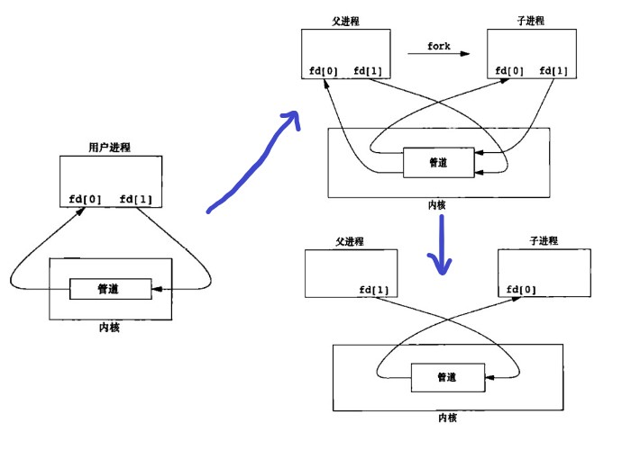

# 第 15 章 进程间通信

## 进程间通信

进程间的通信(InterProcess Communication,IPC)  
常见的 IPC 方式有

1、半双工管道、FIFO  
2、全双工管道、命名全双工管道  
3、消息队列、信号量、共享内存  
4、消息队列（实时）、信号量、共享存储（实时）  
5、套接字、STREAMS

### 管道 pipe

管道是一种进程间通信机制，用于在两个进程间传递数据。可以实现一种单向、基于字节流的通信方式，即一个进程将数据写入管道的一段，另一个进程从管道的另一端读取数据

#### 管道的分类

管道有两种类型：无名管道(Anonymous Pipes)和命名管道(Named Pipes)

1、无名管道（PIPE）：无名管道是在进程间临时创建的，只能在创建它们的进程及其子进程之间进行通信。无名管道的创建是通过 pipe 系统调用来实现的，调用成功后会返回两个文件描述符，一个用于读取管道中的数据，一个用于写入数据到管道中。无名管道具有较小的缓冲区，一旦缓冲区已满，写入操作将被阻塞直到读取进程读取管道中的数据。

2、命名管道（FIFO）：命名管道是在文件系统中创建的，多个进程可以通过打开同一个文件来进行通信。命名管道的创建是通过 mkfifo 系统调用来实现的，调用成功后会在文件系统中创建一个 FIFO 文件，进程可以使用 open 系统调用打开该文件并进行读写操作。命名管道具有较大的缓冲区，写入操作不会阻塞，直到缓冲区已满。

#### pipe 函数

```cpp
#include <unistd.h>
/* On Alpha, IA-64, MIPS, SuperH, and SPARC/SPARC64; see NOTES */
struct fd_pair {
    long fd[2];
};
struct fd_pair pipe();
/* On all other architectures */
int pipe(int pipefd[2]);// 创建一个管道，成功返回0，pipefd[0]代表管道读端，pipefd[1]代表管道写端。
```

#### pipe2 函数

pipefd: 一个长度为 2 的整型数组，用来存储新创建的管道的读取端和写入端的文件描述符。

flags: 用来设置管道的属性，可以为以下值之一：

O_CLOEXEC: 设置管道文件描述符在执行 exec 时自动关闭。
O_DIRECT: 禁止使用缓存。
O_NONBLOCK: 将管道设置为非阻塞模式。

```cpp
#include <fcntl.h>              /* Obtain O_* constant definitions */
#include <unistd.h>
int pipe2(int pipefd[2], int flags);
```

#### pipe 创建背后流程



#### 管道样例

父进程向子进程发送内容的简单样例

```cpp
#include <iostream>
#include <errno.h>
#include <cstring>
#include <unistd.h>
#include <sys/types.h>
#include <sys/wait.h>
using namespace std;

#define BUFFSIZE 256

int main(int argc, char **argv)
{
    int pipefd[2];
    pid_t pid;
    char buffer[BUFFSIZE];
    if (pipe(pipefd) == -1)
    {
        cerr << "pipe error" << endl;
        exit(1);
    }
    pid = fork();
    if (pid == -1)
    {
        cerr << "fork error" << endl;
        exit(1);
    }
    if (pid == 0) // 子进程
    {
        close(pipefd[1]); // 关闭写端
        ssize_t count = read(pipefd[0], buffer, BUFFSIZE);
        if (count == -1)
        {
            cerr << "read error" << endl;
            exit(1);
        }
        cout << "child process read=> " << buffer << endl;
        close(pipefd[0]); // 关闭读端
        exit(0);          // 子进程退出
    }
    else // 父进程
    {
        close(pipefd[0]); // 关闭读端
        char message[] = "hello,child process!";
        ssize_t count = write(pipefd[1], message, strlen(message) + 1);
        if (count == -1)
        {
            cerr << "write error" << endl;
            exit(-1);
        }
        close(pipefd[1]); // 关闭写端
        cout << "father process write=> " << message << endl;
        pid_t retpid = wait(nullptr); // 等待子进程结束
        if (retpid == pid)
        {
            cout << "child process end" << endl;
        }
        cout << "father process end" << endl;
        exit(0);
    }
    return 0;
}
/*
gaowanlu@DESKTOP-QDLGRDB:/$ ./main
father process write=> hello,child process!
child process read=> hello,child process!
child process end
father process end
*/
```

#### popen 和 pclose 函数

popen 和 pclose 是 C 标准库中的两个函数，用于在程序中调用外部命令，并进行输入输出的操作。

函数原型

```cpp
#include <stdio.h>
FILE *popen(const char *command, const char *mode);
int pclose(FILE *stream);
```

popen，command 参数为要执行的外部命令，mode 参数为打开文件的模式（读或写）。popen 函数会创建一个管道，执行指定的命令，并返回一个 FILE 类型的文件指针，可以使用标准的文件 I/O 函数（如 fread、fwrite、fgets、fputs 等）对该文件进行读写操作。如果 mode 参数为“r”，则该文件指针指向命令的标准输出，如果 mode 参数为“w”，则该文件指针指向命令的标准输入。

pclose，stream 参数为 popen 函数返回的文件指针。pclose 函数会等待命令执行完毕，并关闭管道。如果命令执行成功，pclose 函数返回命令的退出状态，否则返回-1。

简单样例

```cpp
#include <iostream>
#include <cstdlib>
#include <unistd.h>
#include <cstdio>
using namespace std;

int main(int argc, char **argv)
{
    FILE *fp;
    char buffer[1024];
    chdir("/");
    fp = popen("ls -l", "r");
    if (fp == nullptr)
    {
        cerr << "popen error" << endl;
        exit(1);
    }
    while (fgets(buffer, sizeof(buffer), fp))
    {
        cout << buffer;
    }
    int ret_state = pclose(fp);
    cout << "\nret_state=" << ret_state << endl;
    return 0;
}
```

#### 如何用管道双向通信

当然可以在 fork 前创建两个管道，fork 后对两个管道规定读写的方向为相反，就可以实现父进程向子进程发数据同时也可以由子进程向父进程发送数据

### 协同进程

协同进程通常指一组进程通过协作的方式共同完成一个任务,出了在 fork 前预分配，也可以使用进程通信方式进程任务数据的分配等

### FIFO

FIFO 是一种特殊的文件类型，也称为命名管道（named pipes），允许不同进程之间进行通信。与匿名管道不同，FIFO 在文件系统中有一个特定的文件名，因此可以由多个进程同时访问

#### 创建 FIFO mkfifo

参数 pathname 指定 FIFO 的路径名，mode 指定 FIFO 的访问权限。创建 FIFO 后，可以像打开普通文件一样打开它。

```cpp
#include <sys/types.h>
#include <sys/stat.h>
int mkfifo(const char *pathname, mode_t mode);
//函数调用成功，则返回0，如果出现错误，则返回-1。
```

简单样例

```cpp
#include <stdio.h>
#include <stdlib.h>
#include <sys/types.h>
#include <sys/stat.h>
#include <cstring>
#include <errno.h>

#define PATH "/tmp/myfifo"

int main()
{
    if (mkfifo(PATH, 0666) == -1)
    {
        perror("create mkfifo error\n");
        if (errno == EEXIST)
        {
            printf(strerror(errno), "");
        }
        exit(EXIT_FAILURE);
    }
    return 0;
}
```

#### mkfifoat

在指定的文件夹下创建 FIFO

```cpp
#include <fcntl.h>           /* Definition of AT_* constants */
#include <sys/stat.h>
int mkfifoat(int dirfd, const char *pathname, mode_t mode);
```

样例

```cpp
#include <fcntl.h>
#include <sys/stat.h>

int main() {
    int dirfd = open("/tmp", O_RDONLY);
    mkfifoat(dirfd, "myfifo", 0666);
    close(dirfd);
    return 0;
}
```

#### FIFO 样例

父子进程通信、当然可以是没有血缘关系的两个进程

```cpp
#include <iostream>
#include <errno.h>
#include <cstring>
#include <unistd.h>
#include <sys/types.h>
#include <sys/wait.h>
#include <sys/stat.h>
#include <fcntl.h>

using namespace std;

#define BUFFSIZE 256

int main(int argc, char **argv)
{
    char buffer[BUFFSIZE];
    const char *path = "/tmp/tmpfifo";
    int ret = mkfifo(path, 0666);
    int fifo = open(path, O_RDWR);
    int pid = fork();
    if (pid == -1)
    {
        cerr << "fork error" << endl;
        exit(1);
    }
    if (pid == 0) // 子进程
    {
        ssize_t count = read(fifo, buffer, BUFFSIZE);
        if (count == -1)
        {
            cerr << "read error" << endl;
            exit(1);
        }
        cout << "child process read=> " << buffer << endl;
        close(fifo);
        exit(0); // 子进程退出
    }
    else // 父进程
    {
        char message[] = "hello,child process!";
        ssize_t count = write(fifo, message, strlen(message) + 1);
        if (count == -1)
        {
            cerr << "write error" << endl;
            exit(-1);
        }
        close(fifo);
        cout << "father process write=> " << message << endl;
        pid_t retpid = wait(nullptr); // 等待子进程结束
        if (retpid == pid)
        {
            cout << "child process end" << endl;
        }
        cout << "father process end" << endl;
        if (remove(path) == 0)
        {
            cout << "fifo delete success" << endl;
        }
        exit(0);
    }
    return 0;
}
/*
gaowanlu@DESKTOP-QDLGRDB:/$ ./main
father process write=> hello,child process!
child process read=> hello,child process!
child process end
father process end
*/
```

#### FIFO 注意事项

1、FIFO 是一种特殊类型的文件，需要像操作普通文件一样打开和关闭它。在打开 FIFO 时，需要指定相应的文件访问模式，例如只读、只写或读写模式。

2、FIFO 是一种半双工通信机制，即一个进程可以向管道写入数据，另一个进程可以从管道读取数据，但不能同时进行。因此，在使用 FIFO 进行通信时，需要分别创建读写进程，并确保它们在适当的时候打开和关闭 FIFO 文件描述符。

3、FIFO 是基于字节流的，它不保留消息的边界，因此在从 FIFO 中读取数据时，需要进行适当的数据处理，以确保正确地解析消息。

4、如果要使用多个 FIFO 进行通信，需要使用不同的 FIFO 文件名来避免冲突。建议使用唯一的、具有描述性的 FIFO 名称来避免混淆。

5、FIFO 是基于文件系统的，因此如果 FIFO 文件被删除或文件系统故障，通信将中断。在使用 FIFO 进行通信时，需要考虑这些情况，并采取适当的恢复措施。

### 管道的读写阻塞

在 Unix 和类 Unix 系统中，管道和 FIFO 的写操作和读操作都是阻塞的，也就是说，如果没有读进程读取管道中的数据，写进程将一直阻塞等待，直到有读进程读取数据为止。同样地，如果管道已满（即写进程写入数据的速度比读进程读取数据的速度快），写进程将一直阻塞等待，直到有足够的空间写入数据为止。

类似地，如果没有数据可读取，读进程将一直阻塞等待，直到有写进程写入数据为止。如果管道为空（即读进程读取数据的速度比写进程写入数据的速度快），读进程将一直阻塞等待，直到有数据可读取为止。

需要注意的是，管道和 FIFO 都是单向的，如果需要进行双向通信，需要创建两个管道或 FIFO。

### XSI IPC

### 消息队列

### 信号量

### 共享内存

### UNIX 域套接字

Unix 域套接字（Unix Domain Socket）是一种用于进程间通信的机制，它只能在同一台计算机上的进程之间进行通信。Unix 域套接字提供了一种可靠的、高性能的本地通信方式，与 TCP/IP 协议栈相比，它不需要经过网络协议栈的处理，因此可以获得更高的性能和更低的延迟。

Unix 域套接字的通信方式与 TCP/IP 协议栈相似，包括面向连接的 SOCK_STREAM 类型和面向消息的 SOCK_DGRAM 类型。使用 Unix 域套接字进行通信时，应用程序需要创建一个 Unix 域套接字，然后将它绑定到一个本地文件系统路径上。另一个应用程序可以通过该路径打开套接字，并使用它进行通信。这种通信方式是双向的，每个进程都可以在套接字上进行读写操作。

Unix 域套接字可以用于各种进程间通信的场景，如服务器进程与客户端进程之间的通信、进程间共享内存等。使用 Unix 域套接字可以获得比命名管道、共享内存等其他进程间通信机制更高的灵活性和性能。

### 客户进程-服务器进程属性
