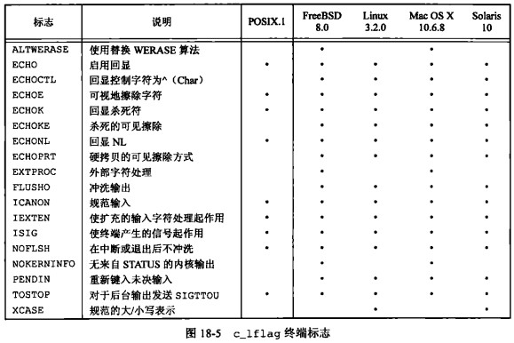

# 第 16 章 终端 IO

## 终端 IO

Linux系统编程中的终端IO部分主要涉及如何在终端（terminal）上进行输入和输出操作。终端是用户与计算机系统进行交互的一个界面，例如命令行终端或图形用户界面。

在Linux系统中，终端是一个特殊的文件，通常被称为tty（teletype）设备。终端的输入和输出可以通过标准输入输出流（stdin/stdout）进行读写操作。终端的IO操作包括读取用户输入、向终端输出信息以及控制终端的光标位置和颜色等。

终端IO部分涉及的具体内容包括以下几个方面：

终端属性设置：可以使用termios库函数来设置终端的属性，包括输入模式、输出模式、控制字符等。例如，可以设置终端为原始模式（raw mode），这样输入字符不会被进行任何处理，例如回显（echo）、回车换行（CR/LF）等，可以直接读取到输入的字符。

终端输入操作：可以使用标准输入流（stdin）来读取终端输入。读取输入的方法有多种，例如使用getc函数逐个读取字符，或者使用fgets函数读取一行输入。在读取输入时，可能需要处理回车换行符等特殊字符。

终端输出操作：可以使用标准输出流（stdout）来向终端输出信息。输出的内容可以是字符串、字符、整数等等。在输出时，可以使用格式化输出函数（printf、fprintf等）进行格式化输出，也可以使用write函数直接写入二进制数据。

终端光标操作：可以使用ANSI转义码来控制终端光标的位置和颜色等属性。例如，可以使用"\033[2J"来清空屏幕，或者使用"\033[31m"来设置输出的文字颜色为红色。

终端信号处理：在进行终端IO操作时，可能会接收到信号（signal），例如终端窗口被关闭、CTRL+C中断等。可以使用信号处理函数（signal、sigaction等）来捕获并处理信号。

总之，终端IO部分是Linux系统编程中非常基础和重要的一部分，掌握了这些知识可以让程序更加灵活地与用户进行交互。


### 输入处理模式

非规范模式输入处理与规范模式输入处理是UNIX/Linux终端输入处理的两种不同方式。

1、规范模式输入处理是指输入数据被一行一行地缓存起来，直到用户按下回车键为止。当用户按下回车键时，整行输入数据被传递给程序进行处理。这种模式下，终端驱动程序会对输入数据进行一些处理，例如删除字符、移动光标等操作，然后将数据传递给程序。

2、非规范模式输入处理则不同，它会立即将输入数据传递给程序，而不需要等待用户按下回车键。这种模式下，输入数据不会被缓存起来，而是直接传递给程序进行处理。非规范模式输入处理通常用于需要立即响应用户输入的程序，例如实时游戏或交互式命令行工具等。

### termios 结构体

```cpp
#include <termios.h>
struct termios{
    tcflag_t c_iflag;//input modes 输入模式标志位
    tcflag_t c_oflag;//output modes 输出模式标志位
    tcflag_t c_cflag;//control modes 控制模式标志位
    tcflag_t c_lflag;//local modes 本地模式标志位
    cc_t     c_cc[NCCS];//special characters 特殊字符
};
```

#### c_cflag 终端标识


#### c_iflag 终端标识


#### c_lflag 终端标识



#### c_oflag 终端标识


### 终端I/O函数汇总

|函数|说明|
|----|----|
|tcgetattr|获取属性(termios结构)|
|tcsetattr|设置属性(termios结构)|
|cfgetispeed|获得输入速度|
|cfgetospeed|获得输出速度|
|cfsetispeed|设置输入速度|
|cfsetospeed|设置输出速度|
|tcdrain|等待所有输出都被传输|
|tcflow|挂起传输或接收|
|tcflush|冲洗未决输入和/或输出|
|tcsendbreak|发送BREAK字符|
|tcgetpgrp|获得前台进程组ID|
|tcsetpgrp|设置前台进程组ID|
|tcgetsid|得到控制TTY的会话首进程的进程组ID|


### 特殊输入字符

在 Linux 终端中，有一些特殊的输入字符，它们可以在终端中进行一些特定的操作，比如控制光标位置、清空屏幕、中断当前程序等。

下面列举一些常见的特殊输入字符及其含义：

Ctrl+C：中断当前程序。  
Ctrl+D：表示输入结束，也就是EOF（End of File），用于结束标准输入的输入。  
Ctrl+Z：暂停当前程序，将程序放到后台运行。  
Ctrl+L：清空屏幕。  
Ctrl+A：将光标移动到行首。  
Ctrl+E：将光标移动到行尾。  
Ctrl+U：删除光标到行首的所有字符。  
Ctrl+K：删除光标到行尾的所有字符。  
Ctrl+W：删除光标前的一个单词。  
Ctrl+R：搜索之前使用过的命令历史记录。  
Tab：自动补全命令或文件名。  

在 Linux 系统编程中，可以通过读取终端输入缓冲区中的字符，来处理这些特殊输入字符，实现对终端的控制。常用的终端 I/O 相关的系统调用有 read、write、ioctl 等。


### 获得和设置终端属性

```cpp
#include <termios.h>
#include <unistd.h>
int tcgetattr(int fd, struct termios *termios_p);
int tcsetattr(int fd, int optional_actions,
             const struct termios *termios_p);
```

optional_actions 指定修改终端属性的方式，如修改立即生效或等到数据发送完再生效等等

```cpp
TCSANOW 更改立即发生
TCSADRAIN 发送了所有输出后更改才会发生,若更改输出参数则应使用此选项
TCSAFLUSH 发送了所有输出后更改才会发生，再更改发生时未读的所有输入数据都被丢弃（冲洗）
```

样例

```cpp
#include <iostream>
#include <termios.h>
#include <unistd.h>
using namespace std;

int main(int argc, char **argv)
{
    struct termios m_termios;
    tcgetattr(STDIN_FILENO, &m_termios);
    cout << m_termios.c_ispeed << " " << m_termios.c_ospeed << endl;
    // 15 15
    return 0;
}
```

### 终端选项标识

可以查看每个标识选项的详情、或查看APUE Page 555

```shell
$ man termios
```

### stty 命令

在Linux系统编程中，stty命令用于设置或显示终端设备的属性。该命令可以帮助用户配置串口、终端、打印机和其他设备的行为。

下面是一些常用的stty命令选项：

stty -a：显示所有属性，包括控制字符和标志位。  
stty -g：显示当前终端的所有属性，并将其保存为字符串，以便稍后使用stty命令还原这些属性。  
stty -icanon：将终端设置为非规范模式，这意味着在输入字符时不需要等待回车键。  
stty -echo：禁止回显，这意味着输入字符时不会在终端上显示。  
stty -hupcl：在写入终端时禁用挂断信号（SIGHUP）。  
stty -clocal：禁用本地连接（DTR / DSR）控制，这将防止终端在关闭时发送信号。  
stty -isig：启用INTR、QUIT和SUSP信号。  
stty speed：设置终端的波特率，例如stty 9600可以将终端波特率设置为9600。  
请注意，stty命令的选项和功能因系统而异，因此请查阅本地的stty文档以获取更多信息。

```shell
aowanlu@DESKTOP-QDLGRDB:/$ stty -a
speed 38400 baud; rows 18; columns 204; line = 0;
intr = ^C; quit = ^\; erase = ^?; kill = ^U; eof = ^D; eol = M-^?; eol2 = M-^?; swtch = <undef>; start = ^Q; stop = ^S; susp = ^Z; rprnt = ^R; werase = ^W; lnext = ^V; discard = ^O; min = 1; time = 0;
-parenb -parodd -cmspar cs8 hupcl -cstopb cread -clocal -crtscts
-ignbrk brkint -ignpar -parmrk -inpck -istrip -inlcr -igncr icrnl ixon -ixoff -iuclc ixany imaxbel iutf8
opost -olcuc -ocrnl onlcr -onocr -onlret -ofill -ofdel nl0 cr0 tab0 bs0 vt0 ff0
isig icanon iexten echo echoe echok -echonl -noflsh -xcase -tostop -echoprt echoctl echoke -flusho -extproc
```

### 波特率函数

波特率(baud rate)是一个历史沿用的术语、现在它指"位/秒"(bit per second),虽然大多数终端设备对输入和输出使用同一波特率，但只要硬件许可可以将它们设置为两个不同值

```cpp
#include <termios.h>
#include <unistd.h>
//两个函数返回值为波特率值
speed_t cfgetispeed(const struct termios *termios_p);
speed_t cfgetospeed(const struct termios *termios_p);
//若成功返回0，失败返回-1
int cfsetispeed(struct termios *termios_p, speed_t speed);
int cfsetospeed(struct termios *termios_p, speed_t speed);
int cfsetspeed(struct termios *termios_p, speed_t speed);
```

波特率常量

```shell
B50 B75 B110 B134 B150 B200 B300 B600 
B1200 B1800 B2400 B4800 B9600
B19200 B38400
B0(表示挂断)
```

样例

```cpp
int set_interface_attribs(int fd, int speed, int parity)
{
    struct termios tty;
    memset(&tty, 0, sizeof tty);
    // 获取termios结构
    if (tcgetattr(fd, &tty) != 0)
    {
        // 错误处理
        return -1;
    }
    // 设置波特率
    cfsetospeed(&tty, speed);
    cfsetispeed(&tty, speed);
    // 设置8bit一个字节
    tty.c_cflag = (tty.c_cflag & ~CSIZE) | CS8; // 8 bits per byte
    // disable IGNBRK for mismatched speed tests; otherwise receive break
    // as \000 chars
    tty.c_iflag &= ~IGNBRK; // disable break processing
    /*
    这行代码是将tty结构体中c_iflag成员的IGNBRK位清零。在Linux系统编程中，termios结构体用于配置终端（包括串口终端），    c_iflag是其中的一个成员，用于配置输入模式标志。其中IGNBRK是一个输入模式标志，表示当检测到BREAK（即所有线路都处于空闲状态）时是否忽略它。
通过将c_iflag成员的IGNBRK位清零，上述代码表示禁用忽略BREAK功能，即当检测到BREAK时，将其视为普通的输入字符。这对于测试串口连接非常有用，因为它可以确保在发送BREAK时，接收端能够正确接收到它并将其视为输入字符。
    */
    tty.c_lflag = 0;        // no signaling chars, no echo,
                            // no canonical processing
    tty.c_oflag = 0;        // no remapping, no delays
    tty.c_cc[VMIN] = 0;     // read doesn't block
    /*
在这里，VMIN是c_cc数组的一个元素，它表示串口输入缓冲区中所需的最小字节数。当使用read函数读取串口输入时，如果输入缓冲区中可用的字节数小于VMIN，则read函数将阻塞，直到缓冲区中的字节数达到VMIN。如果VMIN为0，则read函数将立即返回，即使缓冲区中没有任何数据可用。
因此，将tty结构体中c_cc数组的VMIN元素设置为0，表示在读取串口输入时，read函数将立即返回，即使输入缓冲区中没有任何数据可用。这通常用于非阻塞读取串口输入的情况，例如在轮询循环中读取串口输入。
    */
    tty.c_cc[VTIME] = 5;    // 0.5 seconds read timeout
/*
在这里，VTIME是c_cc数组的一个元素，它表示读取串口输入时的超时时间，单位为1/10秒。当使用read函数读取串口输入时，如果输入缓冲区中的字节数大于等于VMIN，则read函数将返回缓冲区中的数据，否则它将等待，直到输入缓冲区中的字节数达到VMIN或超时时间到达。超时时间由VTIME决定，如果VTIME为0，则read函数将立即返回，否则它将等待VTIME*1/10秒。
因此，将tty结构体中c_cc数组的VTIME元素设置为5，表示在读取串口输入时，read函数将等待0.5秒（即5*1/10秒），如果输入缓冲区中的字节数还未达到VMIN，则read函数将超时并返回。这可以确保在读取串口输入时不会永久阻塞，而是在一定时间后返回。
*/
    tty.c_iflag &= ~(IXON | IXOFF | IXANY); // shut off xon/xoff ctrl
/*
IXON：表示开启XON/XOFF输出流控，即当输入缓冲区满时，发送停止输入控制字符（XOFF）；当输入缓冲区有空闲时，发送开始输入控制字符（XON）。
IXOFF：表示开启XON/XOFF输入流控，即当接收缓冲区满时，发送停止接收控制字符（XOFF）；当接收缓冲区有空闲时，发送开始接收控制字符（XON）。
IXANY：表示开启任意字符流控，即当输入缓冲区满时，发送停止输入控制字符（XOFF）；但只要接收到任何字符，就发送开始输入控制字符（XON）。
通过将tty结构体中c_iflag成员的IXON、IXOFF和IXANY位清零，上述代码表示禁用软件流控，即输入和输出都不会受到XON/XOFF或任意字符的控制，输入和输出都将自由进行。这通常用于不需要流控的简单串口通信场景，或者在使用硬件流控时，需要禁用软件流控。
*/
    tty.c_cflag |= (CLOCAL | CREAD);   // ignore modem controls,
                                       // enable reading
/*
这行代码是将tty结构体中c_cflag成员的CLOCAL和CREAD位设置为1。在Linux系统编程中，termios结构体用于配置终端（包括串口终端），c_cflag是其中的一个成员，用于配置控制模式标志。
CLOCAL：表示忽略调制解调器线路状态（DCD信号）。
CREAD：表示开启接收器。
通过将tty结构体中c_cflag成员的CLOCAL和CREAD位设置为1，上述代码表示打开接收器，并忽略DCD信号，即使调制解调器处于掉线状态，也能接收到串口数据。这通常用于与设备直接进行串口通信，而不需要调制解调器进行线路状态的控制。
*/
    tty.c_cflag &= ~(PARENB | PARODD); // shut off parity
/*
PARENB：表示开启奇偶校验功能。
PARODD：表示开启奇偶校验中的奇校验，即校验位为奇数时校验通过。
通过将tty结构体中c_cflag成员的PARENB和PARODD位清零，上述代码表示禁用奇偶校验，即不对串口数据进行奇偶校验。这通常用于简化串口通信协议，或者在通信中不需要进行奇偶校验的场景。
*/
    tty.c_cflag |= parity;
/*
这行代码中的parity是一个整数变量，用于表示要设置的奇偶校验方式。在一般的实现中，可以使用以下宏定义进行奇偶校验方式的设置：
PARENB：表示开启奇偶校验功能。
PARODD：表示开启奇偶校验中的奇校验，即校验位为奇数时校验通过 ~PARODD(偶校验)。
IGNPAR：表示忽略奇偶校验错误的数据。
INPCK：表示开启输入奇偶校验。
通过将tty结构体中c_cflag成员的parity位设置为指定的奇偶校验方式，上述代码表示设置指定的奇偶校验方式，从而对串口数据进行奇偶校验。奇偶校验通常用于检查数据的正确性，可以检测出一位数据的错误，但不能检测出两位或更多数据的错误。
*/
    tty.c_cflag &= ~CSTOPB;
/*
CSTOPB：表示使用两个停止位。
通过将tty结构体中c_cflag成员的CSTOPB位清零，上述代码表示使用一个停止位，即在每个数据字节的后面只有一个停止位。使用一个停止位可以减少串口数据传输的时间，提高传输效率。
*/
    tty.c_cflag &= ~CRTSCTS;
/*
CRTSCTS：表示开启硬件流控制。
通过将tty结构体中c_cflag成员的CRTSCTS位清零，上述代码表示禁用硬件流控制，即不使用硬件信号线进行数据流控制。硬件流控制通常用于在数据传输速度不匹配的情况下，控制数据的流量，防止数据溢出。但是，硬件流控制需要使用额外的硬件线路，增加了成本和复杂度。在某些场景下，软件流控制（使用特殊字符进行流控制）已经可以满足要求，因此禁用硬件流控制可以提高传输效率。
*/
    if (tcsetattr(fd, TCSANOW, &tty) != 0)
    {
        // 错误处理
        return -1;
    }
    return 0;
}
```

### 行控制函数 tcdrain、tcflow、tcflush、tcsendbreak

4个函数都要求参数fd引用一个终端设备，否则返回-1，errno设置为ENOTTY

```cpp
#include <termios.h>
int tcdrain(int fd);
int tcflow(int fd, int action);
int tcflush(int fd, int queue_selector);
int tcsendbreak(int fd, int duration);
```

1、 tcdrain

tcdrain()是一个用于等待所有输出数据被发送完成的函数，该函数常用于在关闭终端前，确保所有输出数据都被发送完成，以避免数据丢失。另外，该函数也可以用于同步输出，确保数据按顺序发送，避免数据错乱。需要注意的是，该函数只能等待输出缓冲区中的数据被发送完成，而不能等待接收缓冲区中的数据被读取完成。如果需要等待接收缓冲区中的数据被读取完成，可以使用tcflush()函数。

2、 tcflow

其中，fd是打开的终端文件描述符，action是一个指定动作的整数值，可能的取值为以下三个：

TCOOFF：暂停输出，即禁止向终端写入数据。  
TCOON：恢复输出，即允许向终端写入数据。  
TCIOFF：暂停输入和输出，即禁止终端接收和发送数据。  
TCION：恢复输入和输出，即允许终端接收和发送数据。  
该函数用于控制终端数据流，例如，可以使用该函数暂停输出，等待终端准备好接收数据后再继续输出，以避免数据丢失。需要注意的是，该函数仅控制终端数据流，不会清空终端输入输出缓冲区，如果需要清空缓冲区，可以使用tcflush()函数。

3、 tcflush

tcflush()是一个用于刷新终端I/O缓冲区的函数

其中，fd是打开的终端文件描述符，queue_selector是一个指定缓冲区的整数值，可能的取值为以下三个：

TCIFLUSH：刷新输入缓冲区，即清空未读取的数据。  
TCOFLUSH：刷新输出缓冲区，即清空未发送的数据。  
TCIOFLUSH：刷新输入输出缓冲区，即清空未读取和未发送的数据。  
该函数常用于清空终端I/O缓冲区，以避免数据冗余或数据丢失。需要注意的是，该函数只能清空缓冲区中的未读取或未发送数据，已经读取或发送的数据无法清空。此外，如果使用该函数清空缓冲区后，还需要重新设置终端属性，以确保正确性。

4、 tcsendbreak

tcsendbreak()是一个用于向终端发送BREAK信号的函数，

其中，fd是打开的终端文件描述符，duration是一个指定持续时间的整数值，通常为0或1。

该函数用于向终端发送BREAK信号，以通知终端接收方，在数据流中插入一段持续时间很短的空闲信号。通常情况下，发送BREAK信号的目的是用于调试、测试或在通信故障时强制终端重启等。需要注意的是，该函数的duration参数通常只有在实际的硬件终端上才有意义，在模拟终端上可能无效。

### 终端标识

#### ctermid

在大多数UNIX环境下，控制终端名字一直是/dev/tty,POSIX提供ctermid确定控制终端的名字

```cpp
#include <stdio.h>
char* ctermid(char *ptr);
```

样例

```cpp
#include <iostream>
#include <cstdio>
#include <string>
using namespace std;

int main(int argc, char **argv)
{
    char buffer[100];
    cout << ctermid(buffer) << endl; // dev/tty
    cout << buffer << endl;          // dev/tty
    return 0;
}
```

#### isatty

isatty()是一个用于检查文件描述符是否为终端文件描述符的函数

```cpp
#include <unistd.h>
int isatty(int fd);
```

其中，fd是待检查的文件描述符。

该函数用于检查指定的文件描述符是否为终端文件描述符，如果是，返回值为1，否则返回值为0。通常情况下，可以使用该函数来检查标准输入输出或错误是否被重定向到文件或管道等非终端设备上。如果是，可能需要采取相应的措施来处理这种情况，例如使用log文件记录日志。

```cpp
#include <iostream>
#include <cstdio>
#include <unistd.h>
using namespace std;

int main(int argc, char **argv)
{
    cout << isatty(STDIN_FILENO) << endl;  // 1
    cout << isatty(STDOUT_FILENO) << endl; // 1
    cout << isatty(STDERR_FILENO) << endl; // 1
    return 0;
}
```

#### ttyname

ttyname()是一个用于获取终端文件名的函数

其中，fd是打开的终端文件描述符。

该函数用于获取指定终端文件描述符所对应的终端文件名。如果指定的文件描述符不是终端文件描述符，则返回NULL。需要注意的是，如果终端文件已经关闭，则可能会导致该函数返回一个无效的指针。因此，在使用该函数返回的文件名时，需要先检查文件是否存在或可用，以确保程序的正确性。

```cpp
#include <unistd.h>
char *ttyname(int fd);
int ttyname_r(int fd, char *buf, size_t buflen);
```

示例

```cpp
#include <iostream>
#include <cstdio>
#include <unistd.h>
using namespace std;

int main(int argc, char **argv)
{
    cout << ttyname(STDIN_FILENO) << endl;  /// dev/pts/5
    cout << ttyname(STDOUT_FILENO) << endl; /// dev/pts/5
    cout << ttyname(STDERR_FILENO) << endl; /// dev/pts/5
    return 0;
}
```

### 规范模式

在Linux系统编程中，规范模式是一种特殊的终端I/O模式。在规范模式下，终端会将用户输入的字符缓冲起来，直到遇到一个换行符或者EOF（Ctrl+D），然后再将整个行一次性交给进程处理。

在规范模式下，通常情况下，终端输入字符是以行为单位进行处理的。这种模式下，当用户输入一个字符时，终端不会立即将其传递给进程，而是将其存储在一个输入缓冲区中。当用户按下Enter键时，终端会将缓冲区中的所有字符传递给进程，并在末尾添加一个换行符。进程可以使用标准的I/O函数（如fgets()、gets()等）从标准输入中读取这些字符。

规范模式下的输入处理还涉及到一些特殊字符的处理，例如Backspace（退格键）和Ctrl+C（终止进程），这些字符通常被特殊处理，不会被直接传递给进程。

需要注意的是，在规范模式下，输入和输出都会被终端进行缓冲处理，这可能会导致一些延迟。如果需要实时处理输入，或者需要更加灵活的输入处理方式，可以将终端设置为非规范模式或原始模式。

实现getpass函数，无回显输入

```cpp
#include <iostream>
#include <signal.h>
#include <stdio.h>
#include <termios.h>
#include <unistd.h>

#define MAX_PASS_SIZE 8 // 最大字符

using namespace std;

static char *m_getpass(const char *prompt)
{
    static char buf[MAX_PASS_SIZE + 1];
    char *ptr;
    sigset_t sig, osig;
    struct termios ts, ots;
    int c;
    setbuf(stdin, nullptr);
    sigemptyset(&sig);
    sigaddset(&sig, SIGINT);
    sigaddset(&sig, SIGTSTP);
    sigprocmask(SIG_BLOCK, &sig, &osig); // 设置屏蔽
    int ret = tcgetattr(fileno(stdin), &ts);
    ots = ts;
    ts.c_lflag &= ~(ECHO | ECHOE | ECHOK | ECHONL); // 关闭回显
    ret = tcsetattr(fileno(stdin), TCSAFLUSH, &ts);
    fputs(prompt, stdout);
    ptr = buf;
    while ((c = getchar()) != EOF && c != '\n')
    {
        if (ptr < &buf[MAX_PASS_SIZE])
        {
            *ptr = c;
            ptr++;
        }
    }
    *ptr = 0;
    putc('\n', stdout);
    // 还原环境
    tcsetattr(fileno(stdin), TCSAFLUSH, &ots);
    sigprocmask(SIG_SETMASK, &osig, nullptr);
    return buf;
}

int main(int argc, char **argv)
{
    char *ptr = m_getpass("enter password:");
    if (ptr)
    {
        cout << ptr << endl;
    }
    return 0;
}
```

### ANSI控制码

ANSI控制码（ANSI escape codes）是一种用于控制终端文本颜色、光标位置和其他显示属性的特殊字符序列。ANSI控制码以“\033”（或“\x1b”）开头，后面跟着一个或多个字母和数字的组合，用来指示所需的操作。以下是一些常用的ANSI控制码：

```cpp
清屏：\033[2J
光标移动到指定位置：\033[row;colH 或 \033[row;colf
光标上移：\033[nA
光标下移：\033[nB
光标右移：\033[nC
光标左移：\033[nD
设置文本颜色：\033[0;3xm，其中m为颜色代码（0：黑色，1：红色，2：绿色，3：黄色，4：蓝色，5：洋红，6：青色，7：白色）
设置背景颜色：\033[0;4xm，其中0;(4x)为颜色代码
高亮显示：\033[1m
闪烁：\033[5m
反显：\033[7m
取消所有属性：\033[0m
需要注意的是，ANSI控制码在不同终端之间的表现可能会有所不同，因此在编写使用ANSI控制码的程序时，需要考虑到跨平台的兼容性。
```

样例

```cpp
#include <iostream>
#include <unistd.h>
using namespace std;

int main(int argc, char **argv)
{
    cout << "\033[2J" << flush; // 清屏
    // 定位到10行10列
    cout << "\033[10,10H" << flush;
    sleep(2);
    cout << "\033[31;40mhello world" << endl;
    // 黑底红字打印hello world
    return 0;
}
```

### 非规范模式

可以通过关闭termios结构中c_lflag字段的ICANON标志来指定非规范模式，在非规范模式中，输入数据不装配成行,不处理特殊字符:ERASE、KILL、EOF、NL、EOL、EOL2、CR、REPRINT、STATUS、WERASE

使用c_cc[VMIN]与c_cc[VTIME]设置


简单示例

```cpp
#include <iostream>
#include <signal.h>
#include <stdio.h>
#include <termios.h>
#include <unistd.h>

#define MAX_PASS_SIZE 8 // 最大字符

using namespace std;

void m_input()
{
    static char buf[MAX_PASS_SIZE + 1];
    char *ptr;
    sigset_t sig, osig;
    struct termios ts, ots;
    int c;
    setbuf(stdin, nullptr);
    sigemptyset(&sig);
    sigaddset(&sig, SIGINT);
    sigaddset(&sig, SIGTSTP);
    sigprocmask(SIG_BLOCK, &sig, &osig); // 设置屏蔽
    int ret = tcgetattr(fileno(stdin), &ts);
    ots = ts;
    ts.c_lflag &= ~(ECHO | ECHOE | ECHOK | ECHONL | ICANON); // 关闭回显、非规范模式
    ret = tcsetattr(fileno(stdin), TCSAFLUSH, &ts);
    while ((c = getchar()) != EOF && c != '\n')
    {
        cout << (char)c << endl;
    }
    // 还原环境
    tcsetattr(fileno(stdin), TCSAFLUSH, &ots);
    sigprocmask(SIG_SETMASK, &osig, nullptr);
}

int main(int argc, char **argv)
{
    m_input();
    return 0;
}
```

复杂高级的内容肯定要详细研究，不过通过此案例可以简单知道有这么回事

### 终端窗口大小

大多数UNIX提供了跟踪当前终端窗口大小的方法，在窗口大小发生改变时，使内核通知前台进程组，内核为每个终端和伪终端都维护了一个winsize结构

```cpp
//ioctl-types.h
struct winsize{
    unsigned short ws_row;//rows,in characters
    unsigned short ws_col;//cols,in characters
    unsigned short ws_xpixel;//horizontal size,pixels
    unsgined short ws_ypixel;//vertical size,pixels
};
```

#### ioctl

ioctl函数是Linux中用于进行设备I/O控制的系统调用之一

其中，fd是设备的文件描述符，request是设备I/O请求，后面的可选参数是一些需要传递给设备的参数。ioctl函数通常用于与设备驱动程序进行通信，例如设置设备属性、发送命令等等。

request参数通常使用预定义的宏来表示不同的设备I/O请求。例如，在终端I/O编程中，可以使用TIOCGWINSZ宏来获取终端窗口的大小。

```cpp
#include <sys/ioctl.h>
int ioctl(int fd, unsigned long request, ...);
```

ioctl函数返回0表示操作成功，其他返回值表示出错。

样例

```cpp
#include <iostream>
#include <termios.h>
#include <unistd.h>
#include <sys/ioctl.h>
#include <signal.h>
using namespace std;

static void window(int fd)
{
    struct winsize size;
    if (ioctl(fd, TIOCGWINSZ, (char *)&size) < 0)
    {
        cerr << "TIOCGWINSZ error" << endl;
        exit(1);
    }
    cout << size.ws_col << " " << size.ws_row << " " << size.ws_xpixel << " " << size.ws_ypixel << endl;
}

static void sig_watch(int sig)
{
    window(STDIN_FILENO);
}

int main(int argc, char **argv)
{
    signal(SIGWINCH, sig_watch);
    window(STDIN_FILENO);
    for (;;)
    {
        pause(); // wait for signal
    }
    return 0;
}
```


### termcap、terminfo、curses

termcap、terminfo和curses都是在Linux/Unix下进行终端I/O编程时使用的工具。

termcap是最早出现的终端控制库，其主要作用是提供了一组可移植的终端控制函数，可以在不同类型的终端上输出各种格式的数据。termcap通过读取终端的能力描述文件（termcap数据库）来获取终端的能力，并根据能力来控制终端的行为。虽然termcap库已经被淘汰，但其能力描述文件仍然可以在一些程序中使用。

terminfo是termcap的一个改进版本，它也提供了一组可移植的终端控制函数，但是更加灵活和通用。与termcap不同，terminfo通过使用能力描述文件（terminfo数据库）来获取终端的能力，这些文件可以包括多种终端类型，而且文件格式也比termcap更加规范化。terminfo库是Linux/Unix系统中的标准终端控制库，几乎所有终端应用都可以使用它。

curses是一个更高级的终端控制库，它基于terminfo库，并提供了更多的终端操作功能，例如屏幕刷新、字符输入输出等等。curses库允许程序员使用高层次的API进行终端编程，这样可以更加方便地编写具有复杂交互的终端应用。curses库还提供了对多窗口、多线程的支持，以及支持使用鼠标的功能。

综上所述，termcap、terminfo和curses都是用于Linux/Unix终端I/O编程的工具，它们各自有着不同的特点和用途，可以根据实际需求来选择使用。

### 综述

这一章很乱，可能根本没什么头绪，用得做多的其实是一些做Linux驱动的开发工作、或者写上位机做串口通信等，其他用到的场景并不多
