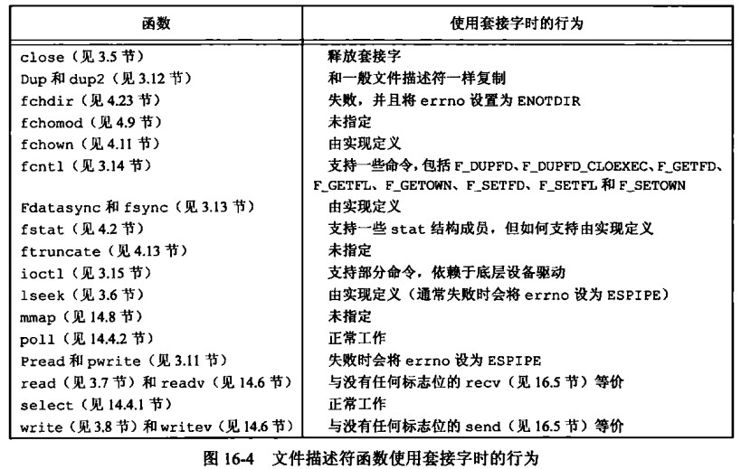

# 第 18 章 网络 IPC 套接字

## 网络 IPC 套接字

Linux系统编程中，网络套接字（socket）是一个重要的概念。套接字是一种在网络上进行通信的工具，通过套接字可以建立客户端和服务器之间的连接，并进行数据的传输。

在Linux系统中，网络套接字是一种特殊的文件描述符，可以通过调用系统函数来创建、连接、发送和接收数据。常用的套接字类型包括TCP套接字和UDP套接字，它们分别用于建立可靠的连接和不可靠的连接。

在编程中，需要使用套接字相关的系统函数来进行网络通信。常用的系统函数包括socket()、bind()、listen()、accept()、connect()、send()和recv()等。其中，socket()函数用于创建套接字，bind()函数用于将套接字与一个地址绑定，listen()函数用于监听连接请求，accept()函数用于接受连接，connect()函数用于建立连接，send()函数用于发送数据，recv()函数用于接收数据。

网络套接字在Linux系统编程中是一个非常重要的概念，它是实现网络通信的基础。了解套接字的概念和相关系统函数的使用方法，可以帮助开发人员编写高效、可靠的网络应用程序。

### 大小端字节序

大小端字节序是指在多字节数据类型（如int、long、float等）的存储过程中，字节的存储顺序不同。  

在大端字节序中，高位字节存放在低地址，低位字节存放在高地址；  
而在小端字节序中，低位字节存放在低地址，高位字节存放在高地址。

```cpp
        2            3
大端： 0000 0010   0000 0011
小端： 0100 0000   1100 0000
    低地址--------->高地址
```

在Linux系统编程中，处理器架构可能是大端字节序或小端字节序，因此需要特别注意在网络通信中字节序的处理。

重点：IO和网络IO时永远是低地址的内容先出去

#### 字节序转换函数

网络通信中通常使用大端字节序（也称为网络字节序）作为标准字节序。为了保证跨平台通信的正确性，需要将本地字节序（即处理器架构字节序）与网络字节序进行转换。可以使用htonl()、htons()、ntohl()和ntohs()等系统函数来完成字节序的转换。

```cpp
//本地字节序转网络字节序
#include <arpa/inet.h>
uint32_t htonl(uint32_t hostlong);
uint16_t htons(uint16_t hostshort);
//网络字节序转本地字节序
uint32_t ntohl(uint32_t netlong);
uint16_t ntohs(uint16_t netshort);
```

### 字节对齐

请见C++内容中的字节对齐，在网络编程中一般会采取不对齐处理

[字节对齐跳转](/c++-even-better/yu-yan-ji-chu/c++-primer-ting-shuo-hen-nan/di-si-bu-fen-gao-ji-zhu-ti/di-19-zhang-te-shu-gong-ju-yu-ji-shu#nei-cun-zi-jie-dui-qi)

### 类型长度问题

在C中int、char等，并没有规定一定的长度大小，可能不同环境下会有不同，为了解决此问题，一般会采取以下固定长度整数类型进行使用

```cpp
#include <stdint.h>
//int8_t: 8 位有符号整数，定义在 stdint.h 或 cstdint 头文件中
//uint8_t: 8 位无符号整数，定义在 stdint.h 或 cstdint 头文件中
//int16_t: 16 位有符号整数，定义在 stdint.h 或 cstdint 头文件中
//uint16_t: 16 位无符号整数，定义在 stdint.h 或 cstdint 头文件中
//int32_t: 32 位有符号整数，定义在 stdint.h 或 cstdint 头文件中
//uint32_t: 32 位无符号整数，定义在 stdint.h 或 cstdint 头文件中
//int64_t: 64 位有符号整数，定义在 stdint.h 或 cstdint 头文件中
//uint64_t: 64 位无符号整数，定义在 stdint.h 或 cstdint 头文件中
```

### 套接字描述符

在Linux系统编程中，套接字描述符是一种重要的概念，它是一种用于进行网络通信的抽象概念，类似于文件描述符，用于标识和管理网络连接

在Linux中，套接字描述符是一个整数，它唯一标识一个网络连接。套接字描述符通常由socket()函数创建，bind()和connect()函数绑定和连接网络端点，send()和recv()函数进行数据传输，close()函数关闭套接字。

#### socket函数

socket()函数是用于创建套接字的系统调用。套接字是一种抽象的通信机制，用于在网络上进行数据传输和通信。

```cpp
#include <sys/types.h>          /* See NOTES */
#include <sys/socket.h>
#include <netinet/in.h>
#include <netinet/tcp.h>
int socket(int domain, int type, int protocol);
返回值：若成功，返回文件描述符；若出错，返回-1
```

套接字通信域domain：

```cpp
AF_INET IPv4因特网域
AF_INET6 Ipv6因特网域
AF_UNIX UNIX域
AF_UNSPEC 未指定
```

套接字类型type：

```cpp
SOCK_DGRAM 固定长度的、无连接的、不可靠的报文传递
SOCK_RAW IP协议的数据报接口
SOCK_SEQPACKET 固定长度的、有序的、可靠的、面向连接的报文传递
SOCK_STREAM 有序的、可靠的、双向的、面向连接的字节流
```

为因特网域套接字定义的协议protocol：

```cpp
IPPROTO_IP  IPv4网际协议
IPPROTO_IPV6    IPv6网际协议
IPPROTO_ICMP    因特网控制报文协议
IPPROTO_RAW     原始IP数据包协议
IPPROTO_TCP     传输控制协议
IPPROTO_UDP     用于数据报协议
```

创建套接字样例

```cpp
#include <iostream>
#include <cstring>
#include <errno.h>
#include <sys/types.h>
#include <sys/socket.h>
#include <netinet/in.h>
#include <netinet/tcp.h>
#include <unistd.h>

using namespace std;

int main(int argc, char **argv)
{
    //监听套接字创建
    int fd = socket(AF_INET, SOCK_STREAM, IPPROTO_TCP);
    if (fd == -1)
    {
        cout << "socket error " << strerror(errno) << endl;
    }
    else
    {
        cout << "socket fd = " << fd << endl;
    }
    close(fd);
    return 0;
}
```

#### 文件描述符函数使用套接字时的行为



#### shutdown函数

shutdown函数是一个系统调用，用于关闭一个已经连接的套接字或禁止其读写操作。它位于头文件<sys/socket.h>中，并具有以下原型：

```cpp
#include <sys/socket.h>
int shutdown(int socket, int how);
```

socket为已经连接的套接字描述符，how指定关闭的方式：

```cpp
SHUT_RD:关闭套接字的读取功能，即禁止套接字接收数据。
SHUT_WR：关闭套接字的写入功能，即禁止套接字发送数据。
SHUT_RDWR：关闭套接字的读写功能，即禁止套接字读取和发送数据。
```

shutdown函数可以用于关闭一个已连接的套接字或禁止其读写操作，以此来表示通信结束或出现错误等情况。需要注意的是，调用该函数不会立即关闭套接字，而是将套接字置于一个特殊的状态，直到所有未发送的数据都被发送完毕或者被丢弃为止。在调用shutdown函数之后，应用程序仍然需要通过close函数关闭套接字描述符。

如果shutdown函数调用成功，返回值为0。如果发生错误，返回值为-1，并设置相应的错误代码，可以通过errno变量获取。

### 寻址

进程标识由两部分组成，一部分是计算机的网络地址，它可以帮助标识网络上我们想与之通信的计算机；另一部分是该计算机上用端口号表示的服务，它可以帮助标识特定的进程。

#### 地址格式

网络地址通常使用IPv4或IPv6地址格式。IPv4地址是32位的地址，通常表示为四个数字，每个数字之间用点号分隔。例如，192.168.1.1就是一个IPv4地址。

IPv6地址是128位的地址，通常表示为8组4位十六进制数，每组之间用冒号分隔。例如，2001:0db8:85a3:0000:0000:8a2e:0370:7334就是一个IPv6地址。

此外，还有一些其他的网络地址格式，如MAC地址和网络掩码等。MAC地址是48位的地址，通常表示为12个十六进制数，每个数之间用冒号或连字符分隔。网络掩码是用于子网划分的一种地址格式，它通常与IPv4地址一起使用，表示一个子网的地址范围。

1、struct sockaddr

它是一个抽象结构，其具体实现取决于地址族（address family）的类型。

```cpp
struct sockaddr {
    unsigned short sa_family;    // 地址族类型 AF_INET AF_INET6 ...
    char sa_data[14];            // 具体的地址信息
};
```

2、struct sockaddr_in

```cpp
struct sockaddr_in {
    short int sin_family;        // 地址族类型，固定为AF_INET
    unsigned short int sin_port; // 端口号，网络字节序
    struct in_addr sin_addr;     // IPv4地址
    unsigned char sin_zero[8];   // 暂未使用，一般设为0
};
struct in_addr {
    uint32_t s_addr;            // IPv4地址，网络字节序
};
/*
struct sockaddr_in* p = (struct sockaddr_in*)&addr;
char* ip = inet_ntoa(p->sin_addr);
printf("IP address: %s\n", ip);
*/
```

3、struct sockaddr_in6

```cpp
struct sockaddr_in6 {
    uint16_t sin6_family;       // 地址族类型，固定为AF_INET6
    uint16_t sin6_port;         // 端口号，网络字节序
    uint32_t sin6_flowinfo;     // 流标识，暂未使用
    struct in6_addr sin6_addr;  // IPv6地址
    uint32_t sin6_scope_id;     // 作用域标识，暂未使用
};
struct in6_addr {
    unsigned char s6_addr[16];  // IPv6地址，使用网络字节序
};
/*
struct sockaddr_in6* p = (struct sockaddr_in6*)&addr;
char ip[INET6_ADDRSTRLEN];
inet_ntop(AF_INET6, &(p->sin6_addr), ip, INET6_ADDRSTRLEN);
printf("IP address: %s\n", ip);
*/
```

#### inet_ntop函数

inet_ntop()函数是一个网络编程中常用的函数，用于将网络字节序的IP地址转换为字符串格式

```cpp
#include <arpa/inet.h>
const char *inet_ntop(int af, const void *src, char *dst, socklen_t size);
```

其中，af参数指定了地址族类型，可以是AF_INET（IPv4）或AF_INET6（IPv6）；src参数是指向存储IP地址的指针；dst参数是指向存储转换后的字符串的指针；size参数指定了dst指针指向的缓冲区的大小。

inet_ntop()函数成功转换IP地址时，返回值是指向转换后的字符串的指针。如果出现错误，返回值为NULL，并且可以通过调用errno来获取错误码。

IPv4代码样例

```cpp
#include <arpa/inet.h>
#include <stdio.h>

int main()
{
    struct in_addr addr;
    addr.s_addr = htonl(0x7f000001); // 127.0.0.1
    char ip[INET_ADDRSTRLEN];
    if (inet_ntop(AF_INET, &addr, ip, INET_ADDRSTRLEN) == NULL)
    {
        perror("inet_ntop");
        return 1;
    }
    printf("IP address: %s\n", ip); // IP address: 127.0.0.1
    return 0;
}
```

IPv6代码样例

```cpp
#include <arpa/inet.h>
#include <stdio.h>

int main()
{
    struct in6_addr addr;
    addr.s6_addr[0] = 0x20;
    addr.s6_addr[1] = 0x01;
    addr.s6_addr[2] = 0x0d;
    addr.s6_addr[3] = 0xb8;
    char ip[INET6_ADDRSTRLEN];
    if (inet_ntop(AF_INET6, &addr, ip, INET6_ADDRSTRLEN) == NULL)
    {
        perror("inet_ntop");
        return 1;
    }
    printf("IP address: %s\n", ip);
    // IP address: 2001:db8::f7e5:78a4:ff7f:0
    return 0;
}

```

#### inet_pton函数

用于将字符串格式的IP地址转换为网络字节序的二进制格式

```cpp
#include <arpa/inet.h>
int inet_pton(int af, const char *src, void *dst);
```

其中，af参数指定了地址族类型，可以是AF_INET（IPv4）或AF_INET6（IPv6）；src参数是指向存储字符串格式IP地址的指针；dst参数是指向存储转换后的二进制格式IP地址的指针。

inet_pton()函数成功转换IP地址时，返回值为1。如果出现错误，返回值为0，并且可以通过调用errno来获取错误码。

IPv4样例

```cpp
#include <arpa/inet.h>
#include <stdio.h>

int main()
{
    const char *ip_str = "127.0.0.1";
    struct in_addr addr;
    if (inet_pton(AF_INET, ip_str, &addr) <= 0)
    {
        perror("inet_pton");
        return 1;
    }
    printf("IP address: 0x%x\n", ntohl(addr.s_addr));
    // IP address: 0x7f000001
    return 0;
}
```

IPv6样例

```cpp
#include <arpa/inet.h>
#include <stdio.h>

int main()
{
    const char *ip_str = "2001:db8::";
    struct in6_addr addr;
    if (inet_pton(AF_INET6, ip_str, &addr) <= 0)
    {
        perror("inet_pton");
        return 1;
    }
    printf("IP address: ");
    for (int i = 0; i < 16; i++)
    {
        printf("%02x", addr.s6_addr[i]);
    }
    printf("\n");
    // IP address: 2001 0db8 000000000000000000000000
    return 0;
}
```

#### 地址查询

#### 将套接字与地址关联

### 建立连接

### 数据传输

### 套接字选项

### 带外数据

### 非阻塞和异步 IO
