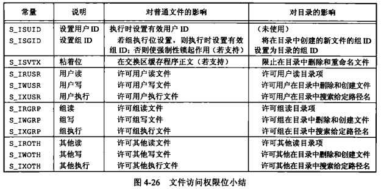

# 第 4 章 文件和目录

## 文件和目录

- Linux 一切皆是文件
- 函数 stat、fstat、fstatat、lstat 返回文件信息

```cpp
//man  fstatat
#include <sys/types.h>
#include <sys/stat.h>
#include <unistd.h>
int stat(const char *pathname, struct stat *statbuf);
int fstat(int fd, struct stat *statbuf);//以fd为文件描述符
int lstat(const char *pathname, struct stat *statbuf);
#include <fcntl.h>           /* Definition of AT_* constants */
#include <sys/stat.h>
int fstatat(int dirfd, const char *pathname, struct stat *statbuf,
                   int flags);//根据dirfd位置提供pathname

```

- 文件类型：普通文件、目录文件、块特殊文件（如磁盘每次访问以固定长度为单位进行）、字符特殊文件（每次访问长度可变）、FIFO、套接字、符号链接（软连接）
- 设置用户 ID、组 ID：实际用户 ID、实际组 ID（我们实际是谁）、有效用户 ID、有效组 ID、附属组 ID（用于文件访问权限检查）、保存的设置用户 ID、保存的设置组 ID（由 exec 函数保存）
- 文件的访问权限：用户 rwx、组 rwx、其他 rwx
- 新文件和目录的所有权：1、新文件的组 ID 可以是进程的有效组 ID。2、新文件的组 ID 可以是它所在目录的组 ID
- 函数 access 和 faccessat，用于权限检查

```cpp
#include <unistd.h>
int access(const char *pathname, int mode);
#include <fcntl.h>           /* Definition of AT_* constants */
#include <unistd.h>
int faccessat(int dirfd, const char *pathname, int mode, int flags);
//mode可以提供 R_OK W_OK X_OK unistd.h
```

- 函数 umask 用来可以在对权限修改时，屏蔽掉某些权限以表示不允许哪些权限，然后只提供赋给的权限

```cpp
#include <sys/types.h>
#include <sys/stat.h>
mode_t umask(mode_t mask);
```

- 函数 chmod、fchmod、fchmodat 修改文件权限

```cpp
#include <sys/stat.h>

int chmod(const char *pathname, mode_t mode);
int fchmod(int fd, mode_t mode);

#include <fcntl.h>           /* Definition of AT_* constants */
#include <sys/stat.h>

int fchmodat(int dirfd, const char *pathname, mode_t mode, int flags);
```

- 粘着位：也称为 t 位，不用太了解，请求分页的一种优化方式

- 函数 chown、fchown、fchownat、lchown，用于修改文件的用户 ID 和组 ID

```cpp
#include <unistd.h>

int chown(const char *pathname, uid_t owner, gid_t group);
int fchown(int fd, uid_t owner, gid_t group);
int lchown(const char *pathname, uid_t owner, gid_t group);

#include <fcntl.h>           /* Definition of AT_* constants */
#include <unistd.h>

int fchownat(int dirfd, const char *pathname,
              uid_t owner, gid_t group, int flags);
```

- 文件长度：stat 结构体中成员 st_size 表示以字节位单位的文件的长度，此字段指对普通文件、目录文件、符号链接有意义
- 文件中的空洞：复制一个含有空洞的文件，新文件中的空洞占用实际的空间
- 文件截断：open 时指定 O_TRUNC，可以使用 truncate 和 ftruncate 函数截断文件

```cpp
#include <unistd.h>
#include <sys/types.h>

int truncate(const char *path, off_t length);
int ftruncate(int fd, off_t length);
//只保留前length字节，后面的删除，若length大于原来的实际大小，则会产生空洞
```

- 文件系统：目录块里存目录项，目录项里面有文件名和 i 节点编号的元组，i 节点编号指向之际的 i 节点，一个 i 节点指向多个数据块
- 硬链接：通常创建硬链接要求二者在同一个文件系统下，也就是有多个目录项中的 i 节点编号指向了相同的 i 节点，也正是这样形成了可以再命名新的名字是被允许的，因为二者的目录项里面存储的文件名不同
- 函数 link、linkat、unlink、unlinkat、remove 用于创建与删除硬链接，当 i 节点的引用为 0 时，才会真的删除数据文件

```cpp
       #include <unistd.h>
       int link(const char *oldpath, const char *newpath);
       #include <fcntl.h>           /* Definition of AT_* constants */
       #include <unistd.h>
       int linkat(int olddirfd, const char *oldpath,
                  int newdirfd, const char *newpath, int flags);
       #include <unistd.h>
       int unlink(const char *pathname);
       #include <fcntl.h>           /* Definition of AT_* constants */
       #include <unistd.h>
       int unlinkat(int dirfd, const char *pathname, int flags);
```

- 函数 rename 和 renameat,用来重命名

```cpp
       #include <stdio.h>
       int rename(const char *oldpath, const char *newpath);
       #include <fcntl.h>           /* Definition of AT_* constants */
       #include <stdio.h>
       int renameat(int olddirfd, const char *oldpath,
                    int newdirfd, const char *newpath);
       int renameat2(int olddirfd, const char *oldpath,
                     int newdirfd, const char *newpath, unsigned int flags);
```

- 链接符号：软链接，避开了硬链接通常要求链接和文件位于同一文件系统中，只有超级用户才能创建指向目录的硬链接
- 是否跟跟随符号链接：什么意思，跟随符号链接也就是会去处理其链接的实际文件，不跟随符号链接也就是会处理符号链接本身，因为其也是一个文件，某些函数是否跟随可查搜索
- 创建和读取符号链接

```cpp
       #include <unistd.h>
       int symlink(const char *target, const char *linkpath);
       #include <fcntl.h>           /* Definition of AT_* constants */
       #include <unistd.h>
       int symlinkat(const char *target, int newdirfd, const char *linkpath);
       //前者为真实文件 后者是创建的软连接路径
```

- open 函数是跟随符号链接的，读取符号链接本身可以使用 readlink

```cpp
       #include <unistd.h>
       ssize_t readlink(const char *pathname, char *buf, size_t bufsiz);
       #include <fcntl.h>           /* Definition of AT_* constants */
       #include <unistd.h>
       ssize_t readlinkat(int dirfd, const char *pathname,
                          char *buf, size_t bufsiz);
```

- 文件时间：在 stat 中，有最后访问时间 at_atime、修改时间 st_mtime、i 节点状态的最后更改时间 st_ctime,要注意的是操作某些文件，可能会引起父目录的相关时间改变，比如重命名等
- 函数 ftimens、utimensat、utimes 用于更改文件访问和修改时间

```cpp
       #include <fcntl.h> /* Definition of AT_* constants */
       #include <sys/stat.h>
       int utimensat(int dirfd, const char *pathname,
                     const struct timespec times[2], int flags);
       int futimens(int fd, const struct timespec times[2]);
```

某些函数对文件操作，其相关时间被修改，然后使用这些函数改回原来的时间是被允许的

- 函数 mkdir、mkdirat、rmdir 用于创建目录和删除空目录

```cpp
       #include <sys/stat.h>
       #include <sys/types.h>
       int mkdir(const char *pathname, mode_t mode);
       #include <fcntl.h>           /* Definition of AT_* constants */
       #include <sys/stat.h>
       int mkdirat(int dirfd, const char *pathname, mode_t mode);
```

- 读目录 opendir fdopendir readdir

```cpp
       #include <sys/types.h>
       #include <dirent.h>
       DIR *opendir(const char *name);
       DIR *fdopendir(int fd);
       #include <dirent.h>
       struct dirent *readdir(DIR *dirp);//返回目录中的第一个目录项,取决于location位置
       struct dirent {
               ino_t          d_ino;       /* Inode number */
               off_t          d_off;       /* Not an offset; see below */
               unsigned short d_reclen;    /* Length of this record */
               unsigned char  d_type;      /* Type of file; not supported
                                              by all filesystem types */
               char           d_name[256]; /* Null-terminated filename */
       };
       #include <sys/types.h>
       #include <dirent.h>
       int closedir(DIR *dirp);//关闭文件夹
       void rewinddir(DIR *dirp);//reset directory stream
       long telldir(DIR *dirp);//return current location in directory stream
       void seekdir(DIR *dirp, long loc);
       //set the position of the next readdir() call in the directory stream.
```

- 函数 chdir、fchdir、getcwd 更改当前工作目录与获取当前工作目录,每个进程有自己的当前工作目录

```cpp
       #include <unistd.h>
       int chdir(const char *path);
       int fchdir(int fd);//fd必须为文件目录的文件描述符
       #include <unistd.h>
       char *getcwd(char *buf, size_t size);
       char *getwd(char *buf);
       char *get_current_dir_name(void);
```

- glob函数: 进行文件名模式匹配

```c
       #include <glob.h>
       int glob(const char *pattern, int flags,
                int (*errfunc) (const char *epath, int eerrno),
                glob_t *pglob);
       void globfree(glob_t *pglob);
```


- 设备特殊文件：设备由主、次设备号标识

```cpp
//如果是设备，可以使用stat获取结构体struct stat信息，使用
major(info.st_dev)获取主设备号
minor(info.st_dev)获取次设备号
```

- 文件权限位



```cpp
S_IRWXU=SIRUSR|S_IWUSR|S_IXUSR
S_IRWXG=S_IRGRP|S_IWGRP_S_IXGRP
S_IRWXO=S_IROTH|S_IWOTH|S_IXOTH
```
