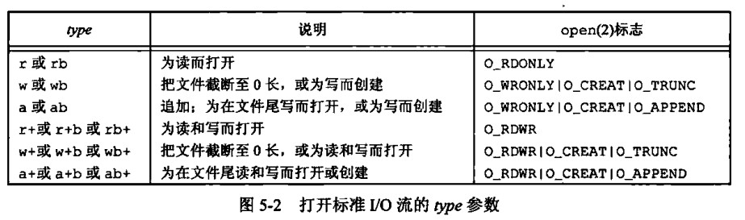
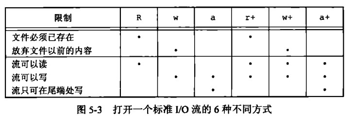

# 第 5 章 标准 I/O 库

## 标准 I/O 库

### 流和对象

打开一个文件，返回一个文件描述符，对于标准 IO 库而言，他们的操作是围绕流进行的，一个字符可能是一个字节，也可能是宽字符需要多个字节。

### 流的定向

决定了所读、写的字符是单字节还是多字节的宽字符，当一个流创建时时没有被定向，若在流上使用一个宽字符则变为宽定向，使用单字节的 IO 函数，则将流定向设为字节定向的

### fwide 函数用于设置流的定向

```cpp
#include <wchar.h>
int fwide(FILE *stream, int mode);
返回值为设置后的mode，
mode 负为字节定向 正为宽字符 0为未定向
```

### 标准输入、标准输出、标准错误

```cpp
STDIN_FILENO STDOUT_FILENO STDERR_FILENO
stdin        stdout        stderr
#include<stdio>
```

### 缓冲

- 缓冲：标准 IO 有三种类型，全缓冲、行缓冲、不带缓冲
- 全缓冲：当填满标准 IO 缓冲区后才进行实际的 I/O 操作
- 行缓冲：在输入和输出中遇到换行符时，标准 I/O 库执行 I/O 操作，缓冲区大小有限当行大小超过缓冲大小即使没换行符也会 I/O 操作，通过标准 I/O 库要求从一个不带缓冲的流或行缓冲流得到输入数据，会冲洗所有行缓冲输出流
- 冲洗：flush、在进行写操作时，冲洗就是将缓冲区中的内容写到磁盘上，可以调用 fflush 函数冲洗一个流
- 不带缓冲，stderr 不带缓冲

### 更改缓冲类型

```cpp
#include <stdio.h>
void setbuf(FILE *stream, char *buf);//buf需要为BUFSIZE长度默认全缓冲
void setbuffer(FILE *stream, char *buf, size_t size);//buf为size长度
void setlinebuf(FILE *stream);//行缓冲
int setvbuf(FILE *stream, char *buf, int mode, size_t size);
//mode： _IOFBF全缓冲 _IOLBF行缓冲 _IONBF不带缓冲
```

### fflush 函数，强制冲洗一个流

```cpp
#include <stdio.h>
int fflush(FILE *stream);
//该函数使得所有未写的数据都被传送到内核
```

### fopen 打开流

```cpp
#include <stdio.h>
FILE *fopen(const char *pathname, const char *mode);
FILE *fdopen(int fd, const char *mode);//例如管道或者socket没有pathname
FILE *freopen(const char *pathname, const char *mode, FILE *stream);
//freopen在一个指定的流上打开一个指定的文件，若流已经打开则先关闭流，流已经定向则先清楚定向，一般用于将一个指定的文件打开为一个预定义的流
```



b 用来以二进制读写还是字节形式

```cpp
#include <stdio.h>
int main(void)
{
    freopen("./temp.text", "ab", stdout);
    printf("new file");
    //会神奇的发现，new file被写到./temp.text文件里了
    return 0;
}
```



### fclose 关闭流

在关闭前将冲洗缓冲中的输出数据，缓冲区种的输入数据将会被清空，因为关闭流了，用户也不会再读数据了，进程正常终止时 exit 调用或 main 返回，都会自动 close

### I/O 读写有三种选择，每次操作一个字符、每次操作一行、直接 I/O 指定大小

```cpp
#include <stdio.h>
int fgetc(FILE *stream);//函数
char *fgets(char *s, int size, FILE *stream);
int getc(FILE *stream);//宏
int getchar(void);//等价于getc(stdin)
int ungetc(int c, FILE *stream);
ssize_t getline(char **lineptr, size_t *n, FILE *stream);//读取一行
ssize_t getdelim(char **lineptr, size_t *n, int delim, FILE *stream);
```

getc 为什么返回 int，而不是 unsigned char,因为可能返回 EOF，EOF 通常为-1，标识文件末尾

```cpp
#include <stdio.h>
void clearerr(FILE *stream); //清楚出错标志
int feof(FILE *stream);      //检测文件结束标志
int ferror(FILE *stream);    //检测出错标志
int fileno(FILE *stream);    //获得文件描述符
```

### 压回字符

从流中读出数据后，可以将数据在返回到缓冲区

```cpp
int ungetc(int c, FILE *stream);
```

```cpp
#include <stdio.h>
int main(void)
{
    char ch = getchar(); // input a
    ungetc(ch, stdin);//压回到stdin缓冲区
    ch = getchar();
    printf("%c", ch); // ouput a
    return 0;
}
```

- 输出函数

```cpp
#include <stdio.h>
int fputc(int c, FILE *stream);
int putc(int c, FILE *stream);
int putchar(int c);
//成功返回c 出错返回EOF
```

- 每次一行 I/O

```cpp
#include <stdio.h>
char *gets(char *s);
char *fgets(char *s, int size, FILE *stream);
//成功返回buf，若已到达文件末尾或者出错，返回NULL
#include <stdio.h>
int main(void)
{
    char buf[5];
    if (fgets(buf, 5, stdin)) // 12345678
    {
        printf("%s\n", buf); // 1234
    }
    fgets(buf, 5, stdin);
    printf("%s\n", buf); // 5678
    return 0;
}
```

### gets 不要使用

其不能指定 buf 大小，可能回造成缓冲区溢出

### 每次输出一行

```cpp
#include <stdio.h>
int fputs(const char *s, FILE *stream);
int puts(const char *s);
//返回非负值则成功 出错返回EOF
#include <stdio.h>
int main(void)
{
    puts("hello unix env");
    FILE *fp = fopen("./temp.txt", "ab");
    fputs("hello unix env", fp);
    fflush(fp);
    fclose(fp);
    return 0;
}
```

### 二进制 I/O

常见的用法为，读或者写一个二进制数组、读或写一个结构

```cpp
#include <stdio.h>
//ptr为首地址 size为一个对象的字节数 nmemb为操作几个对象
size_t fread(void *ptr, size_t size, size_t nmemb, FILE *stream);
size_t fwrite(const void *ptr, size_t size, size_t nmemb,FILE *stream);
```

通常要特别注意字节对齐的问题，以及每个基本数据类型在不同的系统中的存储方式也不同，不大端小端等等

```cpp
float data[10];
if(fwrite(&data[2],sizeof(float),4,fp)!=4){
    perror("");
}
struct{
    char ch;
    int n;
}item;
if(fwrite(&item,sizeof(item),1,fp)!=1){
    //
}
```

### 定位流

```cpp
#include <stdio.h>
//移动指针
int fseek(FILE *stream, long offset, int whence);
//返回现在的位置
long ftell(FILE *stream);
//定位到起始位置
void rewind(FILE *stream);
//获取位置存储到pos指向的fpos_t
int fgetpos(FILE *stream, fpos_t *pos);
//设置位置为pos指向的fpos_t的值
int fsetpos(FILE *stream, const fpos_t *pos);
```

### 格式化 I/O，包括格式化输出与输入两部分

格式化输出

```cpp
#include <stdio.h>
int printf(const char *format, ...);
int fprintf(FILE *stream, const char *format, ...);
int dprintf(int fd, const char *format, ...);
//以上三个，成功则返回输出字符数、出错返回负值
int sprintf(char *str, const char *format, ...);
//成功则返回存入数组的字符数、出错返回负值
int snprintf(char *str, size_t size, const char *format, ...);
//缓冲区足够大，返回存入数组的字符数、出错返回负值
#include <stdarg.h>
int vprintf(const char *format, va_list ap);
int vfprintf(FILE *stream, const char *format, va_list ap);
int vdprintf(int fd, const char *format, va_list ap);
int vsprintf(char *str, const char *format, va_list ap);
int vsnprintf(char *str, size_t size, const char *format, va_list ap);
//关于format的规则，用到再关心
```

格式化输入

```cpp
#include <stdio.h>
int scanf(const char *format, ...);
int fscanf(FILE *stream, const char *format, ...);
int sscanf(const char *str, const char *format, ...);
#include <stdarg.h>
int vscanf(const char *format, va_list ap);
int vsscanf(const char *str, const char *format, va_list ap);
int vfscanf(FILE *stream, const char *format, va_list ap);
//返回指定的输入项目数，若出错或在任一转换前文件结束，返回EOF
```

- 实现细节，书中进行了实践 demo，使用 getchar、fputs、fopen、getc、检测 FILE 的缓冲类型，缓冲区大小等

### 临时文件

ISOC 标准提供了创建临时文件的函数

```cpp
#include <stdio.h>
char *tmpnam(char *s);//每次调用 产生一个不同的唯一路径
//最多调用TMP_MAX次
char *tmpnam_r(char *s);
FILE *tmpfile(void);//创建临时二进制文件，在关闭文件或程序结束时自动删除
#include <stdio.h>
int main(void)
{
    char path[L_tmpnam];
    tmpnam(path);
    printf("%s", path);
    return 0;
}
```

创建临时文件或目录
mkdtemp - create a unique temporary directory

```cpp
#include <stdlib.h>
char *mkdtemp(char *template);
int mkstemp(char *template);
//mkstemp() function generates a unique temporary filename from template, creates and opens the file, and returns an open file descriptor for the file.
//template:如 /tmp/dirXXXXXX 不自动唯一生成XXXXXX
```

### 内存流,fmemopen 创建内存缓冲区

```cpp
//重点难点为放null机制与冲洗内存流的策略
#include <stdio.h>
FILE *fmemopen(void *buf, size_t size, const char *mode);
//用于提供缓冲区用于内存流,buf为缓冲区起始位置、size为buf大小，若buf为空，则自动分配size大小的缓冲区，流关闭时缓冲区释放
//mode提供 r rb,w wb,a ab,r+ rb+ w+ wb+ a+ ab+模式
```

要注意的问题：无论何时以追写方式打开内存流时，当前文件位置设为缓冲区第一个 null 字节，如果缓冲区不存在 null 字节，则当前位置就设为缓冲区结尾的后一个字节，当流并不是以追加方式打开时，当前位置设为缓冲区的开始位置，因为追加方式以通过第一个 null 字节确定数据尾部，所以并不适合存储二进制数据，因为一个二进制数据可能在数据尾部之前就有多个 null  
如果 buf 为 null 则无法找到缓冲区的地址，只写方式打开流意味着无法读取已写入的数据，同样以读方式打开流，意味着只能读取无法写入缓冲分区中的数据  
在调用，fclose、fflush、fseek、fseeko、fsetpos 时都会在当前位置写入一个 null 字节

```cpp
#include <stdio.h>
#include <cstring>
#define BUFF_SIZE 20
int main(void)
{
    FILE *fp;
    char buf[BUFF_SIZE];
    memset(buf, 'a', BUFF_SIZE - 1);
    buf[BUFF_SIZE - 1] = '\0';
    printf("%s\n", buf); // aaaaaaaaaaaaaaaaaaa
    fp = fmemopen(buf, BUFF_SIZE, "w+");
    printf("%s", buf); //没有内存 因为调用fmemopen在开头放了null
    fprintf(fp, "HELLO WORLD");
    printf("%s\n", buf);                        //无内容，因为开头为null
    fflush(fp);                                 //在当前位置放null 即WORLD的后面
    printf("%s\n", buf);                        // HELLO WORLD
    int writed_n = fprintf(fp, "123456789012"); //空间不够了
    printf("%d\n", writed_n);                   // 12
    fflush(fp);
    printf("%s\n", buf); // HELLO WORLD12345678 19个字符最后一个为null字节

    // fseek也会引起冲洗
    fseek(fp, 0, SEEK_SET); //开头位置
    fprintf(fp, "hello");
    printf("%s\n", buf); //空
    fprintf(fp, "hello");
    printf("%s\n", buf); //空
    fprintf(fp, "hello");
    fflush(fp);
    printf("%s\n", buf); // hellohellohello5678
    fprintf(fp, "888888888");
    fflush(fp);
    printf("%s\n", buf); // hellohellohello88888�

    fseek(fp, 0, SEEK_SET);
    char temp[BUFF_SIZE];
    fread(temp, 5, 1, fp);
    printf("%s\n", temp); // hello
    fprintf(fp, "ppppp");
    fflush(fp);
    printf("%s\n", buf); // helloppppphello88888�
    return 0;
    //只有冲洗内存流，将会将上次冲洗到这次冲洗中间写入的内容真的写到缓冲区
}
```

```cpp
//创建内存流
#include <stdio.h>
FILE *open_memstream(char **ptr, size_t *sizeloc);//面向字节
#include <wchar.h>
FILE *open_wmemstream(wchar_t **ptr, size_t *sizeloc);//面向宽字节
//特点：
创建的流只能打开
不能指定自己的缓冲区，可以通过ptr和sizeloc访问缓冲区地址和大小
关闭流后需要自行释放缓冲区
对流添加字节会增加缓冲区大小
缓冲区地址和长度只有在调用fclose和fflush后才有效，二者只有在下一次流写入或者调用fclose前有效，缓冲区可以增长，可能需要重新分配，这样会引起地址和长度的变化
```
