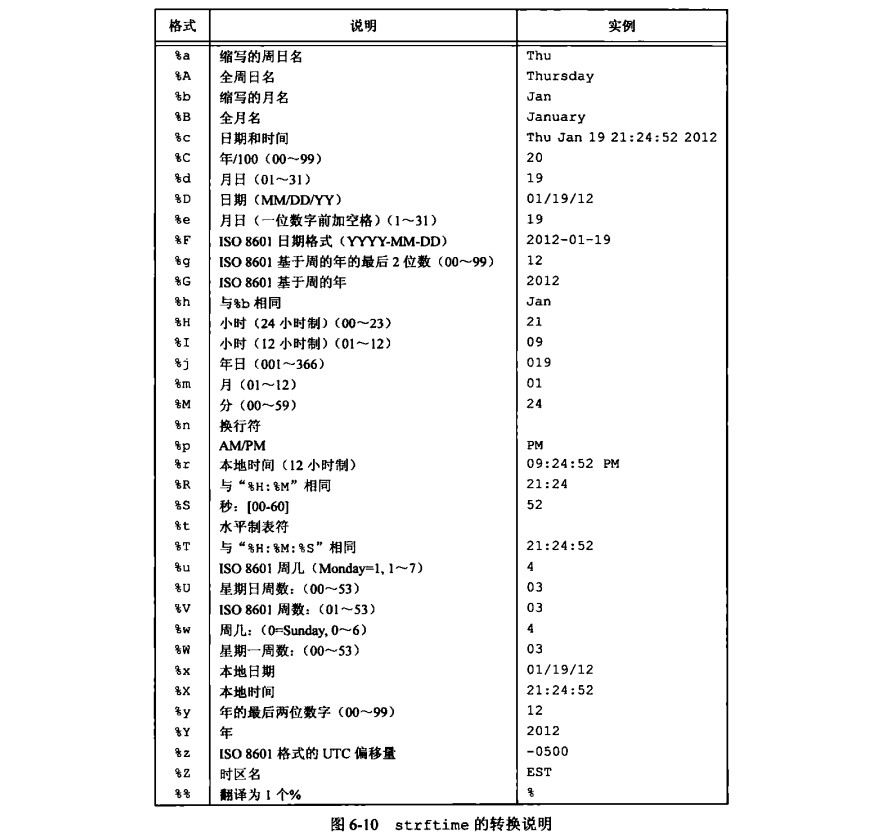
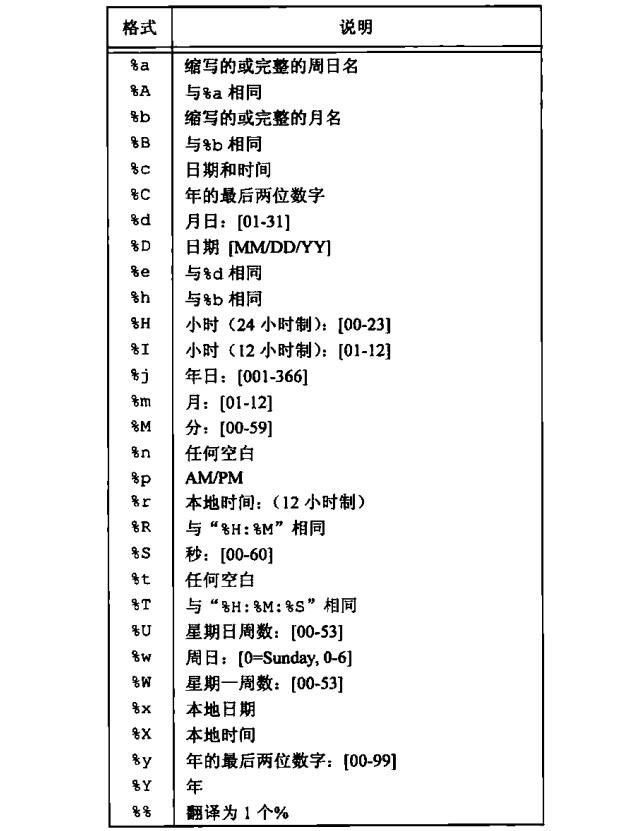

# 第 6 章 系统数据文件和信息

## 系统数据文件和信息

### /etc/passwd

- 口令文件： /etc/passwd UNIX 系统口令文件也成为用户数据库文件,struct passwd 接口在 pwd.h 头文件

/etc/passwd 文件的大致内容格式为

```txt
root:x:0:0:root:/root:/bin/bash
daemon:x:1:1:daemon:/usr/sbin:/usr/sbin/nologin
bin:x:2:2:bin:/bin:/usr/sbin/nologin
sys:x:3:3:sys:/dev:/usr/sbin/nologin
```

```cpp
//pwd.h
/* A record in the user database.  */
struct passwd
{
  char *pw_name;		/* Username.  */
  char *pw_passwd;		/* Hashed passphrase, if shadow database
                                   not in use (see shadow.h).  */
  __uid_t pw_uid;		/* User ID.  */
  __gid_t pw_gid;		/* Group ID.  */
  char *pw_gecos;		/* Real name.  */
  char *pw_dir;			/* Home directory.  */
  char *pw_shell;		/* Shell program.  */
};
```

获取口令函数,获取用户详细信息

```cpp
#include <sys/types.h>
#include <pwd.h>
struct passwd *getpwnam(const char *name);//根据登录用户名获取
struct passwd *getpwuid(uid_t uid);//根据uid获取
int getpwnam_r(const char *name, struct passwd *pwd,
               char *buf, size_t buflen, struct passwd **result);
int getpwuid_r(uid_t uid, struct passwd *pwd,
               char *buf, size_t buflen, struct passwd **result);
```

如果只是获取登录名或用户 ID

```cpp
#include <sys/types.h>
#include <pwd.h>
struct passwd *getpwent(void);//第一次调用打开/etc/passwd文件 getpwent为获取下一项 到文件末尾返回nullptr
void setpwent(void);//读写地址指向文件开头
void endpwent(void);//关闭打开文件
//demo 使用getpwent可是实现getpwnam
#include <pwd.h>
#include <iostream>
using namespace std;
int main(void)
{
    struct passwd *ptr = getpwent();
    while (ptr)
    {
        cout << ptr->pw_name << " " << ptr->pw_passwd << endl;
        ptr = getpwent();
    }
    setpwent();
    endpwent();
    return 0;
}
```

### getpass

无回显输入内容

```cpp
#include <unistd.h>
char *getpass(const char *prompt);
```

### crypt 加密

```cpp
#include <crypt.h>
char * crypt(const char *phrase, const char *setting);
phrase 要加密的明文
setting 密钥
支持 DES Blowfish MD5加密，具体加密算法根据setting内容长度而定
```

### /etc/shadow

- 阴影口令：/etc/shadow 系统将加密口令存放在另一个通常称为阴影口令(shadow password)的文件中，该文件至少包含用户名和加密口令

文件格式

```txt
gaowanlu:$6$U4XjogvH/T4Uh3AL$rwI2004K.KLw13OAAbHY6.pWWa1fSowYlyUheRjNWS3qvoMQl0xIgZS7yB0sLDHRYJ2SJZM9g0WIEBA2V938T/:18852:0:99999:7:::
mysql:!:19295:0:99999:7:::
fwupd-refresh:*:19302:0:99999:7:::
```

```cpp
/* A record in the shadow database.  */
struct spwd
{
    char *sp_namp;             /* Login name.  */
    char *sp_pwdp;             /* Hashed passphrase. 加密口令  */
    long int sp_lstchg;        /* Date of last change.  上次更改口令以来经过的时间*/
    long int sp_min;           /* Minimum number of days between changes. 经多少天后允许修改  */
    long int sp_max;           /* Maximum number of days between changes. 要求更改尚余天数 */
    long int sp_warn;          /* Number of days to warn user to change
                      the password.  超期警告天数 */
    long int sp_inact;         /* Number of days the account may be
                      inactive. 账户不活动之前尚余天数  */
    long int sp_expire;        /* Number of days since 1970-01-01 until
                      account expires. 账户超期天数 */
    unsigned long int sp_flag; /* Reserved. 保留 */
};
```

查看 shadow 文件相关函数

```cpp
//使用方式与口令相关函数类似
/* General shadow password file API */
#include <shadow.h>
struct spwd *getspnam(const char *name);
struct spwd *getspent(void);
void setspent(void);
void endspent(void);
//还有其他API更多可以看man
```

```cpp
//demo
#include <iostream>
#include <shadow.h>
using namespace std;
int main(void)
{
    struct spwd *ptr = getspnam("gaowanlu");
    cout << ptr->sp_namp << " " << ptr->sp_pwdp << endl;
    // gaowanlu $6$U4XjogvH/T4Uh3AL$rwI2004K.KLw13OAAbHY6.pWWa1fSowYlyUheRjNWS3qvoMQl0xIgZS7yB0sLDHRYJ2SJZM9g0WIEBA2V938T/
    return 0;
}
```

### /etc/group

- 组文件：/etc/group,也成为组数据库，存储系统组相关信息

/etc/group 格式

```txt
root:x:0:
daemon:x:1:
bin:x:2:
sys:x:3:
adm:x:4:syslog,gaowanlu
tty:x:5:syslog
```

```cpp
/* The group structure.	 */
struct group
{
    char *gr_name;   /* Group name.	组名*/
    char *gr_passwd; /* Password 加密口令.	*/
    __gid_t gr_gid;  /* Group ID. 数值组ID	*/
    char **gr_mem;   /* Member list. 指向各用户名指针的数组	*/
};
```

相关函数

```cpp
//使用方法与上面都很类似
#include <sys/types.h>
#include <grp.h>
struct group *getgrnam(const char *name);
struct group *getgrgid(gid_t gid);
int getgrnam_r(const char *name, struct group *grp,
               char *buf, size_t buflen, struct group **result);
int getgrgid_r(gid_t gid, struct group *grp,
               char *buf, size_t buflen, struct group **result);
struct group *getgrent(void);
void setgrent(void);
void endgrent(void);
```

```cpp
//demo
#include <iostream>
#include <grp.h>
using namespace std;
int main(void)
{
    struct group *grp = getgrgid(1);
    cout << grp->gr_gid << " " << grp->gr_name << " " << grp->gr_passwd << endl;
    return 0;
}
```

- 附属组 ID：一个用户的组 ID 可以属于口令文件记录项中组 ID 所对应的组，也可属于多至 16 个另外组，也就是附属 ID，检查相关用户的组权限时，附属组 ID 都会查

获取和设置附属 ID 相关函数

```cpp
//根据进程所属用户而言
#include <sys/types.h>
#include <unistd.h>
//size不能大于NGROUPS_MAX
int getgroups(int size, gid_t list[]);//成功返回附属组id数量，出错返回-1
#include <grp.h>
int setgroups(size_t size, const gid_t *list);
#include <sys/types.h>
#include <grp.h>
int initgroups(const char *user, gid_t group);//这两个成功返回0，出错返回-1
//The  initgroups()  function  initializes  the group access list by reading the group database /etc/group and using all groups of which user is a member.  The additional group group is also added to the list.
//initgroups读取/etc/group 并且会调用setgroups
```

### 其他数据文件


使用方法都与前面三个类似

- 登录账户记录：utmp 文件记录当前登录到系统的各个用户，wtmp 文件跟踪各个登录和注销时间,struct utmp 中有登录的用户名，登录的秒数等等，可以看 man utmp
  通常在/var/log /var/run/ /var/adm 文件夹下

- 系统标识：获取主机和操作系统相关信息

```cpp
//$ uname
//Linux
#include <sys/utsname.h>
int uname(struct utsname *buf);//出错返回负值
struct utsname
{
    char sysname[];  /* Operating system name (e.g., "Linux") */
    char nodename[]; /* Name within "some implementation-defined
                        network" */
    char release[];  /* Operating system release (e.g., "2.6.28") */
    char version[];  /* Operating system version */
    char machine[];  /* Hardware identifier */
#ifdef _GNU_SOURCE
    char domainname[]; /* NIS or YP domain name */
#endif
};

#include <unistd.h>//进程所属主机的主机名获取和设置
int gethostname(char *name, size_t len);
int sethostname(const char *name, size_t len);
//demo
#include <iostream>
#include <unistd.h>
using namespace std;
int main(void)
{
    char buffer[_SC_HOST_NAME_MAX];
    gethostname(buffer, sizeof(buffer));
    cout << buffer << endl; // DESKTOP-QDLGRDB
    return 0;
}
```

### 时间信息

- 时间和日期例程

UTC 时间是从 1970 年 1 月 1 日 00：00：00 以来经过的秒数，使用 time_t 数据类型标识

```cpp
#include <iostream>
#include <time.h>
using namespace std;
int main(int argc, char **argv)
{
    time_t now;
    time_t res = time(&now);
    cout << now << " " << res << endl; // 1668219159 1668219159
    //若失败则返回-1
    return 0;
}

```

- 不同时钟类型

clock_gettime 函数用于获取指定时钟的时间

```cpp
#include <time.h>
int clock_getres(clockid_t clk_id, struct timespec *res);//获取时钟精度
int clock_gettime(clockid_t clk_id, struct timespec *tp);
//使用适当的特权更改时钟值，有些时钟是不能修改的
int clock_settime(clockid_t clk_id, const struct timespec *tp);
//clk_id: CLOCK_REALTIME实时系统时间
//CLOCK_MONOTONIC 不带负跳数的实时系统时间
//CLOCK_PROCESS_CPUTIME_ID 调用进程的CPU时间
//CLOCK_THREAD_CPUTIME_ID 调用线程的CPU时间
struct timespec
{
    time_t tv_sec; /* seconds秒 */
    long tv_nsec;  /* nanoseconds纳秒 */
};
```

- 时间分解，gmtime 与 localtime 函数

```cpp
struct tm *gmtime(const time_t *timep);
struct tm *gmtime_r(const time_t *timep, struct tm *result);
struct tm *localtime(const time_t *timep);
struct tm *localtime_r(const time_t *timep, struct tm *result);
struct tm
{
    int tm_sec;   /* Seconds (0-60) */
    int tm_min;   /* Minutes (0-59) */
    int tm_hour;  /* Hours (0-23) */
    int tm_mday;  /* Day of the month (1-31) */
    int tm_mon;   /* Month (0-11) */
    int tm_year;  /* Year - 1900 */
    int tm_wday;  /* Day of the week (0-6, Sunday = 0) */
    int tm_yday;  /* Day in the year (0-365, 1 Jan = 0) */
    int tm_isdst; /* Daylight saving time */
};
```

- 本地时间转换为 time_t,mktime 函数

```cpp
time_t mktime(struct tm *tm);
```

- 打印时间信息字符串、strftime

```cpp
#include <time.h>
size_t strftime(char *s, size_t max, const char *format,
                const struct tm *tm);
```

关于 format



```cpp
//demo
#include <iostream>
#include <time.h>
using namespace std;
int main(int argc, char **argv)
{
    time_t now;
    time(&now);
    tm *t = localtime(&now);
    if (t)
    {
        char buffer[124];
        if (strftime(buffer, 124, "%Y %B %d", t))
        {
            cout << buffer << endl; // 2022 November 12
        }
    }
    return 0;
}
```

- 将字符串分解为时间、strptime 函数

```cpp
#include <time.h>
char *strptime(const char *s, const char *format, struct tm *tm);
//返回值 指向上一次解析的字符的下一个字符的指针、否则返回NULL
```

format，详细内容还得看 man 手册



```cpp
#include <iostream>
#include <time.h>
using namespace std;
int main(int argc, char **argv)
{
    tm t;
    const char *str_format = "%Y %m %d";
    const char *str = "2022 11 12";
    strptime(str, str_format, &t);
    cout << t.tm_year + 1900 << endl; // 2022
    cout << t.tm_mon << endl;         // 10 [0-11]
    cout << t.tm_mday << endl;        // 12
    return 0;
}
```

- 第 6 章的内容，大致就是这些
