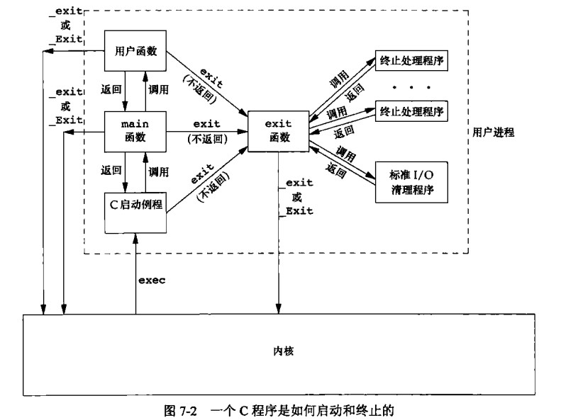

# 第 7 章 进程环境

## 进程环境

主要内容:main 函数、进程的终止、命令行参数的分析、环境变量、C 程序的存储空间布局、库、函数跳转

### main 函数

```cpp
int main(int argc,char**argv);//C/C++程序总是从main函数开始执行
//当内核执行C程序时，使用exec函数，再调用main之前先调用一个特殊的启动例程，可执行文件将此例程指定为程序的起始地址
//启动例程从内核获取命令行参数和环境变量值
```

### 种进程正常终止

```cpp
1、从main返回
int main(int argc,char**argv){
    return 0;
}
2、调用exit
void exit(int status);
status的实参与上0377为exit实际的返回值
status & 0 1111 1111
exit能带回的范围为-128~127

3、调用_exit 或_Exit , _exit与_Exit是系统调用exit是库函数
4、最后一个线程从其启动例程返回
5、从最后一个线程调用 pthread_exit
6、实际的 main 函数形式可能是这样调用的
exit(main(argc,argv))
```

exit 与\_exit 的区别  


### 3 种进程异常终止

```cpp
1、调用abort
2、接收到一个信号并终止
3、最后一个线程对取消请求做出响应
```

在 exit 函数调用时，总会执行标准 I/O 库的清理关闭操作、对于所有打开流调用 fclose 函数，会造成所有缓冲中的数据都会被冲洗

### 进程 exit 钩子函数绑定 atexit

一个进程可以登记多至 32 个函数，将有 exit 自动调用，称为这些函数为终止处理程序，终止处理程序每等级一次，就会被调用一次

```cpp
#include <stdlib.h>
int atexit(void (*function)(void));//成功时返回0否则返回非0
//exit钩子函数 demo
#include <iostream>
#include <stdlib.h>
using namespace std;

void hook1(void)
{
    cout << "hook1" << endl;
}

void hook2(void)
{
    cout << "hook2" << endl;
}

void hook3(void)
{
    cout << "hook3" << endl;
}

int main(int argc, char **argv)
{
    atexit(hook1);
    atexit(hook2);
    atexit(hook3);
    return 0;
}
// output: hook3 hook2 hook1
```

### 命令行参数的分析

相关函数

```cpp
#include <unistd.h>
int getopt(int argc, char * const argv[],
            const char *optstring);
extern char *optarg;
extern int optind, opterr, optopt;
#include <getopt.h>
int getopt_long(int argc, char * const argv[],
                  const char *optstring,
                  const struct option *longopts, int *longindex);
```

基本用法

```cpp
#include <iostream>
using namespace std;

int main(int argc, char **argv)
{
    for (int i = 0; i < argc; i++)
    {
        cout << argv[i] << endl;
    }
    return 0;
}
//./ main - a 12 - l 4343
/*
./main
-a
12
-l
4343
*/
//或者
#include <iostream>
using namespace std;

int main(int argc, char **argv)
{
    for (int i = 0; argv[i] != nullptr; i++) // POSIX与TSOC要求argv末尾必须有个null
    {
        cout << argv[i] << endl;
    }
    return 0;
}
```

### getopt 的使用

getopt 只支持短参数，如-a -b  
optstring 格式

```cpp
单个字符a         表示选项a没有参数            格式：-a即可，不加参数
单字符加冒号b:     表示选项b有且必须加参数      格式：-b 100或-b100,但-b=100错
单字符加2冒号c::   表示选项c可以有，也可以无     格式：-c200，其它格式错误
```

其他参数及其变量

```cpp
1、变量optarg，这是库中定义好的一个变量，保存了参数后面的值，比如有参数-b 100，当getopt函数返回b的时候，此时optarg存储的就是100
2、getopt函数的返回值：char类型的参数所对应的int值，比如-b 100，getopt函数返回的就是字符ｂ对应的int值
3、另外几个与optarg类似的几个变量
optind —— 再次调用 getopt() 时的下一个 argv指针的索引。
optopt —— 最后一个未知选项。
opterr ­—— 如果不希望getopt()打印出错信息，则只要将全域变量opterr设为0即可。
```

```cpp
#include <unistd.h>
int getopt(int argc, char * const argv[],
            const char *optstring);
extern char *optarg;
extern int optind, opterr, optopt;
```

```cpp
#include <iostream>
#include <unistd.h>
#include <string>
using namespace std;

int main(int argc, char **argv)
{
    while (1)
    {
        int c = getopt(argc, argv, "A:BCDE:F");
        if (c >= 'A' && c <= 'F')
        {
            cout << static_cast<char>(c) << endl;
            if (optarg != nullptr)
                cout << string(optarg) << endl;
        }
        else
        {
            break;
        }
    }
    exit(0);
}
/*
gaowanlu@DESKTOP-QDLGRDB$ ./main -A 232 -E 43 -BE 43 -C 43
A
232
E
43
B
E
43
C
*/
```

### getopt_long 的使用

getopt_long 为 getopt 的加强版，getopt_long 支持长选项，如“--ipaddr”

```cpp
#include <getopt.h>
int getopt_long(int argc, char * const argv[],
                  const char *optstring,
                  const struct option *longopts, int *longindex);
```

getopt_long 函数的第四个参数（longopts）与第三个参数（optstring）功能一致，optstring 用于支持短选项，longopts 则用于支持长选项。  
longopts 是一个结构体数组，每个结构体表示一个支持的选项

```c
struct option {
    const char  *name;       /* 参数名称 */
    int          has_arg;    /* 是否带有参数*/
    int          *flag;      /* flag=NULL时,返回value;不为空时,*flag=val,返回0 */
    int          val;        /* 指定函数匹配到*name表示的选项后，getopt_long函数的返回值，或flag非空时指定*flag的值 */
};
```

使用样例

```cpp
#include <iostream>
#include <getopt.h>
using namespace std;

static struct option long_options[] = {
    {"ip", required_argument, 0, 1},
    {"other", no_argument, 0, 2}, // 当匹配到--append时getopt_long返回2
    {"port", required_argument, 0, 3},
    {nullptr, 0, nullptr, 0}};

int main(int argc, char **argv)
{
    const char *optstr = "a:n:";
    int opt = 0;
    int opt_index = 0;
    while ((opt = getopt_long_only(argc, argv, optstr, long_options, &opt_index)) != -1)
    {
        switch (opt)
        {
        // ip
        case 1:
            cout << "ip=" << optarg << endl;
            break;
        // other
        case 2:
            cout << "other" << endl;
            break;
        // port
        case 3:
            cout << "port=" << optarg << endl;
            break;
        // a
        case 'a':
            cout << "a=" << optarg << endl;
            break;
        // n
        case 'n':
            cout << "n=" << optarg << endl;
            break;
        default:
            break;
        }
    }
    return 0;
}

/*
gaowanlu@DESKTOP-QDLGRDB:/$ ./main --ip 0.0.0.0 --port 88 --other 43 -a 32 -n 100
ip=0.0.0.0
port=88
other
a=32
n=100
*/
```

### 环境表

每个程序都接收到一张环境表,里面为系统环境变量

环境变量本质就是 KEY=VALUE,查看环境变量

```bash
gaowanlu@DESKTOP-QDLGRDB:/$ export
declare -x EMSDK="/SD/emsdk"
declare -x EMSDK_NODE="/SD/emsdk/node/14.18.2_64bit/bin/node"
declare -x EM_CONFIG="/SD/emsdk/.emscripten"
declare -x HOME="/home/gaowanlu"
declare -x HOSTTYPE="x86_64"
declare -x LANG="C.UTF-8"
declare -x LOGNAME="gaowanlu"
declare -x MOTD_SHOWN="update-motd"
declare -x NAME="DESKTOP-QDLGRDB"
declare -x OLDPWD
declare -x PATH="/SD/emsdk:/SD/emsdk/upstream/emscripten:/SD/emsdk/node/14.18.2_64bit/bin:/usr/local/sbin:/usr/local/bin:/usr/sbin:/usr/bin:/sbin:/bin:/usr/games:/usr/local/games:/m
nt/c/Program Files/Eclipse Adoptium/jdk-11.0.17.8-hotspot/bin:/mnt/c/Program Files/NVIDIA GPU Computing Toolkit/CUDA/v10.2/bin:/mnt/c/Program Files/NVIDIA GPU Computing Toolkit/CUDA
/v10.2/libnvvp:/mnt/c/Program Files/Common Files/Oracle/Java/javapath:/mnt/f/mvviwer/MV Viewer/Runtime/x64/:/mnt/f/mvviwer/MV Viewer/Runtime/Win32/:/mnt/c/Program Files (x86)/Common
 Files/Intel/Shared Libraries/redist/intel64_win/compiler:/mnt/c/Program Files (x86)/Common Files/Intel/Shared Libraries/redist/intel64/compiler:/mnt/c/Windows/system32:/mnt/c/Windo
ws:/mnt/c/Windows/System32/Wbem:/mnt/c/Windows/System32/WindowsPowerShell/v1.0/:/mnt/c/Windows/System32/OpenSSH/:/mnt/c/Program Files/Intel/WiFi/bin/:/mnt/c/Program Files/Common Fil
es/Intel/WirelessCommon/:/mnt/c/Program Files (x86)/NVIDIA Corporation/PhysX/Common:/mnt/c/Program Files/Microsoft SQL Server/130/Tools/Binn/:/mnt/d/Program Files (x86)/IncrediBuild
:/mnt/c/Program Files/python:/mnt/c/Program Files/python/Scripts:/mnt/d/BtSoft/panel/script:/mnt/d/jishu/opencv/opencv/build/x64/vc15:/mnt/d/jishu/Git/cmd:/mnt/c/WINDOWS/system32:/m
nt/c/WINDOWS:/mnt/c/WINDOWS/System32/Wbem:/mnt/c/WINDOWS/System32/WindowsPowerShell/v1.0/:/mnt/c/WINDOWS/System32/OpenSSH/:/mnt/c/Program Files/PuTTY/:/mnt/c/Program Files/CMake/bin
:/mnt/d/jishu/apache-maven-3.8.1/bin:/mnt/c/Program Files/NVIDIA Corporation/NVIDIA NvDLISR:/mnt/c/Program Files/NVIDIA GPU Computing Toolkit/CUDA/v10.2/lib:/mnt/c/Program Files/NVI
DIA GPU Computing Toolkit/CUDA/v10.2/include:/mnt/c/Program Files/NVIDIA Corporation/Nsight Compute 2019.5.0/:/mnt/c/ProgramData/chocolatey/bin:/mnt/c/Program Files/dotnet/:/mnt/d/e
rlang/erl-24.3.3/bin:/mnt/c/Program Files/Docker/Docker/resources/bin:/mnt/c/ProgramData/DockerDesktop/version-bin:/mnt/c/Users/gaowanlu/AppData/Local/Android/Sdk/platform-tools:/mn
t/c/Users/gaowanlu/AppData/Local/Android/Sdk/emulator:/mnt/c/Users/gaowanlu/AppData/Local/Android/Sdk/tools:/mnt/c/Users/gaowanlu/AppData/Local/Android/Sdk/tools/bin:/mnt/c/Program
Files/nodejs/:/mnt/c/Users/gaowanlu/.cargo/bin:/mnt/d/anaconda:/mnt/d/anaconda/Library/mingw-w64/bin:/mnt/d/anaconda/Library/usr/bin:/mnt/d/anaconda/Library/bin:/mnt/d/anaconda/Scri
pts:/mnt/c/Program Files/MySQL/MySQL Shell 8.0/bin/:/mnt/c/Users/gaowanlu/AppData/Local/Programs/Python/Python38-32/Scripts/:/mnt/c/Users/gaowanlu/AppData/Local/Programs/Python/Pyth
on38-32/:/mnt/d/jishu/Tools/WinNT:/mnt/d/jishu/MSDev98/Bin:/mnt/d/jishu/Tools:/mnt/d/Microsoft Visual Studio/VC98/bin:/mnt/c/Users/gaowanlu/AppData/Local/Microsoft/WindowsApps:/mnt/
d/jishu/vc/Microsoft VS Code/bin:/mnt/d/jishu/idea/IntelliJ IDEA Community Edition 2020.2.3/bin:/mnt/d/jishu/clion/CLion 2020.3.3/bin:/mnt/d/jishu/DataGrip 2021.1/bin:/mnt/d/jishu/I
ntelliJ IDEA Educational Edition 2021.1.1/bin:/mnt/d/jishu/IntelliJ IDEA 2021.1.2/bin:/mnt/c/MinGW/bin:/mnt/c/Users/gaowanlu/AppData/Roaming/npm:/snap/bin"
declare -x PWD="/mnt/c/Users/gaowanlu/Desktop/MyProject/note/testcode"
declare -x SHELL="/bin/bash"
declare -x SHLVL="1"
declare -x TERM="xterm-256color"
declare -x USER="gaowanlu"
declare -x WSLENV="WT_SESSION::WT_PROFILE_ID"
declare -x WSL_DISTRO_NAME="Ubuntu-20.04"
declare -x WT_PROFILE_ID="{61c54bbd-c2c6-5271-96e7-009a87ff44bf}"
declare -x WT_SESSION="4357a040-291d-4667-87ef-403a24d2ef32"
declare -x XDG_DATA_DIRS="/usr/local/share:/usr/share:/var/lib/snapd/desktop"
```

程序读取环境变量

```cpp
#include <iostream>
using namespace std;

//全局变量envviron包含了该指针数组的地址
extern char **environ;

int main(int argc, char **argv)
{
    char **iter = &environ[0];
    while (*iter)
    {
        cout << *iter << endl;
        ++iter;
    }
    return 0;
}
/*
PWD=/mnt/c/Users/gaowanlu/Desktop/MyProject/note/testcode
LOGNAME=gaowanlu
HOME=/home/gaowanlu
*/
```

### getenv 使用

指定 key 尝试获取 value

```cpp
#include <stdlib.h>
char *getenv(const char *name);
char *secure_getenv(const char *name);
```

demo

```cpp
#include <iostream>
#include <stdlib.h>
using namespace std;

int main(int argc, char **argv)
{
    const char *v1 = getenv("NONE");
    if (v1 == nullptr)
    {
        cout << "nullptr" << endl;
    } // nullptr
    const char *v2 = getenv("LANG");
    cout << v2 << endl; // C.UTF-8
    return 0;
}
```

### setenv 与 unsetenv 改变添加环境变量值

```cpp
#include <stdlib.h>
int setenv(const char *name, const char *value, int overwrite);
int unsetenv(const char *name);
```

demo

```cpp
#include <iostream>
#include <stdlib.h>
using namespace std;

int main(int argc, char **argv)
{
    getenv("NONE"); // NULL
    if (setenv("NONE", "ABCDEFG", true) == 0)
    {
        cout << "添加成功" << endl;
        cout << "NONE=" << getenv("NONE") << endl;
    }                 // 如果NONE存在则覆盖
    unsetenv("NONE"); // 删除NONE
    cout << (getenv("NONE") == nullptr) << endl;
    return 0;
}
/*
添加成功
NONE=ABCDEFG
1
*/
```

### putenv

改变或者添加环境变量

```cpp
#include <stdlib.h>
int putenv(char *string);
```

demo

```cpp
#include <iostream>
#include <stdlib.h>
#include <string.h>
using namespace std;
int main(int argc, char **argv)
{
    char s[125];
    const char *v = "WANLU=123";
    strncpy(s, v, strlen(v) + 1);
    putenv(s);
    cout << getenv("WANLU") << endl; // 123
    return 0;
}
```

### C 程序的存储空间布局


正文为指令、初始化数据段如 C 全局变量、未初始化数据段为只定义没有进行初始化的、栈、堆从两头向中间去，堆顶和栈顶之间未用的虚地址空间很大

```cpp
root@drecbb4udzdboiei-0626900:/mes/colnago/bin# size ./colnago
   text    data     bss     dec     hex filename
 679851   10000    1312  691163   a8bdb ./colnago
dec为三者总长度十进制表示，hex为十六进制表示
```

### 共享库

静态函数库：是在程序执行前就加入到目标程序中去了，.a 文件，从链接层解决，不用重读编译  
动态函数库同共享函数库：二者是一个东西，在 linux 上叫共享对象库， 文件后缀是.so ，windows 上叫动态加载函数库， 文件后缀是.dll），从执行时解决

后面应该还会详细学习

```cpp
gcc -static main.cpp //阻止gcc使用共享库
gcc main.cpp //gcc默认使用共享库
```

### 代码程序装载库

共享库：程序第一次执行或调用某个库函数时，用动态链接方法将程序与共享库函数相链接，减少了每个可执行文件的长度，增加了时间开销，因为要加载共享库，提供了编译程序时提供动态链接库，或者用代码在运行时加载.so 文件，调用内部函数。

```cpp
主要为dlerror、dlopen、dlclose、dlsym函数的使用
```

```cpp
#include <dlfcn.h>
char *dlerror(void);//获取错误描述信息
void *dlopen(const char *filename, int flags);
int dlclose(void *handle);
//加载动态链接库，或者关闭已打开的
void *dlsym(void *handle, const char *symbol);
//用于获取，动态链接库提供的函数，symbol为函数名等，返回函数指针
//函数指针需要自己强转为响应函数类型
extern "C"{
    void hello();
}
extern "C" void world();
//提供一个hello，dlsym(handle,"hello")进行获取
//为什么要用extern "C" 因为C++有函数名重载机制
//不能使用函数名作为symbol 而extern "C"的作用就是，让其函数作为ID
//简单地说就是这样，深入学习，还要继续探讨
```

### setjmp

```cpp

```

### getrlimit与setrlimit

```cpp

```