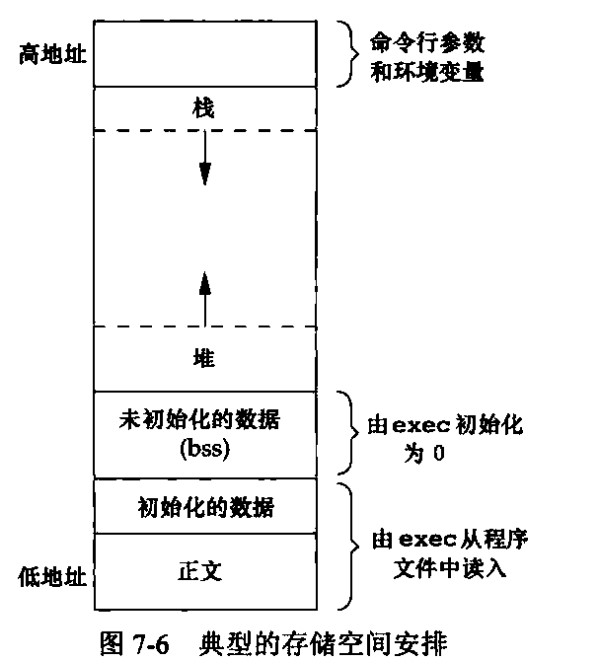

# 第 7 章 进程环境

## 进程环境

- main 函数

```cpp
int main(int argc,char**argv);//C/C++程序总是从main函数开始执行
//当内核执行C程序时，使用exec函数，再调用main之前先调用一个特殊的启动例程，可执行文件将此例程指定为程序的起始地址
//启动例程从内核获取命令行参数和环境变量值
```

- 进程终止

5 种正常终止

```cpp
从main返回
调用exit
调用_exit或_Exit
最后一个线程从其启动例程返回
从最后一个线程调用pthread_exit
实际的main函数形式可能是这样调用的
exit(main(argc,argv))

```

3 种异常终止

```cpp
调用abort
接收到一个信号
最后一个线程对取消请求做出响应
```

在 exit 函数调用时，总会执行标准 I/O 库的清理关闭操作、对于所有打开流调用 fclose 函数，会造成所有缓冲中的数据都会被冲洗

- 进程 exit 钩子函数绑定 atexit

一个进程可以登记多至 32 个函数，将有 exit 自动调用，称为这些函数为终止处理程序，终止处理程序每等级一次，就会被调用一次

```cpp
#include <stdlib.h>
int atexit(void (*function)(void));//成功时返回0否则返回非0
//demo
#include <iostream>
#include <stdlib.h>
using namespace std;

void hook(void)
{
    cout << "hello world" << endl;
}

int main(int argc, char **argv)
{
    atexit(hook);
    return 0; //程序结束时 自动输出hello world
}
```

- 命令行参数

```cpp
#include <iostream>
using namespace std;

int main(int argc, char **argv)
{
    for (int i = 0; i < argc; i++)
    {
        cout << argv[i] << endl;
    }
    return 0;
}
//./ main - a 12 - l 4343
/*
./main
-a
12
-l
4343
*/
//或者
#include <iostream>
using namespace std;

int main(int argc, char **argv)
{
    for (int i = 0; argv[i] != nullptr; i++) // POSIX与TSOC要求argv末尾必须有个null
    {
        cout << argv[i] << endl;
    }
    return 0;
}
```

- 环境表

每个程序都接收到一张环境表,里面为系统环境变量

```cpp
#include <iostream>
using namespace std;

//全局变量envviron包含了该指针数组的地址
extern char **environ;

int main(int argc, char **argv)
{
    char **iter = &environ[0];
    while (*iter)
    {
        cout << *iter << endl;
        ++iter;
    }
    return 0;
}
/*
PWD=/mnt/c/Users/gaowanlu/Desktop/MyProject/note/testcode
LOGNAME=gaowanlu
HOME=/home/gaowanlu
*/
```

- C 程序的存储空间布局



正文为指令、初始化数据段如 C 全局变量、未初始化数据段为只定义没有进行初始化的、栈、堆从两头向中间去，堆顶和栈顶之间未用的虚地址空间很大

```cpp
root@drecbb4udzdboiei-0626900:/mes/colnago/bin# size ./colnago
   text    data     bss     dec     hex filename
 679851   10000    1312  691163   a8bdb ./colnago
dec为三者总长度十进制表示，hex为十六进制表示
```

- 共享库

静态函数库：是在程序执行前就加入到目标程序中去了，.a 文件，从链接层解决，不用重读编译  
动态函数库同共享函数库：二者是一个东西，在 linux 上叫共享对象库， 文件后缀是.so ，windows 上叫动态加载函数库， 文件后缀是.dll），从执行时解决

后面应该还会详细学习

```cpp
gcc -static main.cpp //阻止gcc使用共享库
gcc main.cpp //gcc默认使用共享库
```

共享库：程序第一次执行或调用某个库函数时，用动态链接方法将程序与共享库函数相链接，减少了每个可执行文件的长度，增加了时间开销，因为要加载共享库，提供了编译程序时提供动态链接库，或者用代码在运行时加载.so 文件，调用内部函数。

```cpp
#include <dlfcn.h>
void *dlopen(const char *filename, int flags);
int dlclose(void *handle);
//加载动态链接库，或者关闭已打开的
void *dlsym(void *handle, const char *symbol);
//用于获取，动态链接库提供的函数，symbol为函数名等，返回函数指针
//函数指针需要自己强转为响应函数类型
extern "C"{
    void hello();
}
extern "C" void world();
//提供一个hello，dlsym(handle,"hello")进行获取
//为什么要用extern "C" 因为C++有函数名重载机制
//不能使用函数名作为symbol 而extern "C"的作用就是，让其函数作为ID
//简单地说就是这样，深入学习，还要继续探讨
```

- 待办：存储空间分配
