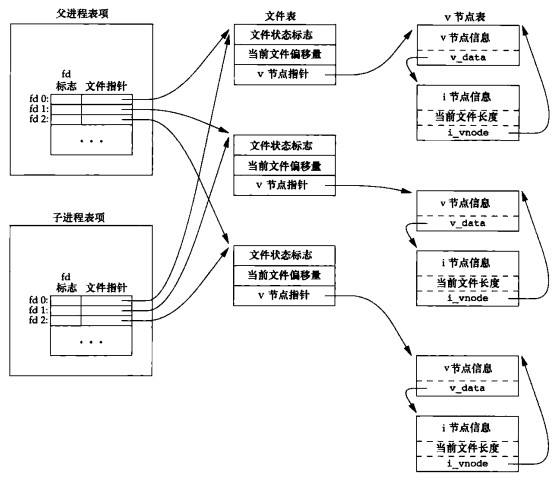
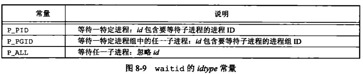
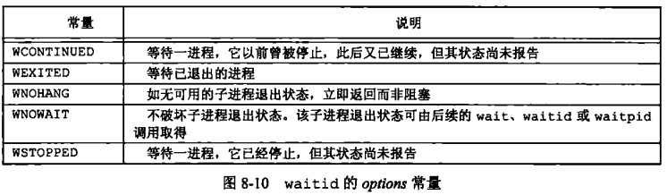
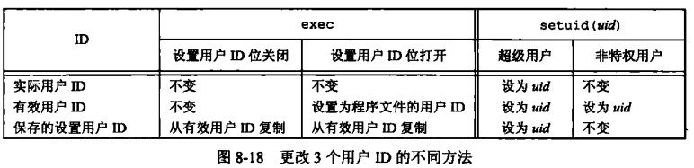

# 第 8 章 进程控制

## 进程控制

### 进程的基本知识

### 进程标识符 pid

pid_t 有符号 16 位、ps 命令、进程号是顺次向下使用、getpid()获取进程 id、getppid()获取父进程 id

```cpp
#include <sys/types.h>
#include <unistd.h>
pid_t getpid(void); //调用进程的进程id
pid_t getppid(void); //调用进程的父进程id
uid_t getuid(void); //调用进程的实际用户ID
uid_t geteuid(void); //调用进程的有效用户id
gid_t getgid(void); //调用进程的实际组id
gid_t getegid(void); //调用进程的有效组id
```

1、实际用户 ID 和实际用户组 ID：标识我是谁。也就是登录用户的 uid 和 gid，比如我的 Linux 以 simon 登录，在 Linux 运行的所有的命令的实际用户 ID 都是 simon 的 uid，实际用户组 ID 都是 simon 的 gid（可以用 id 命令查看）。

2、有效用户 ID 和有效用户组 ID：进程用来决定我们对资源的访问权限。一般情况下，有效用户 ID 等于实际用户 ID，有效用户组 ID 等于实际用户组 ID。当设置-用户-ID（SUID）位设置，则有效用户 ID 等于文件的所有者的 uid，而不是实际用户 ID；同样，如果设置了设置-用户组-ID（SGID）位，则有效用户组 ID 等于文件所有者的 gid，而不是实际用户组 ID。

```cpp
#include <iostream>
#include <sys/types.h>
#include <unistd.h>
using namespace std;
int main(int argc, char **argv)
{
    cout << "pid=" << getpid() << endl;
    cout << "ppid=" << getppid() << endl;
    cout << "uid=" << getuid() << endl;
    cout << "euid=" << geteuid() << endl;
    cout << "gid=" << getgid() << endl;
    cout << "egid=" << getegid() << endl;
    return 0;
}
// pid = 102 ppid = 10 uid = 1000 euid = 1000 gid = 1000 egid = 1000
```

### 进程的产生 fork(); vfork();

```cpp
#include <sys/types.h>
#include <unistd.h>
pid_t fork(void);
pid_t vfork(void);
```

duplicating 意味着拷贝克隆  
fork 后父子进程的区别：fork 返回值不同、pid 不同、ppid 不同、未决信号和文件锁不继承、资源利用量清零  
init 进程：是所有进程的祖先进程、PID=1

在 fork 时，缓冲区的内容也会被复制，所以刷新缓冲区操作显得很重要。

```cpp
#include <iostream>
#include <stdio.h>
#include <sys/types.h>
#include <unistd.h>
using namespace std;
int main(int argc, char **argv)
{
    int val = 999;
    cout << "start" << endl;
    fflush(nullptr);
    pid_t pid = fork();
    if (pid < 0)
    {
        perror("pid<0");
    }
    else if (pid == 0) // 子进程
    {
        cout << val << "子进程 pid = " << pid << " ppid = " << getppid() << endl;
    }
    else // 父进程
    {
        cout << val << "父进程 pid = " << getpid() << endl;
    }
    return 0;
}
/*
start
999父进程 pid = 168
999子进程 pid = 0 ppid = 168
*/
```

进程并发小实例

```cpp
#include <iostream>
#include <stdio.h>
#include <sys/types.h>
#include <unistd.h>
using namespace std;
#define RIGHT 3320
#define LEFT 3000

bool check(int val)
{
    bool res = true;
    for (int i = 2; i < val / 2; i++)
    {
        if (val % i == 0)
        {
            res = false;
            break;
        }
    }
    return res;
}

int main(int argc, char **argv)
{
    for (int i = LEFT; i <= RIGHT; i++)
    {
        int pid = fork();
        if (pid == 0)
        {
            if (check(i))
            {
                cout << i << endl;
            }
            return 0;
        }
    }
    return 0;
}
```

### 父子进程之间对打开文件的共享

每个进程有自己的表项，fd 与文件指针的映射表，子进程表项来源于父进程的拷贝。文件指针所指向的文件表是由操作系统管理的，并不会随着 fork 而复制新的文件表。



### init 进程与 vfork

进程状态

```bash
$man ps
PROCESS STATE CODES
Here are the different values that the s, stat and state output specifiers (header "STAT" or "S") will display to describe the state of a process:

D    uninterruptible sleep (usually IO)
I    Idle kernel thread
R    running or runnable (on run queue)
S    interruptible sleep (waiting for an event to complete)
T    stopped by job control signal
t    stopped by debugger during the tracing
W    paging (not valid since the 2.6.xx kernel)
X    dead (should never be seen)
Z    defunct ("zombie 僵尸") process, terminated but not reaped by its parent
```

当子进程结束时，父进程没有结束则子进程会称为僵尸进程，父进程结束时子进程将会称为孤儿进程。 孤儿进程将会由 init 进程接管，释放其资源。

关于 vfork

```cpp
#include <sys/types.h>
#include <unistd.h>
pid_t vfork(void);
```

vfork()会产生一个新的子进程.但是 vfork 创建的子进程与父进程共享数据段,而且由 vfork()创建的
子进程将先于父进程运行.fork()的使用详见百度词条 fork().  
vfork()用法与 fork()相似.但是也有区别,具体区别归结为以下 3 点:

1. fork():子进程拷贝父进程的数据段，代码段. vfork():子进程与父进程共享数据段.
2. fork():父子进程的执行次序不确定.vfork():保证子进程先运行，在调用 exec 或\_exit 之前与父进程数据是共享的,在它调用 exec 或\_exit 之后父进程才可能被调度运行。
3. vfork()保证子进程先运行，在她调用 exec 或\_exit 之后父进程才可能被调度运行。如果在调用这两个函数之前子进程依赖于父进程的进一步动作，则会导致死锁。
4. 当需要改变共享数据段中变量的值，则拷贝父进程。

### 进程的消亡与资源释放 wait waitpid waitid

```cpp
#include <sys/types.h>
#include <sys/wait.h>
pid_t wait(int *wstatus);//等待进程状态发生变化
pid_t waitpid(pid_t pid, int *wstatus, int options);
// pid:
// > 0 等待进程ID与pid相等的子进程
// 0   等待组ID等于调用进程组ID的任一子进程
// -1  等待任一子进程
// <-1 等待组ID等于pid绝对值的任一子进程
// options:
// WNOHANG 没有子进程结束则立即返回,waitpid变为非阻塞
// WCONTINUED pid指定子进程在停止后已经继续，但状态尚未报告则返回其状态
// WUNTRACED pid指定子进程已处于停止状态，但状态尚未报告则返回其状态
int waitid(idtype_t idtype, id_t id, siginfo_t *infop, int options);
//waitid与waitpid类似
```

waitid 参数




wait 样例

```cpp
//demo
#include <iostream>
#include <sys/types.h>
#include <sys/wait.h>
#include <unistd.h>

using namespace std;

int main(int argc, char **argv)
{
    pid_t id = fork();
    if (id < 0)
    {
        return 0;
    }
    else if (id == 0) // child
    {
        cout << "child" << endl;
        exit(0);
    }
    int status;
    pid_t res_id = wait(&status);
    cout<<"child process "<<res_id<<" status changed"<<endl;
    cout << "parent" << endl;
    cout << res_id << endl;
    if (WIFEXITED(status))
    {
        cout << "正常结束退出码=" << WEXITSTATUS(status) << endl;
        cout << "子进程正常终止" << endl;
    }
    else if (WIFSIGNALED(status))
    {
        cout << "子进程由信号终止" << endl;
        cout << "导致子进程结束的信号码=" << WTERMSIG(status) << endl;
        if (WCOREDUMP(status))
        {
            cout << "产生了core dump文件" << endl;
        }
    }
    if (WIFSTOPPED(status))
    {
        cout << "子进程已暂停" << endl;
        cout << "STOPSIG=" << WSTOPSIG(status) << endl;
    }

    if (WIFCONTINUED(status))
    {
        cout << "the child process was resumed by delivery of SIGCONT." << endl;
    }

    return 0;
}
/*
child
child process 244 status changed
parent
244
正常结束退出码=0
子进程正常终止
*/
```

waitpid 样例

```cpp
#include <iostream>
#include <sys/types.h>
#include <sys/wait.h>
#include <unistd.h>

using namespace std;

int main(int argc, char **argv)
{
    pid_t id = fork();
    if (id < 0)
    {
        return 0;
    }
    else if (id == 0) // child
    {
        cout << "child" << endl;
        exit(0);
    }
    int status;
    pid_t res = waitpid(id, &status, WCONTINUED | WUNTRACED);
    cout << "parent" << endl;
    return 0;
}
/*
child
parent
 */
```

### exec 函数族

执行一个文件 execute a file

```cpp
#include <unistd.h>
extern char **environ;
int execl(const char *pathname, const char *arg, ...
                       /* (char  *) NULL */);
int execlp(const char *file, const char *arg, ...
                       /* (char  *) NULL */);//filename 会直接在环境变量中找path
int execle(const char *pathname, const char *arg, ...
                       /*, (char *) NULL, char *const envp[] */);
int execv(const char *pathname, char *const argv[]);
int execvp(const char *file, char *const argv[]);
int execvpe(const char *file, char *const argv[],
                       char *const envp[]);
// 传参从 argv0 开始的
```

用新的进程镜像替换旧的进程镜像

```cpp
#include <iostream>
#include <unistd.h>
using namespace std;

int main(int argc, char **argv)
{
    int res;
    fflush(nullptr);
    res = execl("/bin/bash", "bash",nullptr); // 新进程替换此进程,pid不变
    if (res == -1)
    {
        perror("execl error");
    }
    return 0;
}
```

fork、wait 与 exec

```cpp
#include <iostream>
#include <sys/types.h>
#include <sys/wait.h>
#include <unistd.h>
using namespace std;

int main(int argc, char **argv)
{
    pid_t pid = fork();
    if (pid < 0)
    {
        perror("pid <0");
        exit(0);
    }
    if (pid == 0)
    {
        execl("/mnt/c/Users/gaowanlu/Desktop/MyProject/note/testcode/other", "other",nullptr);
        exit(0);
    }
    if (pid > 0)
    {
        int status;
        pid_t res = wait(&status);
        cout << res << " is overed" << endl;
    }
    return 0;
}

/*
other file output "hello world"
gaowanlu@DESKTOP-QDLGRDB:/mnt/c/Users/gaowanlu/Desktop/MyProject/note/testcode$ ./main
hello world
289 is overed
*/
```

### 用户权限与组权限

用户 ID 与组 ID 有三种，实际 Real ID、有效 Effective Id、保存的设置 Save ID  
鉴权的时候看的是有效 ID、realId 是不变的，但有效 ID 是可变的，保存的设置 ID 不一定必须要有



```text
从init到shell的ID变化
r e s
init r:0 e:0 s:0
    \
     \ fork exec
      getey 输入user name r:0 e:0 s:
         \
          \exec
           login进程 输入password r:0 e:0 s:0
                check password,/etc/passwd 验证口令,口令不成功则跳到上级
                 \
                  \ fork exec
                   shell r: e: s: 用户自己的
```

相关函数获取用户与组 ID

```cpp
#include <unistd.h>
#include <sys/types.h>
uid_t getuid(void);//r u
uid_t geteuid(void);//e u
gid_t getgid(void);//r g
gid_t getegid(void);//e g
```

设置用户与组 ID

```cpp
#include <sys/types.h>
#include <unistd.h>
int setuid(uid_t uid);// sets the effective user ID of the calling process
int seteuid(uid_t euid);//set effective user ID
int setgid(gid_t gid);//sets  the effective group ID of the calling process.
int setegid(gid_t egid);// set effective group ID
int setreuid(uid_t ruid, uid_t euid);
int setregid(gid_t rgid, gid_t egid);
```

```cpp
#include <iostream>
#include <unistd.h>
#include <sys/types.h>
using namespace std;

int main(int argc, char **argv)
{

    cout << "uid=" << getuid() << endl;
    cout << "euid=" << geteuid() << endl;
    cout << "gid=" << getgid() << endl;
    cout << "egid=" << getegid() << endl;
    return 0;
}
/*
uid=1000
euid=1000
gid=1000
egid=1000

/etc/passwd
gaowanlu:x:1000:1000:,,,:/home/gaowanlu:/bin/bash
*/
```

### 解释器文件

脚本文件标记

```javascript
#!/bin/node

//javascript
console.log("hello world");
```

```bash
gaowanlu@DESKTOP-QDLGRDB:/$ ls -l main.cpp
-rwxrwxrwx 1 gaowanlu gaowanlu 44 Feb 20 17:09 main.cpp
gaowanlu@DESKTOP-QDLGRDB:/$ ./main.cpp
hello world
```

```bash
#!/bin/bash
```

### system 函数

执行命令行

```cpp
#include <stdlib.h>
int system(const char *command);
//execl("/bin/sh", "sh", "-c", command, (char *) NULL);
//过程起始就是 fork exec wait 组合使用效果
```

```cpp
#include <iostream>
#include <stdlib.h>
using namespace std;

int main(int argc, char **argv)
{
    system("node");
    return 0;
}

 10 tty1     S      0:00  \_ -bash
140 tty1     S      0:00      \_ ./main
141 tty1     S      0:00          \_ sh -c node
142 tty1     Sl     0:00              \_ node
```

### 进程会计

相关重要函数，进程结束时将进程相关 acct 信息追加到 filename 指定文件中,但不同的系统会有不同，有的不支持 acct(CONFORMING TO SVr4, 4.3BSD (but not POSIX).)

```cpp
#include <unistd.h>
//switch process accounting on or off
int acct(const char *filename);

struct acct {
    char ac_flag;           /* Accounting flags */
    u_int16_t ac_uid;       /* Accounting user ID */
    u_int16_t ac_gid;       /* Accounting group ID */
    u_int16_t ac_tty;       /* Controlling terminal */
    u_int32_t ac_btime;     /* Process creation time
                                          (seconds since the Epoch) */
    comp_t    ac_utime;     /* User CPU time */
    comp_t    ac_stime;     /* System CPU time */
    comp_t    ac_etime;     /* Elapsed time */
    comp_t    ac_mem;       /* Average memory usage (kB) */
    comp_t    ac_io;        /* Characters transferred (unused) */
    comp_t    ac_rw;        /* Blocks read or written (unused) */
    comp_t    ac_minflt;    /* Minor page faults */
    comp_t    ac_majflt;    /* Major page faults */
    comp_t    ac_swaps;     /* Number of swaps (unused) */
    u_int32_t ac_exitcode;  /* Process termination status
                                          (see wait(2)) */
    char      ac_comm[ACCT_COMM+1];
                                       /* Command name (basename of last
                                          executed command; null-terminated) */
    char      ac_pad[X];    /* padding bytes */
};

enum {          /* Bits that may be set in ac_flag field */
   AFORK = 0x01,           /* Has executed fork, but no exec */
   ASU   = 0x02,           /* Used superuser privileges */
   ACORE = 0x08,           /* Dumped core */
   AXSIG = 0x10            /* Killed by a signal */
};
```

```cpp
#include <iostream>
#include <string.h>
#include <unistd.h>
#include <sys/acct.h>
using namespace std;

int main(int argc, char **argv)
{
    if(-1 == acct("./temp.txt")){
        cout << strerror(errno) << endl;
    }
    return 0;
}
```

### 用户标识

怎样获取登录用户名,可以使用 getpwuid(getuid())

```cpp
#include <iostream>
#include <unistd.h>
#include <sys/types.h>
#include <pwd.h>

using namespace std;

int main(int argc, char **argv)
{
    const struct passwd *pwd = getpwuid(getuid());
    cout << pwd->pw_name << endl; // gaowanlu
    return 0;
}
```

但有时同一个 uid 可能对应多个 username

```cpp
#include <unistd.h>
char *getlogin(void);
```

```cpp
#include <iostream>
#include <string.h>
#include <unistd.h>

using namespace std;

int main(int argc, char **argv)
{
    const char *res = getlogin();
    if (res == nullptr)
    {
        cout << "res==null " << strerror(errno) << endl;
    }
    else
    {
        cout << res << endl;
    }
    return 0;
}
// ls: cannot access '/etc/adm': No such file or directory
// ubuntu wsl2
```

### 进程调度

学过操作系统理论，可以知道进程调度是有优先级的

相关重要函数

```cpp
//change process priority
#include <unistd.h>
int nice(int inc);//使用nice只对本进程友好值修改不影响其他进程
//成功返回inc，否则返回-1
//get/set program scheduling priority
#include <sys/time.h>
#include <sys/resource.h>
int getpriority(int which, id_t who);
int setpriority(int which, id_t who, int prio);
/*
which: PRIO_PROCESS表进程、PRIO_PGRP表进程组、PRIO_USER表用户ID
which与who关系可以查阅 apue p221
*/
```

进程的默认优先级一般为友好值 NZERO、可以用 sysconf(\_SC_NZERO)查看

```cpp
#include <iostream>
#include <unistd.h>
using namespace std;

int main(int argc, char **argv)
{
    cout << sysconf(_SC_NZERO) << endl; // 20
    return 0;
}
```

### 进程时间

相关函数,获取进程时间,时间有三种 墙上时钟时间、用户 CPU 时间、系统 CPU 时间

```cpp
#include <sys/times.h>
clock_t times(struct tms *buf);
struct tms
{
    clock_t tms_utime;  /* user time */
    clock_t tms_stime;  /* system time */
    clock_t tms_cutime; /* user time of children */
    clock_t tms_cstime; /* system time of children */
};
```

样例

```cpp
#include <iostream>
#include <sys/times.h>
#include <unistd.h>
using namespace std;

int main(int argc, char **argv)
{
    clock_t now1 = times(nullptr);
    cout << "每秒钟" << sysconf(_SC_CLK_TCK) << "滴答" << endl;
    sleep(2);
    for (int i = 0; i < 100; i++)
    {
        for (int j = 0; j < 100; j++)
        {
            cout << i << j << endl;
        }
    }
    struct tms t;
    clock_t now2 = times(&t);
    long v = sysconf(_SC_CLK_TCK);
    cout << "sum=" << ((now2 - now1) / v) << "s" << endl;
    cout << "user time=" << t.tms_utime << endl;
    cout << "system time=" << t.tms_stime << endl;
    cout << "user time of children=" << t.tms_cutime << endl;
    cout << "system time of children=" << t.tms_cstime << endl;
    return 0;
}

/*
sum=2s    //这里面包含sleep的2s
user time=0
system time=1
user time of children=0
system time of children=0
*/
```

### 守护进程

```cpp

```

### 系统日志

```cpp

```
