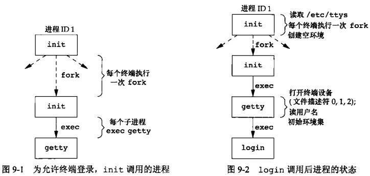
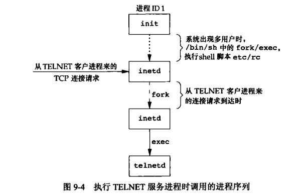
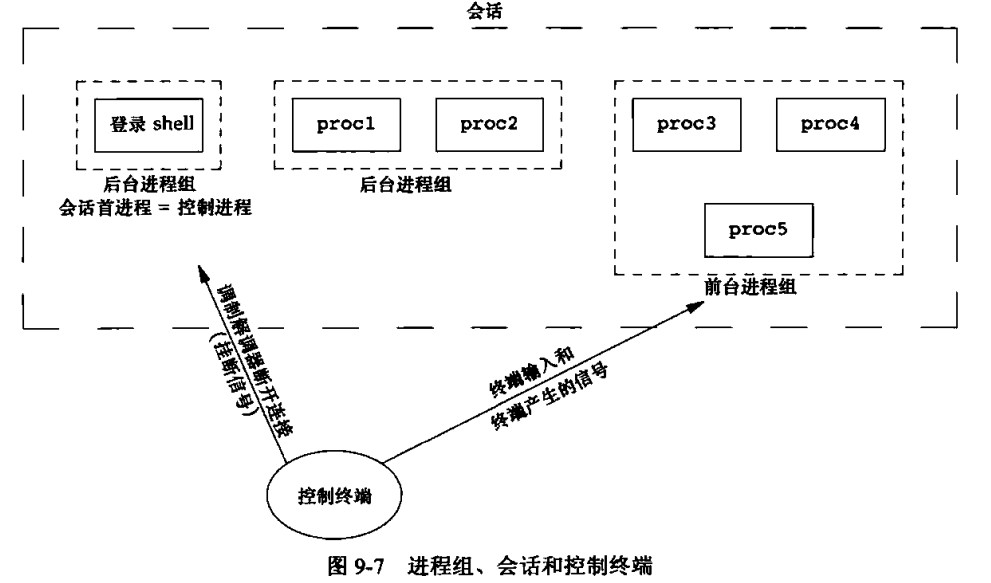
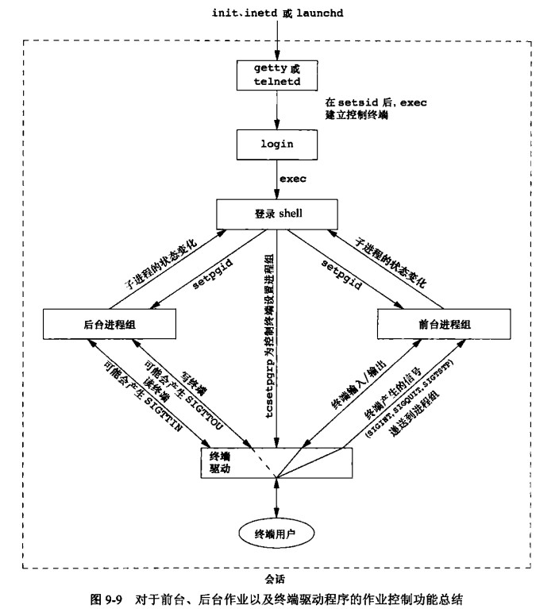
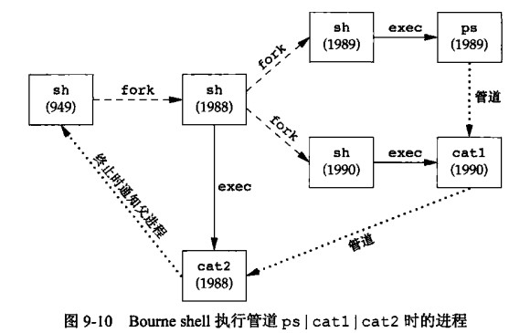

# 第 9 章 进程关系

## 进程关系

### 终端登录



### 网络登录



### 进程组

进程组是一个或多个进程的集合，同一进程组中的各进程接收来自同一终端的各种信号。每个进程组有唯一的进程组 ID，可存储在 pid_t 类型中

```cpp
#include <sys/types.h>
#include <unistd.h>
int setpgid(pid_t pid, pid_t pgid);
pid_t getpgid(pid_t pid);
pid_t getpgrp(void);                 /* POSIX.1 version */
getpgid(0)等价于getpgrp();
```

每个进程组有一个组长进程，组长进程可以创建进程组、创建改组中的进程，然后终止。  
只要进程组中有进程存在、进程组则应存在。  
进程组中的最后一个进程可以终止、也可以转移到另一个进程组

```cpp
//set/get process group
#include <sys/types.h>
#include <unistd.h>

int setpgid(pid_t pid, pid_t pgid);
pid_t getpgid(pid_t pid);
pid_t getpgrp(void);                 /* POSIX.1 version */
```

### 会话

第 13 章 守护进程 由此部分内容

### 控制终端



### 函数 tcgetpgrp、tcsetpgrp、tcgetsid

怎样通知内核哪一个进程组是前台进程组，进而终端驱动设备知道将终端输入和终端产生的信号发送到何处

获取与设置前台进程组

```cpp
#include <unistd.h>
pid_t tcgetpgrp(int fd);//返回的进程组ID的进程组与在fd上打开的终端相关联
//return: 成功，返回前台进程组ID、出错返回-1
int tcsetpgrp(int fd, pid_t pgrp);
//return：成功返回0，错误返回-1
```

获取会话首进程的进程组 ID（控制进程）通常为登录 shell

### 作业控制

用户可以在前台或后台启动一个作业，一个作业是几个进程的集合，通常是一个进程管道，如

```cpp
ps | grep "ps" &
make all &
```

后台启动了两个作业

有 3 个特殊字符可以使终端驱动程序产生信号，并将它们发送至前台进程组

```cpp
中断字符 (Delete或Ctrl+C) 产生 SIGINT
退出字符 (Ctrl+\) 产生SIGQUIT
挂起字符 (Ctrl+Z) 产生 SIGTSTP
```

挂起键(Ctrl+Z) 与终端驱动程序交互，终端驱动程序将信号 SIGTSTP 发送至前台进程组中的所有进程，后台进程组作业不受影响



### shell 执行程序



### 孤儿进程组

一个其父进程已经终止的进程称为孤儿进程，这种进程由 init 进程收养，整个进程组也可能称为"孤儿"

孤儿进程组定义：`该进程组的每个成员的父进程要么是该组的成员，要么在其它会话中。`

如果进程组存在停止状态的进程，当该进程组变成孤儿进程组时，该进程组中所有进程都会收到 SIGHUP 信号，紧接着又收到 SIGCONT 信号

子进程默认在父进程所在进程组。父进程终止，子进程进入后台进程组。

样例，当父进程结束，子进程进入后台进程组，进程组称为孤儿进程组。  
后台进程组试图读控制终端会产生错误

```cpp
#include <unistd.h>
#include <stdio.h>
#include <signal.h>
#include <stdlib.h>
#include <errno.h>

void handler(int sig)
{
    printf("hello sig=%d, pid = %d\n", sig, getpid());
    fflush(stdout);
}

void print(char *name)
{
    printf("%s: pid = %d, ppid = %d, pgrp = %d, tpgrp = %d\n",
           name, getpid(), getppid(), getpgid(getpid()), tcgetpgrp(0));
    fflush(stdout);
}

int main()
{
    char c;
    pid_t pid;
    printf("parent\n");
    fflush(stdout);

    pid = fork();
    if (pid < 0)
    {
        perror("fork\n");
    }
    else if (pid > 0)
    {
        sleep(5); // 父进程
    }
    else
    {
        printf("child\n");
        fflush(stdout);
        signal(SIGHUP, handler);
        signal(SIGCONT, handler);
        kill(getpid(), SIGTSTP); // 让子进程暂停
        printf("child\n");       // 如果执行了此行，说明已经收到了 SIGHUP 信号
        fflush(stdout);
        if (read(STDIN_FILENO, &c, 1) != 1)
        {
            printf("read error, error number: %d\n", errno);
            fflush(nullptr);
        }
        exit(0);
    }
    return 0;
}
```

```shell
root@drecbb4udzdboiei-0626900:/tmp# make main
g++     main.cpp   -o main
root@drecbb4udzdboiei-0626900:/tmp# ./main
parent
child
hello sig=18, pid = 4075235
hello sig=1, pid = 4075235
child
root@drecbb4udzdboiei-0626900:/tmp#
```

这个章节有点深奥、可以在具体工作实践，运用后体会后，在进行详细的阅读，才能学到更多东西。现在就先学习一些概念吧。
