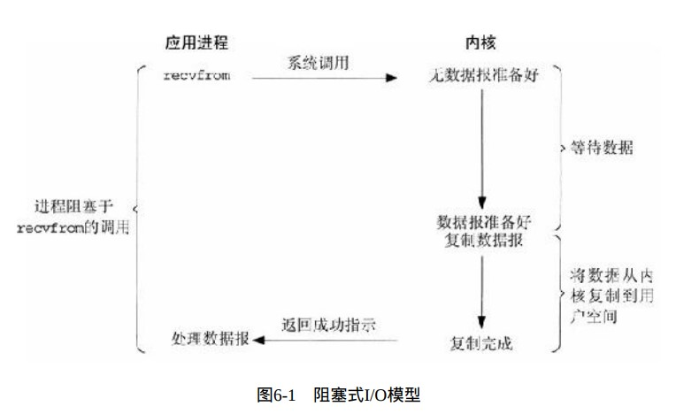
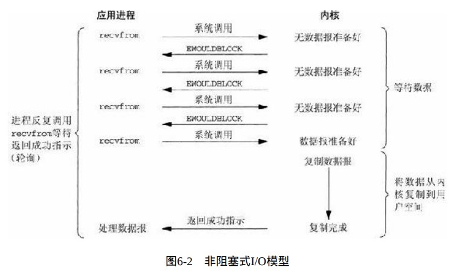
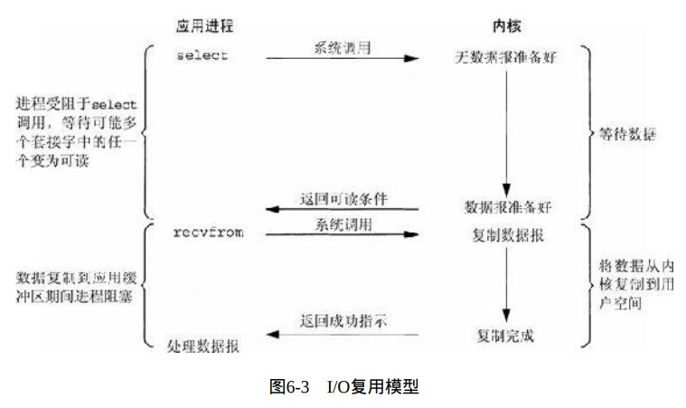
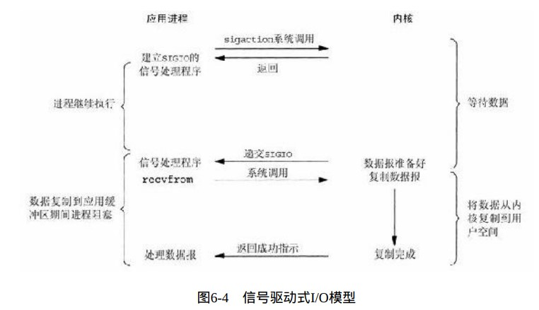
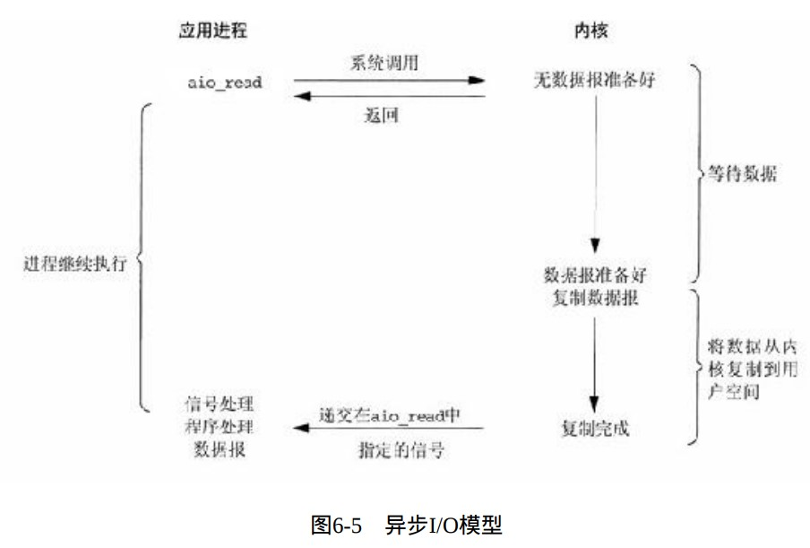
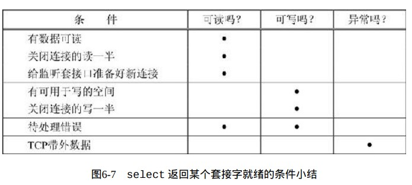
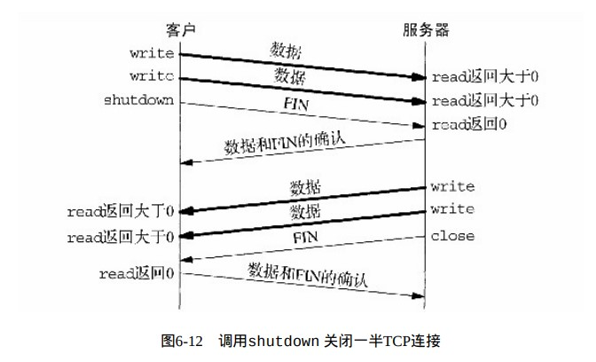
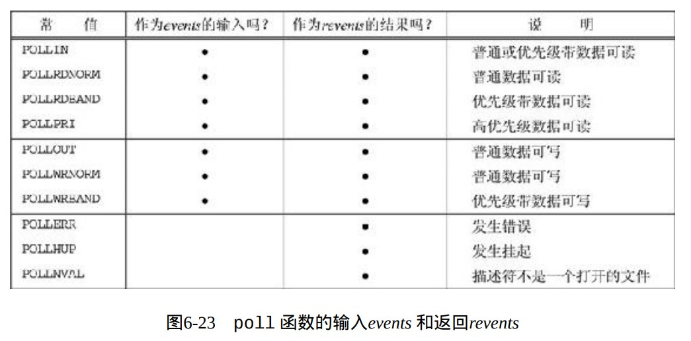

# 第 6 章 I/O 复用：select 和 poll 函数

## I/O 复用：select 和 poll 函数

### 未完待续

- 首先不是还有听说过的 epoll、io_uring 吗，别慌后面再说
- I/O 复用典型的使用场景：当客户处理多个描述符时、一个客户同时处理多个套接字、一个 TCP 服务器既要处理监听套接字又要处理已连接套接字、一个服务器要处理 TCP 又要处理 UDP、一个服务器要处理多个服务或者多个协议，I/O 复用并非只限于网络编程
- I/O 模型：阻塞式 I/O，非阻塞式 I/O、I/O 复用(select、poll、epoll)，信号驱动式 I/O、异步 I/O9(aio 系列函数)











- select 函数

```cpp
       /* According to POSIX.1-2001, POSIX.1-2008 */
       #include <sys/select.h>
       /* According to earlier standards */
       #include <sys/time.h>
       #include <sys/types.h>
       #include <unistd.h>
       int select(int nfds, fd_set *readfds, fd_set *writefds,
                  fd_set *exceptfds, struct timeval *timeout);
        //timeout提供永远等待、等待一定时间超时则返回、根本不等待三种
       //nfds为监听其内部数组的前nfds个描述符，最大使用下标+1=nfds
       void FD_CLR(int fd, fd_set *set);//清空set的下标fd位置
       int  FD_ISSET(int fd, fd_set *set);//检测set下标fd是否就绪
       void FD_SET(int fd, fd_set *set);//表明fd需要被监听
       void FD_ZERO(fd_set *set);//将set全部清空初始化
       #include <sys/select.h>
       int pselect(int nfds, fd_set *readfds, fd_set *writefds,
                   fd_set *exceptfds, const struct timespec *timeout,
                   const sigset_t *sigmask);
        //pselect提供信号屏蔽,可以在pselect前进行信号屏蔽，在阻塞pselect时使用sigmask指定的信号屏蔽，pselect返回后恢复原来的信号屏蔽
        struct timeval {
           long    tv_sec;         /* seconds */
           long    tv_usec;        /* microseconds */
       };
       struct timespec {
           long    tv_sec;         /* seconds */
           long    tv_nsec;        /* nanoseconds */
       };
       FD_SETSIZE 定义了fd_set的最大监听长度
```

- 描述符就绪条件



- select 使用样例

```cpp
#include "unp.h"

void
str_cli(FILE *fp, int sockfd)
{
	int   maxfdp1;
	fd_set		rset;
	char  sendline[MAXLINE], recvline[MAXLINE];

	FD_ZERO(&rset);//全置零初始化
	for ( ; ; ) {
		FD_SET(fileno(fp), &rset);//文件描述符加入rset
		FD_SET(sockfd, &rset);//监听套接字加入rset
		maxfdp1 = max(fileno(fp), sockfd) + 1;//需要监听的最大长度
		Select(maxfdp1, &rset, NULL, NULL, NULL);//select对三个时间都不感兴趣
		if (FD_ISSET(sockfd, &rset)) {	/* socket is readable */
			if (Readline(sockfd, recvline, MAXLINE) == 0)//读取数据
				err_quit("str_cli: server terminated prematurely");
			Fputs(recvline, stdout);//输出
		}
		if (FD_ISSET(fileno(fp), &rset)) {  /* input is readable */
			if (Fgets(sendline, MAXLINE, fp) == NULL)//从文件读取
				return;		/* all done */
			Writen(sockfd, sendline, strlen(sendline));//发送到套接字
		}
	}
}
```

- shutdown函数，close把套接字描述符引用计数减去1，仅在计数变为0时才关闭套接字，而shutdown不管计数器，shutdown可以进行单向关闭操作，因为socket时双工双向通信



```cpp
       #include <sys/socket.h>
       int shutdown(int sockfd, int how);
       //SHUT_RD 不再接收数据、缓冲区现有数据将会清空
       //SHUT_WR 关闭写，写缓冲区心有数据将会被发送完，然后进行发送终止序列
       //SHUT_RDWR 先SHUT_RD 然后 SHUT_WR
```

- shutdown demo

```cpp
#include "unp.h"

void str_cli(FILE *fp, int sockfd)
{
	int maxfdp1, stdineof;
	fd_set rset;
	char buf[MAXLINE];
	int n;

	stdineof = 0;//当stdineof为1时fd读取到eof
	FD_ZERO(&rset);
	for (;;)
	{
		if (stdineof == 0)
			FD_SET(fileno(fp), &rset);
		FD_SET(sockfd, &rset);
		maxfdp1 = max(fileno(fp), sockfd) + 1;
		Select(maxfdp1, &rset, NULL, NULL, NULL);

		if (FD_ISSET(sockfd, &rset))
		{ /* socket is readable */
			if ((n = Read(sockfd, buf, MAXLINE)) == 0)
			{
				if (stdineof == 1)
					return; /* normal termination */
				else
					err_quit("str_cli: server terminated prematurely");
			}

			Write(fileno(stdout), buf, n);
		}

		if (FD_ISSET(fileno(fp), &rset))
		{ /* input is readable */
			if ((n = Read(fileno(fp), buf, MAXLINE)) == 0)
			{
				stdineof = 1;
                //发送FIN
				Shutdown(sockfd, SHUT_WR); /* send FIN */
				FD_CLR(fileno(fp), &rset);//select不再监听fp
				continue;
			}

			Writen(sockfd, buf, n);
		}
	}
}

```

- 规范的使用select，存储client已连接套接字数组

```cpp
/* include fig01 */
#include "unp.h"

int main(int argc, char **argv)
{
	int i, maxi, maxfd, listenfd, connfd, sockfd;
	int nready, client[FD_SETSIZE];
	ssize_t n;
	fd_set rset, allset;
	char buf[MAXLINE];
	socklen_t clilen;
	struct sockaddr_in cliaddr, servaddr;

	listenfd = Socket(AF_INET, SOCK_STREAM, 0);

	bzero(&servaddr, sizeof(servaddr));
	servaddr.sin_family = AF_INET;
	servaddr.sin_addr.s_addr = htonl(INADDR_ANY);
	servaddr.sin_port = htons(SERV_PORT);

	Bind(listenfd, (SA *)&servaddr, sizeof(servaddr));

	Listen(listenfd, LISTENQ);

	maxfd = listenfd; /* initialize */
	maxi = -1;		  /* index into client[] array */
	for (i = 0; i < FD_SETSIZE; i++)
		client[i] = -1; /* -1 indicates available entry */
	FD_ZERO(&allset);
	FD_SET(listenfd, &allset);//将监听套接字放入set
	/* end fig01 */

	/* include fig02 */
	for (;;)
	{
		rset = allset; /* structure assignment */
		nready = Select(maxfd + 1, &rset, NULL, NULL, NULL);//有nready个已经就绪

		if (FD_ISSET(listenfd, &rset))//检查监听套接字是否就绪
		{ /* new client connection */
			clilen = sizeof(cliaddr);
			connfd = Accept(listenfd, (SA *)&cliaddr, &clilen);
#ifdef NOTDEF
			printf("new client: %s, port %d\n",
				   Inet_ntop(AF_INET, &cliaddr.sin_addr, 4, NULL),
				   ntohs(cliaddr.sin_port));
#endif
			for (i = 0; i < FD_SETSIZE; i++)//将已连接套接字放入client下标最小且值为-1的位置
				if (client[i] < 0)
				{
					client[i] = connfd; /* save descriptor */
					break;
				}
			if (i == FD_SETSIZE)//client数组空间已经用完了
				err_quit("too many clients");
            //将新的已连接套接字加入set
			FD_SET(connfd, &allset); /* add new descriptor to set */
			if (connfd > maxfd)
				maxfd = connfd; /* for select */
			if (i > maxi)
				maxi = i; /* max index in client[] array */

			if (--nready <= 0)
				continue; /* no more readable descriptors */
		}

		for (i = 0; i <= maxi; i++)
		{ /* check all clients for data */
			if ((sockfd = client[i]) < 0)//-1的描述符不处理
				continue;
			if (FD_ISSET(sockfd, &rset))//检查是否就绪
			{
				if ((n = Read(sockfd, buf, MAXLINE)) == 0)//没有数据可读了
				{
					/*4connection closed by client */
					Close(sockfd);
					FD_CLR(sockfd, &allset);//从set中丢弃
					client[i] = -1;//从client数组删除
				}
				else
					Writen(sockfd, buf, n);//将收到的信息发回去

				if (--nready <= 0)
					break; /* no more readable descriptors */
			}
		}
	}
}
/* end fig02 */
```

- 拒绝服务型攻击

当一个服务器在处理多个客户时，绝对不能阻塞于只与单个客户相关的某个函数调用，否则可能导致服务器挂起，拒绝为其他客户的提供服务，这就是DOS。例如上一个代码中如果客户端仅仅发送了一个字符然后很坏不发了，那么服务端将会阻塞到read，导致服务端挂起。解决的办法就是使用非阻塞式IO、或者为每个client使用单独的线程服务  

- pselect提供更精准的超时时间配置，以及解决了select中的信号缺陷,select阻塞时可能会被错误中断，然后我们获取errno进行处理，但是在select与我们判断errno之间如果再次发生了信号中断，则上次的信号就会丢失，errno也丢失了，这就出现了问题，pselect提供信号屏蔽，请看上面函数介绍部分

- poll函数，poll与select类似，但在处理流设备时，能够提供额外的信息

```cpp
#include <poll.h>

//fds为数组pollfd数组第一个元素地址，nfds为监听的长度，然后后面为超时时间
int poll(struct pollfd *fds, nfds_t nfds, int timeout);
//timeout==INFTIM 永远等待 0 立即返回不阻塞进程 >0等待指定数目的毫秒数
#define _GNU_SOURCE /* See feature_test_macros(7) */
#include <signal.h>
#include <poll.h>

int ppoll(struct pollfd *fds, nfds_t nfds,
		  const struct timespec *tmo_p, const sigset_t *sigmask);
struct pollfd
{
	int fd;		   /* file descriptor */
	short events;  /* requested events */
	short revents; /* returned events */
};
```



- poll demo

```cpp
/* include fig01 */
#include "unp.h"
#include <limits.h> /* for OPEN_MAX */

int main(int argc, char **argv)
{
	int i, maxi, listenfd, connfd, sockfd;
	int nready;
	ssize_t n;
	char buf[MAXLINE];
	socklen_t clilen;
	struct pollfd client[OPEN_MAX];//pollfd数组
	struct sockaddr_in cliaddr, servaddr;

	listenfd = Socket(AF_INET, SOCK_STREAM, 0);

	bzero(&servaddr, sizeof(servaddr));
	servaddr.sin_family = AF_INET;
	servaddr.sin_addr.s_addr = htonl(INADDR_ANY);
	servaddr.sin_port = htons(SERV_PORT);

	Bind(listenfd, (SA *)&servaddr, sizeof(servaddr));

	Listen(listenfd, LISTENQ);

	client[0].fd = listenfd;
	client[0].events = POLLRDNORM;//监听事件普通数据可读
	for (i = 1; i < OPEN_MAX; i++)
		client[i].fd = -1; /* -1 indicates available entry */
	maxi = 0;			   /* max index into client[] array */
						   /* end fig01 */

	/* include fig02 */
	for (;;)
	{
		nready = Poll(client, maxi + 1, INFTIM);//poll阻塞

		if (client[0].revents & POLLRDNORM)//监听套接字就绪
		{ /* new client connection */
			clilen = sizeof(cliaddr);
			connfd = Accept(listenfd, (SA *)&cliaddr, &clilen);
#ifdef NOTDEF
			printf("new client: %s\n", Sock_ntop((SA *)&cliaddr, clilen));
#endif

			for (i = 1; i < OPEN_MAX; i++)
				if (client[i].fd < 0)
				{
					client[i].fd = connfd; /* save descriptor */
					break;
				}
			if (i == OPEN_MAX)
				err_quit("too many clients");

			client[i].events = POLLRDNORM;//新的已连接套接字加入监听数组
			if (i > maxi)
				maxi = i; /* max index in client[] array */

			if (--nready <= 0)
				continue; /* no more readable descriptors */
		}

		for (i = 1; i <= maxi; i++)
		{ /* check all clients for data */
			if ((sockfd = client[i].fd) < 0)//描述符-1则标识没有使用
				continue;
			if (client[i].revents & (POLLRDNORM | POLLERR))//可读或者出错，POLLERR无论设置与否，条件成立时总是返回
			{
				if ((n = read(sockfd, buf, MAXLINE)) < 0)//<0读取出错
				{
					if (errno == ECONNRESET)//RST
					{
						/*4connection reset by client */
#ifdef NOTDEF
						printf("client[%d] aborted connection\n", i);
#endif
						Close(sockfd);
						client[i].fd = -1;
					}
					else
						err_sys("read error");
				}
				else if (n == 0)//没有数据可读了
				{
					/*4connection closed by client */
#ifdef NOTDEF
					printf("client[%d] closed connection\n", i);
#endif
					Close(sockfd);
					client[i].fd = -1;
				}
				else
					Writen(sockfd, buf, n);

				if (--nready <= 0)
					break; /* no more readable descriptors */
			}
		}
	}
}
/* end fig02 */

```

- epoll? io_uring? 后面再说  
