# 裁剪

我们之前一直在处理的限制：透视投影方程只适用于相机前面的点，由于我们现在可以围绕场景移动和旋转相机，就产生了一个
问题：相机后面的点如何处理。

前面我们得到了透视投影方程


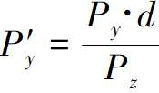

Pz作为除数是有问题的，会出现除以0的现象出现，此外相机后面的点Z的值为负，我们目前无法处理。即使是在相机前面但非常靠近相机的点，也会因为严重扭曲的物体表现形式而造成麻烦。

为了避免这些有问题的情况出现，我们选择不渲染投影平面z=d后面的任何物体。裁剪平面（clipping plane）让我们将任何点分类为裁剪体（clipping volume）的内部（inside）或外部（outside）。`相对于相机而言,由其可见部分组成的空间子集，在这种情况下，裁剪体是z=d前面的任何东西`。我们将只渲染裁剪体内部的这部分场景。

## 裁剪体

不仅仅是视口平面后面的不用渲染，还有就是靠近投影平面，但在相机右侧或左侧很远的物体的投影，会被投影到视口之外。

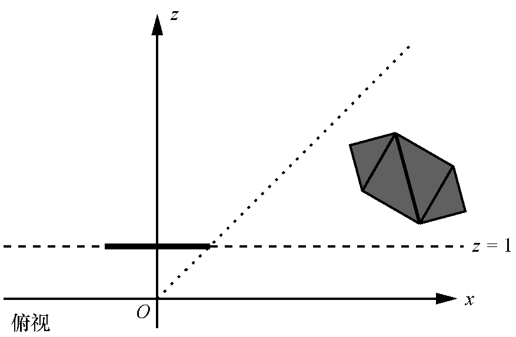

具体的平面如下图所示，想一个被剔除顶部的金字塔。

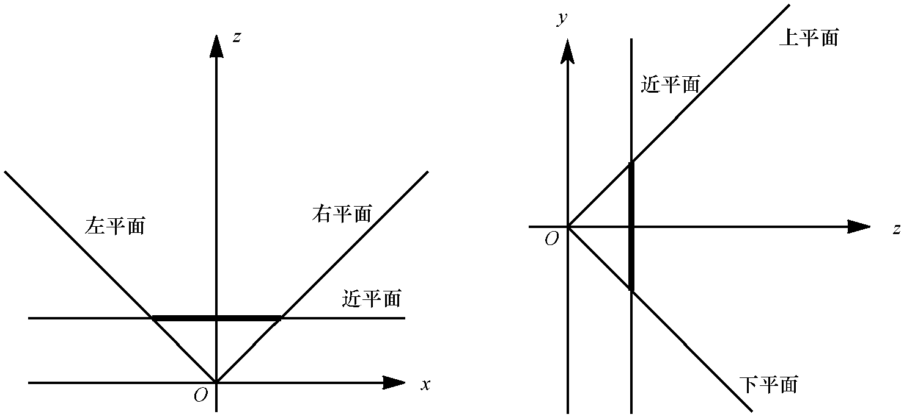

每个裁剪平面将空间分成两部分，称之为半空间 half-space。内部半空间是平面前面的所有东西，外部半空间是它后面的所有
东西。我们定义的裁剪体的内部是每个裁剪平面定义的内部半空间的交集。

## 使用平面裁剪场景

考虑一个包含多个物体的场景，每个物体由4个三角形组成。

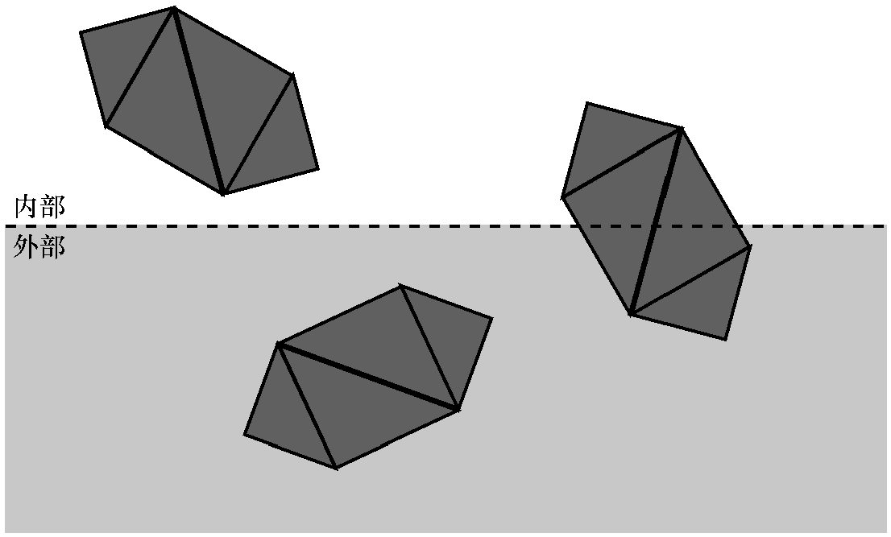

首先，尝试一次性对整个物体进行分类。如果一个物体完全在裁剪体内部，则它被接受。如果一个物体完全在裁剪体外部，则将其丢弃。

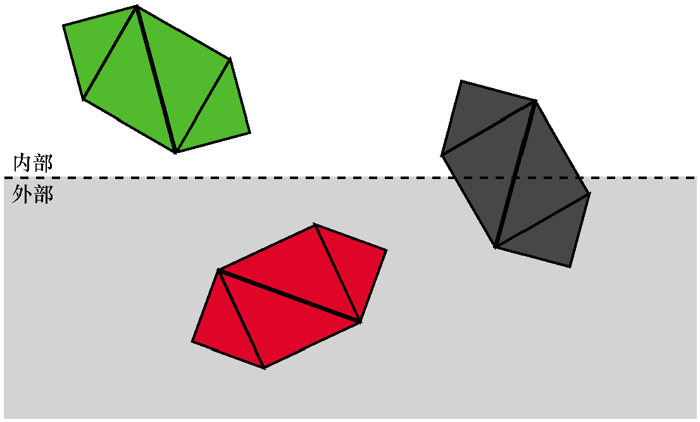

如果一个物体不能被完全接受或丢弃，就进入下一阶段，对它的每个三角形进行独立的分类。
如果三角形完全在裁剪体内部，它是被接受的。如果三角形完全在外部，则将其丢弃。

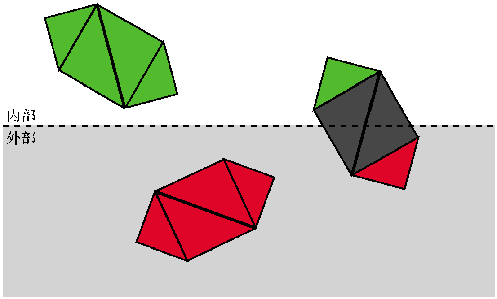

对于每个既没有被接受也没有被丢弃的三角形，我们需要裁剪三角形本身。将原来的三角形移除，并添加一个
或两个新的三角形来覆盖裁剪体内部的三角形部分。

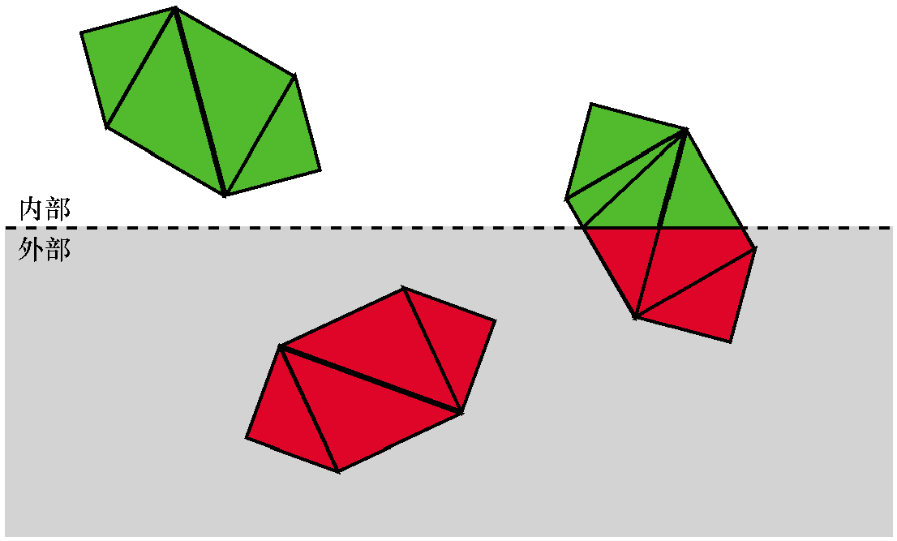

## 定义裁剪平面

先从z=d开始看，其实最规则的一个平面。

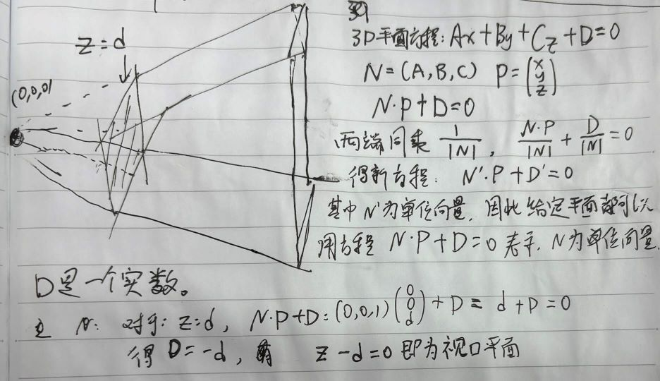

这个方程是很特殊的，其中N恰好是平面的法线，-D是从原点到平面的有符号距离(signed distance)。NP就是求得P到原点距离。

N、-N都是平面的法线，我们选择N使其指向裁剪体的内部。

剩余4个平面也是比较特殊，就是它们都经过原点，也就是说D=0。所以我们需要做的是确定它们的法线，为了简化数学计算，我们选择90度视野(FOV),意味着每个平面在45度。

左裁剪平面，它的法线方向是(1,0,1)右前方45度，向量长度为 

$$
\sqrt{2}
$$

将其归一化为单位向量得到

$$
\left( \frac{1}{\sqrt{2}}，0，\frac{1}{\sqrt{2}}\right)
$$

$$
\left( 0,0,1  \right) \cdot P - d = 0
$$

其他同理，我们的裁剪体由以下5个平面定义。

1. 近平面

$$
\left( 0,0,1  \right) \cdot P - d = 0
$$

2. 左平面

$$
\left( \frac{1}{\sqrt{{2}}}, 0, \frac{1}{\sqrt{{2}}}  \right) \cdot P = 0
$$

3. 右平面

$$
\left( -\frac{1}{\sqrt{2}}, 0, \frac{1}{\sqrt{2}} \right) \cdot P = 0
$$

4. 下平面

$$
\left( 0, \frac{1}{\sqrt{2}}, \frac{1}{\sqrt{2}} \right) \cdot P = 0
$$

5. 上平面

$$
\left( 0, \frac{-1}{\sqrt{2}}, \frac{1}{\sqrt{2}} \right) \cdot P = 0
$$

## 裁剪整个物体

假设我们将每个模型放入能够容纳它的最小球体，称为这个球体为物体的边界球，计算这个球体要比想象得更困难，超出目前学习范围。但我们可以获得边界球得近似表示，首先通过计算模型中所有顶点的坐标平均值来获取球体的球心，然后将半径定义为从球心到它最远的顶点的距离。

可以将这个球体和平面之间的关系分为几类：

1. 球体完全在平面的前面

这种情况，整个物体都被接受，不需要使用这个平面进行进一步的裁剪（但它仍然可能被另一个平面裁剪）

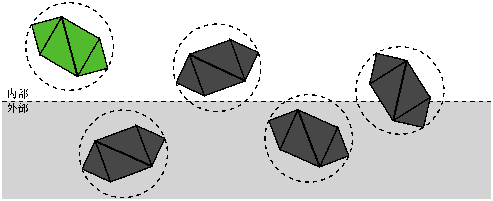

2. 球体完全在平面的后面

这种情况，整个物体将被丢弃，不需要进一步的裁剪（无论其他平面怎么样，物体的任何部分都不会在裁剪体内）

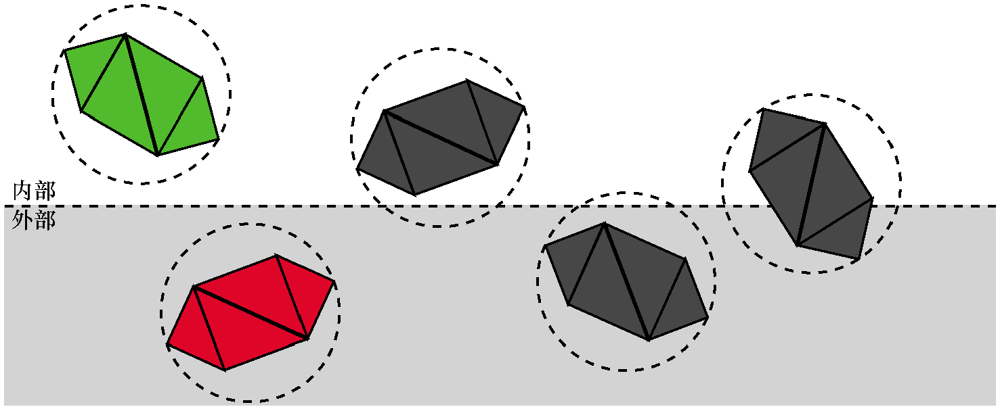

3. 平面与球体相交

这并不能给我们足够的信息确定物体的任意部分是否在裁剪体内，它可能完全在里面，完全在外面，或者部分在里面。进行下一步处理，将模型的三角形逐个进行裁剪计算。


我们将任意点代入平面方程就能得到该点到平面的有符号距离。可以计算从边界球的球心到平面的有符号距离d。所以如果d>r,球体在平面的前面；如果d<-r,则球体在平面的后面，否则`|d|<r`,表示平面与球体相交。

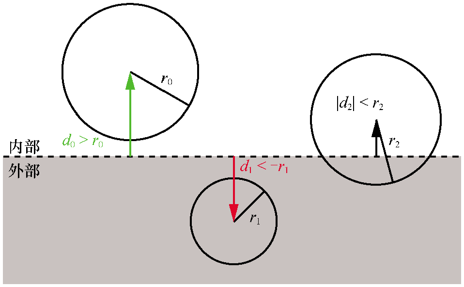

## 裁剪三角形

## 裁剪过程的伪代码

## 渲染管线中的裁剪过程

## 代码实现

```html

```
