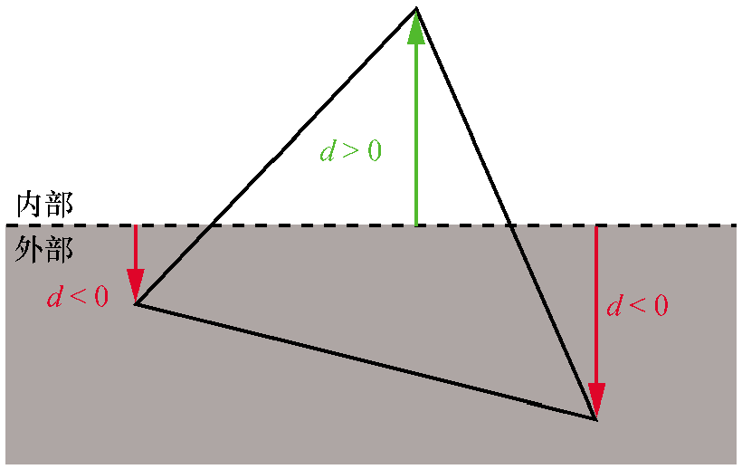
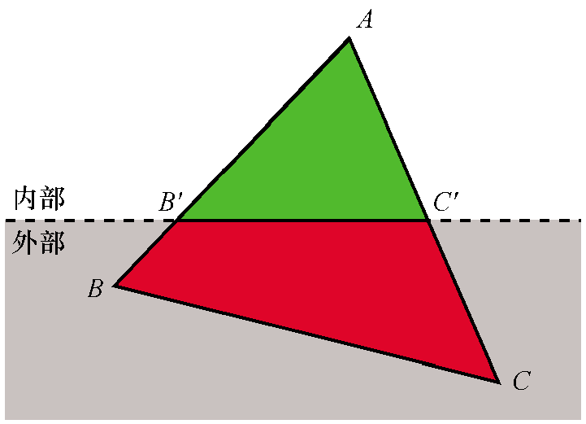
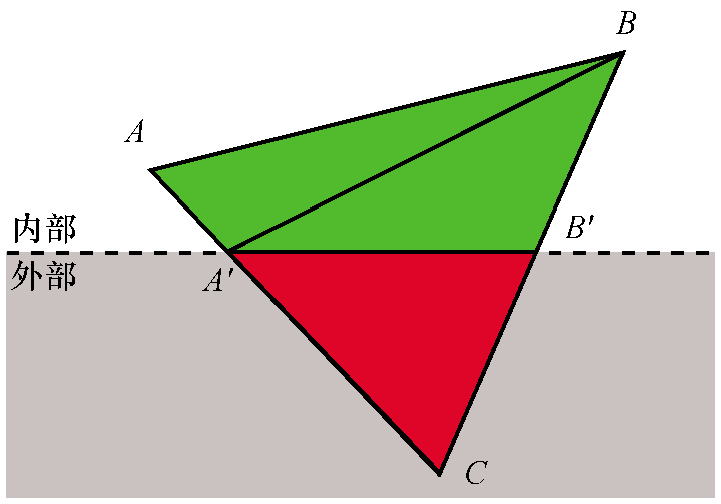
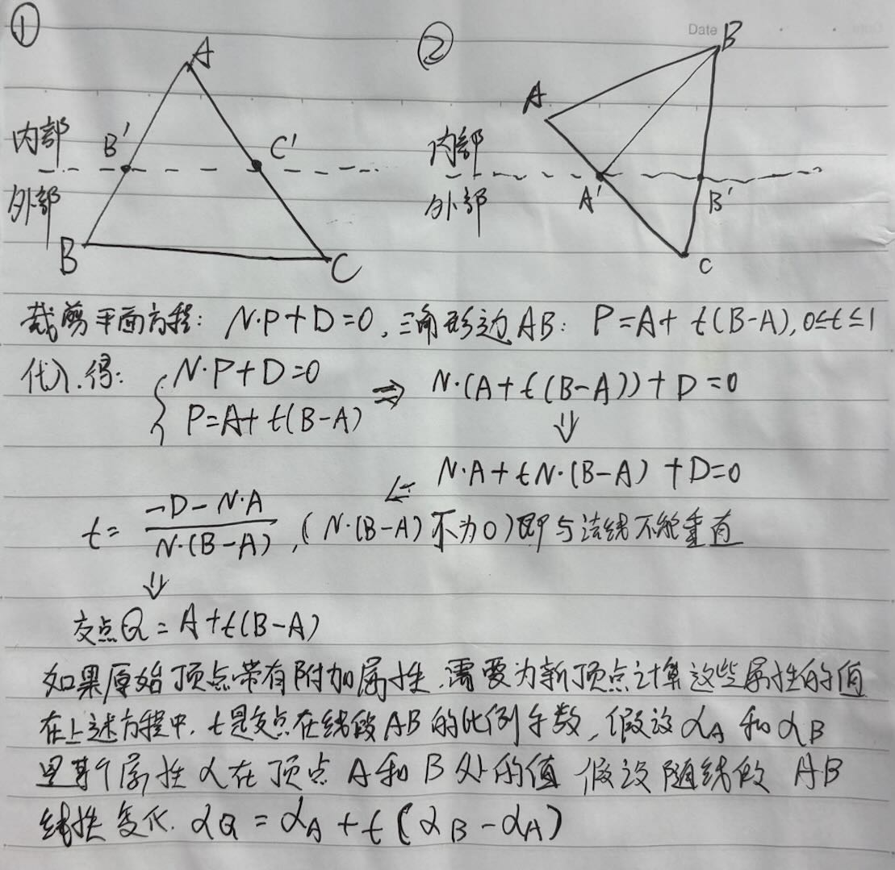

# 裁剪

我们之前一直在处理的限制：透视投影方程只适用于相机前面的点，由于我们现在可以围绕场景移动和旋转相机，就产生了一个
问题：相机后面的点如何处理。

前面我们得到了透视投影方程


Pz作为除数是有问题的，会出现除以0的现象出现，此外相机后面的点Z的值为负，我们目前无法处理。即使是在相机前面但非常靠近相机的点，也会因为严重扭曲的物体表现形式而造成麻烦。

为了避免这些有问题的情况出现，我们选择不渲染投影平面z=d后面的任何物体。裁剪平面（clipping plane）让我们将任何点分类为裁剪体（clipping volume）的内部（inside）或外部（outside）。`相对于相机而言,由其可见部分组成的空间子集，在这种情况下，裁剪体是z=d前面的任何东西`。我们将只渲染裁剪体内部的这部分场景。

## 裁剪体

不仅仅是视口平面后面的不用渲染，还有就是靠近投影平面，但在相机右侧或左侧很远的物体的投影，会被投影到视口之外。


具体的平面如下图所示，想一个被剔除顶部的金字塔。


每个裁剪平面将空间分成两部分，称之为半空间 half-space。内部半空间是平面前面的所有东西，外部半空间是它后面的所有
东西。我们定义的裁剪体的内部是每个裁剪平面定义的内部半空间的交集。

## 使用平面裁剪场景

考虑一个包含多个物体的场景，每个物体由4个三角形组成。


首先，尝试一次性对整个物体进行分类。如果一个物体完全在裁剪体内部，则它被接受。如果一个物体完全在裁剪体外部，则将其丢弃。


如果一个物体不能被完全接受或丢弃，就进入下一阶段，对它的每个三角形进行独立的分类。
如果三角形完全在裁剪体内部，它是被接受的。如果三角形完全在外部，则将其丢弃。


对于每个既没有被接受也没有被丢弃的三角形，我们需要裁剪三角形本身。将原来的三角形移除，并添加一个
或两个新的三角形来覆盖裁剪体内部的三角形部分。


## 定义裁剪平面

先从z=d开始看，其实最规则的一个平面。


这个方程是很特殊的，其中N恰好是平面的法线，-D是从原点到平面的有符号距离(signed distance)。NP就是求得P到原点距离。

N、-N都是平面的法线，我们选择N使其指向裁剪体的内部。

剩余4个平面也是比较特殊，就是它们都经过原点，也就是说D=0。所以我们需要做的是确定它们的法线，为了简化数学计算，我们选择90度视野(FOV),意味着每个平面在45度。

左裁剪平面，它的法线方向是(1,0,1)右前方45度，向量长度为 

$$
\sqrt{2}
$$

将其归一化为单位向量得到

$$
\left( \frac{1}{\sqrt{2}}，0，\frac{1}{\sqrt{2}}\right)
$$

$$
\left( 0,0,1  \right) \cdot P - d = 0
$$

其他同理，我们的裁剪体由以下5个平面定义。

1. 近平面

$$
\left( 0,0,1  \right) \cdot P - d = 0
$$

2. 左平面

$$
\left( \frac{1}{\sqrt{{2}}}, 0, \frac{1}{\sqrt{{2}}}  \right) \cdot P = 0
$$

3. 右平面

$$
\left( -\frac{1}{\sqrt{2}}, 0, \frac{1}{\sqrt{2}} \right) \cdot P = 0
$$

4. 下平面

$$
\left( 0, \frac{1}{\sqrt{2}}, \frac{1}{\sqrt{2}} \right) \cdot P = 0
$$

5. 上平面

$$
\left( 0, \frac{-1}{\sqrt{2}}, \frac{1}{\sqrt{2}} \right) \cdot P = 0
$$

## 裁剪整个物体

假设我们将每个模型放入能够容纳它的最小球体，称为这个球体为物体的边界球，计算这个球体要比想象得更困难，超出目前学习范围。但我们可以获得边界球得近似表示，首先通过计算模型中所有顶点的坐标平均值来获取球体的球心，然后将半径定义为从球心到它最远的顶点的距离。

可以将这个球体和平面之间的关系分为几类：

1. 球体完全在平面的前面

这种情况，整个物体都被接受，不需要使用这个平面进行进一步的裁剪（但它仍然可能被另一个平面裁剪）


2. 球体完全在平面的后面

这种情况，整个物体将被丢弃，不需要进一步的裁剪（无论其他平面怎么样，物体的任何部分都不会在裁剪体内）


3. 平面与球体相交

这并不能给我们足够的信息确定物体的任意部分是否在裁剪体内，它可能完全在里面，完全在外面，或者部分在里面。进行下一步处理，将模型的三角形逐个进行裁剪计算。


我们将任意点代入平面方程就能得到该点到平面的有符号距离。可以计算从边界球的球心到平面的有符号距离d。所以如果d>r,球体在平面的前面；如果d<-r,则球体在平面的后面，否则`|d|<r`,表示平面与球体相交。


## 裁剪三角形

如果球体-平面测试不足以确定一个物体是完全在裁剪平面的前面还是完全在裁剪平面的后面，那么我们必须对每个三角形进行裁剪。

`可以查看三角形每个顶点到裁剪平面的有符号距离，以此来根据裁剪平面对三角形每个顶点进行分类。如果距离为0或者正值，则顶点在裁剪平面的前面，否则它在后面。`



对于每个三角形，有4种分类。

1. 3个顶点在裁剪平面的前面：整个三角形都在裁剪平面的前面，所以我们接受它，不需要进一步使用这个平面对它进行裁剪。
2. 3个顶点在裁剪平面的后面：整个三角形都在裁剪平面的后面，所以我们丢弃它，不再需要进行任何进一步的裁剪。
3. 1个顶点在裁剪平面的前面：假设三角形ABC的三个顶点中位于裁剪平面前面的是顶点A。



4. 2个顶点在裁剪平面的前面：假设三角形ABC中的3个顶点中，位于裁剪平面前面的是顶点A和顶点B。



求交点的过程



整个裁剪计算过程，也可以被称为裁剪管线，我们现在拥有了实现我们的裁剪管线所需的所有算法和方程。

## 裁剪过程的伪代码

使用一组裁剪平面对场景进行裁剪的算法

```cpp
ClipScene(scene, planes) {
    clipped_instances = []
    for I in scene.instances { // 遍历所以场景
        clipped_instance = ClipInstance(I, planes) // 对每个场景处理，返回处理后的数据
        if clipped_instance != NULL {
            clipped_instances.append(clipped_instance)
        }
    }
    clipped_scene = Copy(scene)
    clipped_scene.instances = clipped_instances
    return clipped_scene
}
```

使用一组裁剪平面对实例进行裁剪的算法

```cpp
ClipInstance(instance, planes) {
    for P in planes { // 每个面都对场景实例处理，很显然ClipInstanceAgainstPlane会修改instance数据
        instance = ClipInstanceAgainstPlane(instance, plane)
        if instance == NULL {
            return NULL
        }
    }
    return instance // 返回裁剪后的实例
}
ClipInstanceAgainstPlane(instance, plane) {
    // 计算场景球球心到平面的距离
    d = SignedDistance(plane, instance.bounding_sphere.center)

    if d > r {
        return instance // 场景内部
    } else if d < -r { // 场景外部
        return NULL
    } else { // 难以确定裁剪管线处理
        clipped_instance = Copy(instance)
        // 裁剪三角形
        clipped_instance.triangles =
            ClipTrianglesAgainstPlane(instance.triangles, plane)
        return clipped_instance
    }
}
```

计算从平面到点的有符号距离的函数

```cpp
SignedDistance(plane, vertex) {
    normal = plane.normal
    return (vertex.x * normal.x)
        + (vertex.y * normal.y)
        + (vertex.z * normal.z)
        + plane.D
}
```

使用一个裁剪平面对一组三角形进行裁剪的算法

```cpp
ClipTrianglesAgainstPlane(triangles, plane) {
    clipped_triangles = []
    for T in triangles { // 都每个三角形基于平面 plane 都裁剪管线处理
        clipped_triangles.append(ClipTriangle(T, plane))
    }
    return clipped_triangles
}

ClipTriangle(triangle, plane) {
    // 计算三个顶点的有符号距离
    d0 = SignedDistance(plane, triangle.v0)
    d1 = SignedDistance(plane, triangle.v1)
    d2 = SignedDistance(plane, triangle.v2)

    // 所有都是正值则全部都在裁剪面内部
    if {d0, d1, d2} are all positive {
        return [triangle]
    // 所有都是负值全部都在裁剪面外部
    } else if {d0, d1, d2} are all negative {
        return []
    // 三者只有一个为正值
    } else if only one of {d0, d1, d2} is positive {
        let A be the vertex with a positive distance
        compute B' = Intersection(AB, plane)
        compute C' = Intersection(AC, plane)
        return [Triangle(A, B', C')]
    // 三者有一个为负值
    } else /* only one of {d0, d1, d2} is negative */ {
        let C be the vertex with a negative distance
        compute A' = Intersection(AC, plane)
        compute B' = Intersection(BC, plane)
        return [Triangle(A, B, A'), Triangle(A', B, B')]
    }
}
```

## 渲染管线中的裁剪过程

裁剪是一种3D操作，它获取场景中的3D物体并在场景中生成一组新的3D物体，或者更准确地说，它计算场景和裁剪体的交集。因此，必须在将物体放置在场景中之后
（即使用模型和相机变换之后的顶点），且在透视投影之前进行裁剪。

## 代码实现

```html

```
