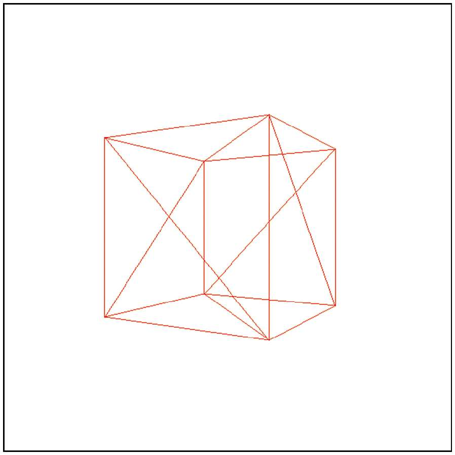
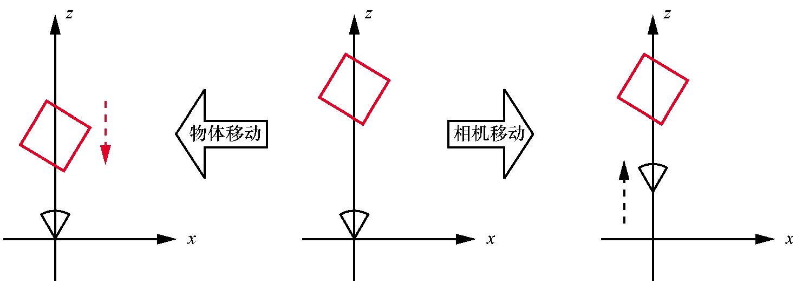
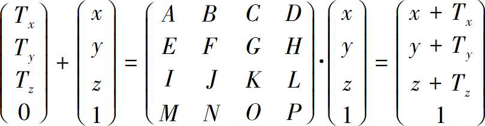
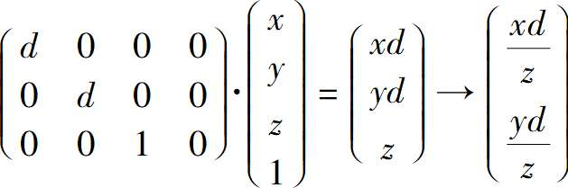

# 场景的描述和渲染

## 表示一个立方体

如何表示和操作立方体，目标是找到一种更通用的方法。就是使用三角形表示。如立方体可以用12个三角形表示，每面从对角线将面分为两个三角形。

实现效果


源码

```html
<!DOCTYPE html>
<html lang="en">

<head>
    <meta charset="UTF-8">
    <meta name="viewport" content="width=device-width, initial-scale=1.0">
    <title>Scene setup demo 1</title>
</head>

<div class="centered">
    <canvas id="canvas" width=600 height=600 style="border: 1px grey solid"></canvas>
</div>
<script>
    "use strict";

    // ======================================================================
    //  Low-level canvas access.
    // ======================================================================

    let canvas = document.getElementById("canvas");
    let canvas_context = canvas.getContext("2d");
    let canvas_buffer = canvas_context.getImageData(0, 0, canvas.width, canvas.height);

    // A color.
    function Color(r, g, b) {
        return {
            r, g, b,
            mul: function (n) { return new Color(this.r * n, this.g * n, this.b * n); },
        };
    }

    // The PutPixel() function.
    function PutPixel(x, y, color) {
        x = canvas.width / 2 + (x | 0);
        y = canvas.height / 2 - (y | 0) - 1;

        if (x < 0 || x >= canvas.width || y < 0 || y >= canvas.height) {
            return;
        }

        let offset = 4 * (x + canvas_buffer.width * y);
        canvas_buffer.data[offset++] = color.r;
        canvas_buffer.data[offset++] = color.g;
        canvas_buffer.data[offset++] = color.b;
        canvas_buffer.data[offset++] = 255; // Alpha = 255 (full opacity)
    }


    // Displays the contents of the offscreen buffer into the canvas.
    function UpdateCanvas() {
        canvas_context.putImageData(canvas_buffer, 0, 0);
    }


    // ======================================================================
    //  Data model.
    // ======================================================================

    // A Point.
    function Pt(x, y, h) {
        return { x, y, h };
    }


    // A 3D vertex.
    function Vertex(x, y, z) {
        return { x, y, z };
    }


    // A Triangle.
    function Triangle(v0, v1, v2, color) {
        return { v0, v1, v2, color };
    }


    // ======================================================================
    //  Rasterization code.
    // ======================================================================

    // Scene setup.
    let viewport_size = 1;
    let projection_plane_z = 1;


    function Interpolate(i0, d0, i1, d1) {
        if (i0 == i1) {
            return [d0];
        }

        let values = [];
        let a = (d1 - d0) / (i1 - i0);
        let d = d0;
        for (let i = i0; i <= i1; i++) {
            values.push(d);
            d += a;
        }

        return values;
    }


    function DrawLine(p0, p1, color) {
        let dx = p1.x - p0.x, dy = p1.y - p0.y;

        if (Math.abs(dx) > Math.abs(dy)) {
            // The line is horizontal-ish. Make sure it's left to right.
            if (dx < 0) { let swap = p0; p0 = p1; p1 = swap; }

            // Compute the Y values and draw.
            let ys = Interpolate(p0.x, p0.y, p1.x, p1.y);
            for (let x = p0.x; x <= p1.x; x++) {
                PutPixel(x, ys[(x - p0.x) | 0], color);
            }
        } else {
            // The line is verical-ish. Make sure it's bottom to top.
            if (dy < 0) { let swap = p0; p0 = p1; p1 = swap; }

            // Compute the X values and draw.
            let xs = Interpolate(p0.y, p0.x, p1.y, p1.x);
            for (let y = p0.y; y <= p1.y; y++) {
                PutPixel(xs[(y - p0.y) | 0], y, color);
            }
        }
    }


    function DrawWireframeTriangle(p0, p1, p2, color) {
        DrawLine(p0, p1, color);
        DrawLine(p1, p2, color);
        DrawLine(p0, p2, color);
    }


    // Converts 2D viewport coordinates to 2D canvas coordinates.
    function ViewportToCanvas(p2d) {
        return new Pt(
            p2d.x * canvas.width / viewport_size,
            p2d.y * canvas.height / viewport_size);
    }


    function ProjectVertex(v) {
        return ViewportToCanvas(new Pt(
            v.x * projection_plane_z / v.z,
            v.y * projection_plane_z / v.z));
    }


    function RenderTriangle(triangle, projected) {
        DrawWireframeTriangle(projected[triangle.v0],
            projected[triangle.v1],
            projected[triangle.v2],
            triangle.color);
    }


    function RenderObject(vertices, triangles) {
        let projected = [];
        // 将物体顶点映射到画布
        for (let i = 0; i < vertices.length; i++) {
            projected.push(ProjectVertex(vertices[i]));
        }
        // 在画布上将三角形根据顶点连起来
        for (let i = 0; i < triangles.length; i++) {
            RenderTriangle(triangles[i], projected);
        }
    }

    // 物体顶点
    const vertices = [
        new Vertex(1, 1, 1),
        new Vertex(-1, 1, 1),
        new Vertex(-1, -1, 1),
        new Vertex(1, -1, 1),
        new Vertex(1, 1, -1),
        new Vertex(-1, 1, -1),
        new Vertex(-1, -1, -1),
        new Vertex(1, -1, -1)
    ];

    // 颜色
    const RED = new Color(255, 0, 0);
    const GREEN = new Color(0, 255, 0);
    const BLUE = new Color(0, 0, 255);
    const YELLOW = new Color(255, 255, 0);
    const PURPLE = new Color(255, 0, 255);
    const CYAN = new Color(0, 255, 255);

    // 用顶点表示三角形
    const triangles = [
        new Triangle(0, 1, 2, RED),
        new Triangle(0, 2, 3, RED),
        new Triangle(4, 0, 3, GREEN),
        new Triangle(4, 3, 7, GREEN),
        new Triangle(5, 4, 7, BLUE),
        new Triangle(5, 7, 6, BLUE),
        new Triangle(1, 5, 6, YELLOW),
        new Triangle(1, 6, 2, YELLOW),
        new Triangle(4, 5, 1, PURPLE),
        new Triangle(4, 1, 0, PURPLE),
        new Triangle(2, 6, 7, CYAN),
        new Triangle(2, 7, 3, CYAN)
    ];

    // 平移物体所有顶点
    for (let i = 0; i < vertices.length; i++) {
        vertices[i].x -= 1.5;
        vertices[i].z += 7;
    }

    RenderObject(vertices, triangles);

    UpdateCanvas();

</script>

</html>
```

## 模型和模型实例

更好的表示方法是模型 model 和 实例 instance的角度进行思考。

```bash
model {
 name = cube
 vertices {
  ...
 }
 triangles {
  ...
 }
}

instance {
 model = cube
 position = (0, 0, 5)
}

instance {
 model = cube
 position = (1, 2, 3)
}
```

逻辑伪代码

```js
RenderScene()
{
    for I in scene.instances{
        RenderInstance(I);
    }
}

RenderInstance(instance){
    projected = []
    model = instance.model
    for V in model.vertices{
        V' = V + instance.position
        projected.append(ProjectVertex(V'))
    }
    for T in model.triangles{
        RenderTriangle(T, projected)
    }
}
```

实现效果


```html
<div class="centered">
  <canvas id="canvas" width=600 height=600 style="border: 1px grey solid"></canvas>
</div>

<script>
  "use strict";

  // ======================================================================
  //  Low-level canvas access.
  // ======================================================================

  let canvas = document.getElementById("canvas");
  let canvas_context = canvas.getContext("2d");
  let canvas_buffer = canvas_context.getImageData(0, 0, canvas.width, canvas.height);

  // A color.
  function Color(r, g, b) {
    return {
      r, g, b,
      mul: function (n) { return new Color(this.r * n, this.g * n, this.b * n); },
    };
  }

  // The PutPixel() function.
  function PutPixel(x, y, color) {
    x = canvas.width / 2 + (x | 0);
    y = canvas.height / 2 - (y | 0) - 1;

    if (x < 0 || x >= canvas.width || y < 0 || y >= canvas.height) {
      return;
    }

    let offset = 4 * (x + canvas_buffer.width * y);
    canvas_buffer.data[offset++] = color.r;
    canvas_buffer.data[offset++] = color.g;
    canvas_buffer.data[offset++] = color.b;
    canvas_buffer.data[offset++] = 255; // Alpha = 255 (full opacity)
  }


  // Displays the contents of the offscreen buffer into the canvas.
  function UpdateCanvas() {
    canvas_context.putImageData(canvas_buffer, 0, 0);
  }


  // ======================================================================
  //  Data model.
  // ======================================================================

  // A Point.
  function Pt(x, y, h) {
    return { x, y, h };
  }


  // A 3D vertex.
  function Vertex(x, y, z) {
    return {
      x, y, z,
      add: function (v) { return new Vertex(this.x + v.x, this.y + v.y, this.z + v.z); },
    }
  }


  // A Triangle.
  function Triangle(v0, v1, v2, color) {
    return { v0, v1, v2, color };
  }


  // A Model.
  function Model(vertices, triangles) {
    return { vertices, triangles };
  }


  // An Instance.
  function Instance(model, position) {
    return { model, position };
  }


  // ======================================================================
  //  Rasterization code.
  // ======================================================================

  // Scene setup.
  let viewport_size = 1;
  let projection_plane_z = 1;


  function Interpolate(i0, d0, i1, d1) {
    if (i0 == i1) {
      return [d0];
    }

    let values = [];
    let a = (d1 - d0) / (i1 - i0);
    let d = d0;
    for (let i = i0; i <= i1; i++) {
      values.push(d);
      d += a;
    }

    return values;
  }


  function DrawLine(p0, p1, color) {
    let dx = p1.x - p0.x, dy = p1.y - p0.y;

    if (Math.abs(dx) > Math.abs(dy)) {
      // The line is horizontal-ish. Make sure it's left to right.
      if (dx < 0) { let swap = p0; p0 = p1; p1 = swap; }

      // Compute the Y values and draw.
      let ys = Interpolate(p0.x, p0.y, p1.x, p1.y);
      for (let x = p0.x; x <= p1.x; x++) {
        PutPixel(x, ys[(x - p0.x) | 0], color);
      }
    } else {
      // The line is verical-ish. Make sure it's bottom to top.
      if (dy < 0) { let swap = p0; p0 = p1; p1 = swap; }

      // Compute the X values and draw.
      let xs = Interpolate(p0.y, p0.x, p1.y, p1.x);
      for (let y = p0.y; y <= p1.y; y++) {
        PutPixel(xs[(y - p0.y) | 0], y, color);
      }
    }
  }


  function DrawWireframeTriangle(p0, p1, p2, color) {
    DrawLine(p0, p1, color);
    DrawLine(p1, p2, color);
    DrawLine(p0, p2, color);
  }


  // Converts 2D viewport coordinates to 2D canvas coordinates.
  function ViewportToCanvas(p2d) {
    return new Pt(
      p2d.x * canvas.width / viewport_size,
      p2d.y * canvas.height / viewport_size);
  }


  function ProjectVertex(v) {
    return ViewportToCanvas(new Pt(
      v.x * projection_plane_z / v.z,
      v.y * projection_plane_z / v.z));
  }


  function RenderTriangle(triangle, projected) {
    DrawWireframeTriangle(projected[triangle.v0],
      projected[triangle.v1],
      projected[triangle.v2],
      triangle.color);
  }


  function RenderInstance(instance) {
    let projected = [];
    let model = instance.model;
    for (let i = 0; i < model.vertices.length; i++) {
      projected.push(ProjectVertex(model.vertices[i].add(instance.position)));
    }
    for (let i = 0; i < model.triangles.length; i++) {
      RenderTriangle(model.triangles[i], projected);
    }
  }


  function RenderScene(instances) {
    for (let i = 0; i < instances.length; i++) {
      RenderInstance(instances[i]);
    }
  }


  const vertices = [
    new Vertex(1, 1, 1),
    new Vertex(-1, 1, 1),
    new Vertex(-1, -1, 1),
    new Vertex(1, -1, 1),
    new Vertex(1, 1, -1),
    new Vertex(-1, 1, -1),
    new Vertex(-1, -1, -1),
    new Vertex(1, -1, -1)
  ];

  const RED = new Color(255, 0, 0);
  const GREEN = new Color(0, 255, 0);
  const BLUE = new Color(0, 0, 255);
  const YELLOW = new Color(255, 255, 0);
  const PURPLE = new Color(255, 0, 255);
  const CYAN = new Color(0, 255, 255);

  const triangles = [
    new Triangle(0, 1, 2, RED),
    new Triangle(0, 2, 3, RED),
    new Triangle(4, 0, 3, GREEN),
    new Triangle(4, 3, 7, GREEN),
    new Triangle(5, 4, 7, BLUE),
    new Triangle(5, 7, 6, BLUE),
    new Triangle(1, 5, 6, YELLOW),
    new Triangle(1, 6, 2, YELLOW),
    new Triangle(4, 5, 1, PURPLE),
    new Triangle(4, 1, 0, PURPLE),
    new Triangle(2, 6, 7, CYAN),
    new Triangle(2, 7, 3, CYAN)
  ];

  let cube = new Model(vertices, triangles);

  let instances = [
    new Instance(cube, new Vertex(-1.5, 0, 7)),
    new Instance(cube, new Vertex(1.25, 2, 7.5))
  ];

  function Render() {
    RenderScene(instances);
    UpdateCanvas();
  }

  Render();

</script>
```

## 模型变换

上面描述的场景定义并没有给我们带来很大的灵活性，由于我们只能指定立方体的位置，因此我们可以实例化任意数量的立方体，但它们都将面向同一个方向。一般来说，希望对实例有更多的控制，如指定它们的方位甚至是指定它们的缩放比例。

可以使用3个元素定义模型变换(model transform),分别是缩放因子、模型空间中围绕原点的旋转以及到场景中特定点的平移。

```cpp
instance{
    model = cube
    transform{
        scale = 1.5
        rotation = <45 degrees around the Y axis>
        translation = {1,2,3}
    }
}
```

应用变换的顺序很重要，尤其是平移必须最后完成。这是因为大多数时候我们想要在模型空间中围绕它们的原点旋转和缩放实例，所以我们需要在它们转换到世界空间之前这样做。

下面演示了 围绕原点旋转45度，然后沿z轴平移的效果。先旋转再平移、先平移再旋转的区别。


严格来说，对于给定一次旋转后跟一次平移的变换，我们可以找到一次平移后跟一次旋转（可能不是围绕原点）的变换达到相同的结果。然而，使用前一种变换要自然得多。

应用旋转缩放平移伪代码：

```cpp
RenderInstance(instance){
    projected = []
    model = instance.model
    for V in model.vertices{
        V' = ApplyTransform(V, instance.transform)
        projected.append(ProjectVertex(V'))
    }
    for T in model.triangles{
        RenderTriangle(T, projected)
    }
}

ApplyTransform(vertex, transform)
{
    scaled = Scale(vertex, transform.scale)
    rotated = Rotate(scaled, transform.rotation)
    translated = Translate(rotated, transform.translation)
    return translated
}
```

## 相机变换

前面讨论了如何将模型实例放置在场景中的不同位置，想象一下，你是一个漂浮在一个完全空白的坐标系中的相机，突然，一个红色的立方体正好出现在你的面前。


1s后，立方体向相机移动了1个单位



但是这个立方体真的向相机移动了一个单位吗？还是相机向着立方体移动了一个单位？因为根本没有参考点，而且坐标系也不可见，所以无法通过看到的画面内容来判断。
因为在这两种情况下，立方体和相机的相对位置(relative position)是相同的。




这种“明显以自我为中心”的宇宙观的优势在于，通过将相机固定在原点并指向Z+,可以使用前面推导出的透视投影方程而无须任何修改，相机的坐标系称为相机空间(camera space)。

假设相机也附加了变换，包括平移和旋转，为了从相机的视野渲染场景，需要对场景的每个顶点应用相反的变换。


## 变换矩阵

现在我们可以在场景中移动相机和模型实例，让我们后退一步，考虑在模型空间中的顶点Vmodel发生的所有事情，直到它被投影到画布点(Cx,Cy)

首先应用模型变换从模型空间变换到世界空间。


然后应用相机变换从世界空间变换到相机空间


然后应用透视方程来获得视口坐标


最后将视口坐标映射到画布坐标


下面我们将模型变换方程表示为函数，这些函数取一个顶点并返回经过变换的顶点。设Ct和Cr为相机的平移函数和旋转函数，Ir、Is、It为模型实例的旋转函数、缩放函数、平移函数，P为透视投影函数、M为视口到画布的映射函数。如果V是原始顶点，V'是画布上的一点。


## 齐次坐标

考虑A=(1,2,3)，A表示一个3D点还是一个3D向量？如果不知道A在什么情况下被使用，就没办法直到这个问题的答案。

如果为其添加第4个值，把A标记为一个点或向量。如果w=0,则为一个向量，如果w=1,则为一个点。向量标识为(1,2,3,0)，而点被表示为(1,2,3,1)。

由于点和向量具有相同的表示方式，因此这些四分量坐标被称为齐次坐标(homogeneous corrdinate)。齐次坐标有更深入、更复杂的几何解释，但超出了本书的范围。这里只是把它们作为一个方便的工具。

处理以齐次坐标表示的点和向量与它们的几何解释是一致的，如两个点相减就会得到一个向量。

```cpp
(8,4,2,1) - (3,2,1,1) = (5,2,1,0)
```

两个向量相加产生另一个向量

```cpp
(0,0,1,0) + (1,0,0,0) = (1,0,1,0)
```

点和向量相加得到点，向量乘标量得到向量。

那么w值不是0或1的坐标代表什么？它们也代表点，3D中的任何点在齐次坐标中都有无限多种表现形式。重要的是坐标和w值之间的比率，例如(1,2,3,1)和(2,4,6,2)表示相同的点，(-3,-6,-9,-3)也是如此。

在这些表示中，称w=1的这个点为齐次坐标中的正则表示(canonical representation)。将任何其他表示转换为其正则表示或笛卡尔坐标系如下：


## 齐次旋转矩阵

将笛卡儿坐标系中的3X3旋转矩阵转换为齐次坐标系中的4X4旋转矩阵是很容易的，因为点w坐标不应该被改变。


## 齐次缩放矩阵

在齐次坐标系中，缩放矩阵也是很容易的，它的构造方法与旋转矩阵的相同。


## 齐次平移矩阵

要寻找一个4X4的矩阵，使得下面的等式成立。



很明显就能看出结果


## 齐次投影矩阵

求和以及乘法运算很容易表示为矩阵和向量的乘法，但是透视投影方程中有一个除以Z的式子。

齐次坐标确实有一个除法实例：变换回笛卡尔坐标时除以w坐标。




## 齐次视口-画布变换矩阵

这一步是将视口上的投影点映射到画布，这是一个2D缩放变换Sx=(Cw/Vw)
和Sy=(Ch/Vh)。


很容易将其与投影矩阵结合起来，得到一个简单的3D到画布的变换矩阵。


## 回顾变换矩阵

在完成这些工作后，就可以将模型顶点V转换为画布像素V'所需的每一个变换函数表示为矩阵形式，可以通过将它们相应的矩阵相乘来组合这些变换。


分为三个部分


这些矩阵不需要为每个顶点从头计算，这就是使用矩阵的意义所在，因为矩阵乘法是符合结合律的，可以重用表达式中不变的部分。

M projection应该很少改变，它只取决于视口的大小和画布的大小。例如，当应用程序从正常窗口变为全屏时，画布的大小会发生变化，只有当相机的视野发生变化时，视口的大小才会改变。

M camera每帧都可能发生改变，它取决于相机的位置和方位，所以如果相机在移动或旋转，就需要重新计算，不过一旦计算完毕，它将对帧中绘制的每个物体保持不变，因此每帧最多只需要计算一次。

对于场景中每个实例，M model都是不同的，对于不移动的实例如树木和建筑，它将随着时间的推移保持不变，所以它可以计算一次并存储在场景本身中，对于移动的物体如赛车游戏中的汽车，它需要在每次移动时都进行计算（可能是每一帧）。

抽象伪代码如下

```cpp
// 一种使用变换矩阵渲染场景的算法
RenderModel(model, transform)
{
  projected = []
  for V in model.vertices
  {
    projected.append(ProjectVertex(transform * V))
  }
  for T in model.triangles
  {
    RenderTriangle(T, projected)
  }
}
RenderScene()
{
  M_camera = MakeCameraMatrix(camera.position, camera.orientation)
  for I in scene.instances
  {
    M = M_camera * I.transform
    RenderModel(I.model, M)
  }
}

```

## 代码实现

TODO:
