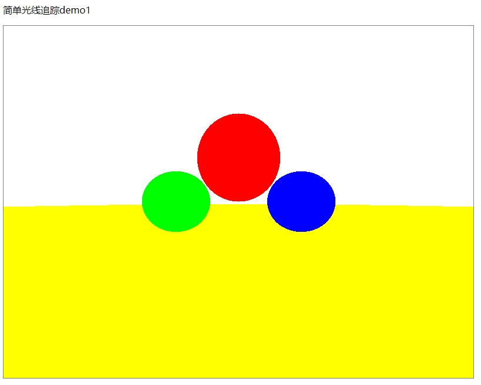
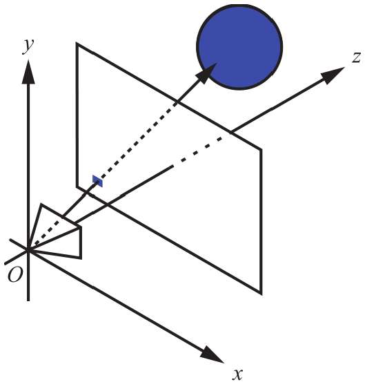

# 光线追踪

实现效果



了解光线追踪基本概念，视口以及相机位置概念，如何追踪屏幕上每个点的光线从何而来是光线追踪的精髓。下面代码的实现是，从相机位置向视口上每个点发出射线，检测射线与场景的相交。



```html
<!DOCTYPE html>
<html lang="en">

<head>
    <meta charset="UTF-8">
    <meta name="viewport" content="width=device-width, initial-scale=1.0">
    <title>Document</title>
</head>

<body>
    <p>简单光线追踪demo1</p>
    <div class class="centered">
        <canvas id="canvas" width=800 height=600 style="border:1px grey solid"></canvas>
    </div>
</body>

<script>
    // 画布
    const canvas = document.getElementById("canvas");
    let canvas_context = canvas.getContext("2d");
    let canvas_buffer = canvas_context.getImageData(0, 0, canvas.width, canvas.height);
    console.log(canvas_context);
    console.log(canvas_buffer);

    // 创建一个新的颜色对象
    function Color(r, g, b) {
        return { r, g, b };
    }

    // (x,y) 是以以画布中心为原点，向上为+y,向右为+x的坐标系的点
    function PutPixel(x, y, color) {
        // console.log({ x, y, color });
        // 将(x,y)转换为屏幕坐标系中的点
        x = canvas.width / 2 + x;//(x|0)作用是将x转为整数
        y = canvas.height / 2 - y - 1;
        x = parseInt(x);
        y = parseInt(y);
        if (x < 0 || x >= canvas.width || y < 0 || y >= canvas.height) {
            return;
        }
        // 像素buffer偏移量
        let offset = 4 * (x + canvas_buffer.width * y);//y行+x个
        canvas_buffer.data[offset++] = color.r;
        canvas_buffer.data[offset++] = color.g;
        canvas_buffer.data[offset++] = color.b;
        canvas_buffer.data[offset++] = 255; // Alpha = 255 满透明度
    }

    // 将buffer内容更新到画布上
    function UpdateCanvas() {
        canvas_context.putImageData(canvas_buffer, 0, 0);
    }

    // 构造向量对象
    function Vec(x, y, z) {
        return {
            x, y, z,
            // 求点积
            dot: function (vec) {
                return this.x * vec.x + this.y * vec.y + this.z * vec.z;
            },
            // 向量相减
            sub: function (vec) {
                return new Vec(this.x - vec.x, this.y - vec.y, this.z - vec.z);
            }
        };
    }

    // 球体对象
    function Sphere(center, radius, color) {
        return { center, radius, color };
    }

    // 场景设置
    const VIEWPORT_SIZE_X = 4; // 视口大小
    const VIEWPORT_SIZE_Y = 3;
    const PROJECTION_PLANE_Z = 1; // 视口距离相机的距离 相机朝向+z
    const CAMERA_POSITION = new Vec(0, 0, 0); // 相机位置
    const BACKGROUND_COLOR = new Color(255, 255, 255); // 画布背景颜色

    // 球体
    const spheres = [
        new Sphere(new Vec(0, 3, 9), 3, new Color(255, 0, 0)),
        new Sphere(new Vec(-2, 0, 4), 1, new Color(0, 255, 0)),
        new Sphere(new Vec(2, 0, 4), 1, new Color(0, 0, 255)),
        new Sphere(new Vec(0, -5001, 0), 5000, new Color(255, 255, 0))
    ];

    // 画布坐标到视口坐标的转换
    function CanvasToViewport(x, y) {
        return new Vec(
            x * (VIEWPORT_SIZE_X / canvas.width),
            y * (VIEWPORT_SIZE_Y / canvas.height),
            PROJECTION_PLANE_Z // 视口平面的坐标z值为PROJECTION_PLANE_Z
        );
    }

    // origin: 射线原点
    // direction: 射线方向
    // sphere: 球体
    function IntersectRaySphere(origin, direction, sphere) {
        // 球体方程 (P-C)*(P-C) = r^2 P为球面上一点 C为球心 r为球体半径
        // 射线上一点 P = O + tD O为射线原点 D为方向
        // 二者方程组可以把P消掉， 可以求解t
        // (O+tD-C)*(O+tD-C)=r ^ 2
        // CO*CO + tD*CO + CO*tD + tD*tD = r^2
        // tD*tD + 2CO*tD + CO*CO = r^2
        // t^2 (D*D) + 2t(CO * D) + CO * CO - r^2 = 0
        // 一元二次方程一般形式 ax^2+bx+c=0(a!=0)
        // 解为 {t1,t2} = ( -b (+-) sqrt(b^2-4ac) ) / 2a
        // t<0 在相机后面
        // 0<=t<=1 在相机和视口间
        // t>1 在视口前

        let co = origin.sub(sphere.center);

        let a = direction.dot(direction);
        let b = 2 * co.dot(direction);
        let c = co.dot(co) - sphere.radius * sphere.radius;
        // 解个数判别式
        let discriminant = b * b - 4 * a * c;
        if (discriminant < 0) {
            return [Infinity, Infinity]; // 无解
        }
        let t1 = (-b + Math.sqrt(discriminant)) / (2 * a);
        let t2 = (-b - Math.sqrt(discriminant)) / (2 * a);
        return [t1, t2];
    }

    // 从原点朝direction射出射线
    function TraceRay(origin, direction, min_t, max_t) {
        let closest_t = Infinity; // 最近距离
        let closest_sphere = null; // 最近的球体

        // 遍历所有球体
        for (let i = 0; i < spheres.length; i++) {
            let ts = IntersectRaySphere(origin, direction, spheres[i]);
            // 求射线与球体相交的解 最多可能有两个解 哪个近用哪个
            if (ts[0] < closest_t && min_t < ts[0] && ts[0] < max_t) {
                closest_t = ts[0];
                closest_sphere = spheres[i];
            }
            if (ts[1] < closest_t && min_t < ts[1] && ts[1] < max_t) {
                closest_t = ts[1];
                closest_sphere = spheres[i];
            }
        }

        // 射线没和任何球体相交则返回背景色
        if (closest_sphere == null) {
            return BACKGROUND_COLOR;
        }
        // 否则返回球体颜色
        return closest_sphere.color;
    }

    // for (let i = 0; i < spheres.length; i++) {
    //     let sphere = spheres[i];
    //     sphere.move_count = 0;
    //     sphere.move_d = 0.2;
    // }

    // setInterval(() => {
    // 从相机位置朝向视口平面上的每个点发出射线 追踪从哪里射进来光源
    for (let x = -canvas.width / 2; x < canvas.width / 2; x++) {
        for (let y = -canvas.height / 2; y < canvas.height / 2; y++) {
            let direction = CanvasToViewport(x, y).sub(CAMERA_POSITION);
            let color = TraceRay(CAMERA_POSITION, direction, Math.sqrt(direction.dot(direction)), Infinity); // 1到无限远
            PutPixel(x, y, color);
        }
    }

    UpdateCanvas(); // 刷新缓冲到画布

    //     for (let i = 0; i < spheres.length; i++) {
    //         let sphere = spheres[i];
    //         sphere.center.x += sphere.move_d;
    //         sphere.center.y += sphere.move_d;
    //         sphere.move_count++;
    //         if (sphere.move_count >= 30) {
    //             sphere.move_count = 0;
    //             sphere.move_d = - sphere.move_d;
    //         }
    //     }
    // }, 10);

</script>

</html>
```
