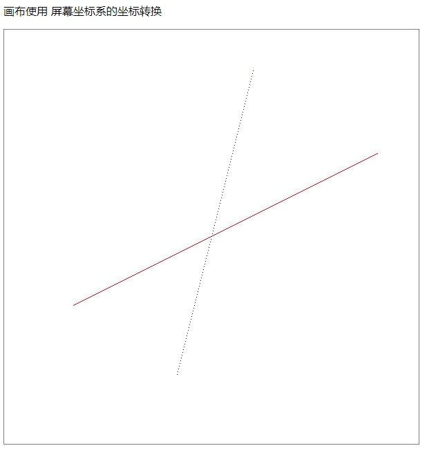

# 画布

html canvas实现

* 主要认识屏幕坐标系，以及颜色的表达方式，减法模型减法模型。画布坐标系与屏幕坐标系的转换。

实现效果



```html
<!DOCTYPE html>
<html lang="en">

<head>
    <meta charset="UTF-8">
    <meta name="viewport" content="width=device-width, initial-scale=1.0">
    <title>Document</title>
</head>

<body>
    <p>画布使用 屏幕坐标系的坐标转换</p>
    <div class class="centered">
        <canvas id="canvas" width=600 height=600 style="border:1px grey solid"></canvas>
    </div>
</body>

<script>
    // 画布
    const canvas = document.getElementById("canvas");
    let canvas_context = canvas.getContext("2d");
    let canvas_buffer = canvas_context.getImageData(0, 0, canvas.width, canvas.height);
    console.log(canvas_context);
    console.log(canvas_buffer);

    // 创建一个新的颜色对象
    function Color(r, g, b) {
        return { r, g, b };
    }

    // (x,y) 是以以画布中心为原点，向上为+y,向右为+x的坐标系的点
    function PutPixel(x, y, color) {
        // console.log({ x, y, color });
        // 将(x,y)转换为屏幕坐标系中的点
        x = canvas.width / 2 + x;//(x|0)作用是将x转为整数
        y = canvas.height / 2 - y - 1;
        x = parseInt(x);
        y = parseInt(y);
        if (x < 0 || x >= canvas.width || y < 0 || y >= canvas.height) {
            return;
        }
        // 像素buffer偏移量
        let offset = 4 * (x + canvas_buffer.width * y);//y行+x个
        canvas_buffer.data[offset++] = color.r;
        canvas_buffer.data[offset++] = color.g;
        canvas_buffer.data[offset++] = color.b;
        canvas_buffer.data[offset++] = 255; // Alpha = 255 满透明度
    }

    // 将buffer内容更新到画布上
    function UpdateCanvas() {
        canvas_context.putImageData(canvas_buffer, 0, 0);
    }

    // 例子画线段
    function DrawLineBroken(x0, y0, x1, y1, color) {
        let a = (y1 - y0) / (x1 - x0);//斜率
        let y = y0;
        let step = 1;
        for (let x = x0; x <= x1; x += step) {
            PutPixel(x, y, color);
            y += a * step;
        }
    }

    DrawLineBroken(-200, -100, 240, 120, new Color(255, 0, 0));
    DrawLineBroken(-50, -200, 60, 240, new Color(0, 0, 255));

    UpdateCanvas();

</script>

</html>
```
