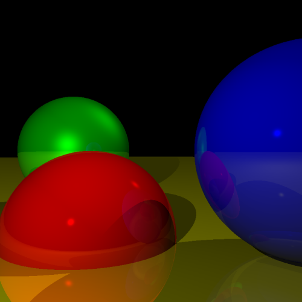
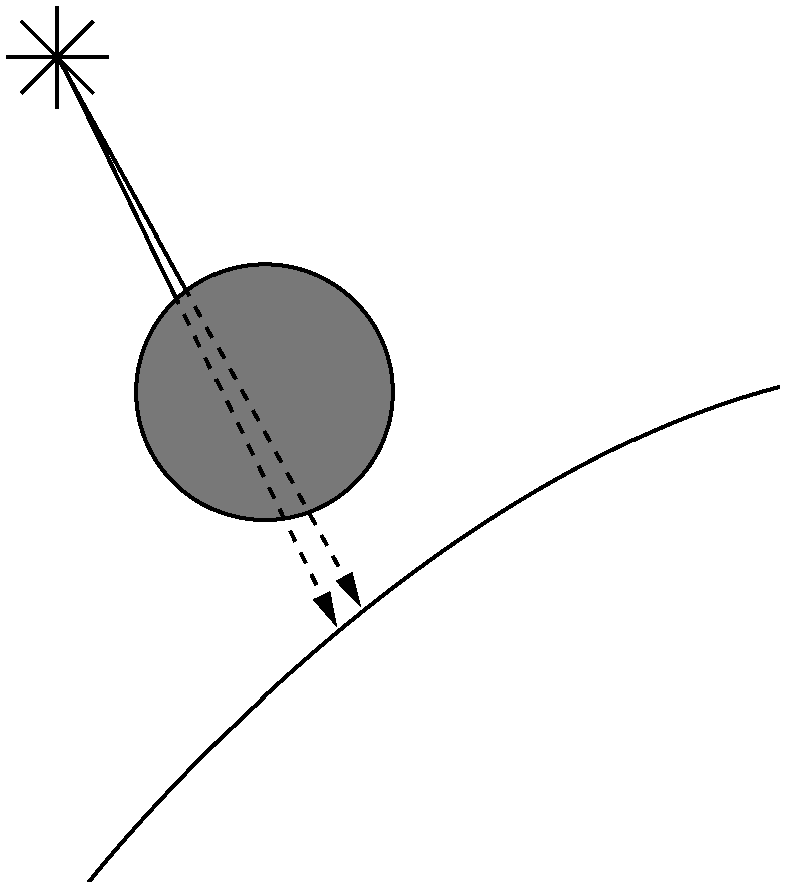
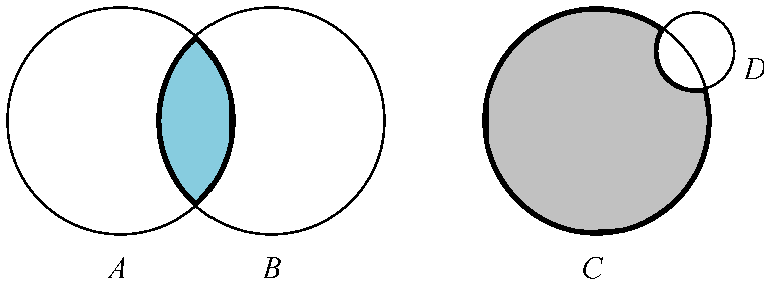
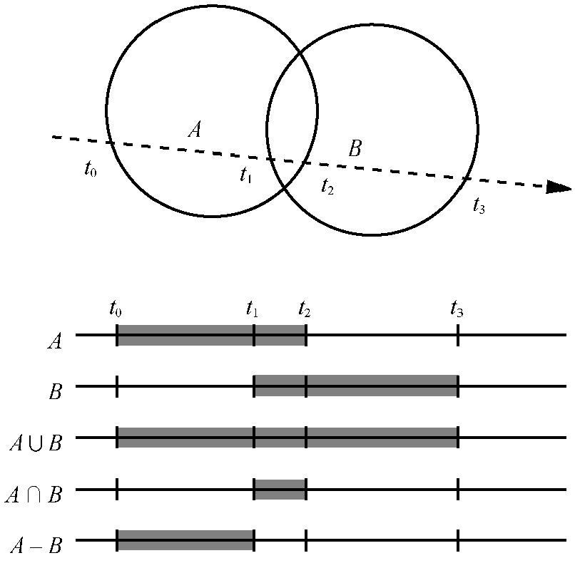
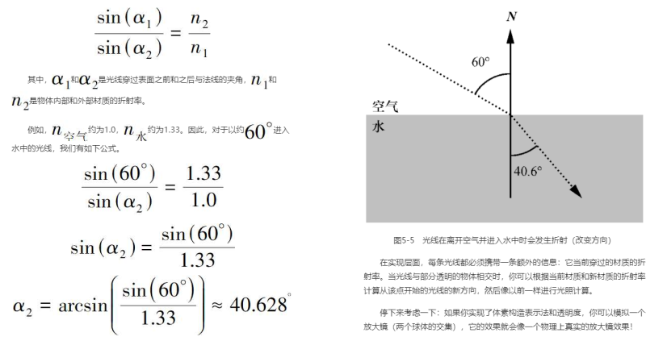

# 扩展光线追踪渲染器

## 任意相机定位

让射线方向乘旋转矩阵即可达到效果

实现效果



代码

```html
<!DOCTYPE html>
<html lang="en">

<head>
    <meta charset="UTF-8">
    <meta name="viewport" content="width=device-width, initial-scale=1.0">
    <title>Document</title>
</head>

<body>
    <p>简单光线追踪 任意相机位置</p>
    <div class class="centered">
        <canvas id="canvas" width=800 height=800 style="border:1px grey solid"></canvas>
    </div>
    <input type="radio" id="eps-0" name="shadow-ray-start" onClick="SetShadowEpsilon(0);">
    <label for='eps-0'>Zero</label><br>
    <input type="radio" id="eps-e" name="shadow-ray-start" onClick="SetShadowEpsilon(0.001);" checked>
    <label for='eps-e'>Epsilon</label>
    <br>
    <input type="number" id="rec-limit" onchange="UpdateRecursionLimit();" min="0" max="5" witdh="3" value="3">
</body>

<script>
    // 画布
    const canvas = document.getElementById("canvas");
    let canvas_context = canvas.getContext("2d");
    let canvas_buffer = canvas_context.getImageData(0, 0, canvas.width, canvas.height);
    console.log(canvas_context);
    console.log(canvas_buffer);

    // 创建一个新的颜色对象
    function Color(r, g, b) {
        return {
            r, g, b,
            mul(n) {
                return new Color(this.r * n, this.g * n, this.b * n);
            },
            add(color) {
                return new Color(this.r + color.r, this.g + color.g, this.b + color.b)
            }
        };
    }

    // (x,y) 是以以画布中心为原点，向上为+y,向右为+x的坐标系的点
    function PutPixel(x, y, color) {
        // console.log({ x, y, color });
        // 将(x,y)转换为屏幕坐标系中的点
        x = canvas.width / 2 + x;//(x|0)作用是将x转为整数
        y = canvas.height / 2 - y - 1;
        x = parseInt(x);
        y = parseInt(y);
        if (x < 0 || x >= canvas.width || y < 0 || y >= canvas.height) {
            return;
        }
        if (x < 0 || x >= canvas.width || y < 0 || y >= canvas.height) {
            return;
        }
        // 像素buffer偏移量
        let offset = 4 * (x + canvas_buffer.width * y);//y行+x个
        canvas_buffer.data[offset++] = color.r;
        canvas_buffer.data[offset++] = color.g;
        canvas_buffer.data[offset++] = color.b;
        canvas_buffer.data[offset++] = 255; // Alpha = 255 满透明度
    }

    // 将buffer内容更新到画布上
    function UpdateCanvas() {
        canvas_context.putImageData(canvas_buffer, 0, 0);
    }

    // 清除画布内容
    function ClearAll() {
        canvas.width = canvas.width;
    }

    // 构造向量对象
    function Vec(x, y, z) {
        return {
            x, y, z,
            // 求点积
            dot(vec) {
                return this.x * vec.x + this.y * vec.y + this.z * vec.z;
            },
            // 向量相减
            sub(vec) {
                return new Vec(this.x - vec.x, this.y - vec.y, this.z - vec.z);
            },
            // 向量相加
            add(vec) {
                return new Vec(this.x + vec.x, this.y + vec.y, this.z + vec.z);
            },
            // 向量乘常数n
            mul(n) {
                return new Vec(this.x * n, this.y * n, this.z * n);
            },
            // 计算向量长度
            length() {
                return Math.sqrt(this.dot(this));
            }
        };
    }

    // 求 v1相对v2的反射向量 v2必须为单位向量
    function ReflectRay(v1, v2) {
        return v2.mul(2 * v1.dot(v2)).sub(v1);
    }

    // 矩阵乘向量
    function MultiplyMV(mat, vec) {
        let result = [0, 0, 0];
        vec = [vec.x, vec.y, vec.z];
        for (let i = 0; i < 3; i++) {
            for (let j = 0; j < 3; j++) {
                result[i] += vec[j] * mat[i][j];
            }
        }
        return new Vec(result[0], result[1], result[2]);
    }

    // 球体对象
    function Sphere(center, radius, color, specular, reflective) {
        return {
            center, // 球心
            radius, // 半径
            color, // 颜色
            specular, // 镜面反射指数 会形成光泽 可以区分哑光与镜面材质
            reflective // 表面反射程度
        };
    }

    // 光源
    function Light(ltype, intensity, position) {
        return { ltype, intensity, position };
    }
    // 光源类型
    Light.AMBIENT = 0; // 场景光
    Light.POINT = 1; // 点光
    Light.DIRECTIONAL = 2; // 方向光

    // 场景设置
    let EPSILON = 0.001; // 一个无限靠近0的实数
    let RECURSION_DEPTH = 3; // 反射递归深度
    const VIEWPORT_SIZE_X = 1; // 视口大小
    const VIEWPORT_SIZE_Y = 1
    const PROJECTION_PLANE_Z = 1; // 视口距离相机的距离 相机朝向+z
    const CAMERA_POSITION = new Vec(3, 0, 1); // 相机位置
    const CAMERA_ROTATION = [
        [0.7071, 0, -0.7071],
        [0, 1, 0],
        [0.7071, 0, 0.7071]
    ];
    const BACKGROUND_COLOR = new Color(0, 0, 0); // 画布背景颜色

    // 球体
    const spheres = [
        new Sphere(new Vec(0, -1, 3), 1, new Color(255, 0, 0), 500, 0.2),
        new Sphere(new Vec(-2, 0, 4), 1, new Color(0, 255, 0), 10, 0.4),
        new Sphere(new Vec(2, 0, 4), 1, new Color(0, 0, 255), 500, 0.3),
        new Sphere(new Vec(0, -5001, 0), 5000, new Color(255, 255, 0), 1000, 0.5)
    ];

    // 场景光源
    let lights = [
        new Light(Light.AMBIENT, 0.1), // 场景光
        new Light(Light.POINT, 0.8, new Vec(2, 1, 0)),
        new Light(Light.DIRECTIONAL, 0.4, new Vec(1, 4, 4))
    ];

    // 画布坐标到视口坐标的转换
    function CanvasToViewport(x, y) {
        return new Vec(
            x * (VIEWPORT_SIZE_X / canvas.width),
            y * (VIEWPORT_SIZE_Y / canvas.height),
            PROJECTION_PLANE_Z // 视口平面的坐标z值为PROJECTION_PLANE_Z
        );
    }

    // origin: 射线原点
    // direction: 射线方向
    // sphere: 球体
    function IntersectRaySphere(origin, direction, sphere) {
        // 球体方程 (P-C)*(P-C) = r^2 P为球面上一点 C为球心 r为球体半径
        // 射线上一点 P = O + tD O为射线原点 D为方向
        // 二者方程组可以把P消掉， 可以求解t
        // (O+tD-C)*(O+tD-C)=r ^ 2
        // CO*CO + tD*CO + CO*tD + tD*tD = r^2
        // tD*tD + 2CO*tD + CO*CO = r^2
        // t^2 (D*D) + 2t(CO * D) + CO * CO - r^2 = 0
        // 一元二次方程一般形式 ax^2+bx+c=0(a!=0)
        // 解为 {t1,t2} = ( -b (+-) sqrt(b^2-4ac) ) / 2a
        // t<0 在相机后面
        // 0<=t<=1 在相机和视口间
        // t>1 在视口前

        let co = origin.sub(sphere.center);

        let a = direction.dot(direction);
        let b = 2 * co.dot(direction);
        let c = co.dot(co) - sphere.radius * sphere.radius;
        // 解个数判别式
        let discriminant = b * b - 4 * a * c;
        if (discriminant < 0) {
            return [Infinity, Infinity]; // 无解
        }
        let t1 = (-b + Math.sqrt(discriminant)) / (2 * a);
        let t2 = (-b - Math.sqrt(discriminant)) / (2 * a);
        return [t1, t2];
    }

    function ComputeLighting(point, normal, view, specular) {
        let intensity = 0;
        let length_n = normal.length(); // 必须为1
        let length_v = view.length();

        // 遍历所有光源
        for (let i = 0; i < lights.length; i++) {
            let light = lights[i];
            if (light.ltype == Light.AMBIENT) { // 环境光
                intensity += light.intensity;
                continue;
            }

            let vec_l, t_max; // vec_l 为场景点P到光源向量 t_max为阴影检测最大范围
            if (light.ltype == Light.POINT) {
                vec_l = light.position.sub(point);
                t_max = 1.0; // 点光则阴影最大检查点P到光源即1
            } else { // Light.DIRECTIONAL
                vec_l = light.position;
                t_max = Infinity; // 方向光则阴影最大检查点P到光源即无限远
            }

            // 阴影检测
            let blocker = ClosestIntersection(point, vec_l, EPSILON, t_max);
            if (blocker) {
                continue; // 光源到点P之间有物体
            }

            // 漫反射
            let n_dot_l = normal.dot(vec_l);
            if (n_dot_l > 0) {
                intensity += light.intensity * n_dot_l / (length_n * vec_l.length());
            }

            // 镜面反射
            if (specular != -1) { // -1表示为哑光不参与镜面反射计算
                let vec_r = normal.mul(2.0 * n_dot_l).sub(vec_l);
                let r_dot_v = vec_r.dot(view);
                if (r_dot_v > 0) {
                    intensity += light.intensity * Math.pow(r_dot_v / (vec_r.length() * length_v), specular);
                }
            }
        }

        return intensity;
    }

    // 找从点origin到方向direction发出射线最先相交的球 射线检测范围min_t到max_t
    function ClosestIntersection(origin, direction, min_t, max_t) {
        let closest_t = Infinity; // 最近距离
        let closest_sphere = null; // 最近的球体

        // 遍历所有球体
        for (let i = 0; i < spheres.length; i++) {
            let ts = IntersectRaySphere(origin, direction, spheres[i]);
            // 求射线与球体相交的解 最多可能有两个解 哪个近用哪个
            if (ts[0] < closest_t && min_t < ts[0] && ts[0] < max_t) {
                closest_t = ts[0];
                closest_sphere = spheres[i];
            }
            if (ts[1] < closest_t && min_t < ts[1] && ts[1] < max_t) {
                closest_t = ts[1];
                closest_sphere = spheres[i];
            }
        }

        // 射线没和任何球体相交则返回背景色
        if (closest_sphere == null) {
            return null;
        }
        return [closest_sphere, closest_t];
    }

    // 从原点朝direction射出射线
    function TraceRay(origin, direction, min_t, max_t, depth) {
        // 找从相机到视口发出射线最先相交的球
        let intersection = ClosestIntersection(origin, direction, min_t, max_t);
        if (!intersection) { // 无解则返回背景色
            return BACKGROUND_COLOR;
        }

        let closest_sphere = intersection[0]; // 最先相交的球体
        let closest_t = intersection[1]; // 最先相交点P的长度 用direction倍数表示

        let point = origin.add(direction.mul(closest_t)); // 射线与场景球体表面交点P
        let normal = point.sub(closest_sphere.center); // 球体表面点P的法线
        normal = normal.mul(1.0 / normal.length()); // 归一化

        let view = direction.mul(-1); // V与射线方向相反
        let lighting = ComputeLighting(point, normal, view, closest_sphere.specular);
        let point_local_color = closest_sphere.color.mul(lighting); // 点P本身颜色

        if (closest_sphere.reflective <= 0 || depth <= 0) { // 递归出口
            return point_local_color; // 球材质不参与反射
        }

        let reflected_ray = ReflectRay(view, normal); // view根据normal的对称向量
        let reflected_color = TraceRay(point, reflected_ray, EPSILON, Infinity, depth - 1);
        // 相当于相机在P点朝向view反向的反射方向再次光线追踪

        let local_contribution = point_local_color.mul(1 - closest_sphere.reflective); // P点本身的部分
        let reflected_contribution = reflected_color.mul(closest_sphere.reflective); // 反射到P点的部分

        return local_contribution.add(reflected_contribution);
    }

    function SetShadowEpsilon(epsilon) {
        EPSILON = epsilon;
        Render();
    }

    function UpdateRecursionLimit() {
        let v = document.getElementById("rec-limit").value | 0; // 取整
        if (v < 0) {
            v = 0;
        }
        if (v > 5) {
            v = 5;
        }
        document.getElementById("rec-limit").value = v;
        if (RECURSION_DEPTH != v) {
            RECURSION_DEPTH = v;
            Render();
        }
    }

    function Render() {
        ClearAll();
        setTimeout(() => {
            // 从相机位置朝向视口平面上的每个点发出射线 追踪从哪里射进来光源
            for (let x = -canvas.width / 2; x < canvas.width / 2; x++) {
                for (let y = -canvas.height / 2; y < canvas.height / 2; y++) {
                    let direction = CanvasToViewport(x, y);
                    direction = MultiplyMV(CAMERA_ROTATION, direction);
                    let color = TraceRay(CAMERA_POSITION,
                        direction,
                        Math.sqrt(direction.dot(direction)),
                        Infinity,
                        RECURSION_DEPTH); // 1到无限远
                    PutPixel(x, y, color);
                }
            }
            UpdateCanvas(); // 刷新缓冲到画布
        }, 0);
    }

    Render();


</script>

</html>
```

## 性能优化

### 并行计算

多线程支持，如每个任务负责对画布的一部分（一个矩形区域，小到一个像素）

### 缓存不变值

缓存（caching）是一种避免一遍又一遍地重复相同计算的方法。每当有一个计算量很大的计算并且你希望重复使用此计算结果时，缓存（存储）此结果并在下次需要时重复使用它可能是个好主意，特别是如果此值不经常更改时。如有些矩阵计算，参与计算的值与表达式是不变的，就无需每帧都重新计算。

### 阴影的优化

当物体表面上的一个点因为有另一个物体处于光线照射路径上而处于阴影中时，它旁边的点很可能也处于同一物体的阴影中，这称为阴影相干性（shadow coherence）。



附近的点计算光源的阴影，可以直接检测旁边点命中的那个物体，如果能命中，则不必每个物体都去检测。

### 空间结构

计算射线与场景中每个球体的交点有点儿浪费资源。有许多数据结构可以让你一次性丢弃整组物体，而无须单独计算交点。

假设你有几个距离很近的球体。你可以计算包含这些球体的最小球体的圆心和半径。如果射线不与这个边界球（bounding sphere）相交，你可以确定它不与该球体包含的任何一个球体相交，代价是进行一次相交测试。当然，如果它们相交，你仍然需要检查它是否与该球体所包含的任何一个球体相交。

你还可以进一步创建多个层级的边界球（球体组），使其形成一个层次结构。只有当某一个真正的球体极有可能与射线相交时，才需要一直遍历到层次结构的底层。

这系列技术可以通过搜索`边界体层级(bounding volum hierarchy)`找到更多内容。

### 子采样

这里有一个简单的方法可以让你的光线追踪渲染器快N倍，即像素计算量变为原来的1/N！

对于画布中的每个像素，我们通过视口追踪一条射线，从而采样来自那个方向的光的颜色。如果我们的射线数量少于像素数量，我们将对场景进行子采样（subsampling）。但是我们如何做到这一点并仍然能正确地渲染场景呢？

假设你跟踪像素(10, 100)和(12, 100)的射线，并且它们碰巧“击中”同一个物体。你可以合理地假设像素(11, 100)的射线也将“击中”同一个物体，因此你可以跳过对射线与场景中所有物体的交点进行初始搜索的阶段，并直接跳转到计算该点的颜色这一步。

如果你在水平和垂直方向上每隔一个像素跳过一个像素，你最多可以减少75%的主要射线与场景相交计算——这是4倍的加速！

在某种程度上，这是“偷工减料”。关键是要知道在保证满意结果的同时可以走哪些捷径。在计算机图形学的许多领域中，重要的是结果的主观质量。

## 支持其他图元

TraceRay需要能够为一条射线和任何给定的物体计算两个东西：它们之间最近交点的值和该交点处的法线。光线追踪渲染器中的其他所有内容都与物体无关！

三角形是一个很好的需要支持的图元。三角形是最简单的多边形，所以你可以用三角形构建任何其他的多边形。它们在数学上很容易操作，所以它们是表示更复杂曲面的近似值的好方法。

要给光线追踪渲染器添加三角形支持，你只需要改变TraceRay。首先，计算射线（由它的原点和方向给出）与包含三角形的平面（由它的法线和它到原点的距离给出）的交点。

因为平面是无限大的，射线几乎总是与任何给定的平面相交（除非它们完全平行），所以第二步是确定射线与平面的交点是否在三角形内。这包括使用重心坐标（barycentric coordinate，也叫质心坐标），或者，相对于三角形的3条边，使用叉积（cross product）来检查点是否在每条边的“内侧”。

一旦你确定了这个点在三角形内，交点的法线就是平面的法线。让TraceRay返回适当的值即可，不需要进一步的更改！

## 体素构造表示法

假设我们想要渲染比球体或弯曲物体更复杂的物体，这些物体难以使用一组三角形进行准确建模。
如放大镜与《星球大战》里的死星。



两个球体的并集、交集、差集。与光线追踪射线的t关系。



## 透明度

实现这一点与实现反射非常相似。当射线照射到部分透明的物体表面时，你可以像之前一样计算局部颜色和反射颜色，但是你还需要计算一个额外的颜色——通过调用另一个TraceRay获得的穿透物体的光线的颜色。然后根据物体的透明程度，将这个颜色与局部颜色和反射颜色混合，就像我们计算物体反射时所做的一样。

### 光线折射

在现实生活中，当一束光线穿过透明物体时，它会改变方向。方向变化的方式取决于每种材料的一种性质，这种性质称为折射率（refraction index）。下面的方程，称为斯内尔定律（Snell’s law）。



## 超采样

超采样（supersampling）或多或少与子采样相反。在这种情况下，你需要的是准确性而不是性能。
解决这个问题的方法就是在每个像素上追踪更多的射线——4、9、16，你想要多少就追踪多少——然后对它们获得的颜色值求平均值来得到最终像素的颜色。

## 键盘按键相机移动

使用 q a w s e d r f t g y h 进行相机位置移动与角度旋转

```html
<!DOCTYPE html>
<html lang="en">

<head>
    <meta charset="UTF-8">
    <meta name="viewport" content="width=device-width, initial-scale=1.0">
    <title>Document</title>
</head>

<body>
    <p>简单光线追踪 任意相机位置</p>
    <div class class="centered">
        <canvas id="canvas" width=800 height=800 style="border:1px grey solid"></canvas>
    </div>
    <input type="radio" id="eps-0" name="shadow-ray-start" onClick="SetShadowEpsilon(0);">
    <label for='eps-0'>Zero</label><br>
    <input type="radio" id="eps-e" name="shadow-ray-start" onClick="SetShadowEpsilon(0.001);" checked>
    <label for='eps-e'>Epsilon</label>
    <br>
    <input type="number" id="rec-limit" onchange="UpdateRecursionLimit();" min="0" max="5" witdh="3" value="3">
</body>

<script>
    // 画布
    const canvas = document.getElementById("canvas");
    let canvas_context = canvas.getContext("2d");
    let canvas_buffer = canvas_context.getImageData(0, 0, canvas.width, canvas.height);
    console.log(canvas_context);
    console.log(canvas_buffer);

    // 创建一个新的颜色对象
    function Color(r, g, b) {
        return {
            r, g, b,
            mul(n) {
                return new Color(this.r * n, this.g * n, this.b * n);
            },
            add(color) {
                return new Color(this.r + color.r, this.g + color.g, this.b + color.b)
            }
        };
    }

    // (x,y) 是以以画布中心为原点，向上为+y,向右为+x的坐标系的点
    function PutPixel(x, y, color) {
        // console.log({ x, y, color });
        // 将(x,y)转换为屏幕坐标系中的点
        x = canvas.width / 2 + x;//(x|0)作用是将x转为整数
        y = canvas.height / 2 - y - 1;
        x = parseInt(x);
        y = parseInt(y);
        if (x < 0 || x >= canvas.width || y < 0 || y >= canvas.height) {
            return;
        }
        if (x < 0 || x >= canvas.width || y < 0 || y >= canvas.height) {
            return;
        }
        // 像素buffer偏移量
        let offset = 4 * (x + canvas_buffer.width * y);//y行+x个
        canvas_buffer.data[offset++] = color.r;
        canvas_buffer.data[offset++] = color.g;
        canvas_buffer.data[offset++] = color.b;
        canvas_buffer.data[offset++] = 255; // Alpha = 255 满透明度
    }

    // 将buffer内容更新到画布上
    function UpdateCanvas() {
        canvas_context.putImageData(canvas_buffer, 0, 0);
    }

    // 清除画布内容
    function ClearAll() {
        canvas.width = canvas.width;
    }

    // 构造向量对象
    function Vec(x, y, z) {
        return {
            x, y, z,
            // 求点积
            dot(vec) {
                return this.x * vec.x + this.y * vec.y + this.z * vec.z;
            },
            // 向量相减
            sub(vec) {
                return new Vec(this.x - vec.x, this.y - vec.y, this.z - vec.z);
            },
            // 向量相加
            add(vec) {
                return new Vec(this.x + vec.x, this.y + vec.y, this.z + vec.z);
            },
            // 向量乘常数n
            mul(n) {
                return new Vec(this.x * n, this.y * n, this.z * n);
            },
            // 计算向量长度
            length() {
                return Math.sqrt(this.dot(this));
            }
        };
    }

    // 求 v1相对v2的反射向量 v2必须为单位向量
    function ReflectRay(v1, v2) {
        return v2.mul(2 * v1.dot(v2)).sub(v1);
    }

    // 矩阵乘向量
    function MultiplyMV(mat, vec) {
        let result = [0, 0, 0];
        vec = [vec.x, vec.y, vec.z];
        for (let i = 0; i < 3; i++) {
            for (let j = 0; j < 3; j++) {
                result[i] += vec[j] * mat[i][j];
            }
        }
        return new Vec(result[0], result[1], result[2]);
    }

    // 球体对象
    function Sphere(center, radius, color, specular, reflective) {
        return {
            center, // 球心
            radius, // 半径
            color, // 颜色
            specular, // 镜面反射指数 会形成光泽 可以区分哑光与镜面材质
            reflective // 表面反射程度
        };
    }

    // 光源
    function Light(ltype, intensity, position) {
        return { ltype, intensity, position };
    }

    // 绕X轴旋转矩阵
    function XRotationMat(a) {
        a = a * Math.PI / 180.;
        return [
            [1, 0, 0],
            [0, Math.cos(a), -Math.sin(a)],
            [0, Math.sin(a), Math.cos(a)]
        ];
    }

    // 绕Y轴旋转矩阵
    function YRotationMat(a) {
        a = a * Math.PI / 180.;
        return [
            [Math.cos(a), 0, Math.sin(a)],
            [0, 1, 0],
            [-Math.sin(a), 0, Math.cos(a)]
        ];
    }

    // 绕Z轴旋转矩阵
    function ZRotationMat(a) {
        a = a * Math.PI / 180.;
        return [
            [Math.cos(a), -Math.sin(a), 0],
            [Math.sin(a), Math.cos(a), 0],
            [0, 0, 1]
        ];
    }

    // 光源类型
    Light.AMBIENT = 0; // 场景光
    Light.POINT = 1; // 点光
    Light.DIRECTIONAL = 2; // 方向光

    // 场景设置
    let EPSILON = 0.001; // 一个无限靠近0的实数
    let RECURSION_DEPTH = 3; // 反射递归深度
    const VIEWPORT_SIZE_X = 1; // 视口大小
    const VIEWPORT_SIZE_Y = 1
    const PROJECTION_PLANE_Z = 1; // 视口距离相机的距离 相机朝向+z
    let CAMERA_POSITION = new Vec(3, 0, 1); // 相机位置
    let CAMERA_ROTATION_X = 0;
    let CAMERA_ROTATION_Y = 0;
    let CAMERA_ROTATION_Z = 0;
    const BACKGROUND_COLOR = new Color(0, 0, 0); // 画布背景颜色

    // 球体
    const spheres = [
        new Sphere(new Vec(0, -1, 3), 1, new Color(255, 0, 0), 500, 0.2),
        new Sphere(new Vec(-2, 0, 4), 1, new Color(0, 255, 0), 10, 0.4),
        new Sphere(new Vec(2, 0, 4), 1, new Color(0, 0, 255), 500, 0.3),
        new Sphere(new Vec(0, -5001, 0), 5000, new Color(255, 255, 0), 1000, 0.5)
    ];

    // 场景光源
    let lights = [
        new Light(Light.AMBIENT, 0.1), // 场景光
        new Light(Light.POINT, 0.8, new Vec(2, 1, 0)),
        new Light(Light.DIRECTIONAL, 0.4, new Vec(1, 4, 4))
    ];

    // 画布坐标到视口坐标的转换
    function CanvasToViewport(x, y) {
        return new Vec(
            x * (VIEWPORT_SIZE_X / canvas.width),
            y * (VIEWPORT_SIZE_Y / canvas.height),
            PROJECTION_PLANE_Z // 视口平面的坐标z值为PROJECTION_PLANE_Z
        );
    }

    // origin: 射线原点
    // direction: 射线方向
    // sphere: 球体
    function IntersectRaySphere(origin, direction, sphere) {
        // 球体方程 (P-C)*(P-C) = r^2 P为球面上一点 C为球心 r为球体半径
        // 射线上一点 P = O + tD O为射线原点 D为方向
        // 二者方程组可以把P消掉， 可以求解t
        // (O+tD-C)*(O+tD-C)=r ^ 2
        // CO*CO + tD*CO + CO*tD + tD*tD = r^2
        // tD*tD + 2CO*tD + CO*CO = r^2
        // t^2 (D*D) + 2t(CO * D) + CO * CO - r^2 = 0
        // 一元二次方程一般形式 ax^2+bx+c=0(a!=0)
        // 解为 {t1,t2} = ( -b (+-) sqrt(b^2-4ac) ) / 2a
        // t<0 在相机后面
        // 0<=t<=1 在相机和视口间
        // t>1 在视口前

        let co = origin.sub(sphere.center);

        let a = direction.dot(direction);
        let b = 2 * co.dot(direction);
        let c = co.dot(co) - sphere.radius * sphere.radius;
        // 解个数判别式
        let discriminant = b * b - 4 * a * c;
        if (discriminant < 0) {
            return [Infinity, Infinity]; // 无解
        }
        let t1 = (-b + Math.sqrt(discriminant)) / (2 * a);
        let t2 = (-b - Math.sqrt(discriminant)) / (2 * a);
        return [t1, t2];
    }

    function ComputeLighting(point, normal, view, specular) {
        let intensity = 0;
        let length_n = normal.length(); // 必须为1
        let length_v = view.length();

        // 遍历所有光源
        for (let i = 0; i < lights.length; i++) {
            let light = lights[i];
            if (light.ltype == Light.AMBIENT) { // 环境光
                intensity += light.intensity;
                continue;
            }

            let vec_l, t_max; // vec_l 为场景点P到光源向量 t_max为阴影检测最大范围
            if (light.ltype == Light.POINT) {
                vec_l = light.position.sub(point);
                t_max = 1.0; // 点光则阴影最大检查点P到光源即1
            } else { // Light.DIRECTIONAL
                vec_l = light.position;
                t_max = Infinity; // 方向光则阴影最大检查点P到光源即无限远
            }

            // 阴影检测
            let blocker = ClosestIntersection(point, vec_l, EPSILON, t_max);
            if (blocker) {
                continue; // 光源到点P之间有物体
            }

            // 漫反射
            let n_dot_l = normal.dot(vec_l);
            if (n_dot_l > 0) {
                intensity += light.intensity * n_dot_l / (length_n * vec_l.length());
            }

            // 镜面反射
            if (specular != -1) { // -1表示为哑光不参与镜面反射计算
                let vec_r = normal.mul(2.0 * n_dot_l).sub(vec_l);
                let r_dot_v = vec_r.dot(view);
                if (r_dot_v > 0) {
                    intensity += light.intensity * Math.pow(r_dot_v / (vec_r.length() * length_v), specular);
                }
            }
        }

        return intensity;
    }

    // 找从点origin到方向direction发出射线最先相交的球 射线检测范围min_t到max_t
    function ClosestIntersection(origin, direction, min_t, max_t) {
        let closest_t = Infinity; // 最近距离
        let closest_sphere = null; // 最近的球体

        // 遍历所有球体
        for (let i = 0; i < spheres.length; i++) {
            let ts = IntersectRaySphere(origin, direction, spheres[i]);
            // 求射线与球体相交的解 最多可能有两个解 哪个近用哪个
            if (ts[0] < closest_t && min_t < ts[0] && ts[0] < max_t) {
                closest_t = ts[0];
                closest_sphere = spheres[i];
            }
            if (ts[1] < closest_t && min_t < ts[1] && ts[1] < max_t) {
                closest_t = ts[1];
                closest_sphere = spheres[i];
            }
        }

        // 射线没和任何球体相交则返回背景色
        if (closest_sphere == null) {
            return null;
        }
        return [closest_sphere, closest_t];
    }

    // 从原点朝direction射出射线
    function TraceRay(origin, direction, min_t, max_t, depth) {
        // 找从相机到视口发出射线最先相交的球
        let intersection = ClosestIntersection(origin, direction, min_t, max_t);
        if (!intersection) { // 无解则返回背景色
            return BACKGROUND_COLOR;
        }

        let closest_sphere = intersection[0]; // 最先相交的球体
        let closest_t = intersection[1]; // 最先相交点P的长度 用direction倍数表示

        let point = origin.add(direction.mul(closest_t)); // 射线与场景球体表面交点P
        let normal = point.sub(closest_sphere.center); // 球体表面点P的法线
        normal = normal.mul(1.0 / normal.length()); // 归一化

        let view = direction.mul(-1); // V与射线方向相反
        let lighting = ComputeLighting(point, normal, view, closest_sphere.specular);
        let point_local_color = closest_sphere.color.mul(lighting); // 点P本身颜色

        if (closest_sphere.reflective <= 0 || depth <= 0) { // 递归出口
            return point_local_color; // 球材质不参与反射
        }

        let reflected_ray = ReflectRay(view, normal); // view根据normal的对称向量
        let reflected_color = TraceRay(point, reflected_ray, EPSILON, Infinity, depth - 1);
        // 相当于相机在P点朝向view反向的反射方向再次光线追踪

        let local_contribution = point_local_color.mul(1 - closest_sphere.reflective); // P点本身的部分
        let reflected_contribution = reflected_color.mul(closest_sphere.reflective); // 反射到P点的部分

        return local_contribution.add(reflected_contribution);
    }

    function SetShadowEpsilon(epsilon) {
        EPSILON = epsilon;
        Render();
    }

    function UpdateRecursionLimit() {
        let v = document.getElementById("rec-limit").value | 0; // 取整
        if (v < 0) {
            v = 0;
        }
        if (v > 5) {
            v = 5;
        }
        document.getElementById("rec-limit").value = v;
        if (RECURSION_DEPTH != v) {
            RECURSION_DEPTH = v;
            Render();
        }
    }

    function Render() {
        ClearAll();
        setInterval(() => {
            // 从相机位置朝向视口平面上的每个点发出射线 追踪从哪里射进来光源
            for (let x = -canvas.width / 2; x < canvas.width / 2; x++) {
                for (let y = -canvas.height / 2; y < canvas.height / 2; y++) {
                    let direction = CanvasToViewport(x, y);
                    direction = MultiplyMV(XRotationMat(CAMERA_ROTATION_X), direction);
                    direction = MultiplyMV(YRotationMat(CAMERA_ROTATION_Y), direction);
                    direction = MultiplyMV(ZRotationMat(CAMERA_ROTATION_Z), direction);
                    let color = TraceRay(CAMERA_POSITION,
                        direction,
                        Math.sqrt(direction.dot(direction)),
                        Infinity,
                        RECURSION_DEPTH); // 1到无限远
                    PutPixel(x, y, color);
                }
            }
            UpdateCanvas(); // 刷新缓冲到画布
        }, 20);
    }

    Render();

    // 当按下键盘按键时触发的函数
    function handleKeyDown(event) {
        const key = event.key;  // 获取按下的键
        const code = event.code;  // 获取按键的代码
        console.log(`按下了键: ${key}, 键码: ${code}`);

        // 示例：根据按下的键进行不同的处理
        if (key === "ArrowUp") {
            console.log("按了向上箭头");
        } else if (key === "ArrowDown") {
            console.log("按了向下箭头");
        } else if (key === "q") {
            console.log("按了字母 'q'");
            CAMERA_POSITION.x += 1;
        } else if (key === "a") {
            console.log("按了字母 'a'");
            CAMERA_POSITION.x -= 1;
        } else if (key === "w") {
            console.log("按了字母 'w'");
            CAMERA_POSITION.y += 1;
        } else if (key === "s") {
            console.log("按了字母 's'");
            CAMERA_POSITION.y -= 1;
        } else if (key === "e") {
            console.log("按了字母 'e'");
            CAMERA_POSITION.z += 1;
        } else if (key === "d") {
            console.log("按了字母 'd'");
            CAMERA_POSITION.z -= 1;
        } else if (key === "r") {
            console.log("按了字母 'r'");
            CAMERA_ROTATION_X += 1;
        } else if (key === "f") {
            console.log("按了字母 'f'");
            CAMERA_ROTATION_X -= 1;
        } else if (key === "t") {
            console.log("按了字母 't'");
            CAMERA_ROTATION_Y += 1;
        } else if (key === "g") {
            console.log("按了字母 'g'");
            CAMERA_ROTATION_Y -= 1;
        } else if (key === "y") {
            console.log("按了字母 'y'");
            CAMERA_ROTATION_Z += 1;
        } else if (key === "h") {
            console.log("按了字母 'h'");
            CAMERA_ROTATION_Z -= 1;
        }
    }

    // 当页面加载时添加事件监听
    window.addEventListener("DOMContentLoaded", () => {
        document.addEventListener("keydown", handleKeyDown);
    });

</script>

</html>
```
