# 光

在现实生活中，光源离得越远，看起来就越暗，这是因为空气中漂浮的粒子会在光线穿过它们时吸收部分光，虽然这在光线追踪渲染器中实现起来并不复杂，但为了简单下面例子将忽略空气的影响。

## 点光

点光：一个光源点向周围任何方向发射光，即全向光，场景中点P到光源Q,光向量即L=Q-P,L对场景中每个点都是不同的

## 方向光

方向光：从地球上看太阳光，其实就算是方向光，因为太远了。光向量L=Q(太阳球心)-P(地球球心)

## 环境光

环境光：当光照射到一个物体上时，一部分被吸收，其余的光会散射回场景中。这意味着光不仅可以来自光源，也可以来自从光源获得光并将其部分散射回场景的物体。

散射的光会反过来照射到其他物体，一部分会被吸收，一部分会被散射回场景。以此类推，直到原始光的所有能量都被场景中的物体表面吸收。

这意味着我们应该把每个物体当作光源，这就是全局光照(global illumination)。但全局光照非常复杂，所以引入环境光我们将声明环境光为场景中的每个点贡献一些光，不管它在哪里。这是对光源和场景中物体表面之间非常复杂的交互过程的一种粗略简化，但它的效果还不错。

一个场景会有单个环境光（因为环境光只有一个强度值，任意数量的环境光都可以简单地组合成一个环境光）和任意数量的点光及方向光。

## 单点光照

单点光照：计算单个点的光照，我们将计算每个光源贡献的光，并将它们加在一起，得到一个代表该点接收到的光的总量的数字。

然后我们可以用这个总量乘物体表面在该点的颜色，从而获得该点的着色颜色，用以代表该点接收了多少光。

## 漫反射

当一束光线照射在一个哑光物体上时，光线会沿着每个方向均匀地散射回场景中，这个过程叫做漫反射（diffuse reflection），这就是哑光物体看起来无光泽的原因。

例如，如果你相对于墙壁移动，它的颜色不会改变，无论你在哪里看，看到的物体反射的光是一样的。

反射的光的数量取决与光线和物体标表面之间的角度，光线所携带的能量必须根据角度分散在更小或更大的区域上，所以单位面积上反射到场景的能量分别更高或更低。

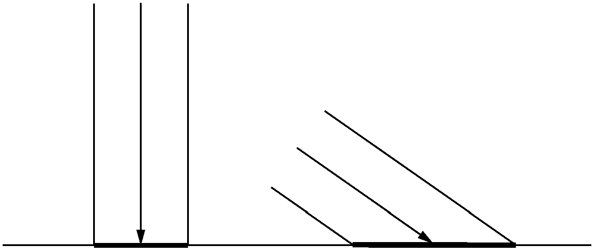

### 对漫反射的建模

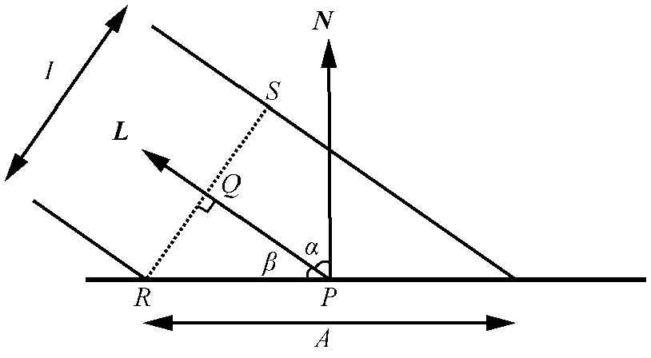

漫反射建模过程

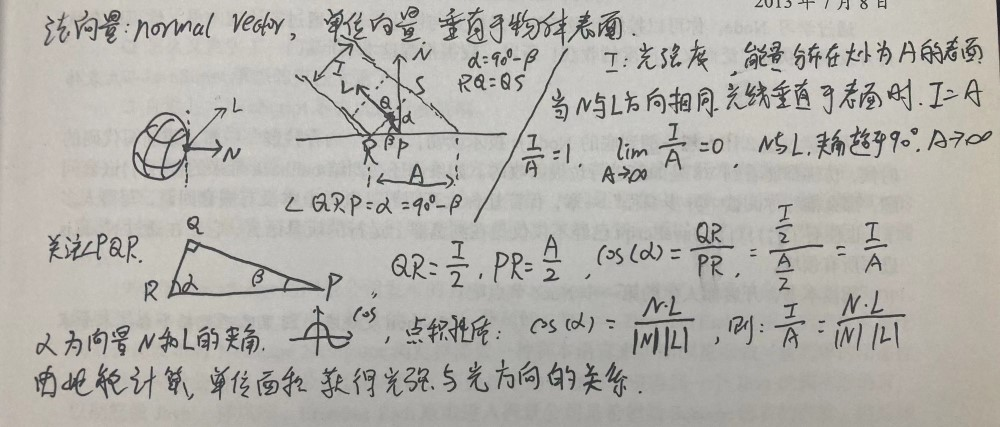

### 漫反射方程

场景点P接收到的全部光计算

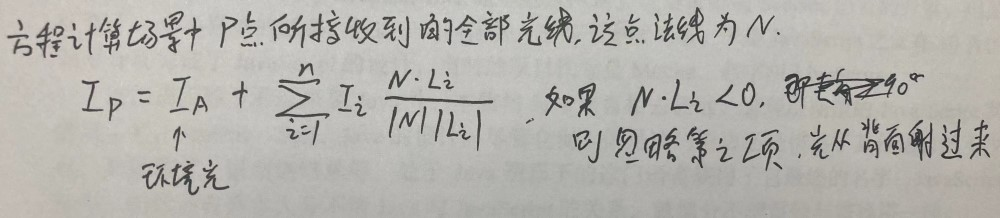

### 球体的法线

寻找场景中点P的法线还是比较复杂的，但是我们现在只讨论球体。

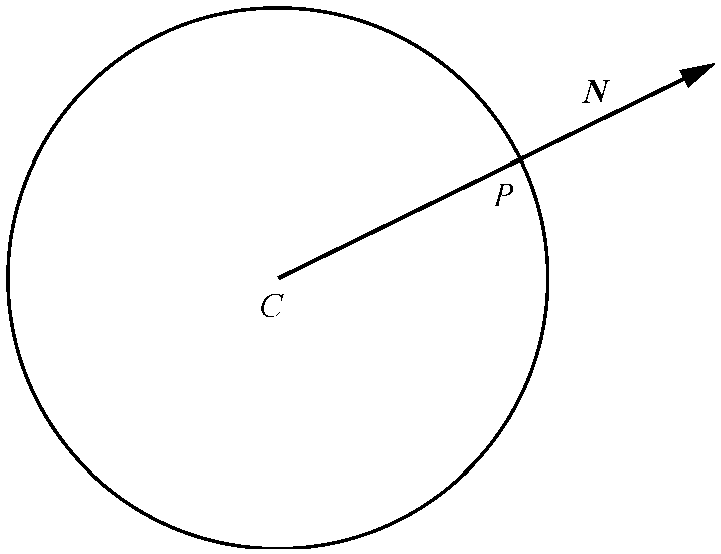

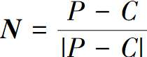

### 漫反射的渲染

实现效果


```html
<!DOCTYPE html>
<html lang="en">

<head>
    <meta charset="UTF-8">
    <meta name="viewport" content="width=device-width, initial-scale=1.0">
    <title>Document</title>
</head>

<body>
    <p>简单光线追踪 漫反射</p>
    <div class class="centered">
        <canvas id="canvas" width=800 height=800 style="border:1px grey solid"></canvas>
    </div>
</body>

<script>
    // 画布
    const canvas = document.getElementById("canvas");
    let canvas_context = canvas.getContext("2d");
    let canvas_buffer = canvas_context.getImageData(0, 0, canvas.width, canvas.height);
    console.log(canvas_context);
    console.log(canvas_buffer);

    // 创建一个新的颜色对象
    function Color(r, g, b) {
        return {
            r, g, b,
            mul(n) {
                return new Color(this.r * n, this.g * n, this.b * n);
            }
        };
    }

    // (x,y) 是以以画布中心为原点，向上为+y,向右为+x的坐标系的点
    function PutPixel(x, y, color) {
        // console.log({ x, y, color });
        // 将(x,y)转换为屏幕坐标系中的点
        x = canvas.width / 2 + x;//(x|0)作用是将x转为整数
        y = canvas.height / 2 - y - 1;
        x = parseInt(x);
        y = parseInt(y);
        if (x < 0 || x >= canvas.width || y < 0 || y >= canvas.height) {
            return;
        }
        if (x < 0 || x >= canvas.width || y < 0 || y >= canvas.height) {
            return;
        }
        // 像素buffer偏移量
        let offset = 4 * (x + canvas_buffer.width * y);//y行+x个
        canvas_buffer.data[offset++] = color.r;
        canvas_buffer.data[offset++] = color.g;
        canvas_buffer.data[offset++] = color.b;
        canvas_buffer.data[offset++] = 255; // Alpha = 255 满透明度
    }

    // 将buffer内容更新到画布上
    function UpdateCanvas() {
        canvas_context.putImageData(canvas_buffer, 0, 0);
    }

    // 构造向量对象
    function Vec(x, y, z) {
        return {
            x, y, z,
            // 求点积
            dot(vec) {
                return this.x * vec.x + this.y * vec.y + this.z * vec.z;
            },
            // 向量相减
            sub(vec) {
                return new Vec(this.x - vec.x, this.y - vec.y, this.z - vec.z);
            },
            // 向量相加
            add(vec) {
                return new Vec(this.x + vec.x, this.y + vec.y, this.z + vec.z);
            },
            // 向量乘常数n
            mul(n) {
                return new Vec(this.x * n, this.y * n, this.z * n);
            },
            // 计算向量长度
            length() {
                return Math.sqrt(this.dot(this));
            }
        };
    }

    // 球体对象
    function Sphere(center, radius, color) {
        return { center, radius, color };
    }

    // 光源
    function Light(ltype, intensity, position) {
        return { ltype, intensity, position };
    }
    // 光源类型
    Light.AMBIENT = 0; // 场景光
    Light.POINT = 1; // 点光
    Light.DIRECTIONAL = 2; // 方向光

    // 场景设置
    const VIEWPORT_SIZE_X = 1; // 视口大小
    const VIEWPORT_SIZE_Y = 1;
    const PROJECTION_PLANE_Z = 1; // 视口距离相机的距离 相机朝向+z
    const CAMERA_POSITION = new Vec(0, 0, 0); // 相机位置
    const BACKGROUND_COLOR = new Color(255, 255, 255); // 画布背景颜色

    // 球体
    const spheres = [
        new Sphere(new Vec(0, -1, 3), 1, new Color(255, 0, 0)),
        new Sphere(new Vec(-2, 0, 4), 1, new Color(0, 255, 0)),
        new Sphere(new Vec(2, 0, 4), 1, new Color(0, 0, 255)),
        new Sphere(new Vec(0, -5001, 0), 5000, new Color(255, 255, 0))
    ];

    // 场景光源
    let lights = [
        new Light(Light.AMBIENT, 0.2), // 场景光
        new Light(Light.POINT, 0.6, new Vec(2, 1, 0)),
        new Light(Light.DIRECTIONAL, 0.2, new Vec(1, 4, 4))
    ];

    // 画布坐标到视口坐标的转换
    function CanvasToViewport(x, y) {
        return new Vec(
            x * (VIEWPORT_SIZE_X / canvas.width),
            y * (VIEWPORT_SIZE_Y / canvas.height),
            PROJECTION_PLANE_Z // 视口平面的坐标z值为PROJECTION_PLANE_Z
        );
    }

    // origin: 射线原点
    // direction: 射线方向
    // sphere: 球体
    function IntersectRaySphere(origin, direction, sphere) {
        // 球体方程 (P-C)*(P-C) = r^2 P为球面上一点 C为球心 r为球体半径
        // 射线上一点 P = O + tD O为射线原点 D为方向
        // 二者方程组可以把P消掉， 可以求解t
        // (O+tD-C)*(O+tD-C)=r ^ 2
        // CO*CO + tD*CO + CO*tD + tD*tD = r^2
        // tD*tD + 2CO*tD + CO*CO = r^2
        // t^2 (D*D) + 2t(CO * D) + CO * CO - r^2 = 0
        // 一元二次方程一般形式 ax^2+bx+c=0(a!=0)
        // 解为 {t1,t2} = ( -b (+-) sqrt(b^2-4ac) ) / 2a
        // t<0 在相机后面
        // 0<=t<=1 在相机和视口间
        // t>1 在视口前

        let co = origin.sub(sphere.center);

        let a = direction.dot(direction);
        let b = 2 * co.dot(direction);
        let c = co.dot(co) - sphere.radius * sphere.radius;
        // 解个数判别式
        let discriminant = b * b - 4 * a * c;
        if (discriminant < 0) {
            return [Infinity, Infinity]; // 无解
        }
        let t1 = (-b + Math.sqrt(discriminant)) / (2 * a);
        let t2 = (-b - Math.sqrt(discriminant)) / (2 * a);
        return [t1, t2];
    }

    function ComputeLighting(point, normal) {
        let intensity = 0;
        let length_n = normal.length();

        // 遍历所有光源
        for (let i = 0; i < lights.length; i++) {
            let light = lights[i];
            if (light.ltype == Light.AMBIENT) { // 环境光
                intensity += light.intensity;
            } else {
                let vec_l;
                if (light.ltype == Light.POINT) {
                    vec_l = light.position.sub(point); // 公式中向量L
                } else { // Light.DIRECTIONAL
                    vec_l = light.position;
                }

                let n_dot_l = normal.dot(vec_l);
                if (n_dot_l > 0) {
                    intensity += light.intensity * n_dot_l / (length_n * vec_l.length());
                }
            }
        }

        return intensity;
    }

    // 从原点朝direction射出射线
    function TraceRay(origin, direction, min_t, max_t) {
        let closest_t = Infinity; // 最近距离
        let closest_sphere = null; // 最近的球体

        // 遍历所有球体
        for (let i = 0; i < spheres.length; i++) {
            let ts = IntersectRaySphere(origin, direction, spheres[i]);
            // 求射线与球体相交的解 最多可能有两个解 哪个近用哪个
            if (ts[0] < closest_t && min_t < ts[0] && ts[0] < max_t) {
                closest_t = ts[0];
                closest_sphere = spheres[i];
            }
            if (ts[1] < closest_t && min_t < ts[1] && ts[1] < max_t) {
                closest_t = ts[1];
                closest_sphere = spheres[i];
            }
        }

        // 射线没和任何球体相交则返回背景色
        if (closest_sphere == null) {
            return BACKGROUND_COLOR;
        }

        let point = origin.add(direction.mul(closest_t)); // 射线与场景球体表面交点P
        let normal = point.sub(closest_sphere.center); // 球体表面点P的法线
        normal = normal.mul(1.0 / normal.length()); // 归一化

        // 否则返回球体颜色
        return closest_sphere.color.mul(ComputeLighting(point, normal)); // 光越强颜色倍数越高
    }

    (() => {
        // for (let i = 0; i < spheres.length; i++) {
        //     let sphere = spheres[i];
        //     sphere.move_count = 0;
        //     sphere.move_d = 0.2;
        // }

        // setInterval(() => {
        // 从相机位置朝向视口平面上的每个点发出射线 追踪从哪里射进来光源
        for (let x = -canvas.width / 2; x < canvas.width / 2; x++) {
            for (let y = -canvas.height / 2; y < canvas.height / 2; y++) {
                let direction = CanvasToViewport(x, y).sub(CAMERA_POSITION);
                let color = TraceRay(CAMERA_POSITION, direction, Math.sqrt(direction.dot(direction)), Infinity); // 1到无限远
                PutPixel(x, y, color);
            }
        }

        UpdateCanvas(); // 刷新缓冲到画布

        //     for (let i = 0; i < spheres.length; i++) {
        //         let sphere = spheres[i];
        //         sphere.center.x += sphere.move_d;
        //         sphere.center.y += sphere.move_d;
        //         sphere.move_count++;
        //         if (sphere.move_count >= 10) {
        //             sphere.move_count = 0;
        //             sphere.move_d = - sphere.move_d;
        //         }
        //     }

        //     // lights[2].position.x -= 1;
        //     // lights[2].position.y -= 1;
        // }, 10);
    })();

</script>

</html>
```

## 镜面反射

镜面反射在不同的视线方向有不同的光强度

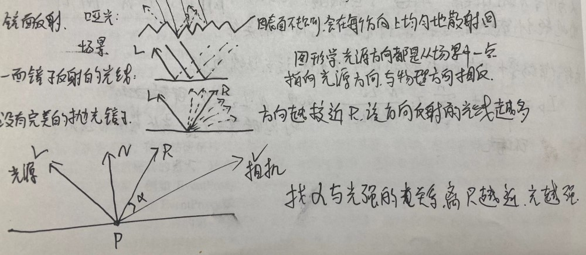

### 对镜面反射的建模

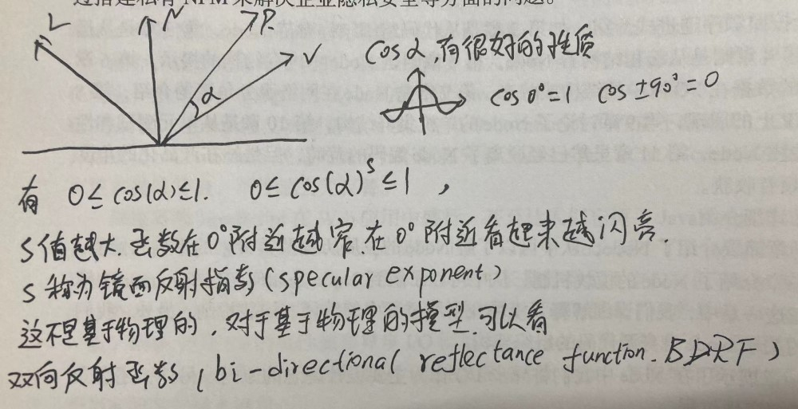

cos (a)^s 图像

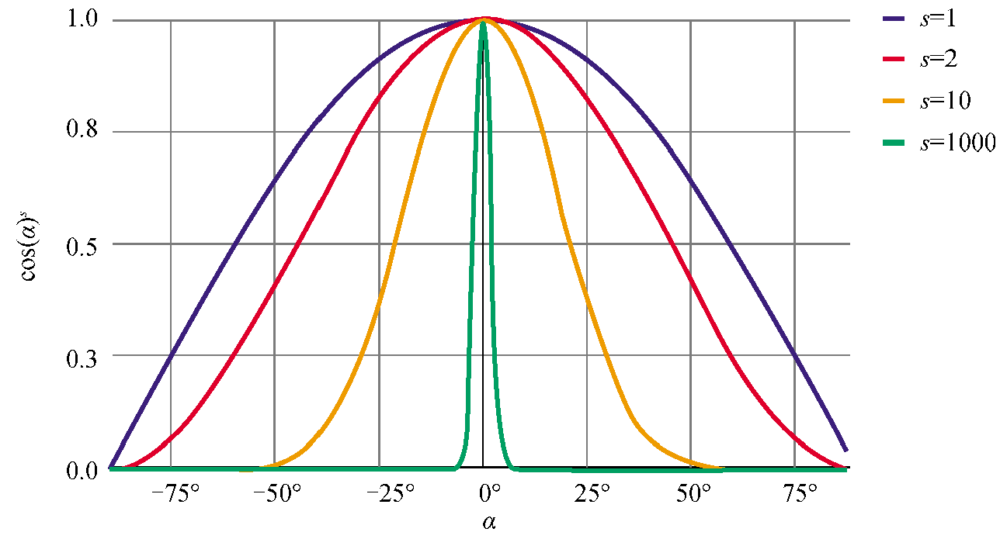

### 镜面反射的计算项

用已知项表达R

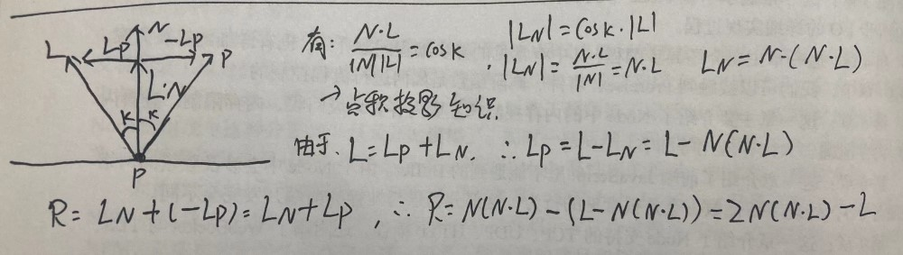

### 完整的光照方程

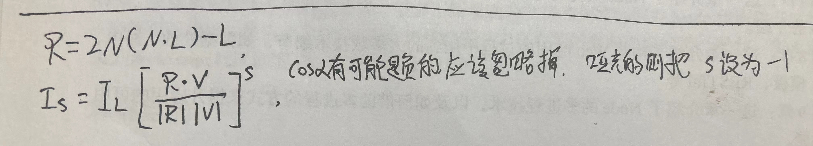

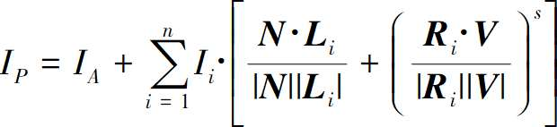

环境光+漫反射光+镜面反射光

### 镜面反射的渲染

实现效果

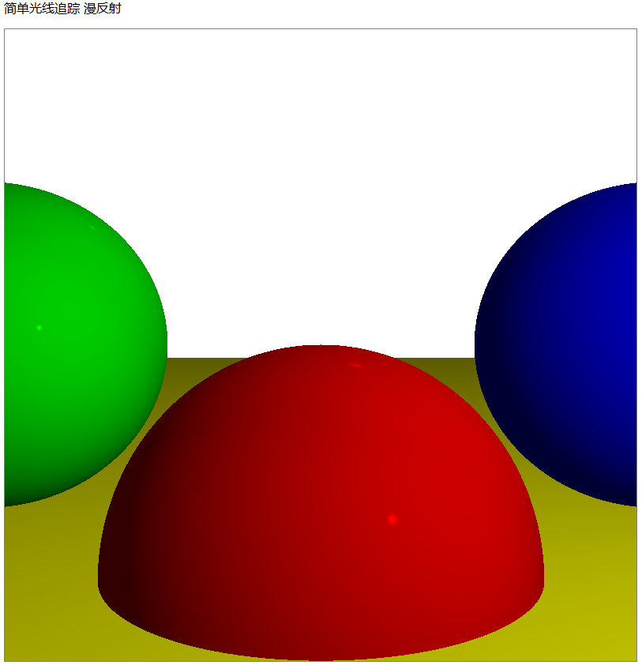

代码实现

```html
<!DOCTYPE html>
<html lang="en">

<head>
    <meta charset="UTF-8">
    <meta name="viewport" content="width=device-width, initial-scale=1.0">
    <title>Document</title>
</head>

<body>
    <p>简单光线追踪 漫反射</p>
    <div class class="centered">
        <canvas id="canvas" width=800 height=800 style="border:1px grey solid"></canvas>
    </div>
</body>

<script>
    // 画布
    const canvas = document.getElementById("canvas");
    let canvas_context = canvas.getContext("2d");
    let canvas_buffer = canvas_context.getImageData(0, 0, canvas.width, canvas.height);
    console.log(canvas_context);
    console.log(canvas_buffer);

    // 创建一个新的颜色对象
    function Color(r, g, b) {
        return {
            r, g, b,
            mul(n) {
                return new Color(this.r * n, this.g * n, this.b * n);
            }
        };
    }

    // (x,y) 是以以画布中心为原点，向上为+y,向右为+x的坐标系的点
    function PutPixel(x, y, color) {
        // console.log({ x, y, color });
        // 将(x,y)转换为屏幕坐标系中的点
        x = canvas.width / 2 + x;//(x|0)作用是将x转为整数
        y = canvas.height / 2 - y - 1;
        x = parseInt(x);
        y = parseInt(y);
        if (x < 0 || x >= canvas.width || y < 0 || y >= canvas.height) {
            return;
        }
        if (x < 0 || x >= canvas.width || y < 0 || y >= canvas.height) {
            return;
        }
        // 像素buffer偏移量
        let offset = 4 * (x + canvas_buffer.width * y);//y行+x个
        canvas_buffer.data[offset++] = color.r;
        canvas_buffer.data[offset++] = color.g;
        canvas_buffer.data[offset++] = color.b;
        canvas_buffer.data[offset++] = 255; // Alpha = 255 满透明度
    }

    // 将buffer内容更新到画布上
    function UpdateCanvas() {
        canvas_context.putImageData(canvas_buffer, 0, 0);
    }

    // 构造向量对象
    function Vec(x, y, z) {
        return {
            x, y, z,
            // 求点积
            dot(vec) {
                return this.x * vec.x + this.y * vec.y + this.z * vec.z;
            },
            // 向量相减
            sub(vec) {
                return new Vec(this.x - vec.x, this.y - vec.y, this.z - vec.z);
            },
            // 向量相加
            add(vec) {
                return new Vec(this.x + vec.x, this.y + vec.y, this.z + vec.z);
            },
            // 向量乘常数n
            mul(n) {
                return new Vec(this.x * n, this.y * n, this.z * n);
            },
            // 计算向量长度
            length() {
                return Math.sqrt(this.dot(this));
            }
        };
    }

    // 球体对象
    function Sphere(center, radius, color, specular) {
        return {
            center, // 球心
            radius, // 半径
            color, // 颜色
            specular // 镜面反射指数
        };
    }

    // 光源
    function Light(ltype, intensity, position) {
        return { ltype, intensity, position };
    }
    // 光源类型
    Light.AMBIENT = 0; // 场景光
    Light.POINT = 1; // 点光
    Light.DIRECTIONAL = 2; // 方向光

    // 场景设置
    const VIEWPORT_SIZE_X = 1; // 视口大小
    const VIEWPORT_SIZE_Y = 1;
    const PROJECTION_PLANE_Z = 1; // 视口距离相机的距离 相机朝向+z
    const CAMERA_POSITION = new Vec(0, 0, 0); // 相机位置
    const BACKGROUND_COLOR = new Color(255, 255, 255); // 画布背景颜色

    // 球体
    const spheres = [
        new Sphere(new Vec(0, -1, 3), 1, new Color(255, 0, 0), 2000),
        new Sphere(new Vec(-2, 0, 4), 1, new Color(0, 255, 0), 5000),
        new Sphere(new Vec(2, 0, 4), 1, new Color(0, 0, 255), 5000),
        new Sphere(new Vec(0, -5001, 0), 5000, new Color(255, 255, 0), 1000)
    ];

    // 场景光源
    let lights = [
        new Light(Light.AMBIENT, 0.2), // 场景光
        new Light(Light.POINT, 0.6, new Vec(2, 1, 0)),
        new Light(Light.DIRECTIONAL, 0.2, new Vec(1, 4, 4))
    ];

    // 画布坐标到视口坐标的转换
    function CanvasToViewport(x, y) {
        return new Vec(
            x * (VIEWPORT_SIZE_X / canvas.width),
            y * (VIEWPORT_SIZE_Y / canvas.height),
            PROJECTION_PLANE_Z // 视口平面的坐标z值为PROJECTION_PLANE_Z
        );
    }

    // origin: 射线原点
    // direction: 射线方向
    // sphere: 球体
    function IntersectRaySphere(origin, direction, sphere) {
        // 球体方程 (P-C)*(P-C) = r^2 P为球面上一点 C为球心 r为球体半径
        // 射线上一点 P = O + tD O为射线原点 D为方向
        // 二者方程组可以把P消掉， 可以求解t
        // (O+tD-C)*(O+tD-C)=r ^ 2
        // CO*CO + tD*CO + CO*tD + tD*tD = r^2
        // tD*tD + 2CO*tD + CO*CO = r^2
        // t^2 (D*D) + 2t(CO * D) + CO * CO - r^2 = 0
        // 一元二次方程一般形式 ax^2+bx+c=0(a!=0)
        // 解为 {t1,t2} = ( -b (+-) sqrt(b^2-4ac) ) / 2a
        // t<0 在相机后面
        // 0<=t<=1 在相机和视口间
        // t>1 在视口前

        let co = origin.sub(sphere.center);

        let a = direction.dot(direction);
        let b = 2 * co.dot(direction);
        let c = co.dot(co) - sphere.radius * sphere.radius;
        // 解个数判别式
        let discriminant = b * b - 4 * a * c;
        if (discriminant < 0) {
            return [Infinity, Infinity]; // 无解
        }
        let t1 = (-b + Math.sqrt(discriminant)) / (2 * a);
        let t2 = (-b - Math.sqrt(discriminant)) / (2 * a);
        return [t1, t2];
    }

    function ComputeLighting(point, normal, view, specular) {
        let intensity = 0;
        let length_n = normal.length(); // 必须为1
        let length_v = view.length();

        // 遍历所有光源
        for (let i = 0; i < lights.length; i++) {
            let light = lights[i];
            if (light.ltype == Light.AMBIENT) { // 环境光
                intensity += light.intensity;
                continue;
            }

            let vec_l;
            if (light.ltype == Light.POINT) {
                vec_l = light.position.sub(point);
            } else { // Light.DIRECTIONAL
                vec_l = light.position;
            }

            // 漫反射
            let n_dot_l = normal.dot(vec_l);
            if (n_dot_l > 0) {
                intensity += light.intensity * n_dot_l / (length_n * vec_l.length());
            }

            // 镜面反射
            if (specular != -1) { // -1表示为哑光不参与镜面反射计算
                let vec_r = normal.mul(2.0 * n_dot_l).sub(vec_l);
                let r_dot_v = vec_r.dot(view);
                if (r_dot_v > 0) {
                    intensity += light.intensity * Math.pow(r_dot_v / (vec_r.length() * length_v), specular);
                }
            }
        }

        return intensity;
    }

    // 从原点朝direction射出射线
    function TraceRay(origin, direction, min_t, max_t) {
        let closest_t = Infinity; // 最近距离
        let closest_sphere = null; // 最近的球体

        // 遍历所有球体
        for (let i = 0; i < spheres.length; i++) {
            let ts = IntersectRaySphere(origin, direction, spheres[i]);
            // 求射线与球体相交的解 最多可能有两个解 哪个近用哪个
            if (ts[0] < closest_t && min_t < ts[0] && ts[0] < max_t) {
                closest_t = ts[0];
                closest_sphere = spheres[i];
            }
            if (ts[1] < closest_t && min_t < ts[1] && ts[1] < max_t) {
                closest_t = ts[1];
                closest_sphere = spheres[i];
            }
        }

        // 射线没和任何球体相交则返回背景色
        if (closest_sphere == null) {
            return BACKGROUND_COLOR;
        }

        let point = origin.add(direction.mul(closest_t)); // 射线与场景球体表面交点P
        let normal = point.sub(closest_sphere.center); // 球体表面点P的法线
        normal = normal.mul(1.0 / normal.length()); // 归一化

        let view = direction.mul(-1); // V与射线方向相反
        let lighting = ComputeLighting(point, normal, view, closest_sphere.specular);

        // 否则返回球体颜色
        return closest_sphere.color.mul(lighting); // 光越强颜色倍数越高
    }

    (() => {
        // for (let i = 0; i < spheres.length; i++) {
        //     let sphere = spheres[i];
        //     sphere.move_count = 0;
        //     sphere.move_d = 0.2;
        // }

        // setInterval(() => {
        // 从相机位置朝向视口平面上的每个点发出射线 追踪从哪里射进来光源
        for (let x = -canvas.width / 2; x < canvas.width / 2; x++) {
            for (let y = -canvas.height / 2; y < canvas.height / 2; y++) {
                let direction = CanvasToViewport(x, y).sub(CAMERA_POSITION);
                let color = TraceRay(CAMERA_POSITION, direction, Math.sqrt(direction.dot(direction)), Infinity); // 1到无限远
                PutPixel(x, y, color);
            }
        }

        UpdateCanvas(); // 刷新缓冲到画布

        //     for (let i = 0; i < spheres.length; i++) {
        //         let sphere = spheres[i];
        //         sphere.center.x += sphere.move_d;
        //         sphere.center.y += sphere.move_d;
        //         sphere.move_count++;
        //         if (sphere.move_count >= 10) {
        //             sphere.move_count = 0;
        //             sphere.move_d = - sphere.move_d;
        //         }
        //     }

        //     // lights[2].position.x -= 1;
        //     // lights[2].position.y -= 1;
        // }, 10);
    })();

</script>

</html>
```
