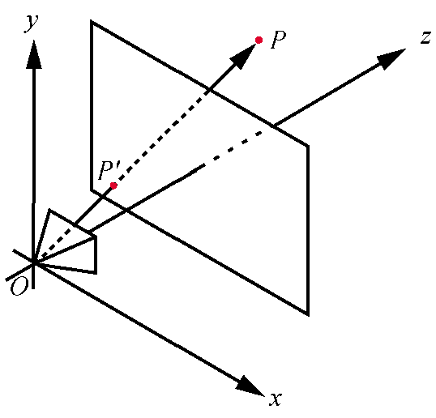
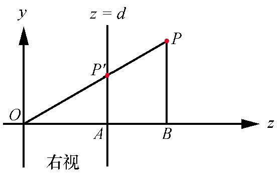
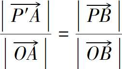
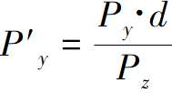
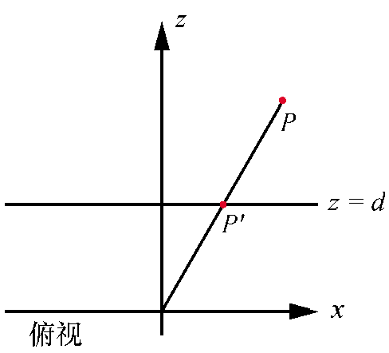
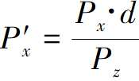
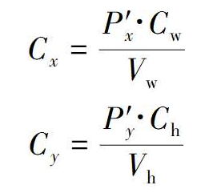
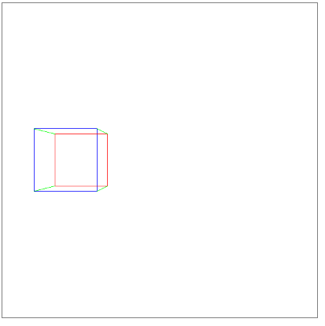

# 透视投影

本节目标，如何将3D场景坐标转换为2D画布坐标，将2D画布上绘制3D三角形。

## 基本假设

从定义相机开始，和之前的光线追踪类似，相机位置，视口大小，相机方向。



这与我们对光线追踪所做的相反，光线追踪渲染器从画布中的一个点开始，并确定它可以通过该点看到什么，在这里我们从场景中的一个点开始，并确定它在视口中的位置。

## 查找P'点



根据三角形相似可以得出。



可以得出 `|P'A|`



俯视图



可以得出`P'x`



## 透视投影方程

把上面的内容整理在一起，可以得出`P'`的x,y,z坐标。

* `P'x = Px*d / Pz`
* `P'y = Py*d / Pz`
* `P'z = d`

目前P'在视口中，仍未3D空间中的一个点，现在可以删除Pz',因为每个投影点都在视口平面上，下面需要将视口上的坐标转换为画布上的坐标。



这种视口到画布的变换(viewport-to-canvas transform)与之前光线追踪用到的画布到视口的变换(canvas-to-viewport transform)是完全想法的。

## 透视投影方程的性质

现时世界中观察事物，一个物体离得越远，看起来就越小，事实上，如果增大`Pz'`确实会得到更小的x,y值，但是过多减小Pz值时，就不再那么直观了，对于Pz的负值，当一个物体在相机后面时，物体仍然被投影，但它却是倒过来的，Pz=0时，除以0会爆炸。

另一个性质是保持点对齐，如果3个点在空间中对齐，它们的投影将在视口上对齐。直线总是被投影成直线，两条线之间的夹角经过投影变换之后是没有保留的（也就是夹角会变化），现实生活中，如在高速公路开车，可以看到公路两侧的平行线“汇聚”在地平线上。

两点之间线段的投影就是两点投影之间的线段，三角形的投影是由其顶点的投影形成的三角形。

## 投影我们的第一个3D物体

实现效果



实现代码

```html
<!DOCTYPE html>
<html lang="en">

<head>
    <meta charset="UTF-8">
    <meta name="viewport" content="width=device-width, initial-scale=1.0">
    <title>透视投影</title>
</head>

<div class="centered">
    <canvas id="canvas" width=600 height=600 style="border: 1px grey solid"></canvas>
</div>

<script>
    "use strict";

    let canvas = document.getElementById("canvas");
    let canvas_context = canvas.getContext("2d");
    let canvas_buffer = canvas_context.getImageData(0, 0, canvas.width, canvas.height);

    // A color.
    function Color(r, g, b) {
        return { r, g, b };
    }

    // The PutPixel() function.
    function PutPixel(x, y, color) {
        x = canvas.width / 2 + (x | 0);
        y = canvas.height / 2 - (y | 0) - 1;

        if (x < 0 || x >= canvas.width || y < 0 || y >= canvas.height) {
            return;
        }

        let offset = 4 * (x + canvas_buffer.width * y);
        canvas_buffer.data[offset++] = color.r;
        canvas_buffer.data[offset++] = color.g;
        canvas_buffer.data[offset++] = color.b;
        canvas_buffer.data[offset++] = 255; // Alpha = 255 (full opacity)
    }


    // Displays the contents of the offscreen buffer into the canvas.
    function UpdateCanvas() {
        canvas_context.putImageData(canvas_buffer, 0, 0);
    }

    // A Point.
    function Pt(x, y) {
        return { x, y };
    }

    // A 3D vertex
    function Vertex(x, y, z) {
        return { x, y, z };
    }

    function Interpolate(i0, d0, i1, d1) {
        if (i0 == i1) {
            return [d0];
        }

        let values = [];
        let a = (d1 - d0) / (i1 - i0);
        let d = d0;
        for (let i = i0; i <= i1; i++) {
            values.push(d);
            d += a;
        }

        return values;
    }


    function DrawLine(p0, p1, color) {
        let dx = p1.x - p0.x, dy = p1.y - p0.y;

        if (Math.abs(dx) > Math.abs(dy)) {
            // The line is horizontal-ish. Make sure it's left to right.
            if (dx < 0) { let swap = p0; p0 = p1; p1 = swap; }

            // Compute the Y values and draw.
            let ys = Interpolate(p0.x, p0.y, p1.x, p1.y);
            for (let x = p0.x; x <= p1.x; x++) {
                PutPixel(x, ys[(x - p0.x) | 0], color);
            }
        } else {
            // The line is verical-ish. Make sure it's bottom to top.
            if (dy < 0) { let swap = p0; p0 = p1; p1 = swap; }

            // Compute the X values and draw.
            let xs = Interpolate(p0.y, p0.x, p1.y, p1.x);
            for (let y = p0.y; y <= p1.y; y++) {
                PutPixel(xs[(y - p0.y) | 0], y, color);
            }
        }
    }

    function ViewportToCanvas(p2d) {
        return new Pt(p2d.x * canvas.width / viewport_size,
            p2d.y * canvas.height / viewport_size);
    }

    function ProjectVertex(v) {
        return ViewportToCanvas(new Pt(v.x * projection_plane_z / v.z,
            v.y * projection_plane_z / v.z));
    }

    // Scene setup
    let viewport_size = 1;
    let projection_plane_z = 1;

    // 立方体8个点
    const vA = new Vertex(-2, -0.5, 5);
    const vB = new Vertex(-2, 0.5, 5);
    const vC = new Vertex(-1, 0.5, 5);
    const vD = new Vertex(-1, -0.5, 5);

    const vAb = new Vertex(-2, -0.5, 6);
    const vBb = new Vertex(-2, 0.5, 6);
    const vCb = new Vertex(-1, 0.5, 6);
    const vDb = new Vertex(-1, -0.5, 6);

    const RED = new Color(255, 0, 0);
    const GREEN = new Color(0, 255, 0);
    const BLUE = new Color(0, 0, 255);

    // 将点透视投影到视图 然后在视图上连线 立方体12条边
    DrawLine(ProjectVertex(vA), ProjectVertex(vB), BLUE);
    DrawLine(ProjectVertex(vB), ProjectVertex(vC), BLUE);
    DrawLine(ProjectVertex(vC), ProjectVertex(vD), BLUE);
    DrawLine(ProjectVertex(vD), ProjectVertex(vA), BLUE);

    DrawLine(ProjectVertex(vAb), ProjectVertex(vBb), RED);
    DrawLine(ProjectVertex(vBb), ProjectVertex(vCb), RED);
    DrawLine(ProjectVertex(vCb), ProjectVertex(vDb), RED);
    DrawLine(ProjectVertex(vDb), ProjectVertex(vAb), RED);

    DrawLine(ProjectVertex(vA), ProjectVertex(vAb), GREEN);
    DrawLine(ProjectVertex(vB), ProjectVertex(vBb), GREEN);
    DrawLine(ProjectVertex(vC), ProjectVertex(vCb), GREEN);
    DrawLine(ProjectVertex(vD), ProjectVertex(vDb), GREEN);

    UpdateCanvas();

</script>

</html>
```
