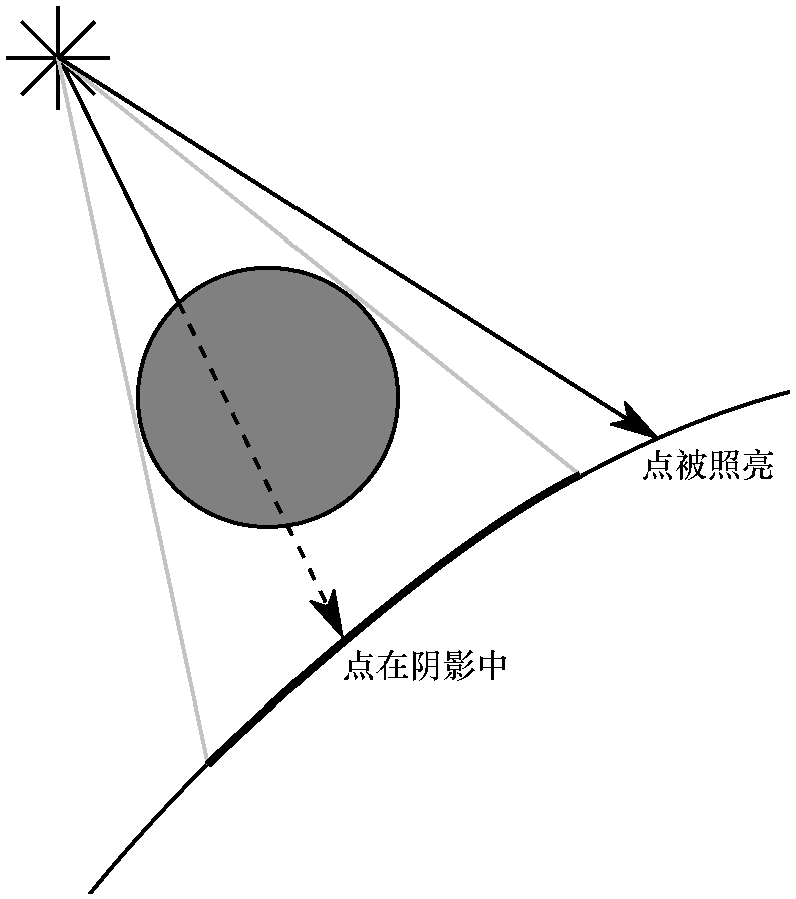
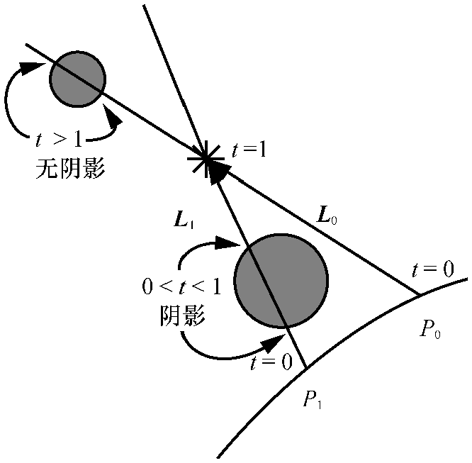
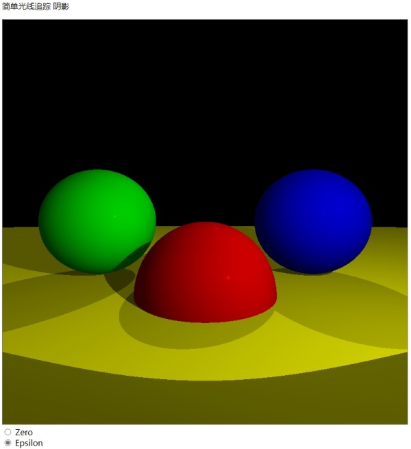
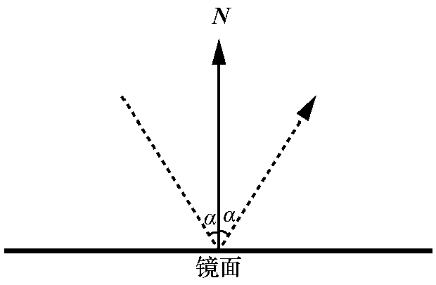
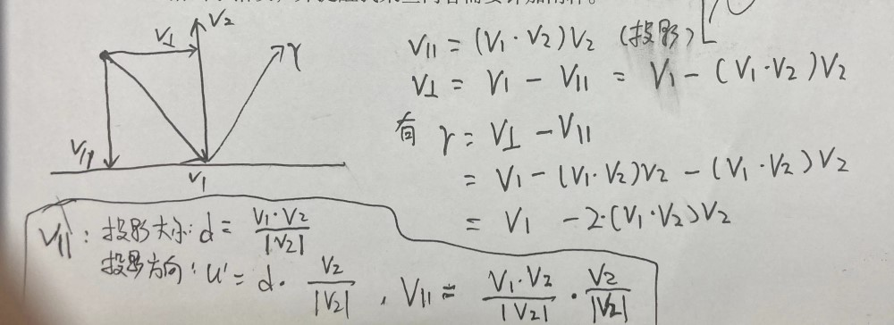
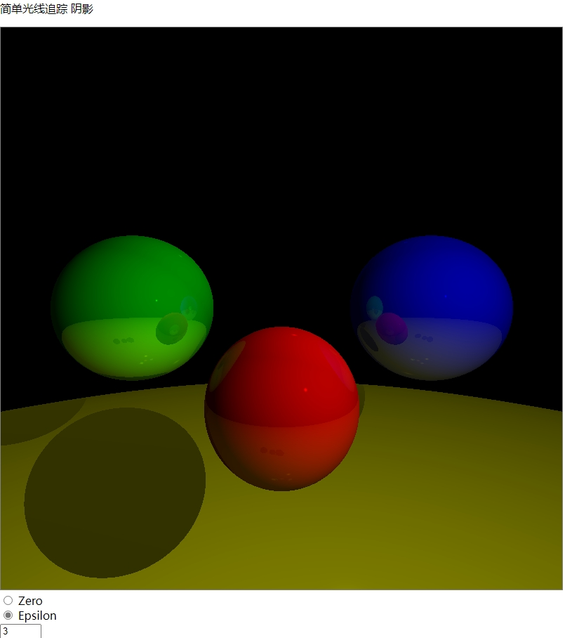

# 阴影和反射

## 阴影

哪里有光和物体，哪里就有阴影。

### 理解阴影



从L的反方向，即从点P指向光源，检测点P到光源中间有没有物体遮挡。和从相机到视口到P检测同理。



对于点光，则t 为无限趋于0，0 < t < 1, 1为光源。如果t等于0则回检测到点P自己。

### 包含阴影的渲染

实现效果



```html

<!DOCTYPE html>
<html lang="en">

<head>
    <meta charset="UTF-8">
    <meta name="viewport" content="width=device-width, initial-scale=1.0">
    <title>Document</title>
</head>

<body>
    <p>简单光线追踪 阴影</p>
    <div class class="centered">
        <canvas id="canvas" width=800 height=800 style="border:1px grey solid"></canvas>
    </div>
    <input type="radio" id="eps-0" name="shadow-ray-start" onClick="SetShadowEpsilon(0);">
    <label for='eps-0'>Zero</label><br>
    <input type="radio" id="eps-e" name="shadow-ray-start" onClick="SetShadowEpsilon(0.001);" checked>
    <label for='eps-e'>Epsilon</label>
</body>

<script>
    // 画布
    const canvas = document.getElementById("canvas");
    let canvas_context = canvas.getContext("2d");
    let canvas_buffer = canvas_context.getImageData(0, 0, canvas.width, canvas.height);
    console.log(canvas_context);
    console.log(canvas_buffer);

    // 创建一个新的颜色对象
    function Color(r, g, b) {
        return {
            r, g, b,
            mul(n) {
                return new Color(this.r * n, this.g * n, this.b * n);
            }
        };
    }

    // (x,y) 是以以画布中心为原点，向上为+y,向右为+x的坐标系的点
    function PutPixel(x, y, color) {
        // console.log({ x, y, color });
        // 将(x,y)转换为屏幕坐标系中的点
        x = canvas.width / 2 + x;//(x|0)作用是将x转为整数
        y = canvas.height / 2 - y - 1;
        x = parseInt(x);
        y = parseInt(y);
        if (x < 0 || x >= canvas.width || y < 0 || y >= canvas.height) {
            return;
        }
        if (x < 0 || x >= canvas.width || y < 0 || y >= canvas.height) {
            return;
        }
        // 像素buffer偏移量
        let offset = 4 * (x + canvas_buffer.width * y);//y行+x个
        canvas_buffer.data[offset++] = color.r;
        canvas_buffer.data[offset++] = color.g;
        canvas_buffer.data[offset++] = color.b;
        canvas_buffer.data[offset++] = 255; // Alpha = 255 满透明度
    }

    // 将buffer内容更新到画布上
    function UpdateCanvas() {
        canvas_context.putImageData(canvas_buffer, 0, 0);
    }

    // 清除画布内容
    function ClearAll() {
        canvas.width = canvas.width;
    }

    // 构造向量对象
    function Vec(x, y, z) {
        return {
            x, y, z,
            // 求点积
            dot(vec) {
                return this.x * vec.x + this.y * vec.y + this.z * vec.z;
            },
            // 向量相减
            sub(vec) {
                return new Vec(this.x - vec.x, this.y - vec.y, this.z - vec.z);
            },
            // 向量相加
            add(vec) {
                return new Vec(this.x + vec.x, this.y + vec.y, this.z + vec.z);
            },
            // 向量乘常数n
            mul(n) {
                return new Vec(this.x * n, this.y * n, this.z * n);
            },
            // 计算向量长度
            length() {
                return Math.sqrt(this.dot(this));
            }
        };
    }

    // 球体对象
    function Sphere(center, radius, color, specular) {
        return {
            center, // 球心
            radius, // 半径
            color, // 颜色
            specular // 镜面反射指数
        };
    }

    // 光源
    function Light(ltype, intensity, position) {
        return { ltype, intensity, position };
    }
    // 光源类型
    Light.AMBIENT = 0; // 场景光
    Light.POINT = 1; // 点光
    Light.DIRECTIONAL = 2; // 方向光

    // 场景设置
    let EPSILON = 0.001; // 一个无限靠近0的实数
    const VIEWPORT_SIZE_X = 2; // 视口大小
    const VIEWPORT_SIZE_Y = 2;
    const PROJECTION_PLANE_Z = 1; // 视口距离相机的距离 相机朝向+z
    const CAMERA_POSITION = new Vec(0, 0, 0); // 相机位置
    const BACKGROUND_COLOR = new Color(0, 0, 0); // 画布背景颜色

    // 球体
    const spheres = [
        new Sphere(new Vec(0, -1, 3), 1, new Color(255, 0, 0), 2000),
        new Sphere(new Vec(-2, 0, 4), 1, new Color(0, 255, 0), 5000),
        new Sphere(new Vec(2, 0, 4), 1, new Color(0, 0, 255), 5000),
        new Sphere(new Vec(0, -5001, 0), 5000, new Color(255, 255, 0), 1000)
    ];

    // 场景光源
    let lights = [
        new Light(Light.AMBIENT, 0.2), // 场景光
        new Light(Light.POINT, 0.6, new Vec(2, 1, 0)),
        new Light(Light.DIRECTIONAL, 0.2, new Vec(1, 4, 4))
    ];

    // 画布坐标到视口坐标的转换
    function CanvasToViewport(x, y) {
        return new Vec(
            x * (VIEWPORT_SIZE_X / canvas.width),
            y * (VIEWPORT_SIZE_Y / canvas.height),
            PROJECTION_PLANE_Z // 视口平面的坐标z值为PROJECTION_PLANE_Z
        );
    }

    // origin: 射线原点
    // direction: 射线方向
    // sphere: 球体
    function IntersectRaySphere(origin, direction, sphere) {
        // 球体方程 (P-C)*(P-C) = r^2 P为球面上一点 C为球心 r为球体半径
        // 射线上一点 P = O + tD O为射线原点 D为方向
        // 二者方程组可以把P消掉， 可以求解t
        // (O+tD-C)*(O+tD-C)=r ^ 2
        // CO*CO + tD*CO + CO*tD + tD*tD = r^2
        // tD*tD + 2CO*tD + CO*CO = r^2
        // t^2 (D*D) + 2t(CO * D) + CO * CO - r^2 = 0
        // 一元二次方程一般形式 ax^2+bx+c=0(a!=0)
        // 解为 {t1,t2} = ( -b (+-) sqrt(b^2-4ac) ) / 2a
        // t<0 在相机后面
        // 0<=t<=1 在相机和视口间
        // t>1 在视口前

        let co = origin.sub(sphere.center);

        let a = direction.dot(direction);
        let b = 2 * co.dot(direction);
        let c = co.dot(co) - sphere.radius * sphere.radius;
        // 解个数判别式
        let discriminant = b * b - 4 * a * c;
        if (discriminant < 0) {
            return [Infinity, Infinity]; // 无解
        }
        let t1 = (-b + Math.sqrt(discriminant)) / (2 * a);
        let t2 = (-b - Math.sqrt(discriminant)) / (2 * a);
        return [t1, t2];
    }

    function ComputeLighting(point, normal, view, specular) {
        let intensity = 0;
        let length_n = normal.length(); // 必须为1
        let length_v = view.length();

        // 遍历所有光源
        for (let i = 0; i < lights.length; i++) {
            let light = lights[i];
            if (light.ltype == Light.AMBIENT) { // 环境光
                intensity += light.intensity;
                continue;
            }

            let vec_l, t_max; // vec_l 为场景点P到光源向量 t_max为阴影检测最大范围
            if (light.ltype == Light.POINT) {
                vec_l = light.position.sub(point);
                t_max = 1.0; // 点光则阴影最大检查点P到光源即1
            } else { // Light.DIRECTIONAL
                vec_l = light.position;
                t_max = Infinity; // 方向光则阴影最大检查点P到光源即无限远
            }

            // 阴影检测
            let blocker = ClosestIntersection(point, vec_l, EPSILON, t_max);
            if (blocker) {
                continue; // 光源到点P之间有物体
            }

            // 漫反射
            let n_dot_l = normal.dot(vec_l);
            if (n_dot_l > 0) {
                intensity += light.intensity * n_dot_l / (length_n * vec_l.length());
            }

            // 镜面反射
            if (specular != -1) { // -1表示为哑光不参与镜面反射计算
                let vec_r = normal.mul(2.0 * n_dot_l).sub(vec_l);
                let r_dot_v = vec_r.dot(view);
                if (r_dot_v > 0) {
                    intensity += light.intensity * Math.pow(r_dot_v / (vec_r.length() * length_v), specular);
                }
            }
        }

        return intensity;
    }

    // 找从点origin到方向direction发出射线最先相交的球 射线检测范围min_t到max_t
    function ClosestIntersection(origin, direction, min_t, max_t) {
        let closest_t = Infinity; // 最近距离
        let closest_sphere = null; // 最近的球体

        // 遍历所有球体
        for (let i = 0; i < spheres.length; i++) {
            let ts = IntersectRaySphere(origin, direction, spheres[i]);
            // 求射线与球体相交的解 最多可能有两个解 哪个近用哪个
            if (ts[0] < closest_t && min_t < ts[0] && ts[0] < max_t) {
                closest_t = ts[0];
                closest_sphere = spheres[i];
            }
            if (ts[1] < closest_t && min_t < ts[1] && ts[1] < max_t) {
                closest_t = ts[1];
                closest_sphere = spheres[i];
            }
        }

        // 射线没和任何球体相交则返回背景色
        if (closest_sphere == null) {
            return null;
        }
        return [closest_sphere, closest_t];
    }

    // 从原点朝direction射出射线
    function TraceRay(origin, direction, min_t, max_t) {
        // 找从相机到视口发出射线最先相交的球
        let intersection = ClosestIntersection(origin, direction, min_t, max_t);
        if (!intersection) { // 无解则返回背景色
            return BACKGROUND_COLOR;
        }
        let closest_sphere = intersection[0]; // 最先相交的球体
        let closest_t = intersection[1]; // 最先相交点P的长度 用direction倍数表示
        let point = origin.add(direction.mul(closest_t)); // 射线与场景球体表面交点P
        let normal = point.sub(closest_sphere.center); // 球体表面点P的法线
        normal = normal.mul(1.0 / normal.length()); // 归一化

        let view = direction.mul(-1); // V与射线方向相反
        let lighting = ComputeLighting(point, normal, view, closest_sphere.specular);

        // 否则返回球体颜色
        return closest_sphere.color.mul(lighting); // 光越强颜色倍数越高
    }

    function SetShadowEpsilon(epsilon) {
        EPSILON = epsilon;
        Render();
    }

    function Render() {
        ClearAll();
        setTimeout(() => {
            // 从相机位置朝向视口平面上的每个点发出射线 追踪从哪里射进来光源
            for (let x = -canvas.width / 2; x < canvas.width / 2; x++) {
                for (let y = -canvas.height / 2; y < canvas.height / 2; y++) {
                    let direction = CanvasToViewport(x, y);
                    let color = TraceRay(CAMERA_POSITION, direction, Math.sqrt(direction.dot(direction)), Infinity); // 1到无限远
                    PutPixel(x, y, color);
                }
            }
            UpdateCanvas(); // 刷新缓冲到画布
        }, 0);
    }

    Render();


</script>

</html>
```

## 反射

### 镜子和反射

在主循环中，对于每个像素，我们创建一条从相机到场景的光线，并调用TraceRay来确定相机在该方向“看到”的颜色。如果TraceRay确定相机看到的是一面镜子，它只需要计算被反射的光线的方向，并计算出来自那个方向的光线的颜色。它必须调用它本身（指的是递归调用）。

设计递归算法（自己调用自己的算法）时，我们需要确保不会导致无限循环（“此程序已停止响应。你想终止它吗？”）。该算法有两个自然退出条件：当射线“击中”非反射物体时和当它没有“击中”任何物体时。但有一个简单的例子，我们可能被困在一个无限循环中：德罗斯特效应（Droste effect）。这就是当你把一面镜子放在另一面镜子前，然后看着它的时候会发生的事情——无穷无尽的自我复制品！



在递归算法，总引入递归极限 recursion limit，递归深度，r=0时能看到物体但没反射效果，r=1可以看到物体以及其他物体在其上的反射，r=2，会看到物体，一些物体的反射以及一些物体反射的反射。等等。

### 包含反射的渲染



实现效果



代码实现

```html
<!DOCTYPE html>
<html lang="en">

<head>
    <meta charset="UTF-8">
    <meta name="viewport" content="width=device-width, initial-scale=1.0">
    <title>Document</title>
</head>

<body>
    <p>简单光线追踪 反射</p>
    <div class class="centered">
        <canvas id="canvas" width=800 height=800 style="border:1px grey solid"></canvas>
    </div>
    <input type="radio" id="eps-0" name="shadow-ray-start" onClick="SetShadowEpsilon(0);">
    <label for='eps-0'>Zero</label><br>
    <input type="radio" id="eps-e" name="shadow-ray-start" onClick="SetShadowEpsilon(0.001);" checked>
    <label for='eps-e'>Epsilon</label>
    <br>
    <input type="number" id="rec-limit" onchange="UpdateRecursionLimit();" min="0" max="5" witdh="3" value="3">
</body>

<script>
    // 画布
    const canvas = document.getElementById("canvas");
    let canvas_context = canvas.getContext("2d");
    let canvas_buffer = canvas_context.getImageData(0, 0, canvas.width, canvas.height);
    console.log(canvas_context);
    console.log(canvas_buffer);

    // 创建一个新的颜色对象
    function Color(r, g, b) {
        return {
            r, g, b,
            mul(n) {
                return new Color(this.r * n, this.g * n, this.b * n);
            },
            add(color) {
                return new Color(this.r + color.r, this.g + color.g, this.b + color.b)
            }
        };
    }

    // (x,y) 是以以画布中心为原点，向上为+y,向右为+x的坐标系的点
    function PutPixel(x, y, color) {
        // console.log({ x, y, color });
        // 将(x,y)转换为屏幕坐标系中的点
        x = canvas.width / 2 + x;//(x|0)作用是将x转为整数
        y = canvas.height / 2 - y - 1;
        x = parseInt(x);
        y = parseInt(y);
        if (x < 0 || x >= canvas.width || y < 0 || y >= canvas.height) {
            return;
        }
        if (x < 0 || x >= canvas.width || y < 0 || y >= canvas.height) {
            return;
        }
        // 像素buffer偏移量
        let offset = 4 * (x + canvas_buffer.width * y);//y行+x个
        canvas_buffer.data[offset++] = color.r;
        canvas_buffer.data[offset++] = color.g;
        canvas_buffer.data[offset++] = color.b;
        canvas_buffer.data[offset++] = 255; // Alpha = 255 满透明度
    }

    // 将buffer内容更新到画布上
    function UpdateCanvas() {
        canvas_context.putImageData(canvas_buffer, 0, 0);
    }

    // 清除画布内容
    function ClearAll() {
        canvas.width = canvas.width;
    }

    // 构造向量对象
    function Vec(x, y, z) {
        return {
            x, y, z,
            // 求点积
            dot(vec) {
                return this.x * vec.x + this.y * vec.y + this.z * vec.z;
            },
            // 向量相减
            sub(vec) {
                return new Vec(this.x - vec.x, this.y - vec.y, this.z - vec.z);
            },
            // 向量相加
            add(vec) {
                return new Vec(this.x + vec.x, this.y + vec.y, this.z + vec.z);
            },
            // 向量乘常数n
            mul(n) {
                return new Vec(this.x * n, this.y * n, this.z * n);
            },
            // 计算向量长度
            length() {
                return Math.sqrt(this.dot(this));
            }
        };
    }

    // 求 v1相对v2的反射向量 v2必须为单位向量
    function ReflectRay(v1, v2) {
        return v2.mul(2 * v1.dot(v2)).sub(v1);
    }

    // 球体对象
    function Sphere(center, radius, color, specular, reflective) {
        return {
            center, // 球心
            radius, // 半径
            color, // 颜色
            specular, // 镜面反射指数 会形成光泽 可以区分哑光与镜面材质
            reflective // 表面反射程度
        };
    }

    // 光源
    function Light(ltype, intensity, position) {
        return { ltype, intensity, position };
    }
    // 光源类型
    Light.AMBIENT = 0; // 场景光
    Light.POINT = 1; // 点光
    Light.DIRECTIONAL = 2; // 方向光

    // 场景设置
    let EPSILON = 0.001; // 一个无限靠近0的实数
    let RECURSION_DEPTH = 3; // 反射递归深度
    const VIEWPORT_SIZE_X = 2; // 视口大小
    const VIEWPORT_SIZE_Y = 2
    const PROJECTION_PLANE_Z = 1; // 视口距离相机的距离 相机朝向+z
    const CAMERA_POSITION = new Vec(0, 0, 0); // 相机位置
    const BACKGROUND_COLOR = new Color(0, 0, 0); // 画布背景颜色

    // 球体
    const spheres = [
        new Sphere(new Vec(0, -1, 3), 0.8, new Color(255, 0, 0), 2000, 0.2),
        new Sphere(new Vec(-2, 0, 4), 1, new Color(0, 255, 0), 5000, 0.4),
        new Sphere(new Vec(2, 0, 4), 1, new Color(0, 0, 255), 5000, 0.3),
        new Sphere(new Vec(0, -310, 0), 300, new Color(255, 255, 0), 1000, 0.5)
    ];

    // 场景光源
    let lights = [
        new Light(Light.AMBIENT, 0.1), // 场景光
        new Light(Light.POINT, 0.8, new Vec(2, 1, 0)),
        new Light(Light.DIRECTIONAL, 0.4, new Vec(1, 4, 4))
    ];

    // 画布坐标到视口坐标的转换
    function CanvasToViewport(x, y) {
        return new Vec(
            x * (VIEWPORT_SIZE_X / canvas.width),
            y * (VIEWPORT_SIZE_Y / canvas.height),
            PROJECTION_PLANE_Z // 视口平面的坐标z值为PROJECTION_PLANE_Z
        );
    }

    // origin: 射线原点
    // direction: 射线方向
    // sphere: 球体
    function IntersectRaySphere(origin, direction, sphere) {
        // 球体方程 (P-C)*(P-C) = r^2 P为球面上一点 C为球心 r为球体半径
        // 射线上一点 P = O + tD O为射线原点 D为方向
        // 二者方程组可以把P消掉， 可以求解t
        // (O+tD-C)*(O+tD-C)=r ^ 2
        // CO*CO + tD*CO + CO*tD + tD*tD = r^2
        // tD*tD + 2CO*tD + CO*CO = r^2
        // t^2 (D*D) + 2t(CO * D) + CO * CO - r^2 = 0
        // 一元二次方程一般形式 ax^2+bx+c=0(a!=0)
        // 解为 {t1,t2} = ( -b (+-) sqrt(b^2-4ac) ) / 2a
        // t<0 在相机后面
        // 0<=t<=1 在相机和视口间
        // t>1 在视口前

        let co = origin.sub(sphere.center);

        let a = direction.dot(direction);
        let b = 2 * co.dot(direction);
        let c = co.dot(co) - sphere.radius * sphere.radius;
        // 解个数判别式
        let discriminant = b * b - 4 * a * c;
        if (discriminant < 0) {
            return [Infinity, Infinity]; // 无解
        }
        let t1 = (-b + Math.sqrt(discriminant)) / (2 * a);
        let t2 = (-b - Math.sqrt(discriminant)) / (2 * a);
        return [t1, t2];
    }

    function ComputeLighting(point, normal, view, specular) {
        let intensity = 0;
        let length_n = normal.length(); // 必须为1
        let length_v = view.length();

        // 遍历所有光源
        for (let i = 0; i < lights.length; i++) {
            let light = lights[i];
            if (light.ltype == Light.AMBIENT) { // 环境光
                intensity += light.intensity;
                continue;
            }

            let vec_l, t_max; // vec_l 为场景点P到光源向量 t_max为阴影检测最大范围
            if (light.ltype == Light.POINT) {
                vec_l = light.position.sub(point);
                t_max = 1.0; // 点光则阴影最大检查点P到光源即1
            } else { // Light.DIRECTIONAL
                vec_l = light.position;
                t_max = Infinity; // 方向光则阴影最大检查点P到光源即无限远
            }

            // 阴影检测
            let blocker = ClosestIntersection(point, vec_l, EPSILON, t_max);
            if (blocker) {
                continue; // 光源到点P之间有物体
            }

            // 漫反射
            let n_dot_l = normal.dot(vec_l);
            if (n_dot_l > 0) {
                intensity += light.intensity * n_dot_l / (length_n * vec_l.length());
            }

            // 镜面反射
            if (specular != -1) { // -1表示为哑光不参与镜面反射计算
                let vec_r = normal.mul(2.0 * n_dot_l).sub(vec_l);
                let r_dot_v = vec_r.dot(view);
                if (r_dot_v > 0) {
                    intensity += light.intensity * Math.pow(r_dot_v / (vec_r.length() * length_v), specular);
                }
            }
        }

        return intensity;
    }

    // 找从点origin到方向direction发出射线最先相交的球 射线检测范围min_t到max_t
    function ClosestIntersection(origin, direction, min_t, max_t) {
        let closest_t = Infinity; // 最近距离
        let closest_sphere = null; // 最近的球体

        // 遍历所有球体
        for (let i = 0; i < spheres.length; i++) {
            let ts = IntersectRaySphere(origin, direction, spheres[i]);
            // 求射线与球体相交的解 最多可能有两个解 哪个近用哪个
            if (ts[0] < closest_t && min_t < ts[0] && ts[0] < max_t) {
                closest_t = ts[0];
                closest_sphere = spheres[i];
            }
            if (ts[1] < closest_t && min_t < ts[1] && ts[1] < max_t) {
                closest_t = ts[1];
                closest_sphere = spheres[i];
            }
        }

        // 射线没和任何球体相交则返回背景色
        if (closest_sphere == null) {
            return null;
        }
        return [closest_sphere, closest_t];
    }

    // 从原点朝direction射出射线
    function TraceRay(origin, direction, min_t, max_t, depth) {
        // 找从相机到视口发出射线最先相交的球
        let intersection = ClosestIntersection(origin, direction, min_t, max_t);
        if (!intersection) { // 无解则返回背景色
            return BACKGROUND_COLOR;
        }

        let closest_sphere = intersection[0]; // 最先相交的球体
        let closest_t = intersection[1]; // 最先相交点P的长度 用direction倍数表示

        let point = origin.add(direction.mul(closest_t)); // 射线与场景球体表面交点P
        let normal = point.sub(closest_sphere.center); // 球体表面点P的法线
        normal = normal.mul(1.0 / normal.length()); // 归一化

        let view = direction.mul(-1); // V与射线方向相反
        let lighting = ComputeLighting(point, normal, view, closest_sphere.specular);
        let point_local_color = closest_sphere.color.mul(lighting); // 点P本身颜色

        if (closest_sphere.reflective <= 0 || depth <= 0) { // 递归出口
            return point_local_color; // 球材质不参与反射
        }

        let reflected_ray = ReflectRay(view, normal); // view根据normal的对称向量
        let reflected_color = TraceRay(point, reflected_ray, EPSILON, Infinity, depth - 1);
        // 相当于相机在P点朝向view反向的反射方向再次光线追踪

        let local_contribution = point_local_color.mul(1 - closest_sphere.reflective); // P点本身的部分
        let reflected_contribution = reflected_color.mul(closest_sphere.reflective); // 反射到P点的部分

        return local_contribution.add(reflected_contribution);
    }

    function SetShadowEpsilon(epsilon) {
        EPSILON = epsilon;
        Render();
    }

    function UpdateRecursionLimit() {
        let v = document.getElementById("rec-limit").value | 0; // 取整
        if (v < 0) {
            v = 0;
        }
        if (v > 5) {
            v = 5;
        }
        document.getElementById("rec-limit").value = v;
        if (RECURSION_DEPTH != v) {
            RECURSION_DEPTH = v;
            Render();
        }
    }

    function Render() {
        ClearAll();
        setTimeout(() => {
            // 从相机位置朝向视口平面上的每个点发出射线 追踪从哪里射进来光源
            for (let x = -canvas.width / 2; x < canvas.width / 2; x++) {
                for (let y = -canvas.height / 2; y < canvas.height / 2; y++) {
                    let direction = CanvasToViewport(x, y);
                    let color = TraceRay(CAMERA_POSITION,
                        direction,
                        Math.sqrt(direction.dot(direction)),
                        Infinity,
                        RECURSION_DEPTH); // 1到无限远
                    PutPixel(x, y, color);
                }
            }
            UpdateCanvas(); // 刷新缓冲到画布
        }, 0);
    }

    Render();


</script>

</html>
```
