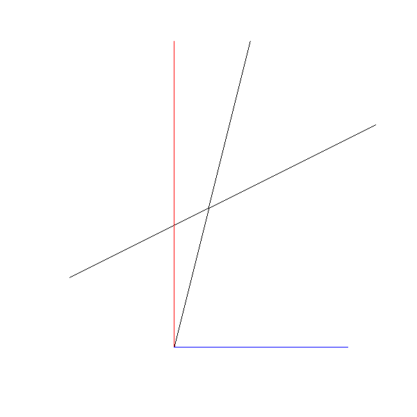

# 直线

## 光栅化

光栅化(Rasterization)是计算机图形学中一种将矢量图形转换为栅格图形（即像素）的过程。
它的主要任务是将 3D 场景中的几何对象（如三角形）映射到 2D 显示器的像素网格。光栅化通常是图形渲染管线
的一部分，在场景渲染时执行。

## 描述直线

两个点可以确定一条直线。一个点加一个斜率也可以表示。

```bash
y-y1   y1-y2
---- = ----- = k
x-x1   x1-y2
```

很尴尬此方程不能表达垂线，先忽略这个问题。

## 绘制直线

效果


源码

```html
<!DOCTYPE html>
<html lang="en">
  <head>
    <meta charset="UTF-8" />
    <meta name="viewport" content="width=device-width, initial-scale=1.0" />
    <title>光栅化 直线</title>
  </head>

  <body>
    <div class="centered">
      <canvas
        id="canvas"
        width="600"
        height="600"
        style="border: 1px grey solid"
      ></canvas>
    </div>

    <script>
      "use strict";

      let canvas = document.getElementById("canvas");
      let canvas_context = canvas.getContext("2d");
      let canvas_buffer = canvas_context.getImageData(
        0,
        0,
        canvas.width,
        canvas.height
      );

      // 创建一个color对象
      function Color(r, g, b) {
        return { r, g, b };
      }

      // The PutPixel() function.
      function PutPixel(x, y, color) {
        x = canvas.width / 2 + (x | 0);
        y = canvas.height / 2 - (y | 0) - 1;

        if (x < 0 || x >= canvas.width || y < 0 || y >= canvas.height) {
          return;
        }

        let offset = 4 * (x + canvas_buffer.width * y);
        canvas_buffer.data[offset++] = color.r;
        canvas_buffer.data[offset++] = color.g;
        canvas_buffer.data[offset++] = color.b;
        canvas_buffer.data[offset++] = 255; // Alpha = 255 (full opacity)
      }

      // Displays the contents of the offscreen buffer into the canvas.
      function UpdateCanvas() {
        canvas_context.putImageData(canvas_buffer, 0, 0);
      }

      // ======================================================================
      //  Rasterization code.
      // ======================================================================
      function DrawLineBroken(x0, y0, x1, y1, color) {
        let a = (y1 - y0) / (x1 - x0);
        let y = y0;
        for (let x = x0; x <= x1; x++) {
          PutPixel(x, y, color);
          y += a;
        }
      }

      DrawLineBroken(-200, -100, 240, 120, new Color(0, 0, 0));
      DrawLineBroken(-50, -200, 60, 240, new Color(0, 0, 0));

      UpdateCanvas();
    </script>
  </body>
</html>
```

## 绘制任意斜率的直线

增加对水平直线和垂直直线的支持

效果



源码

```html
<!DOCTYPE html>
<html lang="en">
  <head>
    <meta charset="UTF-8" />
    <meta name="viewport" content="width=device-width, initial-scale=1.0" />
    <title>光栅化 绘制任意斜率直线</title>
  </head>

  <body>
    <div class="centered">
      <canvas
        id="canvas"
        width="600"
        height="600"
        style="border: 1px grey solid"
      ></canvas>
    </div>

    <script>
      "use strict";

      let canvas = document.getElementById("canvas");
      let canvas_context = canvas.getContext("2d");
      let canvas_buffer = canvas_context.getImageData(
        0,
        0,
        canvas.width,
        canvas.height
      );

      // 创建一个color对象
      function Color(r, g, b) {
        return { r, g, b };
      }

      // The PutPixel() function.
      function PutPixel(x, y, color) {
        x = canvas.width / 2 + (x | 0);
        y = canvas.height / 2 - (y | 0) - 1;

        if (x < 0 || x >= canvas.width || y < 0 || y >= canvas.height) {
          return;
        }

        let offset = 4 * (x + canvas_buffer.width * y);
        canvas_buffer.data[offset++] = color.r;
        canvas_buffer.data[offset++] = color.g;
        canvas_buffer.data[offset++] = color.b;
        canvas_buffer.data[offset++] = 255; // Alpha = 255 (full opacity)
      }

      // Displays the contents of the offscreen buffer into the canvas.
      function UpdateCanvas() {
        canvas_context.putImageData(canvas_buffer, 0, 0);
      }

      // ======================================================================
      //  Rasterization code.
      // ======================================================================
      function DrawLineBroken(x0, y0, x1, y1, color, oneStep) {
        let dx = x1 - x0;
        let dy = y1 - y0;

        let swap = () => {
          let tmp = x0;
          x0 = x1;
          x1 = tmp;
          tmp = y0;
          y0 = y1;
          y1 = tmp;
        };

        // 直线偏向水平情况
        if (Math.abs(dx) > Math.abs(dy)) {
          // 确保x0 < x1
          if (x0 > x1) {
            swap();
          }
          let k = dy / dx; // 斜率
          let y = y0;
          for (let x = x0; x <= x1; x += oneStep) {
            PutPixel(x, y, color);
            y += k * oneStep;
          }
        } else {
          // 直线偏向垂直情况
          if (y0 > y1) {
            swap();
          }
          let k = dx / dy;
          let x = x0;
          for (let y = y0; y <= y1; y += oneStep) {
            PutPixel(x, y, color);
            x += k * oneStep;
          }
        }
      }

      DrawLineBroken(-200, -100, 240, 120, new Color(0, 0, 0), 1);
      DrawLineBroken(-50, -200, 60, 240, new Color(0, 0, 0), 1);
      DrawLineBroken(-50, -200, -50, 240, new Color(255, 0, 0), 1);
      DrawLineBroken(-50, -200, 200, -200, new Color(0, 0, 255), 1);

      UpdateCanvas();
    </script>
  </body>
</html>
```

## 线性插值函数

TODO
