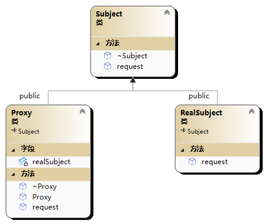

# 代理模式(Proxy 模式)

代理模式（Proxy Pattern）是一种结构型设计模式，它提供了一个代理对象来控制对另一个对象的访问。代理对象与被代理对象具有相同的接口，客户端可以通过代理对象来访问被代理对象。

在代理模式中，通常会有一个代理类，它与被代理类都实现相同的接口。代理类可以直接访问被代理类，或者通过其它方式来控制被代理类的访问。代理类的出现可以使得客户端无需直接访问被代理类，从而实现了对被代理类的保护和控制。



```cpp
#include<iostream>
#include<memory>
using namespace std;

//接口
class Subject {
public:
	virtual void request() = 0;
	virtual ~Subject() = default;
};

//被代理的对象
class RealSubject :public Subject {
public:
	void request()override;
};

void RealSubject::request() {
	cout << "RealSubject request" << endl;
}

//代理
class Proxy :public Subject {
public:
	Proxy();
	~Proxy()=default;
	void request()override;
private:
	shared_ptr<RealSubject> realSubject;
};

Proxy::Proxy() :realSubject(make_shared<RealSubject>()) {
	
}

void Proxy::request() {
	realSubject->request();
}

int main(int argc, char** argv) {
	Proxy proxy;
	proxy.request();
	return 0;
}
//RealSubject request
```