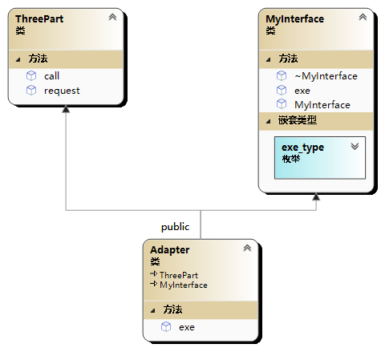

# 🙄 适配器模式(Adapter模式)

使用场景通常为，我们因为任务已经写好了接口，但是拿来了一个第三方库，接口并不相同，则在中间可以有一个适配器进行过渡，适配器可以采用继承或者组合的方式进行实现

继承方式

<figure><figcaption></figcaption></figure>

```cpp
//适配器模式 多继承方式
#include<iostream>
using namespace std;

//原先我们的程序很久以前就在使用的接口
class MyInterface {
public:
	enum exe_type{
		CALL,
		REQUEST
	};
	virtual void exe(exe_type)=0;
	MyInterface() = default;
	virtual ~MyInterface();
};

MyInterface::~MyInterface() {

}

//最新找来的第三方库
class ThreePart {
public:
	void call();
	void request();
};


void ThreePart::call() {
	cout << "call" << endl;
}

void ThreePart::request() {
	cout << "request" << endl;
}


//编写适配器
class Adapter:public ThreePart,public MyInterface {
public:
	virtual void exe(exe_type type);
};

void Adapter::exe(exe_type type) {
	switch (type)
	{
	case MyInterface::CALL:
		call();
		break;
	case MyInterface::REQUEST:
		request();
		break;
	default:
		break;
	}
}

int main() {
	MyInterface* api = new Adapter;
	api->exe(MyInterface::CALL);//call
	api->exe(MyInterface::REQUEST);//request
	delete api;
	return 0;
}

```

组合方式

<figure><figcaption></figcaption></figure>

```cpp
//适配器模式 组合方式
#include<iostream>
using namespace std;

//原先我们的程序很久以前就在使用的接口
class MyInterface {
public:
	enum exe_type{
		CALL,
		REQUEST
	};
	virtual void exe(exe_type)=0;
	MyInterface() = default;
	virtual ~MyInterface();
};

MyInterface::~MyInterface() {

}

//最新找来的第三方库
class ThreePart {
public:
	void call();
	void request();
};


void ThreePart::call() {
	cout << "call" << endl;
}

void ThreePart::request() {
	cout << "request" << endl;
}

//编写适配器
class Adapter:public MyInterface {
public:
	Adapter(ThreePart *threePart);
	virtual void exe(exe_type type);
private:
	ThreePart* threePart;
	~Adapter();
};

Adapter::Adapter(ThreePart*threePart):threePart(threePart) {
}

Adapter::~Adapter() {
	delete threePart;
}

void Adapter::exe(exe_type type) {
	switch (type)
	{
	case MyInterface::CALL:
		threePart->call();
		break;
	case MyInterface::REQUEST:
		threePart->request();
		break;
	default:
		break;
	}
}

int main() {
	MyInterface* api = new Adapter(new ThreePart);
	api->exe(MyInterface::CALL);//call
	api->exe(MyInterface::REQUEST);//request
	delete api;
	return 0;
}

```
