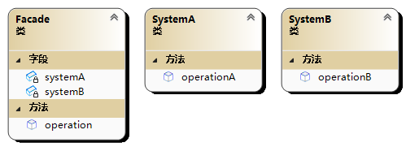

# 🤖 外观模式(Facade 模式)

外观模式（Facade Pattern）是一种结构型设计模式，它提供了一个简单的接口，隐藏了一组复杂的子系统，使得客户端可以更方便地使用这些子系统。

在外观模式中，通常会有一个 Facade 类，它封装了一组复杂的子系统，并提供了一个简单的接口供客户端使用。这个接口可以隐藏子系统的复杂性，使得客户端无需了解子系统的内部实现细节，也无需直接与子系统交互，从而降低了系统的耦合性。



```cpp
#include<iostream>
using namespace std;

class SystemA {
public:
	void operationA();
};

void SystemA::operationA() {
	cout << "systemA operation" << endl;
}

class SystemB {
public:
	void operationB();
};

void SystemB::operationB() {
	cout << "systemB operation" << endl;
}

//外观类
class Facade {
public:
	void operation() {
		systemA.operationA();
		systemB.operationB();
	}
private:
	SystemA systemA;
	SystemB systemB;
};

int main(int argc, char** argv) {
	Facade facade;
	facade.operation();
	return 0;
}
//systemA operation
//systemB operation
```
