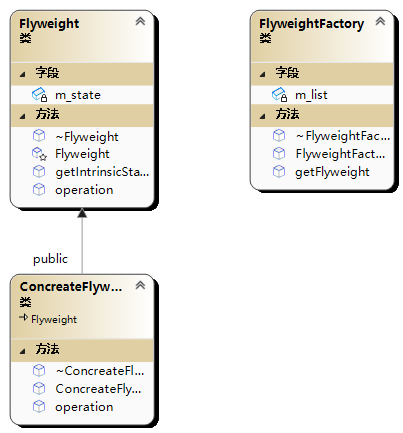

# 🙄 享元模式(Flyweight模式)

享元模式（Flyweight Pattern）是一种结构型设计模式，它旨在通过共享尽可能多的对象来最小化内存使用和对象创建的成本。

在该模式中，共享对象被称为“享元”，而享元对象的状态被分为内部状态和外部状态。内部状态是指可以被多个对象共享的信息，而外部状态是指依赖于特定对象的信息。

享元模式的主要用途是优化内存使用，特别是在需要大量相似对象时。通过共享内部状态，可以减少需要创建的对象数量，从而降低内存使用。这种技术在处理大型数据集或高并发环境中特别有用。

在实际应用中，享元模式常常和其他模式一起使用，例如组合模式和代理模式。

也就是有点像对象池



```cpp
#include <iostream>
#include <string>
#include <list>
using namespace std;

//class Flyweight

class Flyweight {
public:
    virtual ~Flyweight(){}
    string getIntrinsicState();
    virtual void operation(string& extrinsicState) = 0;
protected:
    Flyweight(const string& state);
private:
    string m_state;
};

Flyweight::Flyweight(const string& state) :m_state(state) {

}

string Flyweight::getIntrinsicState() {
    return m_state;
}


//class ConcreateFlyweight
class ConcreateFlyweight :public Flyweight {
public:
    ConcreateFlyweight(const string& state) :Flyweight(state) {

    }
    virtual ~ConcreateFlyweight() {}
    virtual void operation(string& extrinsicState) override;
};

void  ConcreateFlyweight::operation(string& extrinsicState) {
    //...
}


//class FlyweightFactory
class FlyweightFactory {
public:
    FlyweightFactory(){}
    ~FlyweightFactory();
    Flyweight* getFlyweight(const string& key);
private:
    list<Flyweight*> m_list;
};

FlyweightFactory::~FlyweightFactory() {
    for (Flyweight* ptr : m_list) {
        delete(ptr);
    }
    m_list.clear();
}

Flyweight* FlyweightFactory::getFlyweight(const string&key) {
    //遍历list，查找是否有相应key
    for (Flyweight* ptr : m_list) {
        if (ptr->getIntrinsicState() == key) {
            return ptr;
        }
    }
    //否则新建对象
    Flyweight* ptr = new ConcreateFlyweight(key);
    m_list.push_back(ptr);
    return ptr;
}

int main()
{
    FlyweightFactory flyweightFactory;
    Flyweight* ccc = flyweightFactory.getFlyweight("ccc");
    Flyweight* aaa=flyweightFactory.getFlyweight("aaa");
    Flyweight* bbb = flyweightFactory.getFlyweight("aaa");
    cout << (aaa == bbb) << endl;
    std::cout << "Hello World!\n";
    return 0;
}
/*
1
Hello World!
*/
```