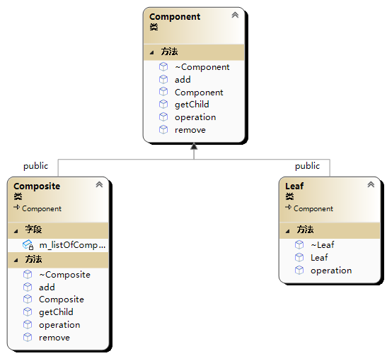

# 🐸 组合模式(Composite模式)

组合模式(Composite)，将对象组合成树形结构以表示‘部分-整体’的层次结构，
组合模式使得用户对单个对象和组合对象的使用具有一致性

<figure><figcaption></figcaption></figure>

```cpp
/*
组合模式(Composite)，将对象组合成树形结构以表示‘部分-整体’的层次结构，
组合模式使得用户对单个对象和组合对象的使用具有一致性
*/
#include<iostream>
#include<list>
using namespace std;

//基本对象
class Component {
public:
	Component() {};
	virtual ~Component() {}
	virtual void operation() = 0;//整体与部分具有相同的操作
	virtual void add(Component*pChild);
	virtual void remove(Component* pChild);
	virtual Component* getChild(int index);
};

void Component::add(Component* pChild) {}

void Component::remove(Component* pChild) {}
Component* Component::getChild(int index) {
	return nullptr;
}

//部分个体
class Leaf :public Component {
public:
	Leaf() {}
	virtual ~Leaf() {}
	virtual void operation();
};

void Leaf::operation() {
	cout << "Leaf::operation" << endl;
}

//组合体
class Composite :public Component {
public:
	Composite();
	virtual ~Composite();
	virtual void operation();
	virtual void add(Component* pChild);
	virtual void remove(Component* pChild);
	virtual Component* getChild(int index);
private:
	list<Component*> m_listOfComponent;//双向链表
};

Composite::Composite(){}
Composite::~Composite() {
	auto end = m_listOfComponent.end();
	auto now = m_listOfComponent.begin();
	while (end != now) {
		delete (*now);
		m_listOfComponent.erase(now);
		now = m_listOfComponent.begin();
		end = m_listOfComponent.end();
	}
}

void Composite::add(Component* pChild) {
	m_listOfComponent.push_back(pChild);
}

void Composite::remove(Component* pChild) {
	auto res = find(m_listOfComponent.begin(),m_listOfComponent.end(),pChild);
	if (res != m_listOfComponent.end()) {
		m_listOfComponent.erase(res);
	}
}

Component* Composite::getChild(int index) {
	if (index < 0 || index >= m_listOfComponent.size()) {
		return nullptr;
	}
	auto begin = m_listOfComponent.begin();
	while (index--) {
		begin++;
	}
	return *begin;
}

void Composite::operation() {
	for (auto item : m_listOfComponent) {
		(item)->operation();
	}
}

int main() {
	Composite* composite = new Composite;
	composite->add(new Leaf);
	composite->add(new Leaf);
	//整体与部分具有使用一致性operation
	composite->operation();//整体
	//Leaf::operation
	//Leaf::operation
	composite->getChild(1)->operation();//个体
	//Leaf::operation
	//例如composite下面还有一个小整体
	Composite* compositeChild = new Composite;
	compositeChild->add(new Leaf);
	composite->add(new Leaf);
	composite->add(compositeChild);
	composite->operation();
	//Leaf::operation
	//Leaf::operation
	//Leaf::operation
	//Leaf::operation
	delete composite;
	return 0;
}

```