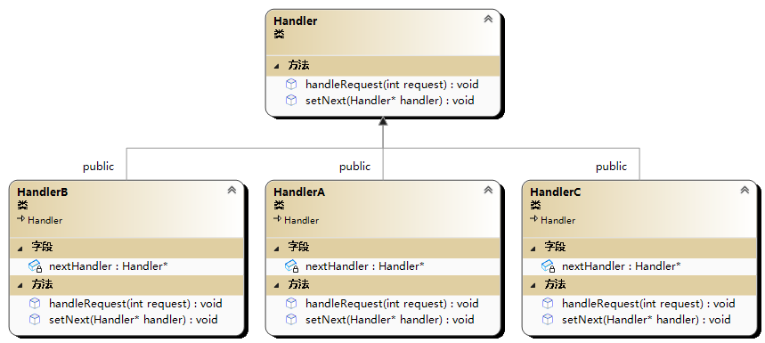

# 🦄 责任链模式(Chain of Responsibility 模式)

责任链模式（Chain of Responsibility Pattern）是一种行为型设计模式，它允许多个对象按照顺序处理请求，直到其中一个对象能够处理为止。每个对象都可以决定是否处理请求，以及将请求传递给下一个对象。这种模式可以避免请求的发送者和接收者之间的耦合关系。

以下是一个使用 C++实现责任链模式的示例代码：



```cpp
#include <iostream>

using namespace std;

class Handler {
public:
	virtual void setNext(Handler* handler) = 0;
	virtual void handleRequest(int request) = 0;
};

class HandlerA :public Handler {
private:
	Handler* nextHandler;
public:
	void setNext(Handler* handler) {
		nextHandler = handler;
	}
	void handleRequest(int request) {
		if (request >= 0 && request < 10) {
			cout << "HandlerA handleRequest" << endl;
		}
		else if (nextHandler != nullptr) {
			nextHandler->handleRequest(request);
		}
	}
};

class HandlerB :public Handler {
private:
	Handler* nextHandler;
public:
	void setNext(Handler* handler) {
		nextHandler = handler;
	}
	void handleRequest(int request) {
		if (request >= 10 && request < 20) {
			cout << "HandlerB handleRequest" << endl;
		}
		else if (nextHandler != nullptr) {
			nextHandler->handleRequest(request);
		}
	}
};

class HandlerC :public Handler {
private:
	Handler* nextHandler;
public:
	void setNext(Handler* handler) {
		nextHandler = handler;
	}
	void handleRequest(int request) {
		if (request >= 20 && request < 30) {
			cout << "HandlerC handleRequest" << endl;
		}
		else if (nextHandler != nullptr) {
			nextHandler->handleRequest(request);
		}
	}
};

int main() {
	Handler* handlerA = new HandlerA();
	Handler* handlerB = new HandlerB();
	Handler* handlerC = new HandlerC();
	handlerA->setNext(handlerB);
	handlerB->setNext(handlerC);
	handlerA->handleRequest(5);
	handlerA->handleRequest(15);
	handlerA->handleRequest(25);
	delete handlerA;
	delete handlerB;
	delete handlerC;
	return 0;
}

//HandlerA handleRequest
//HandlerB handleRequest
//HandlerC handleRequest
```
