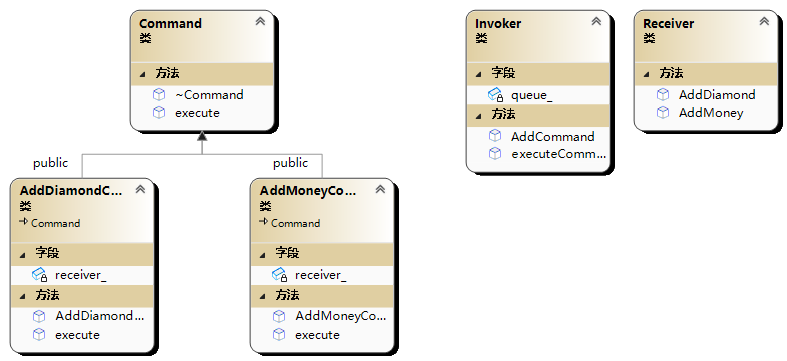

# 🦄 命令模式(Command 模式)

命令模式是一种行为设计模式，它将请求封装成一个对象，从而允许您根据不同的请求将客户端参数化，将请求排入队列或记录请求日志，并支持可撤销的操作。

在命令模式中，有以下几个关键角色：

- 命令（Command）：声明了执行操作的接口。
- 具体命令（Concrete Command）：实现了命令接口，并将操作绑定到接收者。
- 接收者（Receiver）：执行实际操作的对象。
- 调用者（Invoker）：持有命令对象并触发命令执行。
- 客户端（Client）：创建具体命令对象并将其与接收者绑定。



```cpp
#include <iostream>
#include <string>
#include <queue>

// 命令接口
class Command {
public:
    virtual ~Command() {}
    virtual void execute() const = 0;
};

// 接收者类
class Receiver {
public:
    void AddMoney() {
        std::cout << "给玩家加金币" << std::endl;
    }
    void AddDiamond() {
        std::cout << "给玩家加钻石" << std::endl;
    }
};

// 具体命令类
class AddMoneyCommand : public Command {
private:
    Receiver* receiver_;
public:
    AddMoneyCommand(Receiver *receiver) : receiver_(receiver) {}
    void execute() const override {
        // 在这里执行具体的操作
        receiver_->AddMoney();
    }
};

class AddDiamondCommand : public Command {
private:
    Receiver* receiver_;
public:
    AddDiamondCommand(Receiver* receiver) : receiver_(receiver) {}
    void execute() const override {
        // 在这里执行具体的操作
        receiver_->AddDiamond();
    }
};

// 调用者类
class Invoker {
private:
    std::queue<Command*> queue_;
public:
    void AddCommand(Command* command) {
        queue_.push(command);
    }
    void executeCommand() {
        while (queue_.empty() == false) {
            Command* command = queue_.front();
            command->execute();
            queue_.pop();
        }
    }
};

int main() {
    // 创建接收者对象
    Receiver receiver;
    // 创建具体命令对象并绑定接收者
    AddDiamondCommand command1(&receiver);
    AddMoneyCommand command2(&receiver);
    Invoker invoker;
    invoker.AddCommand(&command1);
    invoker.AddCommand(&command2);
    invoker.executeCommand();
    return 0;
}
/*
给玩家加钻石
给玩家加金币
*/
```
