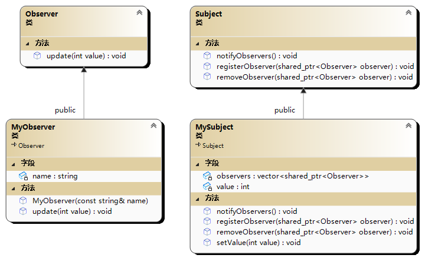

# 🐸 观察者模式(Observer 模式)

观察者模式是一种行为型设计模式，它允许对象自动向其依赖的观察者对象通知其状态的改变。

在观察者模式中，有两个主要角色：主题和观察者。主题维护一个观察者列表，当主题的状态发生改变时，它会通知所有的观察者。观察者则需要实现一个更新方法，以便在接收到主题的通知时执行相应的操作。



```cpp
#include<iostream>
#include<vector>
#include<algorithm>
#include<string>
#include<memory>
using namespace std;

class Observer;

//主题接口
class Subject {
public:
	virtual void registerObserver(shared_ptr<Observer> observer)=0;
	virtual void removeObserver(shared_ptr<Observer> observer)=0;
	virtual void notifyObservers() = 0;
};

//抽象观察者类
class Observer {
public:
	virtual void update(int value) = 0;
};

//具体主题类
class MySubject :public Subject {
public:
	void registerObserver(shared_ptr<Observer> observer)override;
	void removeObserver(shared_ptr<Observer> observer) override;
	void notifyObservers() override;
	void setValue(int value);
private:
	int value{ 0 };
	std::vector<shared_ptr<Observer>>observers;
};

void MySubject::registerObserver(shared_ptr<Observer> observer) {
	observers.push_back(observer);
}

void MySubject::removeObserver(shared_ptr<Observer> observer) {
	auto iter = std::find(observers.begin(), observers.end(), observer);
	if (iter != observers.end()) {
		observers.erase(iter);
	}
}

void MySubject::notifyObservers() {
	for (auto iter = observers.begin(); iter != observers.end();++iter) {
		(* iter)->update(value);
	}
}

void MySubject::setValue(int value) {
	this->value = value;
	notifyObservers();
}


//具体观察者类
class MyObserver :public Observer {
public:
	MyObserver(const std::string& name);
	void update(int value) override;
private:
	std::string name;
};

MyObserver::MyObserver(const std::string& name):name(name)
{
}

void MyObserver::update(int value) {
	cout << "Observer " << name << " received update with value " << value << endl;
}

int main(int argc, char** argv) {
	shared_ptr<MySubject>subject = make_shared<MySubject>();
	//观察者对象
	shared_ptr<Observer> observer1{ new MyObserver("observer1")};
	shared_ptr<Observer> observer2{ new MyObserver("observer2") };
	subject->registerObserver(observer1);
	subject->registerObserver(observer2);
	//改变主题状态
	subject->setValue(12);
	//输出：Observer observer1 received update with value 12
	//      Observer observer2 received update with value 12
	//observer2 从主题中移除
	subject->removeObserver(observer2);
	subject->setValue(1);
	//输出：Observer observer1 received update with value 1
	return 0;
}
```
