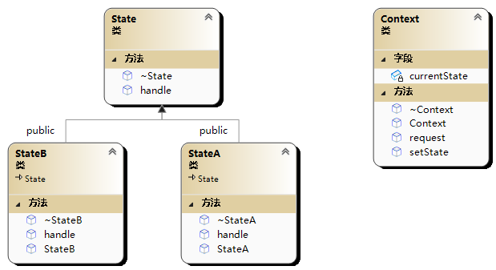

# 🐼 状态模式(State 模式)

状态模式（State Pattern）是一种行为型设计模式，它允许一个对象在内部状态发生改变时改变其行为。状态模式将对象的行为包装在不同的状态对象中，使得对象能够根据当前状态来选择不同的行为。

在状态模式中，主要包含以下几个角色：

环境（Context）：定义了客户端所感兴趣的接口，并且维护一个当前状态对象的引用。在环境中，可以通过调用当前状态对象的方法来执行相应的行为。

抽象状态（Abstract State）：定义了一个抽象的状态接口，所有具体状态都实现了这个接口。抽象状态中的方法代表了对象在该状态下可能执行的行为。

具体状态（Concrete State）：实现了抽象状态接口，并且实现了在特定状态下对象可能执行的行为。



```cpp
#include<iostream>
using namespace std;

class StateB;
class Context;

//状态抽象类
class State {
public:
	virtual void handle(Context* context) = 0;//状态需要做的行为
	virtual ~State() = default;
};

//状态A
class StateA :public State {
public:
	void handle(Context* context)override;
	StateA();
	~StateA();
};

//状态B
class StateB :public State {
public:
	void handle(Context* context)override;
	StateB();
	~StateB();
};

//环境类
class Context {
public:
	Context(State* state);
	~Context();
	void setState(State* state);//更改上下文的状态
	void request();
private:
	State* currentState;
};


void StateA::handle(Context* context) {
	cout << "state a" << endl;
	//改变状态
	context->setState(new StateB());
	delete this;
}

StateA::StateA() {
	cout << "new StateA" << endl;
}

StateA::~StateA() {
	cout << "~StateA" << endl;
}

void StateB::handle(Context* context) {
	cout << "state b" << endl;
	context->setState(new StateA());
	delete this;
}

StateB::StateB() {
	cout << "new StateB" << endl;
}

StateB::~StateB() {
	cout << "~StateB" << endl;
}

Context::Context(State* state) :currentState(state) {};
Context::~Context() {
	if (currentState) {
		delete currentState;
	}
}
void Context::setState(State* state) {
	currentState = state;
}
void Context::request() {
	currentState->handle(this);
}

int main(int argc, char** argv) {
	Context context(new StateA());//new StateA
	context.request();//satte a \ new StateB \ ~StateA
	context.request();//satte b \ new StateA \ ~StateB
	context.request();//satte a \ new StateB \ ~StateA
	context.request();//satte b \ new StateA \ ~StateB
	return 0;
	//~StateA
}
```
