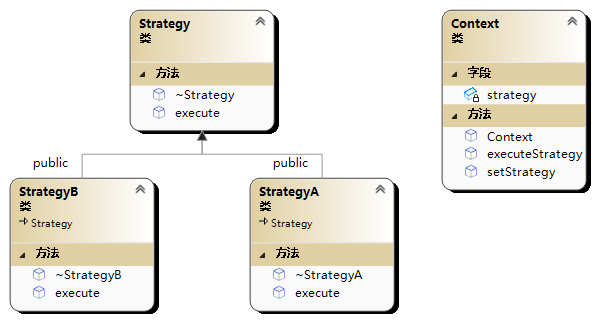

# 🤡 策略模式(Strategy 模式)

策略模式（Strategy Pattern）是一种行为型设计模式，它允许在运行时根据需求选择不同的算法或行为。该模式通过将算法封装在独立的策略类中，使得算法可以互相替换而不影响使用算法的客户端。



```cpp
#include<iostream>
#include<memory>

using namespace std;

//策略接口
class Strategy {
public:
	virtual ~Strategy()=default;
	virtual void execute()const = 0;
};

//具体策略类A
class StrategyA :public Strategy {
public:
	void execute()const override;
	~StrategyA();
};

void StrategyA::execute()const
{
	cout << "StrategyA execute" << endl;
}

StrategyA::~StrategyA() {
	cout << "~StrategyA" << endl;
}

//具体策略类B
class StrategyB :public Strategy {
public:
	void execute()const override;
	~StrategyB();
};

void StrategyB::execute()const
{
	cout << "StrategyA execute" << endl;
}

StrategyB::~StrategyB() {
	cout << "~StrategyB" << endl;
}


//上下文用于调用策略
class Context {
private:
	shared_ptr<Strategy> strategy;
public:
	Context(shared_ptr<Strategy> strategy);
	void setStrategy(shared_ptr<Strategy> strategy);
	void executeStrategy();
};

Context::Context(shared_ptr<Strategy> strategy):strategy(strategy) {

}

void Context::setStrategy(shared_ptr<Strategy> strategy) {
	this->strategy.reset();
	this->strategy.swap(strategy);
}

void Context::executeStrategy() {
	if (strategy.get()) {
		strategy->execute();
	}
}

int main(int argc, char** argv) {
	shared_ptr<Strategy> a{ new StrategyA() };
	shared_ptr<Strategy> b{ new StrategyB() };
	Context context(a);
	context.executeStrategy();//StrategyA execute
	context.setStrategy(b);
	context.executeStrategy();//StrategyB execute
	//~StrategyB
	//~StrategyA
	return 0;
}

```
