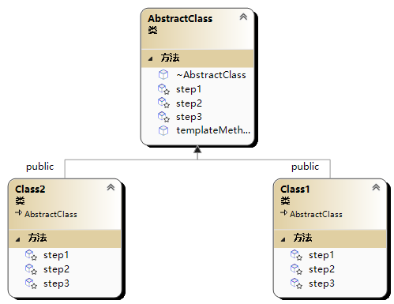

# 😶‍🌫️ 模板模式(Template 模式)

模板模式（Template Pattern）是一种行为设计模式，它定义了一个算法的骨架，将一些步骤的具体实现延迟到子类中。模板模式使得子类可以在不改变算法结构的情况下重新定义某些步骤的具体实现。



```cpp
#include<iostream>
#include<memory>
using namespace std;

class AbstractClass {
public:
	//模板方法，定义算法的骨架
	void templateMethod() {
		//步骤1
		step1();
		//步骤2
		step2();
		//步骤3
		step3();
	}
	virtual ~AbstractClass() = default;
protected:
	virtual void step1()=0;
	virtual void step2() = 0;
	virtual void step3() = 0;
};

//具体子类1
class Class1 :public AbstractClass {
protected:
	void step1()override {
		cout << "class 1 step1" << endl;
	}
	void step2()override {
		cout << "class 1 step2" << endl;
	}
	void step3()override {
		cout << "class 1 step3" << endl;
	}
};

//具体子类2
class Class2 :public AbstractClass {
protected:
	void step1()override {
		cout << "class 2 step1" << endl;
	}
	void step2()override {
		cout << "class 2 step2" << endl;
	}
	void step3()override {
		cout << "class 2 step3" << endl;
	}
};

int main(int argc, char** argv) {
	unique_ptr<AbstractClass> ptr1(new Class1());
	unique_ptr<AbstractClass> ptr2(new Class2());
	ptr1->templateMethod();
	ptr2->templateMethod();
	return 0;
}
//class 1 step1 class 1 step2 class 1 step3
//class 2 step1 class 2 step2 class 2 step3
```
