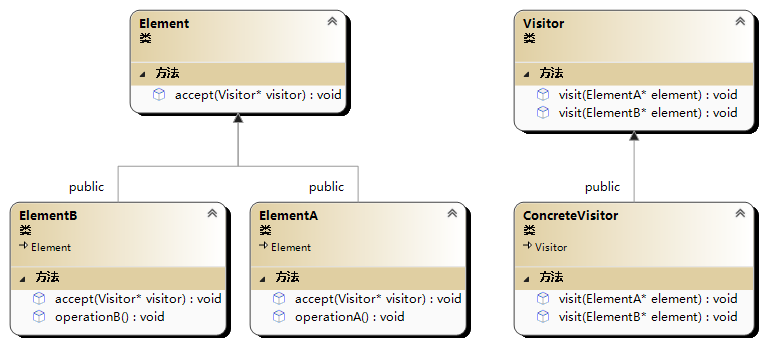

# 🤡 访问者模式(Visitor 模式)

访问者模式（Visitor Pattern）是一种行为型设计模式，它用于在不修改现有对象结构的情况下，定义对对象结构中元素的新操作。该模式将操作与对象结构分离，使得可以在不改变元素类的前提下，定义新的操作。



```cpp
#include <iostream>
#include <vector>

using namespace std;

class ElementA;
class ElementB;

//访问者抽象类
class Visitor {
public:
	virtual void visit(ElementA* element) = 0;
	virtual void visit(ElementB* element) = 0;
};

//元素抽象
class Element {
public:
	virtual void accept(Visitor* visitor) = 0;
};

//具体元素类A
class ElementA :public Element {
public:
	void accept(Visitor* visitor)override {
		visitor->visit(this);
	}
	void operationA() {
		cout << "执行元素A的操作" << endl;
	}
};

//具体元素类B
class ElementB :public Element {
public:
	void accept(Visitor* visitor)override {
		visitor->visit(this);
	}
	void operationB() {
		cout << "执行元素B的操作" << endl;
	}
};

//具体访问者类
class ConcreteVisitor :public Visitor {
public:
	void visit(ElementA* element)override {
		cout << "访问者访问元素A，执行相关操作" << endl;
		element->operationA();
	}
	void visit(ElementB* element)override {
		cout << "访问者访问元素B，执行相关操作" << endl;
		element->operationB();
	}
};

int main() {
	vector<Element*>elements;
	elements.push_back(new ElementA);
	elements.push_back(new ElementB);
	ConcreteVisitor visitor;
	for (auto elementPtr : elements) {
		elementPtr->accept(&visitor);
	}
	for (auto elementPtr : elements) {
		delete elementPtr;
	}
	return 0;
}
/*
访问者访问元素A，执行相关操作
执行元素A的操作
访问者访问元素B，执行相关操作
执行元素B的操作
*/
```

更具体的问题使用样例,在不修改现有对象结构的情况下，定义对对象结构中元素的新操作。

```cpp
#include <iostream>
#include <vector>
 // 前向声明所有图形类
class Circle;
class Rectangle;
class Triangle;
 // 访问者基类
class Visitor {
public:
    virtual void visit(Circle* shape) = 0;
    virtual void visit(Rectangle* shape) = 0;
    virtual void visit(Triangle* shape) = 0;
};
 // 图形基类
class Shape {
public:
    virtual void accept(Visitor* visitor) = 0;
};
 // 圆形类
class Circle : public Shape {
public:
    void accept(Visitor* visitor) override {
        visitor->visit(this);
    }
     void draw() {
        std::cout << "绘制圆形" << std::endl;
    }
};
 // 矩形类
class Rectangle : public Shape {
public:
    void accept(Visitor* visitor) override {
        visitor->visit(this);
    }
     void draw() {
        std::cout << "绘制矩形" << std::endl;
    }
};
 // 三角形类
class Triangle : public Shape {
public:
    void accept(Visitor* visitor) override {
        visitor->visit(this);
    }
     void draw() {
        std::cout << "绘制三角形" << std::endl;
    }
};
 // 具体访问者类 - 绘制访问者
class DrawVisitor : public Visitor {
public:
    void visit(Circle* shape) override {
        std::cout << "绘制访问者绘制圆形" << std::endl;
        shape->draw();
    }
     void visit(Rectangle* shape) override {
        std::cout << "绘制访问者绘制矩形" << std::endl;
        shape->draw();
    }
     void visit(Triangle* shape) override {
        std::cout << "绘制访问者绘制三角形" << std::endl;
        shape->draw();
    }
};
 // 具体访问者类 - 移动访问者
class MoveVisitor : public Visitor {
public:
    void visit(Circle* shape) override {
        std::cout << "移动访问者移动圆形" << std::endl;
        // 执行圆形的移动操作
    }
     void visit(Rectangle* shape) override {
        std::cout << "移动访问者移动矩形" << std::endl;
        // 执行矩形的移动操作
    }
     void visit(Triangle* shape) override {
        std::cout << "移动访问者移动三角形" << std::endl;
        // 执行三角形的移动操作
    }
};
 int main() {
    std::vector<Shape*> shapes;
    shapes.push_back(new Circle());
    shapes.push_back(new Rectangle());
    shapes.push_back(new Triangle());
    DrawVisitor drawVisitor;
    MoveVisitor moveVisitor;
     for (Shape* shape : shapes) {
        shape->accept(&drawVisitor);
    }
     for (Shape* shape : shapes) {
        shape->accept(&moveVisitor);
    }
     // 释放内存
    for (Shape* shape : shapes) {
        delete shape;
    }
     return 0;
}
```
