# 🚗 展望

## 展望

### 《网络游戏核心技术与实战》

```cpp
版权声明

前言

关于本书

本书结构

案例游戏和视频录像

案例游戏的运行环境

关于通信中间件 VCE

使用须知 ※ 请仔细阅读 ※

本书附加信息

致谢

专业术语

第 0 章　[快速入门]网络游戏编程：网络和游戏编程的技术基础

0.1　网络游戏开发者所需了解的网络编程基础

0.1.1　网络编程是必需的

0.1.2　网络编程与互联网编程

0.1.3　互联网编程的历史和思想

0.1.4　OSI 参考模型——透明地处理标准和硬件的变化

0.1.5　网络游戏系统及其层次结构

0.1.6　套接字 API 的基础知识

0.1.7　网络游戏和套接字 API——使用第 4 层的套接字 API

专栏　网络编程的特性和游戏架构的关系——服务器、客户端所需具备的性能和功能

0.2　套接字编程入门——处理多个并发连接、追求性能

0.2.1　通信链路的确定（复习）

0.2.2　套接字 API 基础——一个简单的 ECHO 服务器、ECHO 客户端示例

0.2.3　TCP 通信链路的状态迁移和套接字 API

0.2.4　处理多个并发连接——通向异步套接字 API 之路

0.2.5　同步调用（阻塞）和线程

0.2.6　单线程、非阻塞、事件驱动——使用 select 函数进行轮询

0.2.7　网络游戏输入输出的特点——单线程、事件驱动、非阻塞

0.2.8　网络游戏和实现语言

0.2.9　充分发挥性能和提高开发效率——从实现语言到底层结构

0.2.10　发挥多核服务器的性能

专栏　输入输出的实现方针和未来提高性能的可能性

0.2.11　多核处理器与网络吞吐量——网络游戏与小数据包

0.2.12　简化服务器实现——libevent

0.3　RPC 指南——最简单的通信中间件

0.3.1　通信库的必要性

0.3.2　网络游戏中使用的 RPC 的整体结构

0.3.3　［补充］UDP 的使用

0.4　游戏编程基础

0.4.1　游戏编程的历史
0.4.2　采用“只要能画点就能做出游戏”的方针来开发入侵者游戏

0.4.3　游戏编程的基本剖析

0.4.4　游戏编程精粹——不使用线程的“任务系统”

0.4.5　两种编程方法的相似性——不使用线程

0.5　小结

专栏　确保开发效率和各平台之间的可移植性

第 1 章　网络游戏的历史和演化：游戏进入了网络世界

1.1　网络游戏的技术历史

1.1.1　网络游戏出现前的 50 年

1.1.2　20 世纪 50 年代前：计算机诞生

1.1.3　20 世纪 50 年代：早期的电子游戏

1.1.4　20 世纪 60 年代：各种颇具影响的机器登上历史舞台

1.1.5　20 世纪 70 年代：网络游戏的基本要素

1.1.6　20 世纪 80 年代：网络对战游戏登场

1.1.7　20 世纪 90 年代：游戏市场扩大

1.1.8　本世纪前 10 年的前期：网络游戏商业化

1.1.9　本世纪前 10 年的后半期：基于 Web 浏览器的 MMOG 在商业上获得成功

1.1.10　2010 年之后：究竟会出现怎么样的游戏呢？

1.2　从技术变迁看游戏文化和经济圈

1.2.1　解读技术发展图

1.2.2　3 个圈（三大范畴）

1.2.3　两个游戏经济／文化圈

1.2.4　文化、经济与技术的关系

1.3　小结

专栏　成为出色的网络游戏开发程序员的条件

第 2 章　何为网络游戏：网络游戏面面观

2.1　网络游戏术语的定义

网络游戏的 4 个层面

2.2　网络游戏的物理层面

2.2.1　物理构成要素

2.2.2　物理模式 / 物理上的网络构成

2.3　网络游戏的概念层面

2.3.1　网络游戏及其基本结构

2.3.2　游戏进行空间——进行游戏时所需的所有信息

2.3.3　游戏的进展——游戏进行空间的变化

2.3.4　共享相同的游戏进展

2.4　网络游戏的商业层面

2.4.1　商业层面的要求

2.4.2　有效地招募测试玩家——网络游戏与测试

2.4.3　不断更新——网络游戏的运营和更新

2.4.4　节约服务器数量和带宽——网络游戏开支的特殊性

2.4.5　从小规模开始，确保可扩展性——将风险降到最低，不要错过取胜的机会

2.4.6　提供多种收费方式——收费结算方式的变化

2.4.7　低价、快速地根除攻击者——攻击、非法行为及其对策

2.4.8　减少服务器停止的次数和时间——不要让玩家失望
2.4.9　反馈游戏结果——日志分析和结果的可视化

2.4.10　更容易地与其他玩家相遇——玩家匹配

2.5　网络游戏的人员和组织

2.5.1　与网络游戏服务的运营相关的人员

2.5.2　网络游戏服务运营的 3 项专门职责

2.5.3　开发团队

2.5.4　运维团队

2.6　网络游戏程序员所需的知识

2.6.1　网络游戏程序员所需的技术和经验

2.6.2　各种网络游戏开发知识

2.7　支持网络游戏的技术的大类

支持网络游戏的技术的 4 种形式

2.8　影响开发成本的技术要素

2.8.1　网络游戏与如今的开发技术

2.8.2　支持网络游戏主体的 3 大核心

2.9　小结

专栏　网络游戏编程的最大难点——解决冗余和异步的问题

第 3 章　网络游戏的架构：挑战游戏的可玩性和技术限制

3.1　游戏编程的特性——保持快速响应

3.1.1　响应速度的重要性——时间总是不够的

3.1.2　将数据存放在内存中的理由——游戏编程真的有三大痛苦吗

3.1.3　 每 16 毫秒变化一次——处理的信息及其大小

3.1.4　 大量对象的显示——CPU 的处理能力

3.1.5　 无法预测玩家的操作——游戏状态千变万化

3.1.6　必须将游戏数据放在 CPU 所在的机器上

3.2　网络游戏特有的要素

3.2.1　通信延迟——延迟对游戏内容的限制

3.2.2　带宽——传输量的标准

3.2.3　服务器——成本、服务器数量的估算

3.2.4　安全性——网络游戏的弱点

3.2.5　辅助系统（相关系统）

3.3　物理架构详解——C/S 架构、P2P 架构

3.3.1　基本的网络拓扑结构

3.3.2　物理架构的种类

3.3.3　C/S 架构——纯服务器型、反射型

3.3.4　P2P 架构

3.3.5　C/S ＋ P2P 混合型架构

3.3.6　ad-hoc 模式

专栏　游戏客户端是什么

3.4　逻辑架构详解——MO 架构

3.4.1　MO、MMO 是什么？——同时在线数的区别

3.4.2　MO 架构、MOG

3.4.3　同步方式——获得全体玩家的信息后，游戏才能继续

3.4.4　同步方式 / 全网状结构的实现——所有终端都拥有主数据

3.4.5　同步方式 / 星型结构——暂时将输入信息集中到服务器上

3.4.6　异步方式——接受各终端上游戏状态的不一致
3.4.7　三大基本要素：自己、对手、环境——异步实现的指导方针

3.4.8　❶ 自己和对手——对战游戏和玩家之间往来数据的抽象程度

3.4.9　保持结果一致性的方法——两种覆盖方式

3.4.10　❷ 自己和环境——可使用物品的格斗游戏和互斥控制

3.4.11　互斥控制的实现——采用与同步方式类似的机制来实现异步方式

3.4.12　状态会自动变化的环境——静态环境和动态环境

3.4.13　❸ 对手和环境的关系

3.5　逻辑架构详解——MMO 架构

3.5.1　MMO 架构、MMOG——在大量玩家之间共享长期存在的游戏过程

3.5.2　MMOG 的结构

3.5.3　大型多人网络游戏（MMO）

3.6　小结

专栏　设法改善网页游戏的画面显示间隔

第 4 章　[实践]C/S MMO游戏开发：长期运行的游戏服务器

4.1　网络游戏开发的基本流程

4.1.1　项目文档 / 交付物

4.1.2　开发的进行和文档准备的流程

4.1.3　技术人员的文档 / 交付物

4.2　C/S MMO 游戏的发展趋势和对策

4.2.1　C/S MMO 游戏的特点

4.2.2　C/S MMO 架构（MMO 架构）特有的游戏内容

4.3　策划文档和 5 种设计文档——从虚构游戏 K Online 的开发中学习

4.3.1　考虑示例游戏的题材

4.3.2　详细设计文档

4.3.3　MMOG 庞大的游戏设定

4.3.4　5 种设计文档

4.3.5　设计上的重要判断

4.4　系统基本结构图的制定

4.4.1　系统基本结构图的基础

4.4.2　服务器必须具有可扩展性——商业模式的确认

4.4.3　各种瓶颈——扩展方式的选择

4.4.4　解决游戏服务器 / 数据库的瓶颈

4.4.5　什么都不做的情况（1 台服务器负责整个游戏世界）

4.4.6　空间分割法——解决游戏服务器的瓶颈

4.4.7　实例法——解决游戏服务器的瓶颈

4.4.8　平行世界方式——解决数据库瓶颈

4.4.9　同时采用多种方法——应对越来越多的玩家

4.4.10　各种方式的引入难度

4.4.11　各个世界中数据库（游戏数据库）服务器的绝对性能的提高

4.4.12　K Online 的设计估算——首先从同时在线数开始
4.4.13　根据游戏逻辑的处理成本来估算——敌人的行动算法需要消耗多少 CPU

4.4.14　根据游戏数据库的处理负荷进行估算——找到“角色数据的保存频率”与“数据库负荷”的关系

4.4.15　可扩展性的最低讨论结果，追求进一步的用户体验

4.4.16　服务器的基本结构，1制定系统基本结构图

4.5　2进程关系图的制定

4.5.1　2进程关系图的准备

4.5.2　服务器连接的结构——只用空间分割法

4.5.3　服务器连接的结构——使用平行世界方式和空间分割法

4.5.4　使用平行世界方式进行扩展的关键点

4.6　带宽 / 服务器资源估算文档的制定

4.6.1　以进程列表为基础估算服务器资源

4.6.2　以 CPU 为中心的服务器和以存储为中心的服务器

4.6.3　服务器资源的成本估算——首先从初期费用开始

4.6.4　带宽成本的估算

4.6.5　带宽减半的方针——首先是调整策划，然后在程序上下功夫

4.6.6　策划内容的分析对带宽的降低很有效

4.7　4协议定义文档的制定——协议的基本性质

4.7.1　4协议定义文档基础

4.7.2　“协议的基本性质”的要点

4.7.3　协议的种类、以及进程之间关系的种类

4.7.4　8 种类型的协议

4.7.5　C/S MMO 采用 TCP

4.7.6　与“协议的基本性质”的对应

4.8　4 协议定义文档——协议的 API 规范（概要）

4.8.1　协议的实现原则

4.8.2　8 种协议的功能 / 形式概述

4.9　4 协议定义文档——协议的 API 规范（详细）

4.9.1　协议 API 规范（详细）的制定

4.9.2　API 的函数定义

4.9.3　常量定义

4.9.4　API 的调用时序

4.9.5　时序图制定的要点

4.10　4协议定义文档——数据包的格式

4.10.1　C/S MMO 主要采用 TCP（复习）

4.10.2　C/S MMO 使用包含专用字节数组的二进制协议

4.10.3　二进制协议的实现——首先从术语的整理开始

专栏　C/S MMO 的压缩和加密

4.11　5数据库设计图

4.11.1　要在编程之前进行对重要的表进行设计

4.11.2　C/S MMO 中的数据库实现的历史变迁

4.11.3　整理 K Online 所需的表

专栏　百花缭乱的 KVS——未来 C/S MMO 中数据库的使用情况
4.11.4　数据库性能预测

4.12　服务器 / 客户端软件 + 中间件——实践中不可或缺的开发基础

4.12.1　网络游戏的中间件

4.12.2　开发的基础软件——可以立刻尝试的 C/S MMO 开发体验

4.13　程序开发中的基本原则

4.13.1　如何开始编程、如何继续编程

4.13.2　数据结构优先原则——基本原则1

4.13.3　实现数据结构之前的讨论——出现在画面上和不出现在画面上的元素

4.13.4　维持可玩状态的原则——基本原则2

4.13.5　后端服务器的延后原则——基本原则3

4.13.6　持续测定的原则——基本原则4

4.14　C/S MMO 游戏 K Online 的实现——编程开始！

4.14.1　开发的安排

4.14.2　K Online 中的分工计划

4.14.3　K Online 中“框架阶段”和“原型阶段”的区别

4.14.4　[ 步骤 1～2] 框架～原型阶段

专栏　每一步的进度管理形式

4.14.5　“不实际运行起来是不会理解的！”——游戏开发的特殊性

专栏　C/C++ 以外的语言

4.14.6　框架的整体结构

专栏　VCE 是什么

4.14.7　以怎样的顺序来编写代码

4.14.8　首先编写协议定义文件 k.xml——开发流程1

4.14.9　协议定义的要点

4.14.10　通信连通确认：ping 函数

4.14.11　账户登录和账户认证：signup 函数、authentication 函数

4.14.12　角色创建：createCharacter 函数

4.14.13　登录：login 函数

4.14.14　在地面上移动：move 函数、moveNotify

4.14.15　编写 gmsv/Makefile——开发流程 2

4.14.16　从示例中复制 gmsv/climain.cpp 和 gmsvmain.cpp——开发流程 3

专栏　dbsv 服务器代码的自动生成——后端服务器实现的简化

4.14.17　自动测试客户端 autocli 的实现——开发流程 4

专栏　gmsv 中线程的使用

4.14.18　图形客户端 cli 的创建和运行确认——开发流程

4.14.19　框架之后的开发——开发流程、后续事项

4.15　总结

第 5 章　[实践] P2P MO游戏开发：没有专用服务器的动作类游戏的实现

5.1　P2P MO 游戏的特点和开发策略

5.1.1　P2P MO 和动作类游戏——游戏的状态频繁发生改变
5.1.2　RPC 和共享内存

5.1.3　P2P MO 游戏的特点——和 C/S MMO 游戏的比较和难点

5.1.4　P2P MO 游戏的优点

5.1.5　从概要设计开始考虑［多人游戏模式］

5.2　J Multiplayer 游戏开发案例的学习——和 K Online 的不同

5.2.1　J Multiplayer ——和 K Online 的比较

5.2.2　P2P MO 游戏开发的基本流程

5.2.3　P2P MO 游戏开发的交付产品——开发各个阶段需要提交的资料

5.2.4　和 C/S MMO 的数据量／规模的比较

5.3　P2P MO 游戏的设计资料

5.3.1　系统基本结构图

5.3.2　进程关系图

5.3.3　带宽 / 服务器资源计算资料

5.3.4　通信协议定义资料和 API 规格

专栏　什么是“游戏逻辑”

5.3.5　带宽消耗量的估算

5.3.6　其他资料

5.4　客户端 / 服务器软件 + 中间件、基本原则

5.4.1　P2P MO 开发的最终交付产品

5.4.2　P2P MO 中使用的中间件

5.4.3　编程时应该注意的基本原则——针对 P2P MO 游戏

5.5　P2P MO 游戏 J Multiplayer 的实现——正式开始编程

5.5.1　J Multiplayer 的编程计划

5.5.2　开发流程——K Online 的回顾

5.5.3　J Multiplayer 开发阶段——开发顺序和内容

5.5.4　第 1 阶段的要点

5.5.5　客户端程序的开发案例

5.5.6　“共享内存方式”的实现——开始编码

5.5.7　P2P MO 游戏开发中该如何防止发生竞争状态

5.5.8　共享内存开发方式该如何编码——共享内存开发方式和 RPC 开发方式的比较

5.5.9　SyncValue 类

专栏　数据中心的地理位置分布

5.6　支持 C/S MO 游戏的技术 [ 补充 ]

5.6.1　C/S MO 和 NAT 问题

5.6.2　什么是 NAT 问题

5.6.3　NAT 遍历——解决 NAT 问题建立通信路径的技术

5.6.4　NAT 问题的实际解决方法

5.6.5　中继服务器

5.6.6　中继服务器的折衷方案

5.7　总结

第 6 章　网络游戏的辅助系统：完善游戏服务的必要机制

6.1　辅助系统需要的各种功能

6.1.1　现有服务提供的辅助系统功能

6.1.2　现有服务的功能一览
6.1.3　网页游戏开发方法和客户端游戏的开发方法

6.2　交流 / 通信功能

6.2.1　玩家匹配 P2P MO

6.2.2　游戏大厅 P2P MO

6.2.3　中继服务器 P2P MO

6.2.4　聊天 P2P MO　C/S MMO

6.2.5　邮件 P2P MO　C/S MMO

6.2.6　好友列表 P2P MO　C/S MMO

6.2.7　玩家状态 P2P MO　C/S MMO

6.2.8　加锁服务器 P2P MO　C/S MMO

6.2.9　黑名单 P2P MO　C/S MMO

6.2.10　语音聊天 P2P MO　C/S MMO

6.3　游戏客户端实现相关的辅助系统

6.3.1　玩家成绩管理 P2P MO　C/S MMO

6.3.2　存储功能 P2P MO

6.3.3　（游戏客户端）更新 P2P MO　C/S MMO

6.3.4　排行榜 P2P MO　C/S MMO

6.4　运营辅助系统

新闻发布 P2P MO　C/S MMO

6.5　付费相关的辅助系统

6.5.1　付费认证 P2P MO　C/S MMO

6.5.2　虚拟货币管理 P2P MO　C/S MMO

专栏　C/S MMO 游戏的收入

6.6　其他辅助功能

6.6.1　游戏数据浏览／查询工具 P2P MO　C/S MMO

6.6.2　敏感词过滤 P2P MO　C/S MMO

6.7　本章小结

第 7 章　支持网络游戏运营的 基础设施：架构、负荷测试和运营

7.1　基础设施架构的基础知识

7.1.1　C/S MMO 和 P2P MO 的基础设施（概要）

7.1.2　基础设施架构需要进行的工作 ——从开发整体来看

7.1.3　基础设施的成本估算

7.1.4　成本的概念、单位

7.1.5　网络游戏服务器在一定程度上可以接收的条件

7.1.6　硬件、信息设备

7.1.7　软件

7.1.8　数据中心相关的成本

7.1.9　服务费（数据中心以外）

7.1.10　网络带宽费

7.1.11　电费

7.2　开发者需要知道的基础设施架构技巧

7.2.1　服务规模的扩大 / 缩小——用户数和需要的基础设施规模

7.2.2　典型的环境

7.2.3　负荷曲线

7.2.4　面向开发者的基础设施架构要点

7.2.5　服务器部署

7.2.6　登台环境

7.2.7　服务器的监控、生死监控
7.2.8　日志输出 / 管理

7.3　K Online 、J Multiplayer 游戏的基础设施架构

7.3.1　K Online 的基础设施

7.3.2　J Multiplayer 的基础设施

7.4　负荷测试

7.4.1　负荷测试的准备

7.4.2　K Online 在生产环境的负荷测试

7.4.3　负荷测试时使用的服务器监控命令

7.4.4　J Multiplayer 在生产环境下的负荷测试

7.5　游戏上线

7.5.1　游戏上线前——从确认安全设定开始

7.5.2　游戏上线后 ——系统监控

7.5.3　服务器的组群化

7.5.4　故障发生时的应对

7.6　本章小结

第 8 章　网络游戏的开发体制：团队管理的挑战

8.1　游戏的策划内容和开发团队 网络游戏特有的挑战

8.1.1　游戏的策划内容是团队管理的关键

8.1.2　游戏数据的持久化

8.1.3　游戏中玩家之间的关系

8.1.4　游戏结果的共享范围

8.1.5　聊天系统的内容

8.1.6　维护和升级的计划

8.1.7　代码规模——如果需要迭代的代码过多就会遇到问题

8.2　网络游戏开发团队的实际情况——和一般软件开发相同的地方

8.2.1　工作分配

8.2.2　持续提升网络游戏程序员技能的方法

8.2.3　项目管理术——游戏开发和 Scrum

8.2.4　开发环境的选择

8.2.5　项目的移交——理所当然的事情也需要仔细归纳总结

8.3　本章小结

专栏　网络游戏开发的成本

```

### 《网络多人游戏架构与编程》


### 《百万在线大型游戏服务端开发》


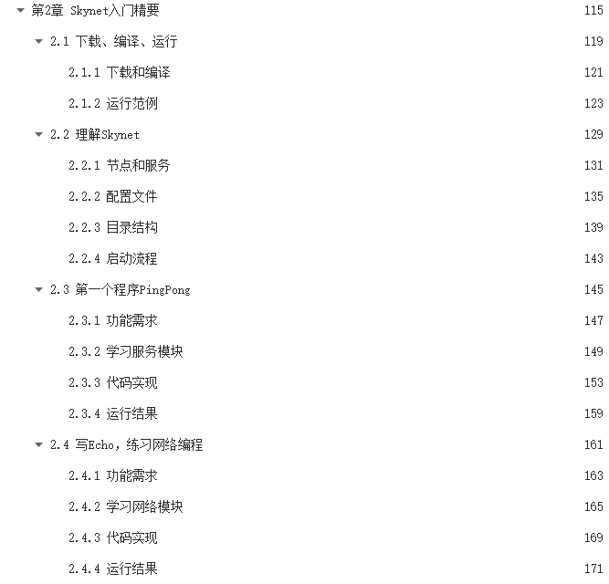
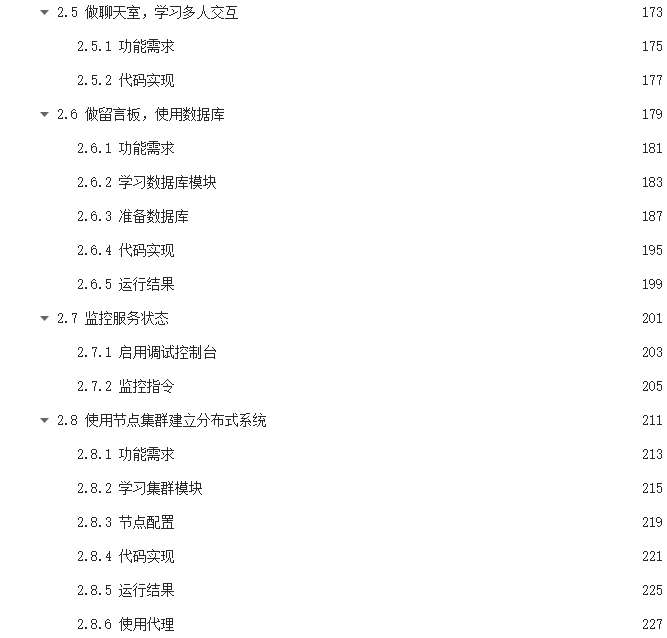

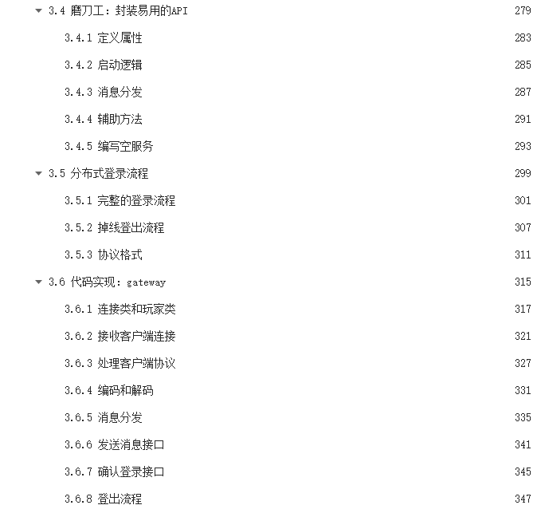
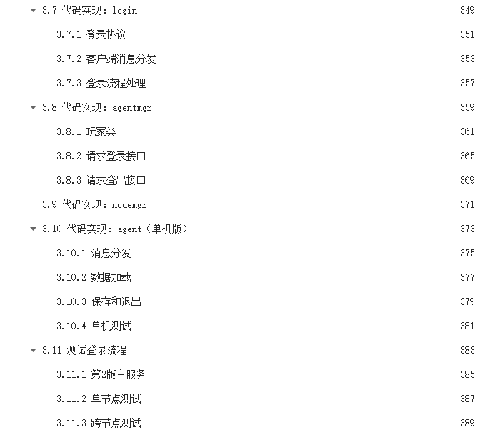

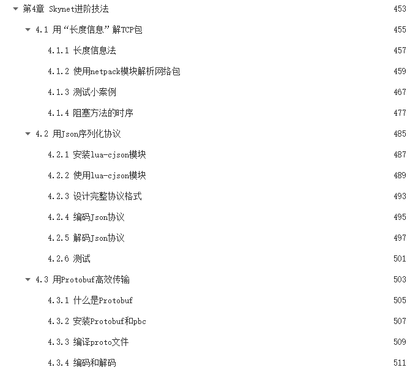

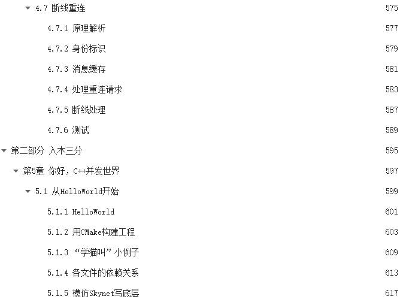
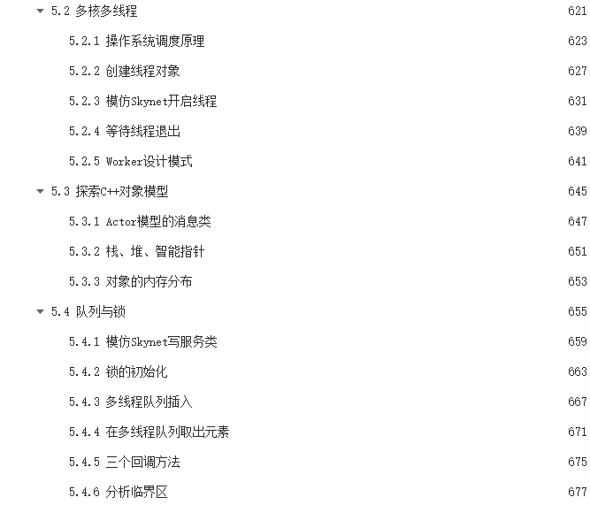


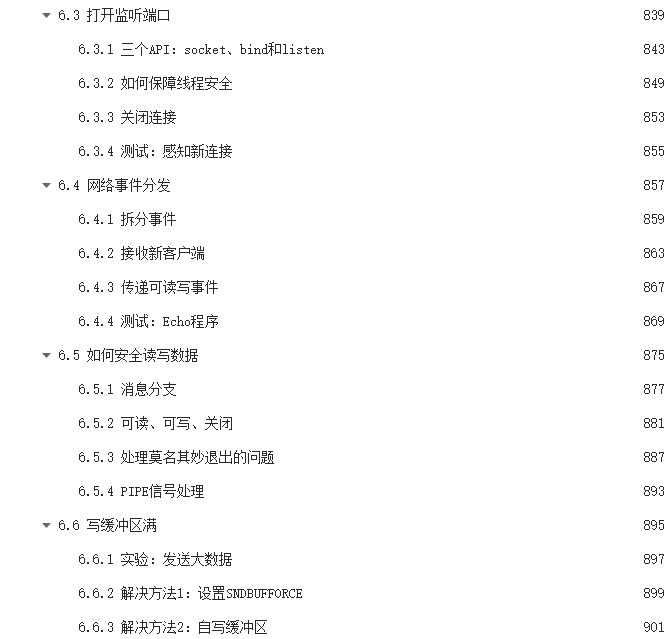
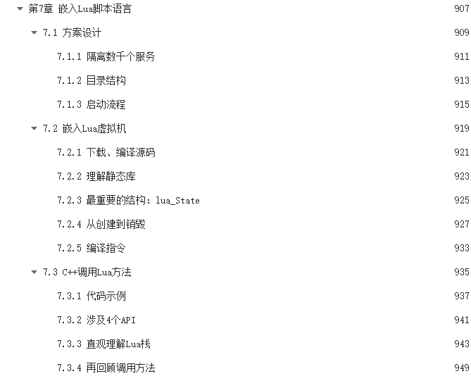

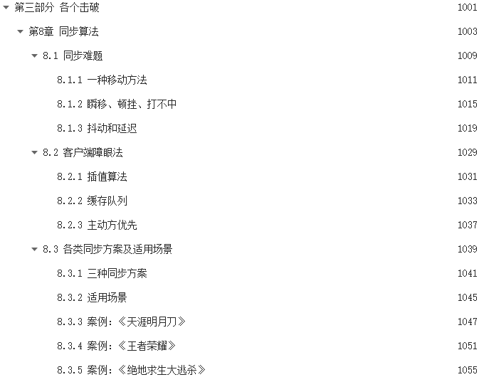


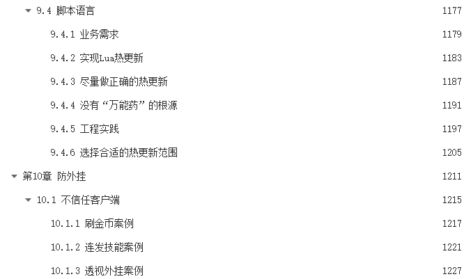
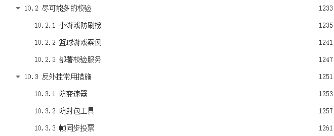
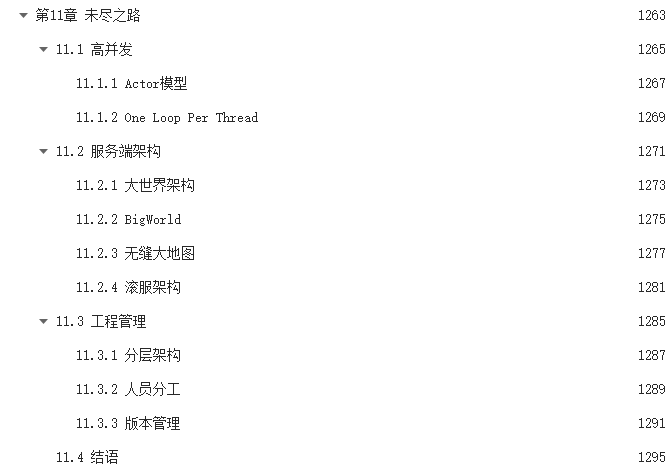
