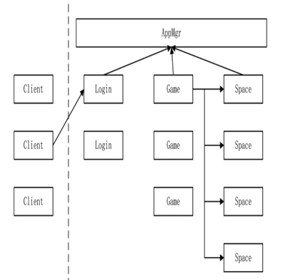
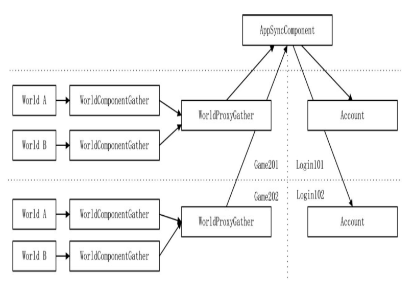

# 🚗 分布式登录与 Redis 内存数据库

## 分布式登录与 Redis 内存数据库

### game 与 space 的定位

客户端通过 HTTP 请求得到一个合适的 login 进程进行账号验证，成功后，login
会分配一个合适的 game 进程给客户端进行连接，game 进程提供玩家角色加载。
如果有多角色则进行选角，space 进程会为其分配最终的地图实例。



1. 客户端通过 HTTP 连接得到一个可用于登录的 login 进程的 IP 和端口
2. 连接到 login 进程进行账号验证，成功登陆后，创角色选角色，选择一个合适的发送给客户端，并同时生成 token
3. 客户端通过 token 连接到 game 进程上，正式开始游戏，进入某个地图
4. 收到进入地图的协议，game 进程首先向 appmgr 发起请求，判断是否有该地图的实例，如果没有，就马上在一
   个合适的 space 中创建一个地图实例。同时，在 game 进程中生成 WorldProxy 实例用于代理地图数据，WorldProxy 一旦生
   成，所有数据均会转发至 space 进程，game 进程则作为一个中转进程，类似网关进行数据转发。地图建立成功之后，向
   客户端发送进入地图协议，加载地图与玩家模型，玩家正式进入地图。

除了图中还有，dbmgr 进程，我们需要这样需要的进程之间进行两两连接。

### 选择合适的 game 进程

进程 login 如何知道在众多 game 进程中哪一个是合适的呢？有很多种办法达到目的。

1. 让 game 进程向第三方的 appmgr 进程定时发送自己的状态信息，如有多少人在线，当
   login 进程需要时，向 appmgr 请求数据，从而获得一个负载最小的 game 进程，这一个方案是异步的。
2. game 与 login 两两通信，game 定时向所有 login 进程发送自己的状态信息。当 login 进程需要时，不需要异步过程，直接可以知道哪个 game 进程负载最小。但有一个问题，如果两人分别在 login1 和 login2 进程上，在一瞬间两个 login 进程分析出来的数据得到的最小负载 game 进程是同一个进程，这意味着从短时间内看，负载可能不是精确均衡的，但长期看其实也没什么问题。

对于第 2 种方案，有个问题，如果有 10 个 login，也就是说每个 game 都必须连接 10 个 login，连接这 10 个 login 原因只是为了发送状态数据，显然不值得。可以合并两种方案：login 进程不要直接和 game 进程产生网络连接，game 进程向 appmgr 进程发送自己的状态，每隔两秒，appmgr 进程将手机到的数据推送给所有 login，这样减少了网络连接，在 login 进程上分配 game 进程时不需要使用异步。



每个 game 有许多 world，这些 world 分布在不同的线程中，每个 world 种又有许多玩家。这需要在每个 world 种加一个 WorldComponentGather 组件用于将 world 的状况上报给进程唯一的组件实例 WorldProxyGather,每个进程的 WorldProxyGather 再将进程内的 world 统计数据上报到 appmgr 进程的 AppSyncComponent,定时将消息推送到每个 login。进而可以让 login 知道每个 game 进程的情况。

### 使用 token 登录 game 进程

当 login 进程种的 Account 类选择好可以登录的 game 进程时，会发送一个 L2C_GameToken 协议到客户端

```cpp
void Account::HandleSelectPlayer(Packet* pPacket){
  //...
  auto pPlayer = pPlayerMgr->GetPlayerBySocket(pPacket->GetSocketKey().Socket);
  //...
  Proto::GameToken protoToken;
  AppInfo info;
  if(!GetOneApp(APP_GAME, &info)){
  protoToken.set_return_code(Proto::GameToken_ReturnCode_GameToken_NO_GAME);
  }else{
    protoToken.set_return_code(Proto::GameToken_ReturnCode_GameToken_OK);
    protoToken.set_ip(info.Ip.c_str());
    protoToken.set_port(info.Port);
    protoToken.set_token("");
  }
  MessageSystemHelp::SendPacket(Proto::MsgId::L2C_GameToken, pPlayer, protoToken);
}
```

当客户端收到协议后，从协议中取出可以登录的地址，就会与 login 进程断开，转而登录 game 进程，客户端会带上 login 进程发给它的 token

```cpp
void Lobby::HandleLoginByToken(Packet *pPacket)
{
    auto pPlayerCollector = GetComponent<PlayerCollectorComponent>();
    auto proto = pPacket->ParseToProto<Proto::LoginByToken>();
    auto pPlayer = pPlayerCollector->AddPlayer(pPacket, proto.account());
    if (pPlayer == nullptr)
    {
        MessageSystemHelp::DispatchPacket(Proto::MsgId::MI_NetworkRequestDisconnect, pPacket);
        return;
    }
    LOG_DEBUG("enter game. account:" << proto.account().c_str());
    Proto::LoginByTokenRs protoLoginGameRs;
    protoLoginGameRs.set_return_code(Proto::LoginByTokenRs::LGRC_OK);
    MessageSystemHelp::SendPacket(Proto::MsgId::C2G_LoginByTokenRs, pPacket, protoLoginGameRs);
}
```

重要的细节在于 `pPlayerCollector->AddPlayer`

PlayerCollectorComponent 是用来管理玩家的组件。

```cpp
class PlayerCollectorComponent : public Component<PlayerCollectorComponent>, public IAwakeFromPoolSystem<>
{
public:
    Player *AddPlayer(NetworkIdentify *pIdentify, std::string account);
    void RemovePlayerBySocket(SOCKET socket);
    Player *GetPlayerBySocket(SOCKET socket);
    Player *GetPlayerByAccount(std::string account);
    //...
private:
    std::map<SOCKET, Player *> _players;
    std::map<std::string, SOCKET> _accounts;
};
```

### Player 组件

Player 是 Entity，Entity 就是一个大容器例如要实现邮件系统，可以将 MailComponent 加载到 Player 类中

```cpp
Player->AddComponent<MailComponent>();
```

使用时

```cpp
auto pMail = pPlayer->GetComponent<MailComponent>();
```

使用组件的方式，代码显得更加简洁，还有另一个很好的用途就是重用。当我们把一些原子功能编写到组件内时，这些组件就可以被不同的实体加载，以达到功能复用的目的。

### Redis 及其第三方库
