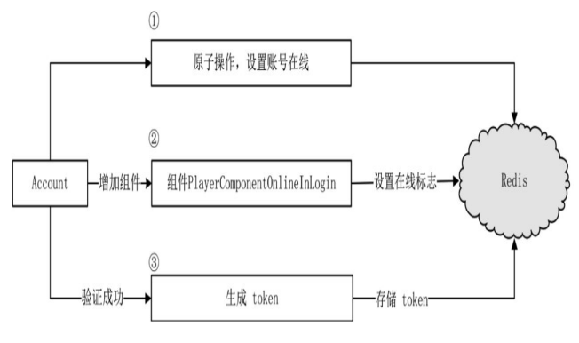
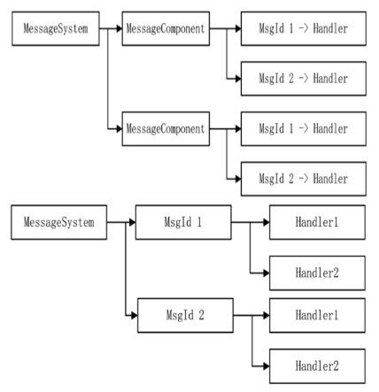

# 🚗 分布式登录与 Redis 内存数据库

## 分布式登录与 Redis 内存数据库

### game 与 space 的定位

客户端通过 HTTP 请求得到一个合适的 login 进程进行账号验证，成功后，login
会分配一个合适的 game 进程给客户端进行连接，game 进程提供玩家角色加载。
如果有多角色则进行选角，space 进程会为其分配最终的地图实例。


1. 客户端通过 HTTP 连接得到一个可用于登录的 login 进程的 IP 和端口
2. 连接到 login 进程进行账号验证，成功登陆后，创角色选角色，选择一个合适的发送给客户端，并同时生成 token
3. 客户端通过 token 连接到 game 进程上，正式开始游戏，进入某个地图
4. 收到进入地图的协议，game 进程首先向 appmgr 发起请求，判断是否有该地图的实例，如果没有，就马上在一
   个合适的 space 中创建一个地图实例。同时，在 game 进程中生成 WorldProxy 实例用于代理地图数据，WorldProxy 一旦生
   成，所有数据均会转发至 space 进程，game 进程则作为一个中转进程，类似网关进行数据转发。地图建立成功之后，向
   客户端发送进入地图协议，加载地图与玩家模型，玩家正式进入地图。

除了图中还有，dbmgr 进程，我们需要这样需要的进程之间进行两两连接。

### 选择合适的 game 进程

进程 login 如何知道在众多 game 进程中哪一个是合适的呢？有很多种办法达到目的。

1. 让 game 进程向第三方的 appmgr 进程定时发送自己的状态信息，如有多少人在线，当
   login 进程需要时，向 appmgr 请求数据，从而获得一个负载最小的 game 进程，这一个方案是异步的。
2. game 与 login 两两通信，game 定时向所有 login 进程发送自己的状态信息。当 login 进程需要时，不需要异步过程，直接可以知道哪个 game 进程负载最小。但有一个问题，如果两人分别在 login1 和 login2 进程上，在一瞬间两个 login 进程分析出来的数据得到的最小负载 game 进程是同一个进程，这意味着从短时间内看，负载可能不是精确均衡的，但长期看其实也没什么问题。

对于第 2 种方案，有个问题，如果有 10 个 login，也就是说每个 game 都必须连接 10 个 login，连接这 10 个 login 原因只是为了发送状态数据，显然不值得。可以合并两种方案：login 进程不要直接和 game 进程产生网络连接，game 进程向 appmgr 进程发送自己的状态，每隔两秒，appmgr 进程将手机到的数据推送给所有 login，这样减少了网络连接，在 login 进程上分配 game 进程时不需要使用异步。


每个 game 有许多 world，这些 world 分布在不同的线程中，每个 world 种又有许多玩家。这需要在每个 world 种加一个 WorldComponentGather 组件用于将 world 的状况上报给进程唯一的组件实例 WorldProxyGather,每个进程的 WorldProxyGather 再将进程内的 world 统计数据上报到 appmgr 进程的 AppSyncComponent,定时将消息推送到每个 login。进而可以让 login 知道每个 game 进程的情况。

### 使用 token 登录 game 进程

当 login 进程种的 Account 类选择好可以登录的 game 进程时，会发送一个 L2C_GameToken 协议到客户端

```cpp
void Account::HandleSelectPlayer(Packet* pPacket){
  //...
  auto pPlayer = pPlayerMgr->GetPlayerBySocket(pPacket->GetSocketKey().Socket);
  //...
  Proto::GameToken protoToken;
  AppInfo info;
  if(!GetOneApp(APP_GAME, &info)){
  protoToken.set_return_code(Proto::GameToken_ReturnCode_GameToken_NO_GAME);
  }else{
    protoToken.set_return_code(Proto::GameToken_ReturnCode_GameToken_OK);
    protoToken.set_ip(info.Ip.c_str());
    protoToken.set_port(info.Port);
    protoToken.set_token("");
  }
  MessageSystemHelp::SendPacket(Proto::MsgId::L2C_GameToken, pPlayer, protoToken);
}
```

当客户端收到协议后，从协议中取出可以登录的地址，就会与 login 进程断开，转而登录 game 进程，客户端会带上 login 进程发给它的 token

```cpp
void Lobby::HandleLoginByToken(Packet *pPacket)
{
    auto pPlayerCollector = GetComponent<PlayerCollectorComponent>();
    auto proto = pPacket->ParseToProto<Proto::LoginByToken>();
    auto pPlayer = pPlayerCollector->AddPlayer(pPacket, proto.account());
    if (pPlayer == nullptr)
    {
        MessageSystemHelp::DispatchPacket(Proto::MsgId::MI_NetworkRequestDisconnect, pPacket);
        return;
    }
    LOG_DEBUG("enter game. account:" << proto.account().c_str());
    Proto::LoginByTokenRs protoLoginGameRs;
    protoLoginGameRs.set_return_code(Proto::LoginByTokenRs::LGRC_OK);
    MessageSystemHelp::SendPacket(Proto::MsgId::C2G_LoginByTokenRs, pPacket, protoLoginGameRs);
}
```

重要的细节在于 `pPlayerCollector->AddPlayer`

PlayerCollectorComponent 是用来管理玩家的组件。

```cpp
class PlayerCollectorComponent : public Component<PlayerCollectorComponent>, public IAwakeFromPoolSystem<>
{
public:
    Player *AddPlayer(NetworkIdentify *pIdentify, std::string account);
    void RemovePlayerBySocket(SOCKET socket);
    Player *GetPlayerBySocket(SOCKET socket);
    Player *GetPlayerByAccount(std::string account);
    //...
private:
    std::map<SOCKET, Player *> _players;
    std::map<std::string, SOCKET> _accounts;
};
```

### Player 组件

Player 是 Entity，Entity 就是一个大容器例如要实现邮件系统，可以将 MailComponent 加载到 Player 类中

```cpp
Player->AddComponent<MailComponent>();
```

使用时

```cpp
auto pMail = pPlayer->GetComponent<MailComponent>();
```

使用组件的方式，代码显得更加简洁，还有另一个很好的用途就是重用。当我们把一些原子功能编写到组件内时，这些组件就可以被不同的实体加载，以达到功能复用的目的。

### Redis 及其第三方库

有一个问题还没有处理，是关于 token 的生成以及验证，生成 token 是在 login 进程中，
而验证却在 game 进程中，如何让一个数据在两个进程之间共享。

Redis 是一个非关系型数据库，它是 Key-Value 数据库，由
一系列的列表和字典构成，既可持久化保存，又可以只保存在内存中。Redis
因为是内存数据库，性能比 MySQL 高一些，而 Redis 也提供锁机制，非常适合进
程之间的数据交互。除了用在 token 上外，任何需要进程交互或暂存数据的功
能都可以使用 Redis。

### Redis 的安装

不如直接上 Docker 来使用 Redis

### Redis 命令行命令

肯定是必须要会的，多看看中间件部分的 redis 部分

### hiredis

C++连接使用 redis 一般直接用 hiredis，redis 原生的库，自由度比较高，封装好
自己的组件，使用起来也没那么糟糕

### 组件 RedisConnector

```cpp
class RedisConnector:public Entity<RedisConnector>, public IAwakeSystem<>{
public:
  void Awake() override;
  bool Connect();
  bool Disconnect();
  //...
protected:
  bool Ping() const;
  bool Setex(std::string key, std::string value, int timeout) const;
  bool SetnxExpire(std::string key, int value, int timeout) const;
  void Delete(std::string key) const;
  //...
};
```

组件 RedisConnector 从对象池中被唤醒时进行数据库连接，配置用 yaml

```cpp
void RedisConnector::Awake(){
  //...
  auto pYaml = ComponentHelp::GetYaml();
  const auto pConfig = pYaml->GetConfig(APP_DB_MGR);
  auto pDBConfig = dynamic_cast<DBMgrConfig*>(pConfig);
  auto pRedisConfig = pDBConfig->GetDBConfig(DBMgrConfig::DBTypeRedis);
  if(pRedisConfig == nullptr){
    LOG_ERROR("...");
    return;
  }
  _ip = pRedisConfig->Ip;
  _port = pRedisConfig->Port;
  AddTimer(0, 2*60, false, 0, BindFuncP0(this, &RedisConnector::CheckPing));
  Connect();
}
```

组件设置了定时器，每两分钟进行 Ping 操作，以下是连接 Redis 的操作

```cpp
bool RedisConnector::Connect()
{
    const struct timeval outTime = {1, 500000}; // 1.5 seconds
    redisContext *c = redisConnectWithTimeout(_ip.c_str(), _port, outTime);
    if (c == nullptr || c->err)
    {
        if (c)
            redisFree(c);
        return false;
    }
    // select rdb
    int db_index = 1;
    std::string sql = strutil::format("select %d", db_index);
    redisReply *pRedisReply = static_cast<redisReply *>(redisCommand(c, sql.c_str()));
    if (nullptr == pRedisReply)
    {
        redisFree(c);
        return false;
    }
    if (!(pRedisReply->type == REDIS_REPLY_STATUS && strncmp(pRedisReply->str, "OK", 2) == 0))
    {
        freeReplyObject(pRedisReply);
        redisFree(c);
        return false;
    }
    freeReplyObject(pRedisReply);
    _pRedisContext = c;
    return Ping();
}
```

Ping 操作检测 Redis 客户端与服务端是否连接正常

```cpp
bool RedisConnector::Ping() const
{
    if (_pRedisContext == nullptr)
    {
        return false;
    }
    redisReply *pRedisReply = static_cast<redisReply *>(redisCommand(_pRedisContext, "PING"));
    if (nullptr == pRedisReply)
    {
        return false;
    }
    if (!(pRedisReply->type == REDIS_REPLY_STATUS && strncmp(pRedisReply->str, "PONG", 4) == 0))
    {
        freeReplyObject(pRedisReply);
        return false;
    }
    freeReplyObject(pRedisReply);
    return true;
}
```

### Redis 在 login 中的应用

前面就有考虑一个场景问题，如果一个玩家用两个客户端登录同一个账号，如果有两个 login 进程这两次登录可能同时落到
同一个 login 进程，又可能落在两个 login 进程上。

利用 Redis 处理这个问题，进行跨进程检查账号是否在线。

```cpp
class RedisLogin : public RedisConnector{
private:
  void RegisterMsgFunction() override;
  void HandleLoginTokenToRedis(Packet* pPacket);
  void HandleAccountQueryOnline(Packet* pPacket);
  void HandleAccountSyncOnlineToRedis(Packet* pPacket);
  void HandleAccountDeleteOnlineToRedis(Packet* pPacket);
}；
```

RedisLogin 有三个任务：检验账号是否在线、生成可以登录 game 进程的 token、给在线账号生成在线标志

1. 检验账号是否在线

当收到一个客户端验证账号的协议时，Account 类会转发一个协议向 Redis 询问登录的账号是否有相同的账号在线，组件 RedisLogin 收到了协议后，向 Redis 查询两
条数据，一个是想知道账号是否在 login 进程上，一个是查看是否在 game 进程上。

设置在线标识时，除了设置 key value 之外，还设置过期时间，在一定时间之内，不能重复登录。应该用 setnx 命令，也就是 (SET if Not eXists),如果不存在就设置，这是个原子操作。

2. 生成可以登录 game 进程的 token

当所有的验证选择角色完成之后，需要生成一个 token，这个 token 需要在 login 与 game 进程中同时访问，在 Account 中账号验证成功后，发起一个 MI_LoginTokenToRedis 协议。

```cpp
void RedisLogin::HandleLoginTokenToRedis(Packet* pPacket){
  auto protoToken = pPacket->ParseToProto<Proto::LoginTokenToRedis>();
  auto account = protoToken.account();
  auto playerSn = protoToken.player_sn();
  auto token = Global::GetInstance()->GenerateUUID();
  //将tokeninfo序列化为串，存入redis
  Proto::TokenInfo protoInfo;
  protoInfo.set_token(token);
  protoInfo.set_player_sn(playerSn);
  std::string tokenString;
  protoInfo.SerializeToString(&tokenString);
  const std::string key = ReisKeyAccountToKey + account;
  const int timeoue = RedisKeyAccountToKeyTimeout;
  //命令setex自带一个有效时间，在存储token时，采用的有效时间由RedisKetAccountToKeyTimeout定义
  if(!Setex(key, tokenString, timeoue)){// SETEX
    token = "";
  }
  //将生成的token返回给Account
  Proto::LoginTokenToRedisRs protoRs;
  protoRs.set_account(account.c_str());
  protoRs.set_token(token.c_str());
  MessageSystemHelp::DispatchPacket(Proto::MsgId::MI_LoginTokenToRedisRs, protoRs, nullptr);
}
```

3. 给在线账号生成在线标志

通过 Redis 在登录时，可以保证同一个账号进行串行登录，但是它依然有一个潜在的风险，向第三方进行账号验证是一个不确定的时间，向外部发起一个 HTTP 请求，如果设置账号在 login 进程在线的标识过期时间为 10 秒，10 秒后 HTTP 请求还没有返回，Redis 就会将这个键销毁，但真实情况可能在第 11 秒返回结果，这中间有 1 秒的时间差，如果在这 1 秒内，该账号再次发起登录，就会产生异常。

需要有一种机制，只要玩家还在 login 进程上，就定时不断向 Redis 写入在线的标识，可以将这个功能交给一个新组件，PlayerComponentOnlineLogin,这个组件在 Redis 验证成功之后、HTTP 验证开始之前被加载到 Player 对象上。

其实这种操作，更像是在做分布式锁，防止有同一个用户同时进入。

```cpp
void Account::HandleAccountQueryOnlineToRedisRs(Packet* pPacket){
  auto protoRs = pPacket->ParseToProto<Proto::AccountQueryOnlineToRedis>();
  //...
  //在线组件
  pPlayer->AddComponent<PlayerComponentOnlineInLogin>(pPlayer->GetAccount());
  //验证账号，向第三方平台发起HTTP请求
  MessageSystemHelp::CreateConnect(NetworkType::HttpConnector, pPlayer->GetObjectKey(), ......);
}
```

PlayerComponentOnlineInLogin 组件被初始化时，向时间堆写入了每隔一段时间就要调用的函数，这个时间可以为 Redis 设置在线标识销毁的一半时间，
到一半时间要做的就是，向 Redis 组件发送一条在线标识设置消息，Redis 组件收到消息后调用 setex,将存活时间重置。



步骤 1 就是设置账号在 login 的在线标识，还要检查是否有 game 在线的标识.然后增加 PlayerComponentOnlineInLogin 定时重置 login 在线标识过期时间,然后向第三方验证,
如果验证成功后,则生成 token 存到 redis.客户端拿着生成的 token,在有效期内去 game 登录上线.

### Redis 在 game 中的应用

客户端登录 game,首先发起 C2G_LoginByToken,为了处理请求 token 的协议,在 Game 增加 RedisGame 类,有两个任务要做,一个任务是查询已知的账号是否存在 token,校验 token,第二个任务是为当前在 game 进程中的玩家设置 game 在线标识.

1. 查询一个已知账号的 token,token 只能使用一次,使用完成之后,将键对应数据进行删除.
2. 在登录 game 时,先收到客户端提交的 tokeninfo,这时应该做的是需要先写入账号在 game 进程的在线标识后,再向 redis 查询账号对应的真 token.

需要注意的是,无论 game 还是 login 进程,在玩家与服务器 socket 断开连接时,服务器应该对玩家的在相应进程在线标识进行删除掉.

### 优化 MessageComponent 组件

其实现在的 MessageComponent 组件,是存在一些问题的,MessageComponent 组件维护了一个字典,关联着 MsgId 和它处理函数的对应关系,如果有 1000 个 Entity 都关心网络断开事件,在 MessageSystem 中就有 1000 个 MessageComponent,在这 1000 个 MessageComponent 组件中存放着 1000 个实体对应网络断开事件的回调函数.

MessageComponent 组件阻隔了实体与 MessageSystem 之间的连接,它们彼此不知道对方的存在,但是 MessageComponent 带来了性能上的问题,显然很多余,MessageSystem 系统可以将 MessageComponen 取消掉,
协议号 MsgId 直接注册到 MessageSystem,对于一个确定的协议来说,不需要遍历所有的 MessageComponent 组件,就可以拿到所有需要回调的处理函数.可以变为根据 MsgId 直接获取到所有的被注册函数,根据 IMessageCallBack 判断是否过滤,
需要过滤则需要用 NetworkIdentify 校验决定是否执行.

```cpp
class MessageSystem:virtual public ISystem<MessageSystem>{
public:
  void RegisterFunction(IEntity* obj, int msgId, MsgCallbackFun cbfun);
  template<typename T>
  void RegisterFunctionFilter(IEntity* obj, int msgId, std::function<T*(NetworkIdentify*)> ...));
  //...
private:
  //message
  std::map<int, std::list<IMessageCallBack*>> _callbacks;
}
```



在注册协议函数时，将协议回调函数与 MsgId 绑定起来，这样免去了中间环节。
如 Account 注册协议时,不再为自己增加一个 MessageComponent 组件,而是直接调用 MessageSystem 的 RegisterFunction 进行注册

```cpp
void MessageSystem::RegisterFunction(IEntity* obj, int msgId, MsgCallbackFunc cbfun)
{
  auto iter = _callbacks.find(msgId);
  if(iter == _callbacks.end()){
    _callbacks.insert(std::make_pair(msgId, std::list<IMessageCallBack*>()));
  }
  const auto pCallback = obj->AddComponent<MessageCallBack>(std::move(cbfun));
  _callbacks[msgId].push_back(pCallback);
}
```

取消 MessageComponent 组件后,MessageSystem 提供了两个函数,一个 RegisterFunction,一个 RegisterFunctionFilter

```cpp
template <typename T>
void MessageSystem::RegisterFunctionFilter(IEntity *obj, int msgId, std::function<T *(NetworkIdentify *)> getObj, std::function<void(T *, Packet *)> fun)
{
    auto iter = _callbacks.find(msgId);
    if (iter == _callbacks.end())
    {
        _callbacks.insert(std::make_pair(msgId, std::list<IMessageCallBack *>()));
    }
    auto pCallback = obj->AddComponent<MessageCallBackFilter<T>>();
    pCallback->GetFilterObj = std::move(getObj);
    pCallback->HandleFunction = std::move(fun);
    _callbacks[msgId].push_back(pCallback);
}
```

有一说一,这本书真他妈傻逼,命名可以到这将,先讲最终的框架,然后向前回溯,倒着讲,让读者大悟,明白原来的优势.
关于最新的 MessageSystem 看代码吧,其实最终我们直接看书籍的仓库代码最终版,然后阅读源码,模仿者写出我们自己的 Actor ECS 框架,然后返回优化自己的框架工程.
