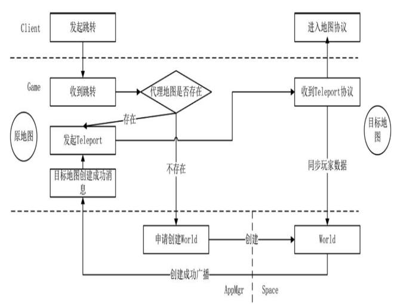

# 分布式跳转方案

## 分布式跳转方案

此部分主要学习玩家在 game 进程上跳转地图的流程,Player 组件如何读取数据,game 进程如何与 space 进程通信,还有游戏逻辑配置文件读取, 进入地图流程.

### 资源数据配置与读取

到此还没有搭建,逻辑配置资源的功能设计,可以采用 CSV 文件格式,而且 execel 可以转 csv. 游戏策划几乎每天大多数时间在与表格打交道.

首先需要一个总的管理类,管理所有游戏逻辑的配置文件,命名为 ResourceManager,在这个类下可能存在 ResourceWorldMgr 和 ResourceItemMgr,分别管理地图和道具的相关配置.


### 资源管理类 ResourceManager

加入需要读取某个资源配置文件,需要设计简单的调用方式风格

```cpp
GetResMgr()->WorldMgr->GetWorld(id);
GetResMgr()->ItemMgr->GetItem(id);
```

先取得一个总的入口，从入口取得需要的地图或道具的管理器，再从管理器中取得 想要的一行数据。

```cpp
class ResourceManager:public Entity<ResourceManager>, public IAwakeSystem<>{
public:
  void Awake() override;
  void BackToPool() override;
public:
  ResourceWorldMgr* Worlds;
}
```

ResourceManager 只在主线程中的 EntitySystem 就好了,虽然设计到多线程的访问,但是初始化完成后,数据只读不写,对于只读的数据,在任何线程中都是安全的.

```cpp
void ResourceManager::Awake(){
  const auto pResPath = ComponentHelp::GetResPath();
  Worlds = new ResourceWorldMgr();
  if(!Worlds->Initialize("world.csv", pResPath)){
    LOG_ERROR("...");
  }
  //LOG...
}
```

### 地图资源管理类 ResourceWorldMgr

```cpp
class ResourceWorldMgr:public ResourceManagerTemplate<ResourceWorld>{
public:
  bool AfterInit() override;
  ResourceWorld* GetInitMap();
private:
  int _initMapId{0};
}
```

除了地图管理之外，随着逻辑功能越来越多会陆续加入很多其他的配置，例如道具、任务 等，这些资源配置管理类其实都是相似的，所以编写了一个管理模板类。

```cpp
template <class T>
class ResourceManagerTemplate
{
public:
    bool Initialize(std::string table, ResPath *pResPath);
    virtual bool AfterInit() { return true; }
    T *GetResource(int id);

protected:
    bool ParserHead(std::string line);
    bool LoadReference(std::string line);

protected:
    std::string _cvsName;
    std::map<std::string, int> _head;
    std::map<int, T *> _refs;
};
```

1. Initialize 函数：配置文件初始化数据。
2. AfterInit 函数：初始化完成之后的操作由具体的继承类实现。
3. GetResource 函数：根据 Id 取得一个对象实体。
4. ParserHead 函数：分析 CSV 文件的头。
5. LoadReference 函数：分析 CSV 文件的行。

模板类中存储了一个字典数据，用于 Id 与行实例的一一对应

```cpp
std::map<int,T*> _refs;
```

Initialize 实现,加载 csv 文件，读取每一行

```cpp
template <class T>
bool ResourceManagerTemplate<T>::Initialize(std::string table, ResPath *pResPath)
{
    _cvsName = table;
    std::string path = pResPath->FindResPath("/resource");
    path = strutil::format("%s/%s.csv", path.c_str(), table.c_str());
    std::ifstream reader(path.c_str(), std::ios::in);
    if (!reader)
    {
        LOG_ERROR("can't open file. " << path.c_str());
        return false;
    }
    if (reader.eof())
    {
        LOG_ERROR("read head failed. stream is eof.");
        return false;
    }
    // 分析第一行，头部标题
    std::string line;
    std::getline(reader, line);
    std::transform(line.begin(), line.end(), line.begin(), ::tolower);
    if (!ParserHead(line))
    {
        LOG_ERROR("parse head failed. " << path.c_str());
        return false;
    }
    // 循环读出每一行，将每一行转换为一个内存对象
    while (true)
    {
        if (reader.eof())
            break;
        std::getline(reader, line);
        if (line.empty())
            continue;
        std::transform(line.begin(), line.end(), line.begin(), ::tolower);
        LoadReference(line);
    }
    if (!AfterInit())
        return false;
    return true;
}
```

ParserHead 和 LoadReference 两个函数，ParserHead 函数用于分析文件的第一行，也就是标题行，而 LoadReference 函数用于分析行数据。ParseHead 函数的实现如下。

```cpp
template <class T>
bool ResourceManagerTemplate<T>::ParserHead(std::string line)
{
    if (line.empty())
        return false;
    std::vector<std::string> propertyList = ResourceBase::ParserLine(line);
    for (size_t i = 0; i < propertyList.size(), i++)
    {
        _head.insert(std::make_pair(propertyList[i], i));
    }
    return true;
}
```

每一行都有一个实例与之对应

```cpp
template <class T>
bool ResourceManagerTemplate<T>::LoadReference(std::string line)
{
    auto pT = new T(_head);
    if (pT->LoadProperty(line) && pT->Check())
    {
        _refs.insert(std::make_pair(pT->GetId(), pT));
        return true;
    }
    return false;
}
```

关于 C++解析 CSV，不再过多解释了，知道是这么回事就行了，可以找一找现有的 C++ CSV 库。 在此先模拟一个地图配置表

| 列名            | 说明                            |
| ------------- | ----------------------------- |
| Id            | 唯一序列号                         |
| Name          | 名字                            |
| Init          | 是不是初始进入的地图，也就是默认出生点           |
| Type          | 地图类型                          |
| AbPath        | 地图客户端 3D 资源 AB 包名             |
| ResName       | 在 AB 包中的资源名                   |
| UiResType     | 进入地图时是否有初始加载的 UI 界面，若有则为界面的类型 |
| PlayerInitPos | 玩家进入地图的初始坐标                   |

### 地图类 World 与代理类 WorldProxy

首先需要理解的概念是 World 和 WorldProxy，这两个概念都很重要，而且相互关联。 每一个玩家进入地图 A 时，地图 A 的实例类为 WorldA，它的实例在某个 Space 进程中，而玩家登录的进程是 game 进程，所以需要有一个 WorldProxy 来帮助玩家对数据进行中转，也就是 WorldProxy 类，每个 WorldProxy 代理一个 World 类。

进入某个地图时，在 game 进程上会为地图 World 实例创建一个代理类，但并不是每个 World 实例在 game 进程都有代理类，只有 game 进程关心的 World 实例才创建代理类。也就是说，如果 game1 进程中没有玩家访问 WorldB，就没有 WorldB 的代理类。 如果作为公共地图，每一个 game 进程上都有公共地图的代理类，但是副本地图，有些副本代理类仅在 game 进程中出现。


在分布式服务器中进入地图是一个比较复杂的过程，要做的第一步就是，World 和 WorldProxy 的创建。

### 地图类 World

World 类在 space 进程中，而 WorldProxy 在 game 进程上，从创建顺序上，应该先创建 World 类，在创建 WorldProxy 类。

对于 game 来说，向 Redis 询问数据对客户端传来的 token 进行验证，验证成功后，就真正进入地图环节了。

```cpp
void Lobby::HandleQueryPlayerRs(Packet* pPacket){
  //...
  //分析进入地图
  auto protoPlayer = protoRs.player();
  const auto playerSn = protoPlayer.sn();
  pPlayer->ParserFromProto(playerSn, protoPlayer);
  const auto pPlayerLastMap = pPlayer->AddComponent<PlayerComponentLastMap>();
  auto pWorldLocator = ComponentHelp::GetGlobalEntitySystem()->GetComponent<WorldProxyLocator>();
  //进入副本
  auto pLastMap = pPlayerLastMap->GetLastDungeon();
  if(pLastMap != nullptr && pWorldLocator->IsExistDungeon(pLastMap->WorldSn)){
    //存在副本，跳转
    WorldProxyHelp::Teleport(pPlayer, GetSN(), pLastMap->WorldSn);
    return;
  }
  //进入公共地图
  pLastMap = pPlayerLastMap->GetLastPublicMap();
  const auto lastMapSn = pWorldLocator->GetWorldSnById(pLastMap->WorldId);
  if(lastMapSn!=INVALID_ID){
    //存在公共地图，跳转
    WorldProxyHelp::Teleport(pPlayer, GetSN(), lastMapSn);
    return;
  }
  //...
  //向appmgr申请创建地图
  Proto::RequestWorld protoToMgr;
  protoToMgr.set_world_id(pLastMap->WorldId);
  MessageSystemHelp::SendPacket(Proto::MsgId::G2M_RequestWorld, protoToMgr, APP_APPMGR);
}
```

当第一个玩家进来的时候，是不可能有副本地图和公共地图的，所以向 appmgr 发起了请求协议 G2M\_RequestWorld，该协议请求一个地图所在的位置。因为我们要创建的是公共地图，公共地图是全局唯一的，必须采用串行的方式创建，所以 appmgr 是一个不错的选择。同一瞬间，有多个玩家登录多个 game 时，在 appmgr 中的处理也是串行的，不会出错。

在工程中，创建协议发送之后，appmgr 收到创建的消息，会查询所有 space 的状态，找到一个相对空闲的 space 发起真正的创建地图协议。

在 appmgr 中用 CreateWorldComponent 处理创建地图请求协议

```cpp
void CreateWorldComponent::HandleRequestWorld(Packet *pPacket)
{
    auto proto = pPacket->ParseToProto<Proto::RequestWorld>();
    auto worldId = proto.world_id();
    auto pResMgr = ResourceHelp::GetResourceManager();
    const auto mapConfig = pResMgr->Worlds->GetResource(worldId);
    if (mapConfig == nullptr)
    {
        LOG_ERROR("can't find map config. id:" << worldId);
        return;
    }
    if (!mapConfig->IsType(ResourceWorldType::Public))
    {
        LOG_ERROR("appmgr recv create dungean map. map id:" << worldId);
        return;
    }
    // 正在创建中，等待
    const auto iter = _creating.find(worldId);
    if (iter != _creating.end())
        return;
    // 因为是异步的，有可能发送过来时已经被创建了
    const auto iter2 = _created.find(worldId);
    if (iter2 != _created.end())
        return;
    AppInfo appInfo;
    if (!GetOneApp(APP_SPACE, &appInfo))
    {
        LOG_ERROR("appmgr recv create map. but no space process. map id:" << worldId);
        return;
    }
    Proto::CreateWorld protoCreate;
    protoCreate.set_world_id(worldId);
    protoCreate.set_request_world_sn(0);
    protoCreate.set_request_game_id(0);
    MessageSystemHelp::SendPacket(Proto::MsgId::G2S_CreateWorld, protoCreate, APP_SPACE, appInfo.AppId);
    _creating[worldId] = appInfo.AppId;
}
```

G2S\_CreateWorld 协议发送给一个指定的 sapce 进程，该进程真正创建一个地图

```cpp
message CreateWorld{
  //想要创建的地图在world.csv中的ID
  int32 world_id = 1;
  //game进程中发起这个请求的实体的唯一标识SN，方便回调
  uint64 request_world_sn = 2;
  //发出此协议的game进程appid，方便回调，如果为0则讲地图
  //创建信息发到所有game进程
  int32 request_game_id = 3;
}
```

在 Space 工程中，WorldOperatorComponent 组件处理创建地图协议

```cpp
void WorldOperatorComponent::HandleCreateWorld(Packet*pPacket){
  auto protoWorld = pPacket->ParserToProto<Proto::CreateWorld>();
  int worldId = protoWorld.world_id();
  const int requestGameId = protoWorld.request_game_id();
  const uint64 requestWorldSn = protoWorld.request_world_sn();
  auto worldSn = Global::GetInstance()->GennerateSN();
  ThreadMgr::GetInstance()->CreateComponentWithSn<World>(worldSn, worldId);
  //验证数据是否正确
  const auto pResMgr = ResourceHelp::GetResourceManager();
  const auto pWorldRes = pResMgr->Worlds->GetResource(worldId);
  if(pWorldRes->IsType(ResourceWorldType::Dungeon)&&requestWorldSn==0){
    LOG_ERROR("create world error. dungeon is created. but requestWorldSn == 0");
  }
  //如果requestWorldSn == 0 ，就广播给所有game和appmgr
  //如果requestWorldSn !=0 ,就广播给指定的game和appmgr
  Proto::BroadcastCreateWorld protoRs;
  protoRs.set_world_id(worldId);
  protoRs.set_world_sn(worldSn);
  protoRs.set_request_game_id(requestGameId);
  protoRs.set_request_world_sn(requestWorldSn);
  if((Global::GetInstance()->GetCurAppType()&APP_APPMGR)==0){
    //本进程不是appmgr，则向appmgr发消息
    MessageSystemHelp::SendPacket(Proto::MsgId::MI_BroadcastCreateWorld, protoRs, APP_APPMGR);
  }
  //本进程不是game
  if((Global::GetInstance()->GetCurAppType()&APP_GAME)==0){
    if(requestWorldSn==0){
      //向所有game进程发送数据
      MessageSystemHelp::SendPacketToAllApp(Proto::MsgId::MI_BroadcastCreateWorld, protoRs, APP_GAME);
    }else{
      //向指定game发送数据
      MessageSystemHelp::SendPacket(Proto::MsgId::MI_BroadcastCreateWorld, pPacket, protoRs);
    }
  }
  if((Global::GetInstance()->GetCurAppType()&APP_GAME)!=0||(Global::GetInstance()->GetCurAppType()&APP_APPMGR)!=0){
    // 本进程中包括game和appmgr其中一个，需要中转消息
    MessageSystemHelp::DispatchPacket(Proto::MsgId::MI_BroadcastCreateWorld, protoRs, nullptr);
  }
}
```

当 appmgr 收到了 MI\_BroadcastCreateWorld

```cpp
void CreateWorldComponent::HandleBroadcastCreateWorld(Packet *pPacket)
{
    auto proto = pPacket->ParseToProto<Proto::BroadcastCreateWorld>();
    const auto worldId = proto.world_id();
    const auto worldSn = proto.world_sn();
    const auto gameId = proto.request_game_id();
    const auto pResMgr = ResourceHelp::GetResourceManager();
    const auto pWorldRes = pResMgr->Worlds->GetResource(worldId);
    if (pWorldRes->IsType(ResourceWorldType::Public))
    {
        // 是公共地图
        _created[worldId] = proto.world_sn();
        _creating.erase(worldId);
    }
    else
    {
        // 是副本
        _dungeons[worldSn] = gameId;
    }
}
```

game 进程收到创建地图的协议要做的事情更多，它必须为这个 World 创建一个 WorldProxy 代理类。

```cpp
void WorldProxyLocator::HandleBroadcastCreateWorld(Packet *pPacket)
{
    std::lock_guard<std::mutex> guard(_lock);
    auto proto = pPacket->ParseToProto<Proto::BroadcastCreateWorld>();
    const int worldId = proto.world_id();
    const auto worldSn = proto.world_sn();
    const auto gameId = proto.request_game_id();
    const uint64 lastWorldSn = proto.request_world_sn();
    const auto worldCfg = ResourceHelp::GetResourceManager()->Worlds->GetResource(worldId);
    if (worldCfg == nullptr)
    {
        LOG_ERROR("WorldProxyLocator::HandleBroadcastCreateWorld. can't find worldId:" << worldId);
        return;
    }
    if (worldCfg->IsType(ResourceWorldType::Public))
    {
        if (_publics.find(worldId) != _publics.end())
        {
            LOG_ERROR(" WorldLocator. find same key. worldId:" << worldId);
        }
        ThreadMgr::GetInstance()->CreateComponentWithSn<WorldProxy>(worldSn, worldId, lastWorldSn);
    }
    else
    {
        if (gameId != Global::GetInstance()->GetCurAppId())
        {
            LOG_ERROR("gameId != cur game id");
        }
        if (lastWorldSn > 0 && _worlds.find(lastWorldSn) == _worlds.end())
        {
            LOG_ERROR("can't find request world. world sn:" << lastWorldSn);
        }
        ThreadMgr::GetInstance()->CreateComponentWithSn<WorldProxy>(worldSn, worldId, lastWorldSn);
    }
}
```

不论何时，在 game 进程中收到地图的创建成功协议，都必须为其创建一个 WorldProxy。如果是副本，就一定是 game 进程与 space 进程一对一发送的，创建结果 space 会发送到指定的 game 进程上，不需要再广播给所有 game 进程。

### 为什么需要 WorldProxy

对于分布式服务架构来说，game 进程并不是一个最终的进程，它起着网关的作用。玩家进入的地图实际上是在 space 进程上，我们称为 World A。如果有两个 玩家在不同的 game 进程中，同时进入了 World A，那么在每个 game 进程中为他们建立一个 WorldProxy 与 World A 进行交互。

从客户端的角度来看，两个玩家通过不同的 IP 或端口进入两个 game 进程，但是他们在同一张地图上。如果我们要做的是 MOBA 类游戏，匹配玩家之后，就一起 进入某个地图实例中战斗，采用这种分布式的方式横向扩展 game、space 服务器，可以达到最优方案，对物理机进行充分利用，所有实例几乎平均分布在所有进程 上。

除了 WorldProxy，也有一部分框架是这样操作的：进入副本地图之后，客户端与 game 进程的网络断开，重新创建一个与副本所在进程连接的 Socket。本 书中没有采用这种方式，而是采用 WorldProxy 方式，即保持 Socket 不变而采用代理。客户端直接连接 space，操作是直接的，但是跳转地图时可能不断地更换网络 连接。同时，也有一些不方便的处理。例如，Space A 上的玩家要与 Space B 上的玩家进行交互，为了达到这个需求，这时所有 space 需要两两连接成一个巨大的网 状网络结构，而且逻辑的交互会变得非常耦合。

如果要做 MOBA 游戏，它的流程在框架中的设计为：两个客户端随机登录 game 进程，通过匹配功能模块，两个玩家建立的战场实例被放到 space N 进程上。这时， game1 和 game2 都会为这个地图创建 WorldProxy，作为客户端协议的中断处。操作协议最终的处理点在 space N 进程的某个地图实例中。当有无数个客户端同时匹配 的时候，这种模式会将战场平均分配在所有 space 进程上，以达到负载均衡的目的。


### 分布式地图跳转流程

在分布式模式中，角色的跳转是比较困难的部分，要考虑的事情比较多，先从简单的入手。验证账号初次进入地图，可以看成是一次跳转，框架中有 Lobby 类，它相当于一个大厅。每个玩家进入 game 进程，首先进入的就是这个大厅。在大厅中进行 token 验证，验证成功之后才能进入上次登录的副本地图或公共地图。 如果不是一个分布式系统，那么一个单进程跳转流程图如图所示：


首先由客户端发起一个跳转请求，原地图收到这个请求之后，组织跳转协议，并且带上玩家数据发送到目标地图。目标地图收到协议并处理完成之后，给 原地图返回一个数据，原地图删除玩家数据。如果目标地图返回失败，就维持在原地图，客户端显示跳转失败；如果跳转成功，客户端就会收到一个进入地图的 协议，加载新地图资源。

对于多进程分布式，在异步流程中，首先需要判断目标地图的代理是否存在，如果不存在，就申请创建，创建是一个异步的过程，只有等 到创建地图成功的广播，原地图才能向目标地图的代理 WorldProxy 发起跳转 Teleport 协议，收到 Teleport 协议的返回协议表示已跳转成功，原地图才能删除 玩家数据。



### 发起跳转协议的时机

当角色 token 验证成功后，登录大厅 Lobby 有两个时机发送跳转 Teleport 协议：

第一个时机，当玩家登录进来时没有 WorldProxy 代理类，所以必须申请创建一个地图。创建完成之后，收到 WorldProxy 创建成功的广播，此时 Lobby 类中等待跳转到该地图的玩家统一发送跳转协议给目标地图。

等待 WorldProxy 的创建是一个异步过程，Lobby 为每一张地图的跳转角色做了一个等待队列。在 Lobby 类中，类型为`std::map<int，std::set<uint64>>`的字典保存了地图 Id 与其对应的玩家等待列表。有时并不只有一 个玩家在等待，所以是 set 数据（集合数据）。

第二个时机，当玩家登录进来时，如果 WorldProxy 已经存在了，Lobby 就可以立即向 WorldProxy 发起跳转请求。在这个流程中不需要任何缓存数据，可以直接调用 WorldProxyHelp：：Teleport 函数发起跳转。

### 目标代理地图收到跳转协议

在目标的 WorldProxy 收到跳转协议时，先通知旧地图跳转成功，让其删除玩家数据，然后，将玩家的数据传到被代理的真实地图中。 到此就能感觉到这本书写的真是一坨狗屎。

### space 进程发送的协议如何转发到客户端

这就需要 WorldProxy 来作为消息转发的中介，需要将客户端的协议转发到 space 进程，同时将 space 进程上的协议转发给客户端。

### 玩家在 WorldProxy 之间的跳转

玩家从 Lobby 创建了代理地图 WorldProxy 并成功跳转，玩家的数据也传递到了 World 地图中，还有就是从 WorldProxy 跳转到 WorldProxy，它与 Lobby 跳转到 WorldProxy 是不一样的，原因在于对玩家数据的同步处 理。Lobby 跳转到 WorldProxy 的流程图如图。


简单来说，玩家从 Lobby 到 WorldProxy 的跳转只需要关注目标代理地图是否存在，一旦存在就可以发起跳转，但是 在 WorldProxy 之间却不是这么回事。


WorldProxy 之间的跳转多了一步请求同步玩家数据。为什么呢？作为代理地图，WorldProxy 只是一个代理，真正的数据还是在 World 中，为了取得跳转时的真实数据，必须实时向 World 请求整个玩家数据，然后跳转到代理地图中，后面的操作就与 Lobby 跳转到 WorldProxy 一致了。在同步玩家数据的处理方式上有很多种方案。可以使用 Redis 数据来进行缓存， Redis 数据是可以跨线程读取的，也可以使用协议进行同步。

对于这部分内容还是好好钻研下源码吧，书写得和狗屎一样，书中乱贴代码又臭又长，所以赶快结束下一章节， 然后从头开始模仿写自己得 ECS Actor，后面再好好分析以下这部分得业务。
