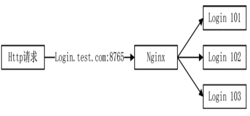

# 🚗 断线与动态加载系统

## 断线与动态加载系统

本部分主要讨论一个异常处理，网络断线和重连。断线又包括，玩家的断线，服务端进程之间的断线。

### 玩家断线

玩家断线是一种正常的网络断线，在整个游戏框架中，玩家数据会保存在 3 个进程和
4 个实体中。3 个进程分别为 login 进程、game 进程、space 进程。当玩家断线时，
要充分考虑到 3 个进程中的数据，相关数据都需要处理。

4 种实体分别为：

1. 在 login 进程中，实体对象为 Account 类，改类用于玩家账号验证
2. 在 game 进程中，有两个与玩家有关的实体类，Lobby 类，改类是玩家进入 game 进程的第一个实体类。WorldProxy 类，改类是地图类的代理类。
3. 在 space 进程中，玩家存在于一个特定的 World 类中，改类是真正的地图类。

对于以上的 4 种实体类，都需要处理玩家断线的问题，当一个网络连接中断时，网络底层
会发送 MI_NetworkDisconnect 协议给各个线程。需要在这 4 个实体类种，处理好 MI_NetworkDisconnect 的后续操作。

### 玩家在 login 进程中断线

当玩家还没有进入 game 进程之前，客户端是与 login 进行通信的，其主要数据位于 Account 类中,下面为 Account 类对于断线协议做出的反应

```cpp
void Account::HandleNetworkDisconnect(Packet* pPacket){
  const auto socketKey = pPacket->GetSocketKey();
  if(socketKey->NetType != NetworkType::TcpListen)
    return;
  auto pPlayerCollector = GetComponent<PlayerCollectorComponent>();
  pPlayerCollector->RemovePlayerBySocket(pPacket->GetSocketKey()->Socket);
}
```

收到断线协议后，Account 类会将玩家的数据进行销毁，附加在 Player 实体上的组件会将玩家在 Redis 中的数据也销毁。
在 Login 进程中，除了有 TCP 连接外，还有向外发出的 HTTP 连接，HTTP 连接用于玩家向第三方 Web 服务器请求账号验证时使用，在断线处理时，需要判断当前断线 Socket 类型，只有是外部连接到套接字的连接才进行处理。

### 玩家在 game 进程中断线

当玩家进入 game 进程时，可能存在于两个实体中：一个是 Lobby、一个是 WorldProxy,在这两个类中，都需要要做断线处理。
Lobby 时验证玩家登陆时提交的 Token 的，WorldProxy 则是某个 space 进程中的 world 代理类。

```cpp
void Lobby::HandleNetworkDisconnect(Packet* pPacket){
  auto pTagValue = pPacket->GetTagKey()->GetTagValue(TagType::Account);
  if(pTagValue == nullptr)
    return;
  GetComponent<PlayerCollectorComponent>()->RemovePlayerBySocket(pPacket->GetSocketKey()->Socket);
}
```

在 Lobby 类中，只需要以除玩家数据即可，在 WorldProxy 类中需要处理的步骤及较多。

```cpp
void WorldProxy::HandleNetworkDisconnect(Packet* pPacket){
  TagValue* pTagValue = pPacket->GetTagKey()->GetTagValue(TagType::Account);
  if(pTagValue!=nullptr){
    const auto pPlayer = GetComponent<PlayerCollectorComponent>()->GetPlayerBySocket(pPacket->GetSocketKey()->Socket);
    if(pPlayer==nullptr){
      return;
    }
    auto pCollector = GetComponent<PlayerCollectorComponent>();
    pCollector->RemovePlayerBySocket(pPacket->GetSocketKey()->Socket);
    SendPacketToWorld(Proto::MsgId::MI_NetworkDisconnect, pPlayer);
  }
  //...
}
```

当一个玩家的网络中断后，WorldProxy 代理地图类将玩家数据移除，同时需要向 space 进程中的 World 发送一个断线消息，
告诉 World 类有一个玩家断线了。

### 玩家断线时 World 类的处理

下面为 space 进程收到断线消息所进行的大致处理

```cpp
void World::HandleNetworkDisconnect(Packet* pPacket){
  auto pTags = pPacket->GetTagKey();
  const auto pTagPlayer = pTags->GetTagValue(TagType::Player);
  if(pTagPlayer != nullptr){
    auto pPlayerMgr = GetComponent<PlayerManagerComponent>();
    const auto pPlayer = pPlayerMgr->GetPlayerBySn(pTagPlayer->KeyInt64);
    if(pPlayer==nullptr){
      //LOG_ERR();
      return;
    }
    Proto::SavePlayer protoSave;
    protoSave.set_player_sn(pPlayer->GetPlayerSN());
    pPlayer->SerializeToProto(protoSave.mutable_player());
    MessageSystemHelp::SendPacket(Proto::MsgId::G2DB_SavePlayer, protoSave, APP_DB_MGR);
    //玩家掉线
    pPlayerMgr->RemovePlayerBySn(pTagPlayer->KeyInt64);
  }
}
```

当 world 收到玩家断线的消息后，第一件事就是将内存中玩家的数据移除，将其从 PlayerManagerComponent 管理类中移除，第二件事是在移除之前，将玩家的数据发送到 dbmgr 进程中进行数据存储，发送的协议号为 G2DB_SavePlayer.

### 玩家数据的读取与保存

当玩家下线时，需要从 World 对象中移除玩家，并对当前数据进行存储，存储玩家数据时使用协议发送给 dbmgr

```cpp
message Player{
  uint64 sn = 1;
  string name = 2;
  PlayerBase base = 3;
  PlayerMisc misc = 4;
}
```

结构 PlayerBase 中包括一些基础数据，结构 PlayerMisc 中包括一些杂项数据，如果要增加道具数据，那么可以再增加一个
PlayerItems 结构，当玩家登录 game 进城后，再 Lobby 类中会生辰一个 Player 实例，game 进程会读取出玩家选中的叫色，并
从 DB 中读取 Proto::Player 传递到 Player 实体中。

```cpp
void Player::ParserFromProto(const uint64 playerSn, const Proto::Player& proto){
  _playerSn = playerSn;
  _player.CopyFrom(proto);
  _name = _player.name();
  //在内存中修改数据,Player实体上挂在了许多Component，当从DB读到玩家数据时
  //也需要让组件知道
  for(auto pair : _components){
    auto pPlayerComponent = dynamic_cast<PlayerComponent*>(pair.second);
    if(pPlayerComponent == nullptr){
      continue;
    }
    pPlayerComponent->ParseFromProto(proto);
  }
}
```

对于附加在 Player 实体上的组件，如果有存储或读取数据库的需要，都是基于 PlayerComponent 接口的，要实现两个虚函数。

```cpp
class PlayerComponent{
public:
  virtual void ParserFromProto(const Proto::Player& proto) = 0;
  virtual void SerializeToProto(Proto::Player* pProto) = 0;
};
```

Player 类解析了 Proto::Player 的结构，并将它传递到自己身上所有组件上，让组件选择自己需要的数据来填充内存数据，如 PlayerComponentLastMap，用于分析最后一次登录地图的数据

```cpp
void PlayerComponentLastMap::ParserFromProto(const Proto::Player& proto){
  //公共地图
  auto protoMap = proto.misc().last_world();
  int worldId = protoMap.world_id();
  auto pResMgr = ResourceHelp::GetResourceManager();
  auto pMap = pResMgr->Worlds->GetResource(worldId);
  if(pMap!=nullptr){
    _pPublic = new LastWorld(protoMap);
  }else{
    pMap = pResMgr->Worlds->GetInitMap();//默认地图
    _pPublic = new LastWorld(pMap->GetId(),0,pMap->GetInitPosition);
  }
  //...
}
```

当 Proto::Player 数据传递到 PlayerComponentLastMap 组件时，从 PlayerMisc 数据挑选自己感兴趣的读到属性中去。
又例如 space 进程中的 PlayerComponentDetail 组件，这个组件存储着玩家的基础数据，如 level、gender 常用数据。

```cpp
void PlayerComponentDetail::ParseFromProto(const Proto::Player& proto){
  auto protoBase = proto.base();
  _gender = protoBase.gender();
  //...
}
```

每个组件指对自己感兴趣的数据进行处理。现在还存在另一种情况，如果 Proto::Player 结构已经解析过了，这时动态为 Player 加入了
新组件，初始化工作由 Awake 组件来完成。

```cpp
void PlayerComponentLastMap::Awake(){
  Player* pPlayer = dynamic_cast<Player*>(_parent);
  ParserFromProto(pPlayer->GetPlayerProto());
}
```

除了读取之外，还需要关注玩家身上的组件是如何进行数据存储的，当玩家断线时，调用下面的代码实现保存

```cpp
Proto::SavePlayer protoSave;
protoSave.set_player_sn(pPlayer->GetPlayerSN());
pPlayer->SerializeToProto(protoSave.mutable_player());
MessageSystemHelp::SendPacket(Proto::MsgId::G2DB_SavePlayer, protoSave, APP_DB_MGR);
```

关键点在于 Player 的 SerializeToProto

```cpp
void Player::SerializeToProto(Proto::Player* pProto) const{
  //基础数据
  pProto->CopyFrom(_player);
  //在内存中修改数据
  for(auto pair:_components){
    auto pPlayerComponent = dynamic_cast<PLayerComponent*>(pair.second);
    if(pPlayerComponent==nullptr){
      continue;
    }
    pPlayerComponent->SerializeToProto(pProto);
  }
}
```

当需要保存数据时，也是遍历玩家的所有组件，让组件把自己的数据传递到给定的参数 Proto::Player 中。

```cpp
void PlayerComponentLastMap::SerializeToProto(Proto::Player* pProto){
  //公共地图
  if(_pPublic!=nullptr){
    const auto pLastMap = pProto->mutable_misc()->mutable_last_world();
    _pPublic->SerializeToProto(pLastMap);
  }
  //副本
  if(_pDungeon!=nullptr){
    const auto pLastDungeon = pProto->mutable_misc()->mutable_last_dungeon();
    _pDungeon->SerializeToProto(pLastDungeon);
  }
}
```

PlayerComponentLastMap 组件保存上一次登录的地图信息，将自己的内存数据(最近的登录地图数据)写入给定的
Proto::Player 中，这样角色下次上线时取到的数据就是下线时最后的数据.

在 Player 组件的 SerializeToProto 函数中,将内存的数据重新写回到 Proto::Player 中,再将它传递到 dbmgr 实现存储,
除了实现持久化存储,还应该处理 Redis 的缓存数据如在线标识应该删除.

### 如何进入断线之前的地图

在一个玩家进入 game 进程时,第一个到达的地方是 Lobby 类中,是一个中转站.Lobby 类从 Redis 读 token 校验,从数据库中读取出玩家数据,其处理函数为`Lobby::HandleQueryPlayerRs`,本函数应从玩家数据中取出最近登录的副本地图(例如王者荣耀的枚举匹配比赛,其实本质就是副本,如果断线后重新上线理应让玩家选择进入未结束的副本),以保证玩家优先进入之前被中断的副本,如果副本不在本地就向 appmgr 进行查询,查询时将玩家放在等待队列.

```cpp
void Lobby::HandleQueryPlayerRs(Packet *pPacket)
{
    auto protoRs = pPacket->ParseToProto<Proto::QueryPlayerRs>();
    auto account = protoRs.account();
    auto pPlayer = GetComponent<PlayerCollectorComponent>()->GetPlayerByAccount(account);
    //...
    // 分析进入地图
    auto protoPlayer = protoRs.player();
    const auto playerSn = protoPlayer.sn();
    pPlayer->ParserFromProto(playerSn, protoPlayer);
    auto pWorldLocator = ComponentHelp::GetGlobalEntitySystem()->GetComponent<WorldProxyLocator>();
    // 进入副本
    auto pLastMap = pPlayerLastMap->GetLastDungeon();
    if (pLastMap != nullptr)
    {
        // 现在game进程找
        if (pWorldLocator->IsExistDungeon(pLastMap->WorldSn))
        {
            // 存在副本,则跳转
            WorldProxyHelp::Teleport(pPlayer, GetSN(), pLastMap->WorldSn);
            return;
        }
        // 为副本加上等待列表
        if (_waitingForDungeon.find(pLastMap->WorldSn) == _waitingForDungeon.end())
        {
            _waitingForDungeon[pLastMap->WorldSn] = std::set<uint64>();
        }
        if (_waitingForDungeon[pLastMap->WorldSn].empty())
        {
            // 向appmgr查询副本
            Proto::QueryWorld protoToMgr;
            protoToMgr.set_world_sn(pLastMap->WorldSn);
            protoToMgr.set_last_world_sn(GetSN());
            MessageSystemHelp::SendPacket(Proto::MsgId::G2M_QueryWorld, protoToMgr, APP_APPMGR);
        }
        // 将用户加入到副本请求等待列表
        _waitingForDungeon[pLastMap->WorldSn].insert(pPlayer->GetPlayerSN());
        return;
    }
    // 进入公共地图
    EnterPublicWorld(pPlayer);
}
```

game 向 appmgr 进程进行副本查询后,如果副本在 space 进程中存在,就会在本地创建一个 WorldProxy 代理地图,进行跳转.
多进程启动时,存在多个 game 进程,有可能玩家第二次登录的 game 进程不是之前的 game 进程,也就不存在 WorldProxy.
虽然不存在,但是可以创建一个代理类.

### WorldProxy 何时被销毁的

理论上来说,当 World 在某种条件下被销毁了,应该广播一条销毁协议,这个销毁协议会发送到所有 game 进程和 appmgr 进程,以请求这个 World 当前对应的 WorldProxy 数据,appmgr 的数据被清除之后,玩家登录时向 appmgr 请求副本地图时会返回失败,这时就会选择最近的公共地图进入.

### 进程之间的断线

对于服务器而言,除了玩家断线之外,服务器进程之间的断线更为复杂,进程之间的通信不一定非得用 TCP,有必要时 UDP,分布式消息队列.
可能会有更好的选择方案,不能说那一个更好,需要结合业务场景选择何使的方案.

在服务端，大部分进程都在内网，除了宕机之外，很少出现断线的问题，处理断线重连问题。多进程启动的顺序不是固定的，如果一定要按照
一个固定的顺序来启动服务器的所有进程，显然不够灵活，就有进程的启动不是先启动 appmgr，在启动 game，对于 game 进程而言，
它启动时 appmgr 还没有启动，这里就相当于一个断线重连的情况。

### login 进程断线与重连

工程 login 的断线处理相对比较简单，login 有网络连接的是 dbmgr 和 appmgr 进程，每个 login 进程需要向 appmgr 进程同步自己当前的状态，一个 login 断线了，在 appmgr 中的状态就需要清楚。

```cpp
appmgr中的处理
void AppSyncComponent::HandleNetworkDisconnect(Packet* pPacket){
  if(!NetworkHelp::IsTcp(pPacket->GetSocketKey()->NetType))
    return;
  SyncComponent::HandleNetworkDisconnect(pPacket);
  //...
}
void SyncComponent::HandleNetworkDisconnect(Packet* pPacket){
  SOCKET socket = pPacket->GetSocketKey()->Socket;
  const auto iter = std::find_if(_apps.begin(), _apps.end(), [&socket](auto pair){
    return pair.second.Socket == socket;
  });
  if(iter == _app.end())
    return;
  _apps.erase(iter);
}
```

在 appmgr 中，login 的数据关系到登陆时请求登录 IP 的功能，因为可能有很多个 login 进程，这样玩家上线时就不会请求到
已经断线的 login 进行数据。关闭 login 进程之后，其信息在 appmgr 进程被销毁，再次连接之后，又会重新同步状态。

### game 进程断线与重连

game 进程发生断线，那么与它有联系的所有进程都需要做出反应，与 game 进程有连接的进程是 dbmgr、appmgr、space。
game 连接 dbmgr 是为了读取数据，连接 appmgr 为了创建公共地图，这两个进程不需要对 game 进程的断线做出特别的操作。

game 是玩家与 space 的中间进程，当 game 进程发生宕机或其他时间引起的断线时，在 game 进程上的所有玩家网络全部中断，对于 space
来说，需要做的是检查自己的每一个地图实例，与断线 game 进程有关联的玩家全部踢下线并保存。

```cpp
//space
void World::HandleNetworkDisconnect(Packet* pPacket){
  auto pTags = pPacket->GetTagKey();
  const auto pTagPlayer = pTags->GetTagValue(TagType::Player);
  if(pTagPlayer != nullptr){
    //...玩家掉线
  }else{
    //dbmgr,appmgr or game断线
    const auto pTagApp = pTags->GetTagValue(TagType::App);
    if(pTagApp != nullptr){
      auto pPlayerMgr = GetComponent<PlayerManagerComponent>();
      pPlayerMgr->RemoveAllPlayers(pPacket);
    }
  }
}
```

一旦发现收到的断线来自于 game 进程，与这个 game 有关的所有玩家将被从 PlayerManagerComponent 管理组件中踢出，在踢出的过程中
执行了保存数据的操作。

```cpp
void PlayerManagerComponent::RemoveAllPlayers(NetIdentify* pNetIdentify){
  auto iter = _players.begin();
  while(iter!=_players.end()){
    auto pPlayer = iter->second;
    if(pPlayer->GetSocketKey()->Socket != pNetIdentify->GetSocketKey()->Socket){
      ++iter;
      continue;
    }
    iter = _players.erase(iter);
    //save
    Proto::SavePlayer protoSave;
    protoSave.set_player_sn(pPlayer->GetPlayerSN());
    pPlayer->SerializeToProto(protoSave.mutable_player());
    MessageSystemHelp::SendPacket(Proto::MsgId::G2DB_SavePlayer, protoSave, APP_DB_MGR);
    //remove obj
    GetSystemManager()->GetEntitySystem()->RemoveComponent(pPlayer);
  }
}
```

game 进程网络断开，space 进程上所有地图的 World 实例都会收到断线消息，在 world 处理消息时，将断开协议中的
socket 值与玩家上的 socket 值进行对比，找到这些 socket 值相同的玩家，让这些玩家下线，同时保存玩家的数据。

### space 进程断线与重连

space 进程断线的情况比 game 更复杂，space 还连接了 dbmgr 与 appmgr，space 与 dbmgr 的连接断开了不会有大问题，很快就会
重新连接。space 与 game 的连接是由 game 进程发起的，space 断线，game 进程中的 WorldProxy 必须做出反应。

```cpp
void WorldProxy::HandleNetworkDisconnect(Packet *pPacket)
{
    if (!NetworkHelp::IsTcp(pPacket->GetSocketKey()->NetType))
    {
        return;
    }
    TagValue *pTagValue = pPacket->GetTagKey()->GetTagValue(TagType::Account);
    if (pTagValue != nullptr)
    {
        // 玩家掉线
        // ...
    }
    else
    {
        // 可能是space、login、appmgr、dbmgr断线
        auto pTags = pPacket->GetTagKey();
        const auto pTagApp = pTags->GetTagValue(TagType::APP);
        if (pTagApp == nullptr)
        {
            return;
        }
        const auto appKey = pTagApp->KeyInt64;
        const auto appType = GetTypeFromAppKey(appKey);
        const auto appId = GetIdFromAppKey(appKey);
        if (appType != APP_SPACE || _spaceAppId != appId)
        {
            return;
        }
        // 玩家需要全部断线
        auto pPlayerCollector = GetComponent<PlayerCollectorComponent>();
        pPlayerCollector->RemoveAllPlayerAndCloseConnect();
        // locator
        auto pWorldLocator = ComponentHelp::GetGlobalEntitySystem()->GetComponent<WorldProxyLocator>();
        pWorldLocator->Remove(_worldId, GetSN);
        // worldproxy销毁
        GetSystemManager()->GetEntitySystem()->RemoveComponent(this);
    }
}
```

在 game 进程中，worldproxy 代理类的目标 world 可能位于各个 space 进程上，所以 worldproxy 收到断线消息，需要先判断
是狗是自己代理类的 space 进程断线了，如果是，当前代理地图中的玩家全部下线，同时销毁 worldproxy 自己。

在 space 断线时，在 appmgr 中保存了一些地图实例与 space 的对应数据，这些数据也必须在断线时处理掉

```cpp
//appmgr中
void CreateWorldComponent::HandleNetworkDisconnect(Packet* pPacket){
  //...
  auto appId = GetIdFromAppKey(pTagApp->KeyInt64);
  //断线的space上是否有正在创建的地图
  do{
    auto iterCreating = std::find_if(_creating.begin(), _creating.end(), [&appId](auto pair){
      return pair.second == appId;
    });
    if(iterCreating == _creating.end()){
      break;
    }
    //正在创建时，Space进程断开了，另找其他space进程创建world
    auto workdId = iterCreating->first;
    _creating.erase(iterCreating);
    ReCreateWorld(worldId);
  }while(true);
  //断线的Space上有自己创建的公共地图全部删除
  do{
    auto iterCreated = std::find_if(_created.begin(), _created.end(), [&appId](auto pair){
      return Global::GetAppIdFromSN(pair.second) == appId;
    });
    if(iterCreated == _created.end())
      break;
    _created.erase(iterCreated);
  }while(true);
  //断线的space上创建的副本地图全部删除
  do{
    const auto iter = std::find_if(_dungeons.begin(), _dungeons.end(), [&appId](auto pair){
      return pair.second == appId;
    });
    if(iter == _dungeons.end())
      break;
    _dungeons.erase(iter);
  }while(true);
}
```

### appmgr 进程断线与重连

如果 appmgr 断线了或者宕机了，会怎样，appmgr 需要解决两个问题，一个是全局共有数据另一个为 http 请求

重启 appmgr 后，所有连接它的进程会将自己的玩家和在线情况发送过来，但 appmgr 不仅仅是重启那么简单，appmgr 不仅负责
维护公共地图所在的 space 信息，还负责维护副本地图的 space 信息，这些信息在 appmgr 断线后变为空白。

1. space 进程发现自己和 appmgr 连接上后，马上发送协议，一些中包括 space 当前所有的地图信息，但这有问题，当 appmgr 被重启了，
   在 space 还没有向 appmgr 发送同步地图的信息之前，game 进程向 appmgr 请求某个公共地图的信息，这时 appmgr 应该选 space 去
   创建 world，还是应该等待。
2. appmgr 是否真的需要保存这些数据，如果不保存，game 进程应该如何知道某个公共地图的实例在哪一个 space 中，可以将数据推送到
   redis 中，space 中的数据就不必保存到 appmgr 上，同时可以省略每个进程中的采集数据的流程。

除了 appmgr 和 dbmgr 之外，都有可替代的方案，game1 挂了有 game2，space1 挂了有 space2，如果 appmgr 宕机了，就没可替代方案了。
实际上，appmgr 同样可以采用集合的方式，这样即使其中一个 appmgr 关闭了，还有另一个 appmgr，都是类似的思路。appmgr 的地址也可以搞到 redis 中，
appmgr 称为集群。

在框架中，appmgr 收集了所有 login 进程的信息，客户端通过 HTTP 请求到 appmgr 获取到一个 login 进程用于登录，在实际情况中
可以采取另外一种方式实现，可以用 Nginx 的 upstream 功能，首先在 login 进程上实现一个 HTTP 接口，返回自己的 IP 与端口，
也就是客户端登录的 IP 与端口，将 login 打开的 HTTP 端口配置到 Nginx 上

```cpp
Upstream login_server{
  server 192.168.0.172:9000 weight=5;
  server 192.168.0.171:9000 weight=5;
}
```

当访问 Nginx 时，Nginx 会以轮询的方式分发客户端的请求到每一个 login 进程上，这种架构叫反向代理负载均衡。



### 动态新增系统

现在的 ECS 框架对于 System 系统的部分几乎固定在了底层，如果上层有需求新增系统，只能改底层，需要设计动态新增系统，下面为
移动系统的样例。

要实现移动功能，首先客户端需要发送一条移动协议，在处理移动协议时可以分两种情况。

1. 给定一个目标点，让任务移动到目标点
2. 给定一个移动方向

常用的处理移动的方式:当玩家收到这个移动协议，将这个数据保存在玩家对象中，然后每一帧对其移动位置进行计算与调整。

```cpp
class player{
private:
  std::list<Vector3> pos;
public:
  void HandleMove(Packet* pPacket){
    This->pos = ...;//收到移动协议，初始化
  }
  void Update(){
    if(IsMove()){
      this->curpos = ...//计算移动点
    }
  }
};
```

如果所有数据都堆积在 player 类中，就有太多杂乱数据，可以用新组件来存储移动数据。

### MoveComponent 组件

在 space 进程中，收到客户端传来的 C2S_Move 移动协议后，通过 game 进程的 WorldProxy，协议被中转到指定 World 实例上。
在处理协议时，将移动数据全部存在了 MoveComponent 组件，处理移动时，要求客户端发送从起点位置到重点位置的所有坐标点。
将路径传给服务端，让服务端以相同的速度计算出玩家的位移情况。在 World 类中，收到移动消息的处理如下

```cpp
void World::HandleMove(Player* pPlayer, Packet* pPacket){
  auto proto = pPacket->ParseToProto<Proto::Move>();
  proto.set_player_sn(pPlayer->GetPLayerSN());
  const auto positions = proto.mutable_position();
  auto pMoveComponent = pPlayer->GetComponent<MoveComponent>();
  if(pMoveComponent == nullptr){
    pMoveComponent = pPlayer->AddComponent<MoveComponent>();
  }
  std::queue<Vector3> pos;
  for(auto index = 0; index < proto.position_size(); index++){
    Vector3 v3(0,0,0);
    v3.ParserFromProto(positions->Get(index));
    pos.push(v3);
  }
  const auto pComponentLastMap = pPlayer->GetComponent<PlayerComponentLastMap>();
  pMoveComponent->Update(pos, pComponentLastMap->GetCur()->Position);
  BroadcastPacket(Proto::MsgId::S2C_Move, proto);
}
```

协议中的位置数据存储了从原点到终点之间路径上的所有点，相邻的两个点之间没有阻碍，当收到一个移动协议后，做一个
全地图广播，将收到的移动数据广播给本地图的所有玩家，并将数据保存到 MoveComponent 中。

```cpp
class MoveComponent:public Component<MoveComponent>,public IAwakeSystem<>{
//...
private:
  std::queue<Vector3> _targets;
  MoveVector3 _vector3;
};
```

如果玩家要计算出每帧的位移，需要有一个 Update 帧函数来实时计算，如果有 1000 个玩家在地图上，也就是需要调用 Update 函数 1000 次，
现在可以进行统一处理，只需要调用 Update 一次，处理这个计算的是新系统 MoveSystem。

### 新系统 MoveSystem

MoveSytem 的定义，在 space 进程中

```cpp
class MoveSystem:public ISystem<MoveSystem>{
public:
  MoveSystem();
  void Update(EntitySystem* pEntities) override;
private:
  timeutil::Time _lastTime;
  ComponentCollections* _pCollections{nullptr};
};
//...
void MoveSystem::Update(EntitySystem* pEntities){
  //每0.5秒刷一次
  cosnt auto curTime = Global::GetInstance()->TimeTick;
  const auto timeElapsed = curTime - _lastTime;
  if(timeElapsed<500){
    return;
  }
  if(_pCollections==nullptr){
    _pCollections=pEntities->GetComponentCollections<MoveComponent>();
    if(_pCollections==nullptr){
      return;
    }
  }
  _lastTime = curTime;
  const auto plists = _pCollections->GetAll();
  for(auto iter = plists->begin(); iter!=plists->end(); ++iter){
    auto pMoveComponent = dynamic_cast<MoveComponent*>(iter->second);
    auto pPlayer = pMoveComponent->GetParent<Player>();
    if(pMoveComponent->Update(timeElased, pPlayer->GetComponent<PlayerComponentLastMap>(), 2)){
      pPlayer->RemoveComponent<MoveComponent>();
    }
  }
}
```

MoveComponent 组件有两个 Update 函数，一个用于更新移动路径，一个用于计算路径

```cpp
class MoveComponent : public Component<MoveComponent>, public IAwakeFromPoolSystem<>
{
public:
    void Update(std::queue<Vector3> targets, Vector3 curPosition);
    bool Update(float timeElapsed, PlayerComponentLastMap *pLastMap, const float speed);
    //...
};
```

随着时间的流逝计算现在玩家所在的位置。玩家下线之后，再次上线进入地图会定位到上次下线时保存的位置，该位置的数据保存在
PlayerComponentLastMap 组件上，所以这里传入了 PlayerComponentLastMap 组件的指针。

移除 MoveComponent 组件。当玩家走到目标点之后，有一个移除 MoveComponent 组件的操作。如果一直不停
地行走，这个 MoveComponent 组件的信息就会不断更新，一旦停下来，这个组件就会被移除。这样做的目的在于减少
整个 MoveSystem 的循环量。相对于循环量而言，整个框架创建对象和删除对象没有压力，用空间换取了时间。

### 加载新系统

需要为每个线程增加一个指定的系统

```cpp
inline void InitializeComponentSpace(ThreadMgr* pThreadMgr){
  pThreadMgr->CreateComponent<WorldGather>();
  pThreadMgr->CreateComponent<WorldOperatorComponent>();
  //...
  //新系统
  pThreadMgr->CreateSystem<MoveSystem>();
}
```

创建系统的函数实现

```cpp
template <class T, typename... TArgs>
void ThreadMgr::CreateSystem(TArgs... args)
{
    std::lock_guard<std::mutex> guard(_packet_lock);
    const std::string className = typeid(T).name();
    if (!ObjectFactory<TArgs...>::GetInstance()->IsRegisted(className))
    {
        RegistObject<T, TArgs...>();
    }
    Proto::CreateSystem proto;
    proto.set_system_name(className.c_str());
    auto pCreatePacket = MessageSystemHelp::CreatePacket(Proto::MsgId::MI_CreateSystem, 0);
    pCreatePacket->AddComponent<CreateOptionComponent>(true, false, LogicThread);
    pCreatePacket->SerializeToBuffer(proto);
    _cPackets.GetWriterCache()->emplace_back(pCreatePacket); // 将包发出去，每个线程上的System由其自己创建
}
```

CreateComponentC 组件是每个线程中都存在的基础组件，用于创建组件，现在多了一个创建系统的功能。

```cpp
void CreateComponentC::Awake()
{
    auto pMsgSystem = GetSystemManager()->GetMessageSystem();
    //...
    pMsgSystem->RegisterFunction(this, Proto::MsgId::MI_CreateComponent, BindFunP1(this, &CreateComponentC::HandleCreateComponent);
    pMsgSystem->RegisterFunction(this, Proto::MsgId::MI_CreateSystem, BindFunP1(this, &CreateComponentC::HandleCreateSystem);
}
void CreateComponentC::HandleCreateSystem(Packet *pPacket)
{
    Proto::CreateSystem proto = pPacket->ParseToProto<Proto::CreateSystem>();
    const std::string systemName = proto.system_name();
    const auto pThread = static_cast<Thread *>(GetSystemManager());
    if (int(pThread->GetThreadType()) != proto.thread_type())
        return;
    GetSystemManager()->AddSystem(systemName);
}
void SystemManager::AddSystem(const std::string &name)
{
    const auto pObj = ComponentFactory<>::GetInstance()->Create(nullptr, name, 0);
    if (pObj == nullptr)
    {
        LOG_ERROR("failed to create system.");
        return;
    }
    System *pSystem = static_cast<System *>(pObj);
    if (pSystem == nullptr)
    {
        LOG_ERROR("failed to create system.");
        return;
    }
    _systems.emplace_back(pSystem);
}
```

SystemManager 是一个大容器，它并不关心自己管理的系统有什么功能，只要符合 ISystem 接口的对象都可以正常运行在这个大容器中。

### 记得写一个自己的框架

https://github.com/gaowanlu/GameBookServer

先模仿，后成王
