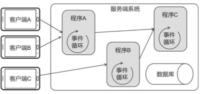

# 从角色走路说起

## 从角色走路说起

想象下，要制作一款 MMORPG（多人角色扮演游戏），场景中有角色、NPC、小怪、玩家可以控制角色在场景中随意走动，可以和其他角色交互、打小怪，该如何实现

### 业务怎么学起

首先做到学以致用，再做到入门三分，在做到各个击破

* 业务层：战斗、副本、物品、公告、邮件、聊天、称号、成就、排行榜、签到、首充、登录、离线消息、AOI 算法、无缝地图、同步算法、作弊防范等等
* 框架层：分布式结构、消息分发、热更新、数据持久化等等
* 底层：网络库、数据库、协议编码解码、定时器、缓冲区、字符串处理、数据结构等等

### 每走一步都有事情发生

从玩家角度看，网络游戏大都会涉及如下流程

1. 打开游戏，客户端向服务端发起网络连接
2. 玩家输入账号密码，经过验证后，进入游戏场景
3. 操作交互，行走、打怪、购买道具等
4. 下线退出游戏

### 走路的五个步骤

多个客户端通过网络与服务端相连，服务端处理网络请求，存储角色数据

```cpp
client1<--->server<--->client2
```

服务端像个黑盒子，走路背后发生的事情

1. 角色 A 移动
2. 客户端 A 向服务端发送新的坐标信息（或方向指令）
3. 服务端处理消息
4. 服务端将角色 A 的新坐标转发给客户端 B
5. 客户端 B 收到消息并更新角色 A 的位置

### 让角色走起来

可以开发一套服务端运算的走路程序，客户端可以发送 left、right、up、down 等文字指令，控制场景中角色移动。

在玩家的 Player 组件内，加上 x，y 属性,场景中的玩家位置信息改变的广播可以在每帧 loop 时广播一次.

### 承载量估算

要计算服务端系统的承载量,则要从 CPU 负载,内存占用,网络流量等多角度考量.用分布式扩能,在第一部分的 ECS Actor 中我们已经能构建一套框架了. 多个程序协同工作如下



| 交互场景   | 代价 稳定性 承载量                                                                          |
| ------ | ----------------------------------------------------------------------------------- |
| 同一个进程内 | 交互代价很小,同场景的角色数据可以直接获取,稳定性好,承载量小                                                     |
| 同一台物理机 | 交互代价中等,进程通信肯定比一个进程内直接读内存要慢,稳定性中等可能出现进程崩溃,承载量很大程度取决与 CPU 内存                          |
| 跨物理机   | 交互代价很大,进程位于不同物理机上没网络传输速度是毫秒级别的,尽量走内网. 稳定性较差,可能某个物理机会挂掉宕机,承载量几乎可以无限增加物理机,实现理论上无限的承载量 |

### 简单分布式服务端

采用分布式,就可以实现每个场景为独立进程,而且也可以轻松实现不同的场景下的玩家可以在相同的聊天频道聊天.

```cpp
clientA<---->兽人村落Server<------>
clientB
                                  聊天服务器(转发)
clientC<---->森林Server<---------->
```

### 一致性问题

如果程序部署在不同物理机上,连接不太稳定需要处理好断线重连,断线期间的消息重发,以及断线后进程状态不一致的问题.

```cpp
clientA <---> serverA<----(2)----
                              Server C
clientB <---> serverB-----(1)--->
(1) 扣除道具成功
(2) 添加道具失败
```

例如做一个交易系统,玩家 A 向玩家 B 购买物品,这样交互在服务端间进程通信有问题时,业务就会有问题导致不到账等.\
一致性问题是分布式系统的一大难题，在游戏业务中，开发者一般会把一致性问题抛给具体业务去处理。需要给每个交易赋予唯一编号。程序 C 除了转发消息，还需要记录程序 A 对每个交易的执行状态，如果转发失败，程序 C 要在稍后重发交易消息，直到程序 A 成功执行。而程序 A 也需要记录每个交易的状态，如果某个交易已经成功执行，则不再响应程序 C 发来的消息，避免重复添加道具。

### 万物皆 Actor

游戏业界苦苦追寻着更适合当代游戏的服务端模型，蓦然回首，几十年前就被提出的 Actor 并发模型就在灯火阑珊处。在前面部分相比你已经深入了解到了 Actor.

只操作自己的数据,不同的实体之间只通过消息协议的方式进行交互.

### Nodejs 与 Skynet 类似对比

不过大多数游戏公司并不会直接使用 Skynet,它们一般会开发自己的框架,将 lua 虚拟机搬到自己的框架内,由自己搭建脚手架.

```cpp
NodeJs               Skynet
JavaScript            Lua
V8引擎(C++)            Skynet底层(C语言)
           操作系统OS
```
