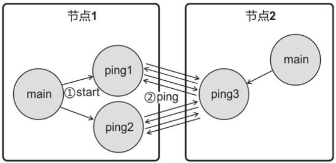
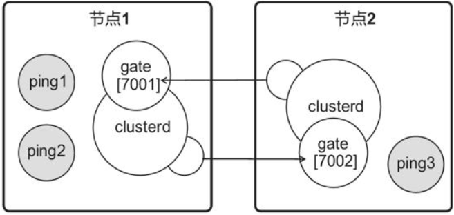
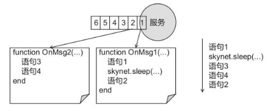
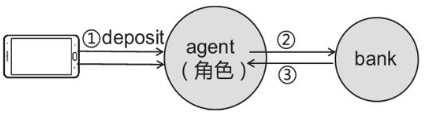

# 🚗 Skynet 入门精要

## Skynet 入门精要

Skynet 是一套历经商业游戏验证的游戏服务端引擎，Skynet 是一套底层引擎，不能开箱即用，有人说没有几年的服务器经验很难
驾驭。

无论什么框架，最基本的可以说是网路连接、多人交互、操作数据库等，本部分别不是让自己学会 skynet，而是了解游戏的功能设计逻辑、
skynet 的思想。skynet 对自己的描述定位为“A lightweight online game framework”。仓库地址为 https://github.com/cloudwu/skynet

```bash
yum install git
yum install gcc
yum install autoconf
yum install readline-devel
git clone https://github.com/cloudwu/skynet.git
cd skynet
make linux
```

### 理解 Skynet

每个 Skynet 进程称为一个节点，每个节点可以开启数千个服务，不同节点可以部署在不同的物理机上，提供分布式集群的能力，每个节点调度数千个
lua 服务，让其可以并行工作，每个服务都是一个 Actor。

```cpp
clientA   <------> 节点2（兽人村落）
                                               节点3（工会服务、聊天服务）
clientB   <------> 节点1（沼泽）
                                               【数据库】
clientC   <------> 节点1（森林）
```

其实每个服务相当于前面 ECS 里面的 System。

### 配置文件

skynet 进程有自己的配置文件格式 可以参考 https://github.com/cloudwu/skynet/wiki/Config

如常见设置，可以了解下

| 配置项     | 说明                                                                                    |
| ---------- | --------------------------------------------------------------------------------------- |
| thread     | 表示启动多少个工作线程，我们之前 ECS 框架设计中也有                                     |
| start      | 主服务，指定 skynet 系统启动后，开启哪一个自定义服务                                    |
| cpath      | 用 C 编写的服务模块的位置                                                               |
| bootstrap  | skynet 启动的第一个服务及其参数                                                         |
| harbor     | 集群相关                                                                                |
| Lua 配置项 | 包含 lualoader、luaservice、lua_path、lua_cpath,用于指定 lua 服务的目录，lua 文件的地址 |
| 后台模式   | 守护进程设置相关                                                                        |

### 启动流程

skynet 进程 基本上的启动流程

```bash
(引擎)1.启动skynet
(引擎)2.读取配置文件
(引擎)3.初始化 开启服务bootstrap、launcher等
(用户)4.启动主服务 examples/main.lua
```

### 设计 PingPong

假如现在开启两个 ping 类型的服务 ping1、ping2，之间互相发送消息

```bash
    skynet 节点
main<--1.start--->ping1----2.ping--->ping2
                       <-------------
                       -------------->
                       ......

```

### 学习服务模块

skynet 提供了开启服务和发送消息的 API https://github.com/cloudwu/skynet/wiki/APIList

### PingPong 实现

```lua
//examples/Pmain.lua 需要将start="main"改为start="Pmain"
local skynet = require "skynet"
skynet.start(function()
    skynet.error("[Pmain] start")
    local ping1 = skynet.newservice("ping")
    local ping2 = skynet.newservice("ping")
    skynet.send(ping1, "lua", "start", ping2)
    skynet.exit()
end)
```

其中的 send 是，让主服务向 ping1 发送 start 的消息，附带一个参数 ping2

ping 服务

```lua
//examples/ping.lua
skynet.start(function()
    skynet.dispatch("lua", function(session, source, cmd, ...)
        local f=assert(CMD[cmd])
        f(source,...)
    end)

end)
```

收到其他服务的消息后，查找 `CMD[cmd]` 这个方法是否存在，如果存在就调用它。例如，当 ping1 服务收到主服务的“start”消息时，程序会调用 `CMD.start(source, ...)`。其中，参数 source 代表消息来源，其他参数由发送方传送。

ping 服务可以接收两种消息，一种是主服务发来的 start 消息，另一种是其他 ping 服务发来的 ping 消息。

```lua
function CMD.start(source, target)
    skynet.send(target, "lua", "ping", 1)
end
function CMD.ping(source, count)
    local id = skynet.self()
    skynet.error("["..id.."] recv ping count="..count)
    skynet.sleep(100)
    skynet.send(source, "lua", "ping", count+1)
end
```

主服务会在启动两个 ping 服务后，给 ping1 发送 start 消息，`skynet.send(ping1, "lua", "start", ping2)`,最后一个参数对应 CMD.start 参数的 target，
ping1 收到后给 ping 发一条消息，附带参数为 1，ping2 收到后执行 CMD.ping,参数 1 对应 count,ping2 也会给 ping1 发送，并把数值 count+1 如此往复。

这么一来可以认为 skynet 是站在 lua 脚本上的 Actor 框架

### 设计 Echo

```bash
clientA ---hello---> skynet节点主服务
        <--hello---
```

### 网络模块

skynet.socket 模块提供了网络编程的 API

```bash
//examples/Pmain.lua
local skynet = require "skynet"
local socket = require "skynet.socket"
skynet.start(function()
    local listenfd = socket.listen("0.0.0.0", 8888)
    socket.start(listenfd, connect)
end)
```

新客户端发起连接时，connect 方法将被调用，如果你熟悉 linux c 网络编程下面的代码很容易看懂，什么你不会？快滚去学习系统编程部分

```lua
//examples/Pmain.lua
function connect(fd, addr)
    --启用连接
    print(fd.." connected addr:"..addr)
    socket.start(fd)
    --消息处理
    while true do
        local readdata = socket.read(fd)
        --正常接收
        if readdata ~= nil then
            print(fd.." recv "..readdata)
            socket.write(fd, readdata)
        --断开连接
        else
            print(fd..," close ")
            socket.close(fd)
end
```

### 设计聊天室

客户端发送一条消息，经由服务端转发，所有在线客户端都能收到,下面的代码也很简单，只不过把 fd 存在了 clients 中，收到消息时就广播给所有其他 fd

```lua
local clients={}

function connect(fd, addr)
    --启用连接
    print(fd.." connected addr:"..addr)
    socket.start(fd)
    clients[fd]={}
    --消息处理
    while true do
        local readdata=socket.read(fd)
        --正常接收
        if readdata~=nil then
            print(fd.." recv "..readdata)
            for i, _ in pairs(clients) do --广播
                socket.write(i, readdata)
            end
        --断开连接
        else
            print(fd.." close ")
            socket.close(fd)
            clients[fd]=nil
        end
    end
end
```

### 留言板

客户端发送 "set XXX"命令时，程序会把留言"XXX"存入数据库，发送"get"命令时，程序会把整个留言板发送给客户端

```bash
                                   skynet节点
client ------1.set 她微信多少--->    主服务     ---------->MYSQL
       ----2.get--------------->
       <---3.今天公司来了新人
             她微信多少
```

### 数据库模块

skynet.db.mysql 模块提供了操作 MYSQL 数据库的方法，假设我们数据库由张表

主键为 id、列有 text,下面的样例就是查入了一条新数据，并检索表内所有行

```lua
//Pmain.lua
local skynet = require "skynet"
local mysql = require "skynet.db.mysql"
local socket = require "skynet.socket"

skynet.start(function()
    --网络监听
    local listenfd = socket.listen("0.0.0.0", 8888)
    socket.start(listenfd, connect)
    --连接
    local db=mysql.connect({
        host="39.100.116.101",
        port=3306,
        database="message_board",
        user="root",
        password="7a77-788b889aB",
        max_packet_size = 1024 * 1024,
        on_connect = nil
    })
    --插入
    local res = db:query("insert into msgs (text) values (\'hehe\')")
    --查询
    res = db:query("select * from msgs")
    --打印
    for i,v in pairs(res) do
        print ( i," ",v.id, " ",v.text)
    end
end)
```

对于连接的处理如下,其中省略了循环的部分

```lua
function connect(fd, addr)
    ……
    --正常接收
    if readdata ~= nil then
        --返回留言板内容
        if readdata == "get\r\n" then
            local res = db:query("select * from msgs")
            for i,v in pairs(res) do
                socket.write (fd, v.id.." "..v.text.."\r\n")
            end
        --留言
        else
            local data = string.match( readdata, "set (.-)\r\n")
            db:query("insert into msgs (text) values (\'"..data.."\')")
        end
   ……
end
```

### 调试控制台服务

skynet 自带了一个调试控制台服务 debug_console,启动它之后，可以查看节点的内部状态，如果自己设计框架，提供这样的服务是很有必要的，例如看一些
在线玩家数量、内存池、对象池情况

```lua
//Pmain.lua
local skynet = require "skynet"

skynet.start(function()
    skynet.newservice("debug_console",8000)
    local ping1 = skynet.newservice("ping")
    local ping2 = skynet.newservice("ping")
    local ping3 = skynet.newservice("ping")

    skynet.send(ping1, "lua", "start", ping3)
    skynet.send(ping2, "lua", "start", ping3)
    skynet.exit()
end)
```

debug_console 是一个服务，用本地的 telnet 连接 debug_console 服务，可以看到 Welcome to skynet console 字样。

提供了一些指令，常用的如下

```bash
list指令 用于列出所有的服务，以及启动服务的参数。
mem指令 用于显示所有Lua服务占用的内存
stat指令 列出所有Lua服务的CPU时间，处理的消息总数、消息队列长度、被挂起的请求数量，毕竟每个Actor有自己消息队列
netstat指令 用于列出网络连接的概况
```

### 节点集群建立分布式系统

例如有两个 skynet 节点（即进程）



### 集群模块

skynet 的 cluster 集群模式，需要为每个节点配置 cluster 监听端口，skynet 会自动开启
gate、clusterd 等多个服务用于处理节点之间的通信功能。



skynet.cluster 模块提供节点之间通信的 API https://github.com/cloudwu/skynet/wiki/Cluster

节点的配置，每个进程在配置文件中指定不同的 node 标识

```bash
node = "node1"
--node = "node2"
```

主服务如下，可以制作了每个节点与 IP 端口的映射，不同的节点执行不同逻辑

```lua
--examples/Pmain.lua
local skynet = require "skynet"
local cluster = require "skynet.cluster"
require "skynet.manager"

skynet.start(function()
    cluster.reload({
        node1 = "127.0.0.1:7001",
        node2 = "127.0.0.1:7002"
    })
    local mynode = skynet.getenv("node")

    if mynode == "node1" then
        cluster.open("node1")
        local ping1 = skynet.newservice("ping")
        local ping2 = skynet.newservice("ping")
        --让ping1和ping2向node2节点的pong服务发送消息
        skynet.send(ping1, "lua", "start", "node2", "pong")
        skynet.send(ping2, "lua", "start", "node2", "pong")
    elseif mynode == "node2" then
        cluster.open("node2")
        local ping3 = skynet.newservice("ping")
        skynet.name("pong", ping3)
    end
end
```

ping 服务如下

```lua
---examples/ping.lua
local skynet = require "skynet"
local cluster = require "skynet.cluster"
local mynode = skynet.getenv("node")

local CMD = {}
skynet.start(function()
    ...... 略
end)

function CMD.ping(source, source_node, source_srv, count)
    local id = skynet.self()
    skynet.error("["..id.."] recv ping count="..count)
    skynet.sleep(100)
    cluster.send(source_node, source_srv,  "ping",  mynode,  skynet.self(), count+1)
end

function CMD.start(source, target_node, target)
    cluster.send(target_node, target, "ping", mynode, skynet.self(), 1)
end
```

如果懂得之前的 ECS Actor 分布式框架，上面的代码也很容易理解的

### 使用代理

可以将其他节点的服务，在自己节点内创建一个服务代理远程的节点,这样一来就像使用自己进程的服务一样，不需要考虑其他的问题

```lua
if mynode == "node1" then
        cluster.open("node1")
        local ping1 = skynet.newservice("ping")
        local ping2 = skynet.newservice("ping")
        local pong = cluster.proxy("node2", "pong")
        skynet.send(pong, "lua", "ping", "node1", "ping1", 10)
```

### skynet 的注意事项

skynet 最大的特性是 提供同一及其上充分利用多核 CPU 的处理能力，并发就会需要考虑一些特殊的场景是否存在问题

### 协程的作用

Skynet 服务在收到消息时，会创建一个协程，在协程中会运行消息处理方法，会创建一个协程，在协程中会运行消息处理方法（即用 skynet.dispatch 设置的回调方法）。这意味着，如果在消息处理方法中调用阻塞 API（如 skynet.call、skynet.sleep、socket.read），服务不会被卡住（仅仅是处理消息的协程被卡住），执行效率得以提高，但程序的执行时序将得不到保证。

某个服务的消息队列存在多条消息，第一条消息的处理函数是 OnMsg1，第二条是 OnMsg2，OnMsg1 调用了阻塞方法 skynet.sleep。尽管程序会依次调用 OnMsg1、OnMsg2……但当执行到阻塞函数时，协程会挂起。实际执行顺序可能是图 2-36 中右边展示的“语句 1、skynet.sleep、语句 3、语句 4、语句 2”。



使用阻塞 API 需要注意时序问题

### 扣除金币的 BUG

做游戏其中对玩家充值、奖励、背包物品操作最为重要

假设游戏有存款功能，玩家可以将一定数量的金币存入银行获得利息。



客户端发起存款请求（阶段 ①），agent 向 bank 转达请求（阶段 ②），bank 会返回操作的结果（阶段 ③）

```lua
--有BUG写法
local coin = 20 --角色身上的金币数
function CMD.deposit(source)
    if coin < 20 then --假设每次存20金币
        return
    end
    local isok = skynet.call(bank, "lua", "deposit", 20)
    if isok then
        coin = coin -20
    end
end
```

由于 skynet.call 是阻塞方法

存在一种可能，玩家快速地点击存款按钮时，消息时序可能会按照(1)(1)(2)(3)地顺序执行，如果玩家仅剩 20 金币，第一次操作时，尚剩余 20 金币，第二次操作时，
依然剩余 20 金币，两次都能成功，玩家总共存入 40 金币，剩余-20 金币。

```lua
--修复后
function CMD.deposit(source)
    if coin < 20 then   --假设每次存20金币
        return
    end

    coin = coin - 20
    local isok = skynet.call(bank, "lua", "deposit",  20);
    if not isok then
        coin = coin + 20
    end
end
```

向其他服务发起请求之前先将金币扣除，如果没有调用其他服务成功，则再将金币加回来

### 总结

在此并没有深入去学习 skynet，但是可以从框架用法上，看到奇妙地 Actor 模型在游戏中地巧妙运用。后面也会不断地去深入游戏业务的学习，自顶向下进行学习。
