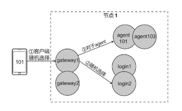

# 球球大作战

## 球球大作战

本部分用一个完整游戏案例《球球大作战》，介绍分布式游戏服务端的实现方法。

### 功能需求

《球球大作战》是一款多人对战游戏，玩家控制一个小球，让它在场景中移动，场景会随机产生食物，小球吃掉（碰到）食物后，体积会增大。 数十名玩家在同一场景堆栈，体积大的玩家可以吃掉体积小的玩家。

整个游戏流程如下：

1. 玩家输入账号密码登录游戏
2. 进入主界面，可以设置本轮游戏的昵称、选择服务器
3. 当玩家点击界面中的“开始比赛”按钮时，会进入某一战斗场景，在这里可以与其他玩家对战

假设预估有数万到数十万玩家同时在线，服务端也要根据这个量级来设计。

### 方案设计

因为要支持数以万计的在线玩家，必然要采取分布式的设计方案。

### 拓扑结构

服务端拓扑结构设计如下


其中的圆圈代表服务，圈内文字表明服务的类型和编号。每个节点被划分为两部分，其中用虚线框起来的为`本地服务`,方框外的称为`全局服务`

| 类型   | 说明                                                             |
| ---- | -------------------------------------------------------------- |
| 本地服务 | 在单节点内是唯一的，但是它不具备全局唯一性的服务                                       |
| 全局服务 | 在所有节点中都具有唯一性的服务，如图中的 agentmgr,可以把它部署到节点 1 或者节点 2，但是在整个架构中只能有一个 |

### 各服务功能

服务端包含了 gateway、login 等多个类型的服务

* gateway

网关，用于处理客户端连接的服务，客户端会连接某个网关，如果玩家尚未登录，网关会把消息转发给节点内某个登录服务器， 以处理账号校验等操作；如果登录成功，则会把消息转发给客户端对应的代理(agent),一个节点可以开启多个网关以分摊性能

* login

登录服务，用于处理登录逻辑的服务，账号校验，一个节点可以开启多个登录服务分摊性能。

* agent

代理，每个客户端会对应一个代理服务(agent),负责对应角色的数据加载，数据存储，单服逻辑处理（如强化装备、成就等）。 处于性能考虑，agent 必须与它对应的客户端连接（即客户端连接的 gateway）处于在同一个节点。

* agentmgr

管理代理(agent)的服务，它会记录每个 agent 所在的节点，避免不同的客户端登录同一个账号

* nodemgr

节点管理，每个节点会开启一个 nodemgr 服务，用于管理该节点和监控性能

* scene

场景服务，处理战斗逻辑的服务，每一局游戏由一个场景服务负责。

### 消息流程

从客户端发起连接开始，服务端内部的消息处理流程如下，简化忽略了 nodemgr


* 登录过程

在第 1 阶段，客户端连接某个 gateway，然后发送登录协议，gateway 将登录协议转发给 login（阶段 2），校验账号后， 由 agentmgr 创建与客户端对应的 agent（阶段 3 和 4）完成登录。如果玩家已经在其他节点登录，agentmgr 会把另一个客户端下线处理。

* 游戏过程

登录成功后，客户端的消息经由 gateway 转发给对应的 agent（阶段 5），agent 会处理角色的个人功能，比如购买装备、查看成就等。 当客户端发送开始比赛的协议时，程序会选择一个场景服务器，让它和 agent 关联，处理一场战斗（阶段 6）。

### 设计要点

* gateway

gateway 只做消息转发，解包，启用 gateway 服务是有好处的，隔离客户端与服务端系统，例如要更改客户端协议（如 json 改为 protobuf） 仅需要修改 gateway，不会对系统内部产生影响。

预留断线重连功能，如果客户端掉线，仅影响到 gateway，引入 gateway 意味着客户端消息需经过一层转发，会带来一定的延迟。将同一个客户端连接 的 gateway、login、agent 置于同一个节点有助于减少延迟。

* agent 与 scene 的关系

agent 可以和任意一个 scene 通信，但跨节点通信开销比较大，一个节点可以支撑数千名玩家，足以支撑各种段位的匹配，玩家应尽可能 进入同节点的战斗场景服务器（scene）。

* agentmgr

agentmgr 仅记录 agent 的状态、处理玩家登录，登出功能，所有对它的访问都以玩家 id 为索引，agentmgr 是一个单节点，但也很容易扩展为分布式。

### 分布式登录流程

处理玩家的登录，是服务端框架的主要功能之一，分布式系统涉及多个服务，让它们相互配置不产生重复是一大难点。

### 完整的登录流程

看一下下面的图大致就可以理解整体流程，这涉及到重复登录的场景


### 掉线登出流程

当客户端掉线时，登出流程如图所示


所有上线下线的请求都要经过 agentmgr，由它裁决，只有“已在线”状态的客户端方可被顶替下线，如果处于“登录中”或“登出中”，agentmgr 会告诉新登录的客户端“其他玩家正在尝试登录该账号，请稍后再试”。这样设计可以免去考虑很多复杂情况。

### 实现 gateway

请见如下部分

### 连接类和玩家类

gateway 需要使用两个列表，一个用于保存客户端连接信息，另一个用于记录已登录玩家信息，"让 gateway 把客户端和 agent 关联起来"，即是将 连接信息和玩家信息关联起来。

```lua
-- service/gateway/init.lua
conns = {} --[fd] = conn
players = {} --[playerid] = gateplayer
-- 连接类
function conn()
  local m = {
      fd = nil
      playerid = nil
  }
  return m
end
-- 玩家类
function gateplayer()
  local m = {
    playerid = nil,
    agent = nil,
    conn = nil
  }
end
```

在客户端进行连接后，程序会创建一个 conn 对象，gateway 会以 fd 为索引将其存进 conns 表中。conn 对象会保存连接的 fd 标识，但 playerid 属性为空，此时 gateway 可以通过 conn 对象找到连接标识 fd，给客户端发送消息。


当玩家成功登陆时，会创建一个 gateplayer 对象，服务端才会创建角色对象(agent),gateway 会以玩家 id 为索引将其存入 player 表中。gateplayer 对象会保存 playerid(玩家 id)、agent（代理服务 id）、conn（对应的 conn 对象）。

登录后，gateway 可以做到双向查找

* 客户端发了消息，可以由底层 socketfd 找到 conn 对象，再由 playerid 属性找到 gateplayer 对象，进而可以知道代理服务 agent 在哪里
* 若 agent 发来消息，只要附带玩家 id，gateway 可以由 playerid 获取到 gateplayer 对象进而可以找到 conn，可以使用 fd 进行发送

### 接收客户端连接

首先需要开启 socket 的监听，当有客户端连接时，start 方法的回调函数 connect 被调用

```lua
--service/gateway/init.lua
local socket = require "skynet.socket"
local runconfig = require "runconfig"
function s.init()
  local node = skynet.getenv("node")
  local nodecfg = runconfig[node]
  local port = nodecfg.gateway[s.id].port
  local listenfd = socket.listen("0.0.0.0", port)
  skynet.error("Listen socket :", "0.0.0.0", port)
  socket.start(listenfd, connect)
end
--有新连接时的处理
local connect = function(fd, addr)
  print("connect from " .. addr .. " " .. fd)
  local c = conn()
  conns[fd] = c
  c.fd = fd
  skynet.fork(recv_loop, fd)
end
```

recv\_loop 负责接收客户端消息

```lua
-- service/gateway/init.lua
--每一条连接接收数据处理
--协议格式cmd,arg1,arg2,...#
local recv_loop = function(fd)
  socket.start(fd)
  skynet.error("socket connected" ..fd)
  local readbuff = ""
  while true do
    local recvstr = socket.read(fd)
    if recvstr then
      readbuff = readbuff..recvstr
      readbuff = process_buff(fd, readbuff)
    else
      skynet.error("socket close" ..fd)
      disconnect(fd)
      socket.close(fd)
      return
    end
  end
end
```

通过拼接 Lua 字符串实现缓冲区是一种简单的做法，它可能带来 GC（垃圾回收）的负担。


### 处理客户端协议

服务端接收到数据后就会调用 process\_buff,并把缓冲区传给它，process\_buf 会实现消息的切分工作.

```lua
--service/gateway/init.lua
local process_buff = function(fd, readbuff)
  while true do
    local msgstr, rest = string.match(readbuff, "(.-)\r\n(.*)")
    if msgstr then
      readbuff = rest
      process_msg(fd, msgstr)
    else
      return readbuff
    end
end
```

这就是个从 buffer 中解析协议的流程，并不难理解

### 编码和解码

可以封装自己的工具函数，进行协议的解包封包操作，此处不再详细展开

### 消息分发

先看下代码，要做的就是 消息解码、如果尚未登陆、如果已经登录、将消息发往 agent



```lua
local process_msg = function(fd, msgstr)
    local cmd, msg = str_unpack(msgstr)
    skyn et.error("recv "..fd.." ["..cmd.."] {"..table.concat( msg, ",").."}")

    local conn = conns[fd]
    local playerid = conn.playerid
    --尚未完成登录流程
    if not playerid then
        local node = skynet.getenv("node")
        local nodecfg = runconfig[node]
        -- 随机一个login节点
        local loginid = math.random(1, #nodecfg.login)
        local login = "login"..loginid
        -- 发往目标login
        skynet.send(login, "lua", "client", fd, cmd, msg)
    --完成登录流程
    else
        local gplayer = players[playerid]
        local agent = gplayer.agent
        skynet.send(agent, "lua", "client", cmd, msg)
    end
end
```

### 发送消息接口

gateway 将消息传给 login 或 agent，login 或 agent 也需要给客户端回应。比例，在客户端发送登录协议，login 校验失败后， 要给客户端回应 账号或密码错误，则需要 login 发往 gateway 再由 gateway 发往 client。


```lua
-- 从source发来 发给fd 消息为msg
s.resp.send_by_fd = function(source, fd, msg)
    if not conns[fd] then
        return
    end

    local buff = str_pack(msg[1], msg)
    skynet.error("send "..fd.." ["..msg[1].."] {"..table.concat( msg, ",").."}")
    socket.write(fd, buff)
end

-- 根据playerid给client发送消息
s.resp.send = function(source, playerid, msg)
    local gplayer = players[playerid]
    if gplayer == nil then
        return
    end
    local c = gplayer.conn
    if c == nil then
        return
    end

    s.resp.send_by_fd(nil, c.fd, msg)
end
```

### 确认登录接口

在完成登录流程后，login 会通知 gateway，让它把客户端连接和新 agent 关联起来

```lua
s.resp.sure_agent = function(source, fd, playerid, agent)
    local conn = conns[fd]
    if not conn then --登录过程中已经下线
        skynet.call("agentmgr", "lua", "reqkick", playerid, "未完成登录即下线")
        return false
    end

    conn.playerid = playerid

    local gplayer = gateplayer()
    gplayer.playerid = playerid
    gplayer.agent = agent
    gplayer.conn = conn
    players[playerid] = gplayer

    return true
end
```

sure\_agent 的功能是将 fd 和 playerid 关联起来，它会先查找连接对象 conn，再创建 gateplayer 对象 gplayer，并设置属性。

### 登出协议

玩家有两种登出情况，一种为客户端掉线或者自主线下，另一种是被顶替下线。如果客户端掉线 gateway 会向 agentmgr 发送下线请求，由 agentmgr 仲裁。

```lua
--service/gateway/init.lua
local disconnect = function(fd)
    local c = conns[fd]
    if not c then
        return
    end

    local playerid = c.playerid
    --还没完成登录
    if not playerid then
        return
    --已在游戏中
    else
        -- players[playerid] = nil -- 将玩家的gateplayer对象删除，其实里应当在agentmgr回包后删除
        local reason = "断线"
        skynet.call("agentmgr", "lua", "reqkick", playerid, reason)
    end
end
```

如果 agentmgr 仲裁通过，或者 agentmgr 想直接把玩家踢下线，在保存数据后，会通知 gateway 做收尾工作,删掉玩家的 conn 和 gateplayer 对象

```lua
s.resp.kick = function(source, playerid)
    local gplayer = players[playerid]
    if not gplayer then
        return
    end

    local c = gplayer.conn
    players[playerid] = nil

    if not c then
        return
    end
    conns[c.fd] = nil
    disconnect(c.fd)
    socket.close(c.fd)
end
```

gateway 大致就是这样，理论这样设计没啥问题，但是在生产环境中应用还需要很多深思，但是我们现在是用来，学习，很不错啦，你很棒的加油。

### 实现 login

登录服务，对于此服务可以看以前的登录流程。

### 登录协议

客户端肯定要发账号密码，服务端收到登录协议后会做出回应，gateway 挑一个 login 去验证，在 login 返回包给 gateway 时，gateway 应该提示客户端，如账号或密码错误，其他玩家正在尝试登录该账号请稍后再试。

### 登录流程处理

gateway 会将客户端协议以 client 消息的形式转发给 login 服务，login 服务会先校验客户端发来的用户名密码，再作为 gateway 和 agentmgr 的中介，等待 agentmgr 创建代理服务。

1. 校验用户名密码：这个过程可能是查询数据库或者向平台 SDK 进行验证
2. 给 agentmgr 发送 reqlogin，请求登录，reqlogin 会回应两个值一个值代表是否成功，一个值为 agent 代表已创建的代理服务 id
3. 给 gate 发送 sure\_agent
4. 如果全部过程成功执行，login 服务会给客户端回应成功消息。

详细的还是看本章以前的 完整的登录流程 部分的图解吧。

```lua
--service/login/init.lua
s.client.login = function(fs, msg, source)
  local playerid = tonumber(msg[2])
  local pw = tonumber(msg[3])
  local gate = source
  node = skynet.getenv("node")
  --校验用户名密码
  if pw ~= 123 then
    return {"login", 1, "密码错误"}
  end
  --发给agentmgr
  local isok, agent = skynet.call("agentmgr", "lua", "reqlogin", playerid, node, gate)
  if not isok then
    return {"login", 1, "请求mgr失败"}
  end
  --回应gate
  local isok = skynet.call(gate, "lua", "sure_agent", fd, playerid, agent)
  if not isok then
    return {"login", 1, "gate注册失败"}
  end
  skynet.error("login succ"..playerid)
  return {"login", 0, "登录成功"}
end
```

代码当伪代码看就行了，主打一个业务学习作用

### 实现 agentmgr

agentmgr 是管理 agent 的服务，它是登录过程的仲裁服务，控制着登录过程。agentmgr 中含有一个列表 players，里面保存着所有玩家的在线状态。

### 玩家类

登录流程中，玩家会有 “登录中”、“游戏中”、“登出中”三种状态。

```lua
STATUS = {
  LOGIN = 2,
  GAME = 3,
  LOGOUT = 4
}
--玩家列表
local players={}
--玩家类
function mgrplayer()
  local m = {
    playerid = nil, -- 玩家id
    node = nil, -- 该玩家对应gateway和agent所在的节点
    agent = nil, -- 该玩家对agent服务的id
    status = nil, -- 状态
    gate = nil -- 该玩家对应gateway的id
  }
end
```


### 请求登录接口

login 服务会向 agentmgr 请求登录(reqlogin)

1. 登录仲裁，判断玩家是否已经登录
2. 顶替已在线玩家，如果该角色已在线，需要先把它踢下线
3. 记录在线信息，将新建的 mgrplayer 对象记录为登陆中状态
4. 让 nodemgr 创建 agent 服务
5. 登录完成，设置 mgrplayer 为游戏中状态，并返回 true 与 agent 服务的 id


```lua
s.resp.reqlogin = function(source, playerid, node, gate)
    local mplayer = players[playerid]
    --登录过程禁止顶替
    if mplayer and mplayer.status == STATUS.LOGOUT then
        skynet.error("reqlogin fail, at status LOGOUT " ..playerid )
        return false
    end
    if mplayer and mplayer.status == STATUS.LOGIN then
        skynet.error("reqlogin fail, at status LOGIN " ..playerid)
        return false
    end
    --在线，顶替
    if mplayer then
        local pnode = mplayer.node
        local pagent = mplayer.agent
        local pgate = mplayer.gate
        mplayer.status = STATUS.LOGOUT,
        s.call(pnode, pagent, "kick")
        s.send(pnode, pagent, "exit")
        s.send(pnode, pgate, "send", playerid, {"kick","顶替下线"})
        s.call(pnode, pgate, "kick", playerid)
    end
    --上线
    local player = mgrplayer()
    player.playerid = playerid
    player.node = node
    player.gate = gate
    player.agent = nil
    player.status = STATUS.LOGIN
    players[playerid] = player
    local agent = s.call(node, "nodemgr", "newservice", "agent", "agent", playerid)
    player.agent = agent
    player.status = STATUS.GAME
    return true, agent
end
```

### 请求登出接口

除了登录，agentmgr 还负责登出的仲裁。agentmgr 会先发送 kick 让 agent 处理保存数据的事情，再发送 exit 让 agent 退出服务，由于保存数据需要一小段时间，因此 mgrplayer 会保存一小段时间的 LOGOUT 状态。

```lua
-- service/agentmgr/init.lua
s.resp.reqkick = function(source, playerid, reason)
    local mplayer = players[playerid]
    if not mplayer then
        return false
    end

    if mplayer.status ~= STATUS.GAME then
        return false
    end

    local pnode = mplayer.node
    local pagent = mplayer.agent
    local pgate = mplayer.gate
    mplayer.status = STATUS.LOGOUT

    s.call(pnode, pagent, "kick") -- call同步
    s.send(pnode, pagent, "exit") -- send异步
    s.send(pnode, pgate, "kick", playerid) --异步调用
    players[playerid] = nil

    return true
end
```

### 实现 nodemgr

nodemgr 是节点管理服务，每个节点都会开启一个，提供创建服务的远程调用接口。

```lua
--service/nodemgr/init.lua
local skynet = require "skynet"
local s = require "service"

s.resp.newservice = function(source, name, ...)
  local srv = skynet.newservice(name, ...)
  return srv
end

s.start(...)
```

### 实现 agent 单机

agent 也就是玩家类，玩家类接收协议消息处理各项功能

1. 消息分发

玩家登陆后，gateway 会将客户端协议转发给 agent。

```lua
--service/agent/init.lua
s.client = {}
s.gate = nil
s.resp.client = function(source, cmd, msg)
  s.gate = source
  if s.client[cmd] then
    local ret_msg = s.client[cmd](msg, source)
    if ret_msg then
      skynet.send(source, "lua", "send", s.id, ret_msg)
    end
  else
    skynet.error("s.resp.client fail", cmd)
  end
end
```

例如登陆后客户端发送 work 协议，s.client.work 方法将会被调用。

2. 数据加载

每个 agent 对应一个游戏角色，创建服务后，它要加载完所有角色数据才算完成职责。service 模块将在服务启动时调用它。

```lua
s.init = function()
  --在此处加载角色数据
  skynet.sleep(200)--模拟加载数据库数据
  s.data = {
    coin = 100,
    hp = 200,
  }
end
```

3. 保存和退出

有 kick 和 exit 调用(agentmgr 会调用它们，agentmgr 是 agent 的仲裁中心)。

```lua
s.resp.kick = function(source)
  --在此保存角色数据
  skynet.sleep(200)--模拟
end

s.resp.exit = function(source)
  skynet.exit()--接触此agent服务
end
```

### 战斗流程

玩家登陆后，可以做非战斗操作如成就、背包、邮件、好友功能，点击开始比赛按钮时，客户端会进入战斗的协议。 服务端会开启很多 scene 服务，每个服务处理一场战斗，收到战斗的协议后，agent 会随机选择一个战斗服务，进入战斗后， agent 会与某个 scene 服关联。


球球大作战的玩法，战场中包含球和食物两种对象，每个玩家控制一个球，其中黑色小圆代表食物，当玩家进入战斗时 场景中会添加一个代表玩家的小球，它出生在随机的位置上，默认是很小尺寸，玩家可以控制球移动的速度。 场景中会随机生成一些食物，遍布各处，当小球碰到食物时，食物消失，球的尺寸增大。


### 战斗协议

* 进入战场协议

当玩家点击开始比赛按钮时，客户端发送 enter 协议，服务端会做出能不能进入战斗的判断， 并且将 agent 和某个 scene 关联起来。

```lua
客户端发送： enter
服务端回应：enter，0，     进入成功
                  错误码
服务端广播： enter，101，  10，20，1
                   玩家id  坐标   尺寸
```

如果成功进入战场，服务端会回应成功消息，且向同战场的其他玩家广播有人进入的消息。 广播的消息包含三个参数，刚进入的玩家 id、坐标、尺寸。

如果进入战场失败，例如玩家已经在战斗中，会回应失败信息，如“您已在战场中，不能重复进入”

* 战场信息协议

进入战场后，客户端需要显示战场中的球和食物，服务端会发送 balllist 和 foodlist 协议

服务端生成食物时，会给每个食物一个唯一 id，在食物信息协议 foodlist 中，每个食物会包含 id、坐标

```lua
服务端发送
balllist,102, 10, 20, 1,203,10,20,2
玩家id，x坐标，y坐标，尺寸
foodlist,1，15，25，2，100，210
食物id，x坐标，y坐标
```

* 生成食物协议

战场会随机生成一些食物，服务端会广播 addfood 协议，此协议包含新生成食物的 id、坐标

```lua
服务端广播
addfood,3,15,125
id,坐标
```

* 移动协议

当需要改变移动方向时，客户端会发送 shift 协议，设置小球的 x 方向速度和 y 方向速度

所有游戏逻辑由服务端判定，每当小球的位置发生变化时(每隔一小段时间)，服务端就会广播 move 协议，更新小球 的坐标，move 协议是发送频率最高的协议，例如服务端每 0.2 秒更新一次小球位置，战场上有 10 个小球， 每个客户端每秒将收到 50 条 move 协议。

```lua
客户端发送
shift，1，0
服务端广播
move,104,120,250
```

每个客户端每秒将收到 50 条 move 协议，频率非常高，但有不少优化方法，可以将多个小球的 位置信息合并成一条协议或使用 AOI 算法做优化。

* 吃食物协议

当小球吐下食物时，服务端会广播 eat 协议，此协议的参数包含玩家 id、被吃掉的食物 id 和玩家的新尺寸

* 离开协议

当玩家掉线时，服务端会广播 leave 协议，告诉战场中每一位玩家，有人离开了

```lua
服务端广播
eat,104,13,3
玩家id，食物id，玩家新尺寸
leave，104
玩家id
```

完整的球球大作战含包含玩家的碰撞、球分裂、排行榜等功能。都大同小异。

### 场景服务

场景中包含小球和食物这两种对象，先看看小球的实现。

### Ball 类

ball 有自己的坐标、例属玩家信息、移动速度

```lua
local balls = {} --[playerid] = ball
--球
function ball()
    local m = {
        playerid = nil,
        node = nil,
        agent = nil,
        x = math.random( 0, 100),
        y = math.random( 0, 100),
        size = 2,
        speedx = 0,
        speedy = 0,
    }
    return m
end
```

balllit\_msg 会收集战场中所有小球,并构建 balllist 协议

```lua
--球列表
local function balllist_msg()
    local msg = {"balllist"}
    for i, v in pairs(balls) do
        table.insert( msg, v.playerid )
        table.insert( msg, v.x )
        table.insert( msg, v.y )
        table.insert( msg, v.size )
    end
    return msg
end
```

### Food 类

食物类 food 包含 id、x 坐标、y 坐标这三种属性，foods 回以食物 id 为索引，保存战场中各食物的信息

```lua
--service/scene/init.lua
local foods = {} --[id] = food
local food_maxid = 0
local food_count = 0
-- 食物
function food()
  local m = {
    id = nil,
    x = math.random(0, 100)
    y = math.random(0, 100)
  }
  return m
end
-- 食物列表
local function foodlist_msg()
  local msg = {"foodlist"}
  for i, v in pairs(foods) do
    table.insert(msg, v.id)
    table.insert(msg, v.x)
    table.insert(msg, v.y)
end
```

### 进入战斗

agent 收到 enter 协议，随机选择一个 scene 服务，给它发送 enter 消息。


scene 服务处理 enter 需要以下几个基本功能：

1. 判定是否能进入战斗场景，如果玩家已在战场内，不可再进入，返回失败信息
2. 创建 ball 对象，创建玩家对应的 ball 对象，并给各个属性赋值
3. 向战场内的其他玩家广播 enter 协议，说明新的玩家到来
4. 将 ball 对象存入 balls 表
5. 向玩家发送战场信息(balllist、foodlist)

```lua
--service/scene/init.lua
--进入
s.resp.enter = function(source, playerid, node, agent)
  if balls[playerid] then
    return false
  end
  local b = ball()
  b.playerid = playerid
  b.node = node
  b.agent = agent
  --广播
  local entermsg = {"enter", playerid, b.x, b.y, b.size}
  broadcast(entermsg)
  --记录
  balls[playerid] = b
  --回应
  local ret_msg = {"enter", 0, "进入成功"}
  s.send(b.node, b.agent, "send", ret_msg)
  --发战场信息
  s.send(b.node, b.agent, "send", balllist_msg())
  s.send(b.node, b.agent, "send", foodlist_msg())
  return true
end
--广播
function broadcast(msg)
  for i, v in pairs(balls) do
    s.send(v.node, v.agent, "send", msg)
  end
end
```

### 退出战斗

当玩家掉线时，agent 会远程调用 scene 服务的 leave 服务，会删除与玩家对应的消息，并广播 leave 协议

```lua
--service/scene/init.lua
--退出
s.resp.leave = function(source, playerid)
  if not balls[playerid] then
    return false
  end
  balls[playerid] = nil
  local leavemsg = {"leave", playerid}
  broadcase(leavemsg)
end
```

### 操作移动

当玩家要改变移动方向时，客户端会发送 shift 协议，经由 agent 转发，调用 scene 的 shift 方法。 根据参数找到玩家对应的小球，并设置它的速度。

```lua
--service/scene/init.lua
--改变速度
s.resp.shift = function(source, playerid, x, y)
  local b = balls[playerid]
  if not b then
    return false
  end
  b.speedx = x
  b.speedy = y
end
```

### 主循环

球球大作战是服务端运算的游戏，一般会使用主循环程序结构，让服务端处理战斗逻辑。balls 和 foods 代表 服务端的状态，再循环中执行 食物生成 位置更新 碰撞检测 等功能，从而改变服务端的状态。scene 启动后，会开启定时器， 每隔一段时间(0.2s)执行一次循环，在循环中会处理食物生成，位置更新等功能。


update 方法，通过让它每隔一段时间被调用一次，参数 frame 代表当前的帧数，每一次执行 update，frame 加 1.其中的 分别执行 食物生成、位置更新、碰撞检测

```lua
--service/scene/init.lua
function update(frame)
  food_update()
  move_update()
  eat_update()
  --碰撞检测略
  --分裂略
end
```

开启简单的定时器，可以开启一个死循环协程，协程中调用 update，最后用 skynet.sleep 等待一小会。

```lua
--service/scene/init.lua
s.init = function()
    skynet.fork(function()
        --保持帧率执行
        local stime = skynet.now()
        local frame = 0
        while true do
            frame = frame + 1
            local isok, err = pcall(update, frame)
            if not isok then
                skynet.error(err)
            end
            local etime = skynet.now()
            local waittime = frame*20 - (etime - stime)
            if waittime <= 0 then
                waittime = 2
            end
            skynet.sleep(waittime)
        end
    end)
end
```

pcall 是为安全调用 update 而引入的。waittime 代表每次循环后需等待的时间。由于程序有可能卡住，我们很难保证“每隔 0.2 秒调用一次 update”是精确的。


### 移动逻辑

服务端要处理的第一项业务功能是球的移动，由于主循环会每隔 0.2 秒调用一次 move\_update,因此它只需遍历场景中的所有球， 根据“路程=速度\*时间”计算处每个球的新位置，再广播 move 协议通知所有客户端即可。

```lua
--service/scene/init.lua
function move_update()
  for i, v in pairs(balls) do
    v.x = v.x + v.speedx * 0.2--每帧0.2s
    v.y = v.y + v.speedy * 0.2
    if v.speedx ~= 0 or v.speedy ~= 0 then
      local msg = {"move", v.playerid, v.x, v.y}
      broadcast(msg)
    end
  end
end
```

### 生成食物

服务端每隔一段时间会放置一个新食物

* 判断食物总量：场景中有最大食物数量，多了就不再生成
* 控制生成时间：计算一个 0 到 100 的随机数，只有大于等于 98 才往下执行，即往下执行的概率是 50 分之 1，由于主循环每 0.2s 调用一个 food\_update,因此平均下来每 10 秒会生成一个食物
* 生成食物：创建 food 类型对象 f，把它添加到 foods 列表中，并广播 addfood 协议。生成食物时，会更新食物总量 food\_count 和食物最大标识 food\_maxid

```lua
--service/scene/init.lua
function food_update()
    if food_count > 50 then
        return
    end

    if math.random( 1,100) < 98 then
        return
    end

    food_maxid = food_maxid + 1
    food_count = food_count + 1
    local f = food()
    f.id = food_maxid
    foods[f.id] = f

    local msg = {"addfood", f.id, f.x, f.y}
    broadcast(msg)
end
```

### 吞下食物

它会遍历所有的球和食物，并根据两点间距离公式判断小球是否和食物发生了碰撞。如果发生碰撞，即视为吞下食物，服务端会广播 eat 协议，并让食物消失（设置 foods 对应值为 nil）


```lua
--service/scene/init.lua
function eat_update()
    for pid, b in pairs(balls) do
        for fid, f in pairs(foods) do
            if (b.x-f.x)^2 + (b.y-f.y)^2 < b.size^2 then
                b.size = b.size + 1
                food_count = food_count - 1
                local msg = {"eat", b.playerid, fid, b.size}
                broadcast(msg)
                foods[fid] = nil
            end
        end
    end
end
```

### 开启多个场景服务

可采用 main.lua 执行时，初始化多个固定的 scene 服务。或者参照 agent 服务动态添加类似地设计动态开启场景服务。

### 实现 agent 跨服务器

上面的内容，实现了球球大作战的绝大部分功能，还需要完善 agent 让其和 scene 服务联动。

### agent 进入战斗

对于 agent 需要编写让玩家进入比赛的功能

```lua
--service/agent/scene.lua
local skynet = require "skynet"
local s = require "service"
local tunconfig = require "runconfig"
local mynode = skynet.getenv("node")

s.snode = nil --scene_node
s.sname = nil --scene_id

s.client.enter = function(msg)
  if s.sname then
    return {"enter",1,"已经在场景"}
  end
  local snode, sid = random_scene()
  local sname = "scene"..sid
  local isok = s.call(snode, sname, "enter", s.id, mynode, skynet.self)
  if not isok then
    return {"enter",1,"进入失败"}
  end
  s.snode = snode
  s.sname = sname
  return nil
end
```

随机选择场景的，agent 尽可能选择进入个同节点的 scene。先把所有配置了场景服务的节点都放在表 nodes 中，同一节点会查入多次，使它能够更高概率选中。

```lua
--service/agent/scene.lua
local function random_scene()
  --选择node
  local nodes = {}
  for i, v in pairs(runconfig.scene) do
    table.insert(nodes, i)
    if runconfig.scene[mynode] then
      table.insert(nodes, mynode)--重复插
    end
  end
  local idx = math.random(1, #nodes)
  local scenenode = nodes[idx]
  --具体场景
  local scenelist = runconfig.scene[scenenode]
  local idx = math.random(1, $scenelist)
  local sceneid = scenelist[idx]
  return scenenode, sceneid
end
```

### agent 退出战斗

当客户端掉线时，agent 需要向场景服务请求退出

```lua
--service/agent/init.lua
s.resp.kick=function(source)
  s.leave_scene()
  --在此保存角色数据
  skynet.sleep(200)
end

s.leave_scene = function()
  --不在场景
  if not s.sname then
    return
  end
  s.call(s.snode, s.sname, "leave", s.id)
  s.snode = nil
  s.sname = nil
end
```
