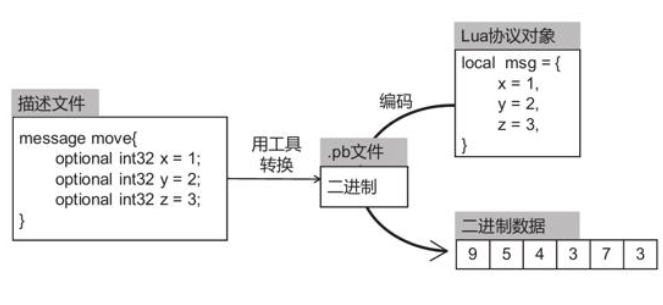
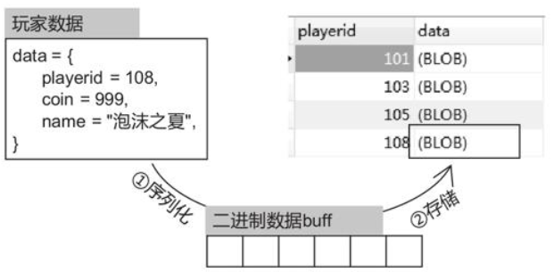
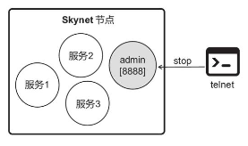
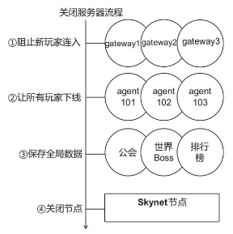
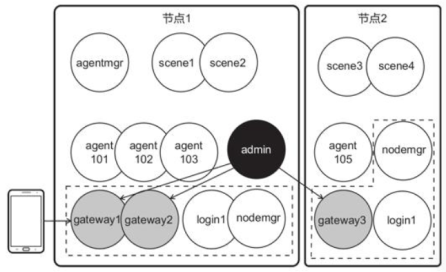
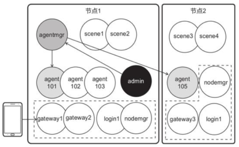
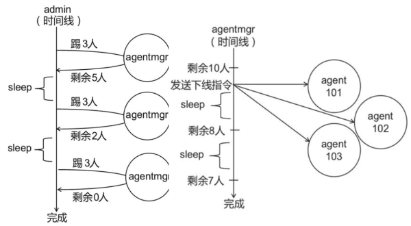
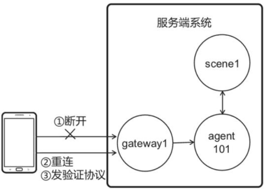
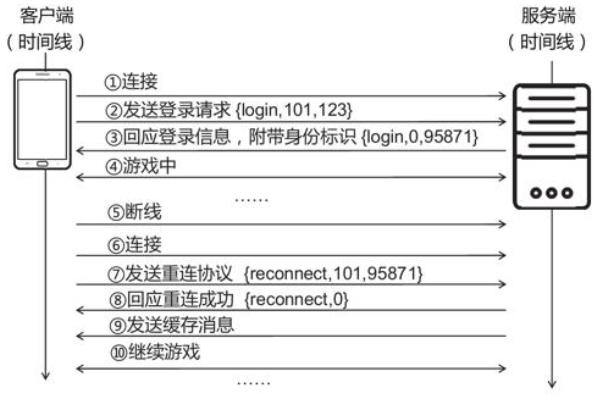

# 🚗 skynet 进阶技法

## skynet 进阶技法

然而对于上线运营的游戏，只是做出游戏功能还不够，还要考虑服务端的运行效率。

下面主要从以下几点考虑优化

1. 字符串协议，占用带宽较多，有没有高效的协议
2. 游戏功能时常更新，热门游戏每隔一两周就会出新版本，增加新功能。怎样合理存储玩家的数据
3. 客户端网络常会有不稳定的情况出现，断线重连是游戏的必备功能

### 长度信息法

长度信息法，就是在数据包前面加上长度信息，游戏一般会使用 2 字节或者 4 字节表示长度，2 字节整型数的取值范围是 0 到 65535，4 字节整形数的取值范围是 0 到 4294967295，对于大部分游戏，2 字节足够用了。

```lua
| 消息长度 |    消息内容    |
```

解析数据时，先读取长度信息，如果数据足够多，取出相应的字节。否则等待下一次接收。

### 用 Json 序列化协议

Json 协议主打直观又强大，可运用于大部分弱交互的游戏中，但是耗费的带宽是比较高的。

```lua
| 消息长度 | 协议名长度 | 协议名 | 协议体 |
```

### 用 Protobuf 高效传输

Protobuf 是谷歌发布的一套协议格式，规定了一系列的编码和解码方法，比如用于数字，它要求根据数字的大小选择存储空间，小于等于 15 的数字只用 1 个字节表示，大于 15 的数字用 2 个字节表示，以此类推，这样要求可以尽可能地节省空间，Protobuf 协议的一大特点是编码后的数据量很小，可以节省网络带宽。

开发者需要先编写描述文件，描述文件有它特定的格式，再用名为 protoc 的软件将它转换成`.pb`格式的文件，最后使用 pbc 库提供的方法实现编码解码,Protobuf 支持多种语言，如 C#、C++等都是支持的。



### 如何涉及游戏数据库

我们需要将玩家的金币、等级、背包内容等数据存入数据库，使得在服务端关闭、重启时，数据不会丢失，虽然以前有说 Mysql 的操作方法，但是哪些还不够。

### 传统设计方法

10 年前一些游戏，为设计表，如 playerid 作为索引，name、coin、level、last_login_time 这些都会单独作为表的单个字段。

传统方法只适用于功能稳定的游戏项目或者 web 项目，现代手游更新频率很高，一般游戏每隔两个月就会有一次大版本更新，传统数据库设计难以应付。

例如用传统数据库设计存储方案，添加一个字段在游戏用户量很大时，可能需要花费十几个小时，会造成较大损失。

### Key-Value 表结构

为避免拓展数据库导致十几小时停服，就要保证数据库结构的稳定，一种方式就是将玩家数据序列化，数据库仅存储序列化后的二进制结构，以玩家 id 为键，一序列化数据作为值。



使用 Key-Value 数据表，可以构造稳定的数据库结构，还能兼容 NoSQL，让服务端系统拥有无缝切换 MySQL 和 MongoDB 这两种数据库的潜力。

### 使用 Protobuf 描述玩家数据

由于 Protobuf 序列化的数据很小，能节省存储空间，又能管理默认值，更加使用。

```proto
package playerdata;

message BaseInfo{
  required int32 playerid = 1;
  required int32 coin = 2;
  required string name = 3;
  required int32 level = 4;
  required int32 last_login_time = 5;
}

| playerid | BaseInfo |
```

### 应对游戏版本更新

用 Protobuf 序列化角色数据可以应对游戏的版本更新。在更新时，只需要修改 BaseInfo 结构就行了

```proto
package playerdata;
message BaseInfo{
  required int32 playerid = 1;
  required int32 coin = 2;
  required string name = 3;
  required int32 level = 4;
  required int32 last_login_time = 5;
  required int32 skin = 6 [default = 10];
}
```

更新描述文件后，无需扩展数据库，甚至无须修改读写数据库的代码，即可获取新增的数值。

### 拆分数据表

设想在游戏中有一个好友功能，无论好友上线与否，玩家都可以查看他好友的基础信息，比如等级、战斗力、外观。
若好友不在线，程序可能要查询数据库获取好友的基本信息。若把角色数据都存在一张表，每次查询都要全局加载，
而实际用到的只有其中很小的部分，那么数据越大加载的时间就越长，很浪费。

一种解决方式就是按照功能模块划分数据表，成就相关的数据就放在 achieve 表，背包内容就放在 bag 表，类推，
当需要查询不在线玩家的部分信息时，只加载某一个数据表即可，会快很多。

```lua
local playerdata = {
  baseinfo = {},  -- 基本信息
  bag = {},       -- 背包
  task = {},      -- 任务
  friend = {},    -- 朋友
  mail = {},      -- 邮件
  achieve = {},   -- 成就
  title = {},     -- 称号
  -- ...
}
```

### 如何关闭服务器

如果游戏要停服更新，关闭服务器时，要妥善处理在线玩家。

### 管理控制台

可以写一个管理控制台(admin)服务，服务器管理员可以通过 telnet 登入控制台，然后输入指令，来做一个 GM 服务。



### 关闭服务器的流程

一般会先给 gateway 发送服务器的消息，让它阻止新玩家连入，再缓慢地让所有玩家下线，下线过程中玩家数据都将
得以保存，然后保存公会、排行榜等一些全局数据，最后才关闭整个节点。



```lua
function stop()
  shutdown_gate()
  shutdown_agent()
  -- ...
  skynet.abort()
  return "OK"
end
```

### 阻止新玩家连入

关闭服务器地第一步是阻止新的玩家连接，管理控制台会给每隔网关发生送关闭服务器地新消息，使网关不再接收新连接。



管理控制台发送消息的方法，会遍历每个网关，发送"shutdown"的消息，gateway 接收新连接处要做判断，如果
服务端处于关闭中状态，则不再处理新连接。

gateway 仅仅会阻止新玩家连入，而不是直接关闭所有连接，因为玩家下线时需要保存数据，如果成千上万
玩家同时下线，会给数据库造成很大压力，服务端要 缓缓 地把玩家踢下线。

### 缓缓踢下线

假设 agentmgr 提供一个 shutdown 接口，可以把一定数量地玩家踢下线，管理控制台会给 agentmgr 发 shutdown 消息，在 agentmgr 把一定数量玩家踢下线后，会返回在线玩家地数量。



每次 admin 会让 agentmgr 踢掉 N 人，直到所有玩家被被踢下线，agentmgr 返回 online_num 代表剩余的在线人数。



### 怎样做定时系统

不少游戏功能是和时间相关的，如每天只能购买一次，每周周六 12:00 之类的。

### 每天第一次登录

在加载玩家数据后，判断上一次登录时间与现在时间是否为同一天，如果不在同一天，说明是跨天，可以执行刷新
数据的逻辑。

这样的是以零点作为分界的，类似也可以实现每天凌晨 5 点登录后刷新，每周五 10 点登陆后等。

### 定时唤醒

有一种错误的定时唤醒方法，它会启用定时器每秒调用一次 timer 方法，然后判断时、分、秒是否满足开启条件。
这种方法的问题是，如果活动开启的那一秒服务端刚好卡顿，活动将不会开启。

较好的方法是，定时检查并记录下每次检查的时间，判断两次检查时间是否跨过活动开启时间，就算服务端卡顿，甚至中间服务器停止了一小段时间，活动都会正常开启。

### 断线重连

“断线重连”是手机游戏的必备功能。除了网络连接不稳定外，部分手机系统为了节省电量，在默认情况下黑屏十几秒后就会断开网络连接。如果没有重连机制，玩家只要短时间不在手机旁（比如去喝杯水），回来后就得退出游戏重新打开，大大影响游戏体验。

### 原理解析

gateway 作为中介连接客户端与内部服务，当客户端断开连接时，只要 gateway 不去触发下线流程，agent 和 scene 就都不会受到影响。当客户端重新发起连接时，经过校验，如果 gateway 认为它是合法的连接，则会将新连接与 agent 关联起来，这样便完成了重连。整个重连过程只有 gateway 参与，服务端系统中的其他服务均不受影响。



### 身份标识

为验证重连客户端的合法性，需给每个玩家生成代表身份标识的密码，gateway 会为每个玩家生成身份标识码，并让其随着登录协议返回给客户端。在发起重连时，客户端必须将标识码发回给服务端，以验证身份。如果不是重连的客户端，它无法得知标识码，就无法以断线的名义冒充身份。



### 消息缓存

断线期间服务端可能会向客户端发送消息，由于这些消息不能传达，因此需由 gateway 缓存起来，待重连后发送。

修改 gateway 向客户端发送消息的远程调用 send，可实现如下功能：

1. 如果没有断线，调用 s.resp.send_by_fd 正常发送消息。
2. 如果在断线期间，将消息存入 gplayer.msgcache 中。
3. 为避免占用过多内存，在缓存了大于 500 条的消息后，触发下线逻辑，不允许重连。

### 处理重连请求

重连协议 reconnect，客户端会发送玩家 id 和身份标识，服务端会回应重连成功或者失败。由于 reconnect 协议由 gateway 处理，因此在处理消息的 process_msg 方法中，要做个特殊判断，即如果收到 reconnect 协议，交由 process_reconnect 方法处理.

```lua
local process_msg = function(fd, msgstr)
    local cmd, msg = str_unpack(msgstr)
    skynet.error("recv "..fd.." ["..cmd.."] {"..table.concat( msg, ",").."}")
    local conn = conns[fd]
    local playerid = conn.playerid
    --特殊断线重连
    if cmd == "reconnect" then
        process_reconnect(fd, msg)
        return
    end
    --尚未完成登录流程，转发给login
    ……
    --完成登录流程，转发给agent
```

1. 做出严格的条件判断，只有断线的玩家才能接受重连。未登录（if not gplayer 为真）、未掉线（if gplayer.conn 为真）、身份标识错误（if gplayer.key~=key 为真）均不可重连。
2. 绑定新连接（conn）和玩家对象（gplayer）
3. 回应重连消息{"reconnect",0}。
4. 发送缓存中的消息。

### 断线处理

与“登出流程”不同，当客户端掉线时，gateway 不会去触发掉线请求（即向 agentmgr 请求 reqkick）。掉线时仅仅取消玩家对象（gplayer）与旧连接（conn）的关联（即 gplayer.conn=nil）。

为防止客户端不再发起重连导致的资源占用，程序会开启一个定时器（skynet.timeout），若 5 分钟后依然是掉线状态（if gplayer.conn~=nil 为假），则向 agentmgr 请求下线。
